# The Teacher Above AI

<!-- markdownlint-disable MD025 MD024 -->

## STEM Education, Human Judgment, and the New Learning Ecosystem

Draft version: 0.1  
Date: 2026-08-07  
Source base: International STEM Skills Round Table Phase III collected mail corpus, meeting summaries, presentations, discussion documents, and background sources.

## Editorial Note

This manuscript is a first professional draft built from the collected Round Table materials. It is written as a synthesis, not as meeting minutes. Where the source material names speakers and summarizes their contributions, the manuscript refers to them by name and role. Where a source was available only as a meeting outline or steering summary, the manuscript treats it as a reported contribution and avoids direct quotation.

The draft uses external references that appear in the collected materials, including the [OECD Teaching Compass](../materials/oecd-teaching-compass.pdf), [OECD Learning Compass 2030](https://www.oecd.org/education/2030-project/teaching-and-learning/learning/), [UNESCO AI competency frameworks](https://www.unesco.org/en/digital-education/ai-future-learning/competency-frameworks), [TALIS 2024 material](../materials/talis-2024-us-short.pdf), and research references listed in the [Meeting 3 Round Table discussion document](../materials/meeting-3-teacher-in-ai-era-discussion.docx). Detailed source verification and formal citation formatting should be completed in the next editorial pass.

# Preface

The International STEM Skills Round Table Phase III took place at a moment when education systems were already feeling the pressure of generative artificial intelligence. AI tools had moved from novelty to everyday practice. Students could use them to explain a concept, solve a problem, write code, summarize a paper, generate a draft, translate a text, or rehearse an argument. Teachers and lecturers faced a difficult question: if AI can perform many routine intellectual tasks, what should human education now do?

The Round Table did not treat AI as a narrow technical issue. Its central concern was broader and more demanding: the profile of the teacher and lecturer in the age of generative AI, especially in STEM education. The group asked how educators should cultivate skills, competencies, ethical judgment, critical thinking, curiosity, teamwork, and real understanding when machines can produce fluent answers but cannot take human responsibility for learning.

This book captures the arc of that discussion. It follows the six Phase III meetings and the steering discussions around them. It draws on presentations, summaries, discussion documents, background papers, and the voices of participants from education, higher education, policy, research, and industry.

The book's central claim is simple: AI does not remove the need for teachers. It raises the bar for teaching. The educator is no longer only a transmitter of content. The educator becomes a designer of learning environments, a mediator of judgment, a cultivator of human competencies, a connector between knowledge and practice, and a guardian of the principle that the human must remain above the machine.

# Methodology

This book is based on the collected materials from the International STEM Skills Round Table Phase III. The source base includes meeting summaries, steering-team summaries, presentation files, discussion documents, program outlines, email materials, and extracted text from background documents.

The main Phase III meetings addressed the following sequence:

1. Introduction and skills in the era of artificial intelligence.
2. Whether the profile of lecturers and teachers should be uniform or diverse.
3. Whether teachers and lecturers must themselves possess the competencies they are expected to cultivate.
4. Whether the educational process should be understood as a teacher-student-AI triangle.
5. How professional development of teachers and lecturers can be ensured over time.
6. How physical, virtual, workplace, and industry-connected environments should support future STEM skills.

The manuscript follows that sequence, but it reorganizes the material into a book structure. Each issue chapter is built around a repeated professional pattern:

- The challenge.
- The dilemma.
- The main positions.
- Pros and cons.
- Points of view from different sectors.
- Round Table voices.
- Synthesis.
- Recommendation in the spirit of the discussion.

This approach is intended to preserve the complexity of the Round Table. The goal is not to force consensus where the discussion remained open. The goal is to present a coherent professional compass that reflects the direction, tensions, and insights of the group.

# Part I - Why STEM Education Must Change Now

## Chapter 1 - The New Pressure on STEM Education

### The Challenge

STEM education was built on the belief that disciplined knowledge matters. Mathematics, physics, chemistry, engineering, computer science, and biology all require sequence, practice, abstraction, symbolic fluency, and conceptual control. A learner cannot reason responsibly about a circuit, a model, a biological process, a data set, or an engineering system without foundations.

Generative AI does not cancel that truth. It makes the truth harder to protect.

A student can now ask an AI system to explain a concept, solve a calculation, write code, summarize a paper, produce a design idea, draft a laboratory report, or generate a polished answer. The output may be helpful. It may also be shallow, biased, wrong, or disconnected from understanding. This changes the basic evidence problem in education. Producing an answer no longer proves that a student has learned. Producing a fluent answer no longer proves that a student can judge, transfer, explain, or take responsibility for the result.

The second Round Table meeting placed this pressure inside a broader historical shift. Prof. Arnon Bentur described education as moving away from a model centered mainly on transmission of disciplinary knowledge toward a model in which teachers and lecturers must also cultivate cross-disciplinary competencies such as critical thinking, teamwork, curiosity, reflection, and AI literacy. This does not mean that disciplinary knowledge becomes less important. It means that knowledge must now be taught as something learners can use, question, connect, and apply in uncertain situations.

The [Meeting 3 discussion document](../materials/meeting-3-teacher-in-ai-era-discussion.docx) sharpened the point further. It identified five competencies for an AI-rich world and introduced ethical judgment because AI raises questions of integrity, fairness, accountability, and responsibility. The document's guiding principle was clear: keep the human above the machine. Across all competencies, human judgment, creativity, and moral responsibility must remain the final authority over any tool or system.

This is the new pressure on STEM education. The system must still teach foundations, but it can no longer be satisfied when students reproduce procedures or submit correct-looking products. It must cultivate learners who can ask whether an answer makes sense, whether a tool should be trusted, whether a model fits the situation, whether a method is fair, and whether a decision can be defended.

### The Dilemma

Should STEM education continue to focus mainly on mastery of disciplinary content, or should it reorganize around deeper human competencies that remain valuable when AI can perform many routine tasks?

This question is often misunderstood as a choice between content and skills. The Round Table materials point to a more serious dilemma. STEM education must preserve rigorous disciplinary learning, but it must also change what counts as successful learning. A student who can repeat a procedure but cannot evaluate an AI-generated solution is not prepared. A student who can speak generally about critical thinking but lacks mathematical, scientific, or engineering foundations is also not prepared.

The deeper dilemma is therefore this: how can education preserve the slow work of conceptual formation while preparing students for a world in which many technical outputs can be produced quickly by machines?

### Main Positions

The first position is content-first. This view argues that students still need strong disciplinary foundations before they can use AI responsibly. Without mathematics, physics, scientific method, engineering reasoning, and computational thinking, students cannot reliably evaluate the outputs of AI systems. They may become dependent on confident answers that they do not understand.

The second position is competency-first. This view argues that the future value of education lies in human abilities that AI cannot own: critical thinking, moral responsibility, collaboration, creativity, curiosity, reflection, persistence, communication, and judgment. From this perspective, education must prepare students not only to know, but to act wisely with what they know.

The third position, which best reflects the spirit of the Round Table, is integrated. STEM education must preserve disciplinary depth, but it must use disciplinary learning as the arena in which students develop human competencies. Students should not learn critical thinking as a slogan. They should learn it by testing claims, comparing models, identifying failure modes, explaining assumptions, and reflecting on evidence inside real STEM work.

Jan Morrison's presentation from TIES supported this integrated view from the education-system perspective. She argued that success requires transdisciplinary teaching, career-connected learning, real-world experiences, team-based teaching, and systems designed for iteration and improvement. Her examples showed that problem-based and transdisciplinary learning fail when they are placed inside systems that were never designed to support them. Time for teacher collaboration, cross-sector training, and structured teamwork are not decorations. They are conditions for success.

Dr. Gabi Shafat's presentation from Afeka brought the same issue into higher education. The shift from "teaching engineering" to "engineering education" means starting not only from course content, but from the desired graduate profile. AI can provide assistance, summaries, explanations, and feedback, but it lacks accountability and human interaction, and it can be confidently wrong. Therefore, students must learn to use AI while understanding its limits.

### Pros and Cons

The content-first approach protects rigor. It reminds educators that AI fluency without knowledge is fragile. Students cannot check a mathematical derivation, debug code, critique a model, or recognize a flawed engineering assumption if they lack the underlying concepts. Its weakness is that it can preserve a model of education designed for an earlier evidence environment, where producing the answer was more tightly connected to doing the thinking.

The competency-first approach is future-facing. It recognizes that employers and societies need people who can think, judge, create, cooperate, and keep learning. Its weakness is that competencies can become vague if they are separated from disciplinary practice. A student does not become a critical thinker in general. A student learns to think critically through repeated work with specific materials, methods, claims, tools, and consequences.

The integrated approach is strongest, but hardest. It asks teachers and lecturers to design learning tasks in which content and competencies develop together. It asks institutions to change assessment, scheduling, professional development, class size, collaboration time, and learning environments. It also asks policy makers to recognize that competency development is not free. It requires investment.

### Point of View Map

From an industry perspective, Avi Salmon emphasized that employers, especially in high technology, are becoming less interested in routine technical skills that AI can easily perform and more interested in deep conceptual understanding, curiosity, and genuine engagement with the profession. His point was not that technical skill no longer matters. It was that technical skill must be connected to judgment, meaning, and the ability to keep learning. Schools should help develop love of the profession. Higher education should deepen conceptual understanding beyond curriculum coverage.

From a school perspective, the challenge is implementation. Teachers face prescribed curricula, external exams, mixed student motivation, class size, limited time, and different expectations across age groups. The Meeting 2 discussion made clear that middle school, upper secondary school, and higher education cannot be treated as identical settings.

From a higher education perspective, the challenge is to protect foundations while redesigning programs around graduate profiles and competencies. Prof. Arnon Bentur noted that the first years of higher education, especially in mathematics, physics, and chemistry foundations, often resemble secondary education in their constraints. Later years may allow more autonomy, differentiation, and specialization.

From a policy perspective, the challenge is to define skills clearly enough to support teacher development, curriculum design, assessment, and institutional investment. Dr. Marwa Maklada's contribution points to the importance of validating competency-based tasks in formal assessment systems, including matriculation processes.

From an international education-system perspective, Jan Morrison's examples suggest that isolated innovation is not enough. Systems need cross-sector communication, industry involvement, teacher externships, flexible professional pathways, and measures used for improvement rather than accountability alone.

### Round Table Voices

Dr. Eli Eisenberg opened the [Meeting 2 source context](https://www.neaman.org.il/) by emphasizing that the initiative's value lies not only in documentation but in active participation and brainstorming. This matters because the dilemmas are not administrative. They concern the future purpose of education.

Prof. Arnon Bentur framed Phase III as a sequence of connected dilemmas: the educator profile, possession versus cultivation of competencies, the teacher-student-AI relationship, professional development, and the learning environment. This framing prevents the discussion from treating AI as a stand-alone technology issue. AI is part of a larger redesign of educational purpose, roles, environments, and evidence.

Jan Morrison argued that teaching must become a team-driven, cross-sector profession connected to real-world experience. Her warning is important: transdisciplinary and problem-based learning cannot succeed when inserted into systems built for isolated individual teaching.

Dr. Gabi Shafat showed how engineering education can respond through graduate profiles, skill mapping, AI integration, personalized learning, flipped classrooms, project-based learning, continuous feedback, and industry visits. Her examples make the abstract debate concrete.

Avi Salmon brought the industry perspective into the conversation. His contribution was not that education should become narrow job training. It was that STEM education must cultivate the kind of thinking, curiosity, and meaning that remain valuable when routine production is automated.

Emlen Metz and Prof. Russell Tytler added a warning that belongs already in the opening chapter. AI can support learning, but it can also reduce independent thinking if students rely on it passively. Decision-making and responsibility cannot be delegated to machines. Long-term habits of independent, reflective STEM learning must be deliberately cultivated.

### Synthesis

The Round Table points toward a new understanding of STEM rigor. Rigor is not only the ability to produce a correct answer. Rigor is the ability to understand why an answer is correct, judge whether a method is appropriate, see the limits of a tool, connect knowledge to context, and take responsibility for decisions.

In the AI era, rigor must include visible thinking. Students should be asked to show how they framed the problem, what assumptions they made, how they used tools, how they checked outputs, where they found uncertainty, what alternatives they considered, and why they trust their conclusion. The polished final product is no longer enough.

This also changes the teacher's role. The teacher or lecturer is not only a source of content. The educator becomes a designer of learning situations in which students must think with tools, against tools, and beyond tools. The educator makes judgment visible. The educator protects the human work of learning.

### Recommendation

STEM education should preserve disciplinary rigor, but redesign learning so that every significant task also develops human competencies. Students should not only learn content. They should learn how to use content to think, judge, create, collaborate, and act responsibly in an AI-rich world.

The practical recommendation is to redesign STEM learning around three layers:

1. Foundations: disciplinary knowledge, methods, concepts, and technical fluency.
2. Competencies: critical thinking, teamwork, curiosity, creativity, communication, reflection, AI literacy, and ethical judgment.
3. Evidence of learning: visible reasoning, tool critique, explanation, reflection, application, and responsibility.

This is the first principle of the book: the future of STEM education is not less knowledge. It is knowledge placed under stronger human responsibility.

### Visual

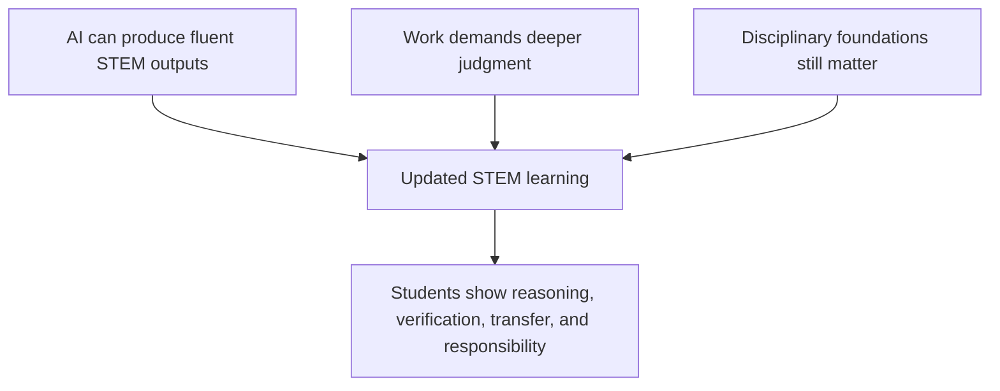

Figure 1. Title: STEM education under AI pressure.

### Practical Recommendation for Teachers

Act as a designer of visible thinking, not only as a presenter of content. In every substantial STEM task, ask students to show the path behind the answer: assumptions, tool use, checks, errors, corrections, and final responsibility.

In practice:

1. Add a short "how I know" component to assignments.
2. Ask students to compare their reasoning with an AI-generated explanation.
3. Require students to mark what they accepted, rejected, or changed after using AI.
4. Use class discussion to examine one wrong or biased AI answer.
5. Keep disciplinary foundations strong, but assess whether students can explain and defend them.

Classroom activity examples:

1. AI answer audit. Give students a familiar STEM problem and one AI-generated solution. Students mark correct steps, weak assumptions, missing explanations, and possible errors, then write a short statement explaining what they trust and why.
2. Reasoning trail submission. Students solve a problem and submit the final answer together with a reasoning trail: what they tried first, where they checked themselves, what evidence supports the answer, and what remains uncertain.
3. Human responsibility debate. Present two polished answers, one student-made and one AI-assisted. Students discuss which answer shows stronger learning and define what evidence would prove ownership.

Evaluation method:

Evaluate success through evidence of visible thinking, not only the correctness of the final answer. The student should be able to explain assumptions, identify tool use, verify claims, correct errors, and take responsibility for the conclusion. A strong performance includes a defensible answer, a clear reasoning trail, and at least one explicit check of reliability.

For personal development, the updated teacher should practice the same task personally. Take one familiar lesson, use AI to solve or explain it in several ways, identify where the tool is strong and weak, and redesign the lesson so students must think beyond the output. This follows the Round Table spirit expressed by Avi Salmon, Emlen Metz, Prof. Russell Tytler, Jan Morrison, and Dr. Gabi Shafat: AI use must deepen judgment, not replace it.

### Sources

[Meeting 2 presentation](../materials/meeting-2-presentation.pptx), [Meeting 3 discussion document](../materials/meeting-3-teacher-in-ai-era-discussion.docx), [OECD Teaching Compass](../materials/oecd-teaching-compass.pdf), [TALIS 2024 background](../materials/talis-2024-us-short.pdf), [Samuel Neaman Institute Round Table context](https://www.neaman.org.il/).

## Chapter 2 - From Knowledge Transmission to Competency Formation

### The Challenge

Many education systems now speak the language of skills and competencies. They mention critical thinking, teamwork, creativity, communication, adaptability, AI literacy, ethical judgment, and lifelong learning. Yet many classrooms, courses, timetables, examinations, and promotion systems remain organized around content delivery, individual performance, and final answers.

This gap between language and structure was one of the recurring concerns in the Round Table. It is easy to say that students need skills. It is harder to design courses, programs, assessment, teacher development, and institutional routines that actually cultivate them.

The [OECD Teaching Compass](../materials/oecd-teaching-compass.pdf) helps explain why the gap is so difficult. It argues that modern teaching requires more than subject knowledge and technical skill. Teachers need professional identity, agency, competencies for complexity, well-being, and participation in a learning ecosystem. In other words, competencies cannot be demanded only from students. The entire teaching system must become capable of supporting them.

The [TALIS 2024 material](../materials/talis-2024-us-short.pdf) reinforces this point from the teacher side. Teachers work under job demands such as workload, work pressure, student behavior, diverse learning needs, uncertainty, and change. They also need resources such as learning opportunities, agency, leadership, support, and professional status. A system that asks teachers to cultivate complex competencies while leaving their work environment unchanged creates a contradiction.

The challenge, therefore, is not whether competencies are desirable. The challenge is how to move them from policy language into daily educational practice without weakening disciplinary rigor or overloading teachers.

### The Dilemma

Should competencies be taught as separate skills, or embedded inside disciplinary courses and real learning tasks?

A separate skills course can make a skill visible. It can give students vocabulary, tools, and dedicated practice. But it can also signal that the skill is external to the discipline. Students may treat it as secondary, optional, or disconnected from real STEM work.

An embedded model makes the skill authentic. It asks students to practice critical thinking inside a physics problem, teamwork inside an engineering project, ethical judgment inside an AI-supported design task, and reflection inside a real learning process. But embedding competencies is demanding. It requires every teacher and lecturer to understand how to design for the competency, make it visible, support it, and assess it.

The Round Table discussion made the dilemma sharper by asking whether competencies should be taught in individual courses, across whole programs, or through a wider ecosystem of teachers, lecturers, industry partners, and institutional structures.

### Main Positions

The separate-skills position argues that competencies should be taught directly. Students need explicit language and practice. If teamwork, communication, or AI literacy matters, then it deserves dedicated time.

The embedded-skills position argues that competencies only become meaningful when used in context. Critical thinking in physics is not identical to critical thinking in history. Collaboration in engineering is shaped by technical constraints, design decisions, and shared responsibility.

The repeated-practice position, raised in the discussion through Dr. Yael Granot-Bein's reference to European evidence, argues that competencies are internalized when three conditions are present: they are linked to a discipline, reinforced over time, and supported by structured reflection. A one-time activity is not enough.

The program-level mapping position argues that individual courses are not enough. Institutions should define a graduate profile and then map where each competency is introduced, practiced, assessed, and deepened across the program.

The ecosystem position goes one step further. It argues that competencies require teachers, lecturers, school leaders, teaching centers, assessment bodies, industry partners, and policy makers to work in alignment. A teacher cannot create a competency-based system alone.

### Pros and Cons

Separate skills courses provide clarity. They can be easy to schedule and communicate. Their risk is that students may treat them as secondary or fail to transfer them into real disciplinary work.

Embedded skills feel more authentic. They connect competencies to actual problems, repeated practice, and disciplinary identity. Their risk is that implementation depends heavily on teacher preparation. If teachers are not supported, the term "embedded" may mean only that the competency is mentioned in the syllabus but never deliberately taught.

Program-level mapping creates coherence. It prevents skills from being left to chance. Its cost is institutional coordination. Departments, teachers, lecturers, and assessment systems must work together.

The ecosystem approach has the greatest long-term potential, but it is also the most demanding. It requires policy, leadership, professional development, data, time, collaboration, and investment. This is why the Afeka presentation is important. It did not present competency formation as a slogan. It presented it as course design, graduate profile work, dynamic learning processes, feedback, student presentations, flipped learning, AI-supported problem solving, project-based learning, industry visits, and evaluation.

### Point of View Map

Higher education needs graduate profiles and program-level mapping. The Afeka example, presented by Dr. Gabi Shafat, shows how engineering education can move from a collection of courses toward a coherent profile of the graduate. The presentation described the future lecturer profile, the Afeka learning experience, the limits of the traditional lecturer model, and the need for team-based structures that combine teaching, project-based learning, industry engagement, AI, and faculty development.

Schools need competencies that fit curriculum, assessment, and student development. Dr. Marwa Maklada's contribution pointed to work in STEM subjects where competency-based tasks can be connected to assessment processes.

Students need to see why competencies matter. If they experience skills as general slogans, they will not internalize them. If they use them to solve real problems, compare approaches, expose mistakes, and reflect on their decisions, competencies become part of learning.

Assessment bodies need ways to evaluate process, reasoning, reflection, and growth, not only final products.

Teachers and lecturers need agency and support. The [OECD Teaching Compass](../materials/oecd-teaching-compass.pdf) explicitly connects teacher agency with curriculum change. If educators are expected to lead modern learning, they need autonomy, confidence, capabilities, professional identity, and well-being. A competency agenda that ignores teacher conditions will remain rhetorical.

Industry needs graduates who can perform in uncertain and collaborative settings. Avi Salmon's contribution connects directly to this point: future readiness is not only mastery of routine technical skills, but deep understanding, curiosity, and professional engagement.

### Round Table Voices

Dr. Yael Granot-Bein brought evidence from European contexts suggesting that competencies are internalized more effectively when they are linked to a discipline, reinforced over time, and accompanied by reflection.

Prof. Sigal Tifferet raised an important question: is embedding competencies inside disciplinary courses evidence-based? This question is central because education systems must avoid adopting attractive language without testing its effectiveness.

Dr. Gabi Shafat described Afeka's practice of defining skills and competencies for courses and evaluating whether students achieved them. Her presentation adds operational depth. In the Advanced Digital Signal Processing course, drivers of change included teamwork, flipped classroom, personalized learning, students teaching, AI as a tool for improving learning processes, and project-based or problem-based learning. The course design included pre-assessment questionnaires, problems at the beginning of lectures, student presentations, pre-class preparation, immediate formative feedback through Delta-Plus, discussions to bridge knowledge gaps, industry site visits, and guest experts.

Dr. Marwa Maklada described progress in integrating skills in STEM subjects and connecting competency-based tasks to assessment.

Dr. Avigdor Zonnenshain emphasized that education must go beyond knowledge transmission and foster love of profession and lifelong learning. He connected this to team-driven education, industry realities, project-based learning, active learning, meaningful assessment, and student motivation.

Danielle Eisenberg's comment about institutions mapping competencies across curricula added another layer. The issue is not only whether one lecturer teaches one skill. The issue is whether an institution knows where its core competencies are developed, where gaps exist, and how professors are supported to teach competencies as intentionally as they teach content.

### Synthesis

Competencies become real when they are practiced, reflected on, and assessed in context. They cannot remain posters on a wall or terms in a policy document.

The Round Table material points to a discipline-linked model of competency formation. It has six parts:

1. Name the competency clearly.
2. Anchor it in a disciplinary or professional context.
3. Give students repeated opportunities to practice it.
4. Make the process visible through reflection and feedback.
5. Assess evidence of reasoning, contribution, and growth.
6. Map the competency across courses, years, and institutional structures.

This model also changes what teachers and lecturers need. They need to know how to design learning processes, not only how to deliver knowledge. They need to manage AI as a learning tool, not only as a threat. They need to work in teams, because one individual educator cannot carry the full complexity of modern STEM learning alone.

### Recommendation

The book recommends a program-level embedded model. Competencies should be explicitly named, repeatedly practiced, connected to disciplinary work, supported by reflection, and assessed through evidence of process as well as outcomes.

For schools, this means connecting competencies to subject learning, assessment tasks, classroom routines, and age-appropriate development.

For higher education, this means defining a graduate profile and mapping competencies across the program rather than leaving them to individual lecturer preference.

For teacher and lecturer development, this means giving educators lived experience with the learning processes they are expected to design for students.

For policy, this means supporting time, structures, assessment redesign, and investment. Competency formation is not a low-cost add-on to traditional education. It is a different design logic.

### Visual

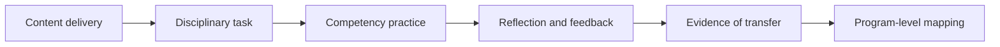

Figure 2. Title: From knowledge transmission to competency formation.

### Practical Recommendation for Teachers

Turn one unit from content coverage into competency formation. Do not add competencies as a slogan at the end of the lesson. Build them into the task itself.

In practice:

1. Choose one disciplinary topic already in the curriculum.
2. Name one competency that naturally belongs inside it, such as critical thinking, teamwork, reflection, communication, or ethical judgment.
3. Design a task where students must use the competency to solve the disciplinary problem.
4. Add structured reflection, so students explain how the competency helped them work.
5. Repeat the same competency later in the course, so it develops over time.

Classroom activity examples:

1. Competency inside content. During a disciplinary lesson, assign a task that requires both content and one named competency, such as explaining a physics result to a nonexpert or justifying a design choice under constraints.
2. Reflection loop. At the end of a project, ask students to write where they used critical thinking, teamwork, or ethical judgment and how that changed the technical result.
3. Repeated competency tracker. Return to the same competency three times across a unit. Students record how their performance changed from first attempt to final task.

Evaluation method:

Evaluate success by looking for transfer of the competency inside the discipline. The student should show accurate content knowledge and also demonstrate the named competency in action: explaining, collaborating, questioning, reflecting, or making a justified decision. Use a rubric with two equal parts: disciplinary quality and competency evidence.

For personal development, the updated teacher should map one course or semester and ask: where is each competency introduced, practiced, assessed, and revisited? This follows Dr. Yael Granot-Bein's point that competencies are internalized when linked to discipline, repeated over time, and supported by reflection, and it follows [Dr. Gabi Shafat's Afeka material](../materials/meeting-2-gabi-shafat-stem.pdf) on defining and evaluating skills inside courses.

### Sources

[Meeting 2 presentation](../materials/meeting-2-presentation.pptx), [Dr. Gabi Shafat STEM material](../materials/meeting-2-gabi-shafat-stem.pdf), [OECD Teaching Compass](../materials/oecd-teaching-compass.pdf), [TALIS 2024 background](../materials/talis-2024-us-short.pdf).

## Chapter 3 - The Five Competencies in an AI-Rich World

### The Challenge

The Round Table built on earlier work identifying core STEM competencies. Phase III added a new pressure: generative AI raises questions of integrity, fairness, responsibility, authorship, trust, dependence, bias, and human agency. These questions cannot be placed outside the competency framework.

The [Meeting 3 discussion document](../materials/meeting-3-teacher-in-ai-era-discussion.docx), prepared by Dr. Eli Eisenberg, Prof. Arnon Bentur, and Avi Salmon with AI assistance, made this point directly. It stated that the first four competencies had been selected through the Phase I round-table consensus process, and that ethical judgment was added as a fifth competency because AI raises questions of integrity, fairness, and responsibility that cut across all the others.

This move is important. It means that AI does not merely add one more technical requirement to STEM education. It changes the conditions under which every competency must be understood. Critical thinking now includes judging AI output. Teamwork now includes collaboration in human-machine environments. Curiosity now includes knowing when to pursue a question beyond an automated answer. Reflection now includes examining how a tool shaped one's thinking. Ethical judgment now becomes a cross-cutting condition for responsible learning and work.

The extracted Meeting 3 document does not enumerate the first four competencies by name in the section available to us. Other collected meeting materials repeatedly mention examples such as critical thinking, teamwork, curiosity, reflection, AI literacy, communication, creativity, and problem solving. This chapter therefore avoids pretending that the source gives a complete canonical list where the extracted text does not. Instead, it develops the structure that the Round Table clearly established: an AI-era competency framework must join cognitive, social, reflective, technological, and ethical dimensions.

### The Dilemma

Are existing STEM skills sufficient, or does the AI era require adding ethical judgment and stronger AI literacy to the core profile?

The question is not only whether a fifth competency should be added. The harder question is whether AI changes the meaning of every competency already named. A student may demonstrate critical thinking in a traditional task, but fail to evaluate an AI-generated explanation. A student may collaborate well with classmates, but use AI in a way that hides contribution and responsibility. A student may show creativity in an assignment, but rely on AI to generate ideas without understanding where they came from. A student may be fluent with tools, but unable to explain when not to use them.

The dilemma is therefore structural. Should AI-era education update the list of competencies, or reinterpret the whole framework through the principle of human responsibility?

### Main Positions

One position is continuity. The competencies identified in earlier phases remain valid. Education systems should avoid constantly changing frameworks.

Another position is expansion. AI creates new conditions, so education must add explicit AI literacy and ethical judgment.

A third position is integration. Ethical judgment and AI literacy should not be treated only as separate skills. They should become cross-cutting dimensions of every competency.

A fourth position, implied by the [OECD Teaching Compass](../materials/oecd-teaching-compass.pdf), is professional mirroring. If students are expected to develop agency, responsibility, and competencies for complexity, teachers must also be supported as agents of curriculum change. The student competency framework and the educator competency framework cannot be separated.

### Pros and Cons

Continuity offers stability. Teachers and institutions need frameworks they can implement. But continuity can understate the specific risks created by AI.

Expansion addresses the new reality directly. But if every new technology adds another competency, teachers and curricula become overloaded.

Integration is stronger. It says that ethical judgment should be present in critical thinking, collaboration, creativity, communication, reflection, and problem solving. Its challenge is assessment. Cross-cutting competencies are harder to measure.

Professional mirroring is essential but demanding. It prevents the system from asking teachers to cultivate capacities that they are not supported to practice themselves. But it requires time, professional development, leadership, trust, and attention to teacher well-being.

### Point of View Map

Teachers need definitions they can teach. A vague call for "future skills" is not enough. Educators need to know what each competency looks like in a lesson, in a project, in feedback, in assessment, and in AI-supported work.

Students need habits, not only rules. They need repeated practice in asking: What did the tool do? What did I do? What do I understand? What do I still need to verify? What are the consequences if this answer is wrong?

Policy makers need a framework that can be adapted locally. The [OECD Teaching Compass](../materials/oecd-teaching-compass.pdf) is useful here because it connects competencies to professional identity, agency, well-being, and learning ecosystems. It also makes clear that transformative student learning cannot happen unless teachers are empowered and supported.

Industry needs graduates who can work responsibly with powerful tools. Avi Salmon's Meeting 2 contribution and the AI-era discussion documents point to a future in which routine output matters less than the ability to understand, judge, question, collaborate, and continue learning.

The [UNESCO AI competency framework](https://www.unesco.org/en/articles/ai-competency-framework-teachers), referenced in the collected materials, similarly supports the Round Table's direction. It frames AI-era teaching through human-centered mindsets, ethics, foundations, pedagogy, and professional learning. That structure reinforces a central idea: AI competence is not just tool use. It is responsible practice.

### Round Table Voices

Dr. Eli Eisenberg, Prof. Arnon Bentur, and Avi Salmon framed the Meeting 3 question around the role of the teacher in cultivating competencies. The discussion document emphasized a guiding principle: the human must remain above the machine.

This phrase is more than a slogan. It means that AI can support analysis, explanation, production, and feedback, but responsibility remains human. The learner must remain responsible. The teacher must remain responsible. The institution must remain responsible.

Emlen Metz's Meeting 2 contribution is directly relevant to this chapter. The warning was that students must use AI thoughtfully and critically, and that deep understanding, critical thinking, and writing require students to think and produce work independently, not merely edit AI-generated text. Decision-making and responsibility cannot be delegated to machines.

Prof. Russell Tytler added a related concern: as AI becomes more sophisticated, students may relinquish control over their thinking processes. This risk makes AI literacy and critical thinking not optional enrichments, but long-term habits that STEM education must deliberately cultivate.

[Dr. Gabi Shafat's Afeka material](../materials/meeting-2-gabi-shafat-stem.pdf) gives this principle a practical form. Students should confront problems where AI tools fail, produce biased perceptions, or provide incomplete solutions. The educational value lies not only in using AI, but in learning to evaluate it.

Dr. Marwa Maklada's assessment perspective also matters. If competencies include ethical and critical AI use, assessment systems must be able to recognize more than final correctness. They must evaluate reasoning, process, judgment, and evidence of independent thought.

### Synthesis

AI does not only add a technology skill. It changes the moral and intellectual conditions of learning. Students must learn how to use AI, but also when to question it, when to reject it, when to disclose it, when to seek human help, and when to rely on their own judgment.

An AI-era competency is therefore not a simple skill. It has at least four layers:

1. Capability: the student can perform or participate in the activity.
2. Understanding: the student knows why the action or answer makes sense.
3. Judgment: the student can evaluate quality, limits, risks, and alternatives.
4. Responsibility: the student can explain and defend the decision to use, revise, reject, or disclose AI support.

This four-layer model helps prevent a common mistake. AI literacy should not be reduced to knowing how to prompt a system. Prompting may be useful, but it is not enough. The deeper educational question is whether the student remains intellectually present and morally responsible.

The same applies to teachers. Teachers need enough AI literacy to design meaningful learning, enough ethical judgment to set boundaries, enough pedagogical confidence to make thinking visible, and enough professional agency to adapt as tools change.

### Recommendation

The book should recommend an AI-era competency architecture rather than only a list. The architecture should preserve the competencies developed in the earlier Round Table work, add ethical judgment explicitly, and embed AI literacy across the whole framework.

The guiding principle should be: keep the human above the machine.

In practice, this means that every STEM learning task involving AI should ask students to provide evidence of:

1. What they asked the AI to do.
2. What they accepted, rejected, or changed.
3. How they checked the output.
4. What they learned independently.
5. What ethical or practical risks they considered.
6. Why the final answer is their responsibility.

This principle should guide curriculum, assessment, professional development, and institutional policy. It should also guide the language of the book. The goal is not anti-AI education. The goal is human-centered AI education.

### Visual

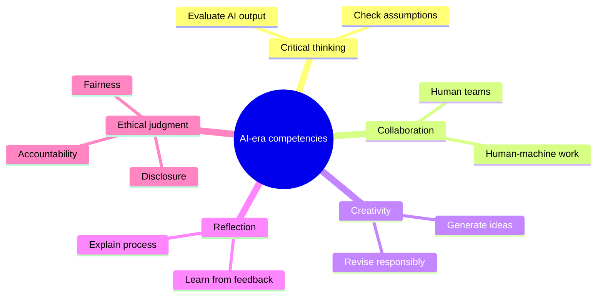

Figure 3. Title: Five competency dimensions in an AI-rich world.

### Practical Recommendation for Teachers

Teach AI literacy as responsibility, not only as tool use. A student who knows how to prompt AI but cannot verify, question, or own the result has not developed the needed competency.

In practice:

1. Require an AI-use note when students use a tool.
2. Ask students to identify one risk in the AI output: error, bias, missing context, weak source, or ethical concern.
3. Make students explain what remains their own responsibility.
4. Use short classroom routines for verification: source check, calculation check, assumption check, and consequence check.
5. Include ethical judgment in STEM tasks whenever AI affects fairness, privacy, accountability, or safety.

Classroom activity examples:

1. AI use declaration. Students complete an assignment with a short declaration: what AI tool was used, for what purpose, what was checked, and what remained their own work.
2. Bias and fairness check. Give students an AI answer to a STEM or technology scenario and ask them to identify possible bias, missing stakeholders, or fairness concerns.
3. Responsibility card. Before submitting AI-assisted work, each student writes one sentence beginning, "I am responsible for this answer because..." and supports it with one verification step.

Evaluation method:

Evaluate success through responsible AI behavior. The student should disclose assistance, distinguish personal thinking from tool output, identify possible ethical or reliability risks, and show how the final work was checked. The grade should reward transparency and judgment, not hidden automation or polished language alone.

For personal development, the updated teacher should build a personal AI competency journal. Once a week, test one AI tool on a real teaching task, record what worked, what failed, and what boundary you would set for students. This turns the Meeting 3 principle, keeping the human above the machine, into a teacher habit.

### Sources

[Meeting 3 discussion document](../materials/meeting-3-teacher-in-ai-era-discussion.docx), [OECD Teaching Compass](../materials/oecd-teaching-compass.pdf), [UNESCO AI competency frameworks](https://www.unesco.org/en/digital-education/ai-future-learning/competency-frameworks), [AI Literacy Framework](https://ailiteracyframework.org/).

# Part II - The Future Profile of the Teacher and Lecturer

## Chapter 4 - One Profile or Many?

### The Challenge

Teachers and lecturers are now expected to do many things at once. They must teach content, cultivate competencies, understand AI, design meaningful tasks, support student motivation, assess process and product, work with diverse learners, collaborate with peers, and connect education to society and work.

No single person can be equally strong in all these areas. This creates the central dilemma of Meeting 2: should the future profile of teachers and lecturers be uniform, or should education systems build diversity of profiles within a coordinated ecosystem?

The question is not technical. It goes to the identity of the profession. If the system defines one ideal teacher profile, it may create clarity but also overload. If the system accepts many profiles, it may gain realism but lose coherence. If it builds a common foundation with differentiated roles, it may support both equity and excellence, but only if institutions are designed to coordinate those differences.

[Jan Morrison's TIES presentation](../materials/meeting-2-ties-jan-morrison.pptx) framed the issue as a shift from "no alternative" toward a strategic approach to defining the future teacher or lecturer. Her proposal included openness to recruiting individuals from diverse backgrounds, including industry, not as a temporary solution but as part of a systemic strategy. It also included team-based models in which teachers and lecturers with different strengths complement one another rather than all being expected to fit a single mold.

### The Dilemma

Should there be a uniform future profile for all teachers and lecturers, or a diversity of profiles within a coordinated educational ecosystem?

The dilemma contains several smaller questions. Are school teachers and university lecturers similar enough to share one profile? Does the answer change between middle school, upper secondary school, first-year higher education, and advanced university courses? Should all educators be expected to embed the same competencies in the same way? Can individual educators be retrained fast enough, or should systems create complementary teams? How much of the future profile belongs to the individual educator, and how much belongs to the institution?

### Main Positions

The uniform-profile position argues for a common expected profile. Every educator should share a clear foundation. This supports equity, policy, teacher education, and public expectations.

The diverse-profile position argues that educators should bring different strengths. Some may be strong in disciplinary depth, others in project-based learning, AI integration, mentoring, assessment, industry connection, or student support.

The common-foundation-plus-specialization position combines both. Every educator needs a baseline, but not every educator needs the same depth in every competency.

The ecosystem position goes further. It argues that the future profile should not be imagined only as the profile of one person. It should be imagined as the profile of a school, department, program, or learning system. The question becomes: what capabilities must exist around the learner, and how should they be distributed among teachers, lecturers, mentors, AI tools, industry partners, teaching centers, and institutional leaders?

### Pros and Cons

A uniform profile creates clarity. It can help teacher education and professional standards. But it can become unrealistic and may ignore differences between school, higher education, discipline, student age, and institutional mission.

Diverse profiles are more realistic. They allow teams to combine strengths. But diversity without coordination becomes fragmentation.

A common foundation plus specialization is the strongest model. It supports shared expectations and differentiated roles. But it requires institutional design.

The ecosystem model is even stronger when implemented well. It recognizes that STEM education in the AI era requires disciplinary expertise, pedagogy, technology use, assessment design, project design, industry relevance, mentoring, and student support. These capabilities can be distributed. The risk is that distributed responsibility can become no one's responsibility unless governance is clear.

The Round Table discussion suggests that this is the real tradeoff. Uniformity without realism produces overload. Diversity without structure produces incoherence. A coordinated ecosystem can produce both professional dignity and practical capacity.

### Point of View Map

School teachers often work under prescribed curricula and closer regulation. University lecturers may have greater academic freedom, especially in advanced courses. Prof. Gil Noam warned against treating school teachers and university lecturers as identical. His concern is important because a shared vocabulary can hide very different professional conditions.

Prof. Arnon Bentur complicated the distinction. He noted that early higher education and secondary education may share important constraints, especially in large foundational courses in mathematics, physics, chemistry, and other basic subjects. In those settings, lecturers often work within predefined programs because later courses depend on those foundations. Greater academic freedom appears more strongly in later years.

Dr. Eli Eisenberg added a governance distinction. Schools in Israel operate under prescribed curricula and close supervision by the Ministry of Education, while universities usually grant more academic autonomy. This changes what can reasonably be expected from the individual educator.

Industry tends to value diverse teams. Complex problems are rarely solved by one ideal worker. This supports an ecosystem view of teaching.

[Jan Morrison's TIES material](../materials/meeting-2-ties-jan-morrison.pptx) adds a systems perspective. Teaching should become a team-driven, cross-sector endeavor. It should connect education to workforce and economic development without reducing education to training. Career-connected learning should be infused with real-world experience and expertise. Emerging technologies such as AI should not remain optional or peripheral to teaching competencies.

[Dr. Gabi Shafat's Afeka material](../materials/meeting-2-gabi-shafat-stem.pdf) gives the higher education version of the same idea. The traditional lecturer model is no longer sufficient because the lecturer is asked to carry too many roles. Her proposed principle is a shift from a single-lecturer model to a complementary team-based model with targeted integration of teaching, project-based learning, industry engagement, AI, and faculty development.

### Round Table Voices

Prof. Gil Noam emphasized that the terms teacher and lecturer refer to different professional contexts. His warning matters because a book about educator profiles must not flatten those differences.

Prof. Arnon Bentur argued that some parts of higher education, especially foundational first-year courses, resemble secondary education in their constraints and challenges. He also described the shift from academic programs as collections of individual courses toward programs designed backward from a graduate profile.

Dr. Eli Eisenberg pointed to differences in academic freedom between schools and universities.

Jan Morrison emphasized team-based and system-based teaching. Her contribution supports the idea that the future profile may not be one individual profile but a designed professional ecosystem. She described the need to leave the traditional "yellow brick road" career path and adopt an "interstate road" model with ramps on and off, including industry, nonprofit, post-military, and other entry paths into teaching.

Dr. Marwa Maklada emphasized that educator profiles differ not only between schools and universities, but also across educational stages and subject areas. Middle school, upper secondary school, STEM subjects, and humanities do not pose identical pedagogical demands.

Dr. Einat Sprinzak added that teachers must experience learning processes themselves in order to mediate them. This supports a differentiated profile because not every educator will enter the transformation from the same starting point.

Avi Salmon's contribution connects the profile question to industry. If employers value deep understanding, curiosity, and meaning-making more than routine AI-replaceable skills, then teachers and lecturers need enough capacity to cultivate these qualities. But this does not imply that every educator must do so in the same way.

### Synthesis

The Round Table points away from a single ideal educator. The better model is a shared baseline combined with diverse strengths, team structures, and institutional coherence.

The shared baseline should include disciplinary responsibility, pedagogical care, ethical judgment, AI awareness, commitment to student agency, and ability to participate in collaborative professional learning. These are not optional.

The differentiated layer should allow educators to specialize. Some may lead deep disciplinary foundations. Some may lead project-based learning. Some may design AI-supported learning. Some may connect with industry. Some may mentor students. Some may develop assessment. Some may coordinate interdisciplinary work.

The institutional layer must make these profiles work together. Without coordination, specialization becomes fragmentation. With coordination, specialization becomes capacity.

### Recommendation

Define a common AI-era educator foundation, then design differentiated roles within schools, departments, and programs. The future teacher or lecturer should not be alone. The educator should be part of a coordinated ecosystem.

The recommended model has three levels:

1. A common foundation for all educators: ethical responsibility, disciplinary integrity, AI awareness, student agency, and reflective practice.
2. Differentiated professional strengths: project learning, industry connection, assessment, mentoring, technology integration, foundational teaching, or interdisciplinary design.
3. Institutional coordination: graduate profiles, team teaching, shared planning, professional development, quality indicators, and leadership support.

This model protects equity without demanding an impossible teacher. It recognizes that excellence in AI-era STEM education is not a heroic individual trait. It is a designed professional system.

### Visual

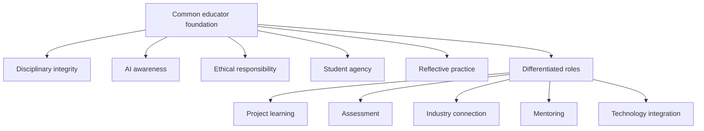

Figure 4. Title: Common foundation plus diverse educator profiles.

### Practical Recommendation for Teachers

Stop trying to become every kind of future educator alone. Build a personal strength profile and connect it to colleagues with complementary strengths.

In practice:

1. Identify your current strongest contribution: foundations, project work, mentoring, assessment, AI use, industry connection, or interdisciplinary design.
2. Identify one gap that matters for your students this year.
3. Find a colleague, teaching center, or external partner who is stronger in that area.
4. Co-design one activity or assessment together.
5. Make the collaboration visible to students, so they see professional teamwork modeled.

Classroom activity examples:

1. Expert roles project. Students work in teams with differentiated roles such as concept lead, AI checker, evidence lead, ethics lead, and presentation lead. The class discusses why different strengths improved the outcome.
2. Teacher profile reflection. After a learning activity, students identify which teacher role mattered most: content expert, coach, assessor, AI guide, mentor, or industry connector.
3. Complementary teaching moment. Invite a colleague or external expert for one part of a lesson and explicitly show students how different professional profiles complement one another.

Evaluation method:

Evaluate success by checking whether students can explain how different roles contribute to learning and quality. In team work, assess both the shared product and each student's role evidence. A successful student understands that expertise can be distributed while responsibility remains clear.

For personal development, the updated teacher should create a two-layer growth plan: maintain the common foundation required of every educator, then develop one specialized strength deeply. This reflects the Round Table's balanced answer to the one-profile-or-many dilemma: common responsibility plus differentiated expertise inside a coordinated ecosystem.

### Sources

[Meeting 2 presentation](../materials/meeting-2-presentation.pptx), [TIES Jan Morrison presentation](../materials/meeting-2-ties-jan-morrison.pptx), [Dr. Gabi Shafat STEM material](../materials/meeting-2-gabi-shafat-stem.pdf), [OECD Teaching Compass](../materials/oecd-teaching-compass.pdf).

## Chapter 5 - Teaching as a Team Profession

### The Challenge

Teaching is often organized as individual work. One teacher, one classroom, one course, one syllabus. But the competencies discussed by the Round Table, especially teamwork, creativity, problem solving, communication, industry relevance, and real-world learning, are difficult to cultivate through isolated practice.

This creates a contradiction. Education systems ask students to become collaborative, interdisciplinary, adaptive, and connected to real problems, but they often place teachers in structures that are solitary, fragmented, and disconnected from the world of practice. A teacher may be asked to cultivate teamwork while having little time to work in a team. A lecturer may be asked to connect learning to industry while having no structured connection to industry partners. A school may be asked to develop creativity while preserving schedules, spaces, and assessments designed for individual content delivery.

[Jan Morrison's TIES presentation](../materials/meeting-2-ties-jan-morrison.pptx) made this contradiction explicit. Future STEM teaching, in her framing, requires transdisciplinary instruction that is team-based and connected to real-life problems and issues. It also requires career-connected learning, externships, diverse recruitment, and cross-sector collaboration. Teaching must become a professional system, not a private act performed behind a classroom door.

### The Dilemma

Should teachers remain primarily individual classroom actors, or should teaching become a team-based, cross-sector profession?

The dilemma is not whether individual teacher expertise matters. It does. Students still need teachers and lecturers who know their subjects, care about learning, and can build trust. The question is whether individual expertise is sufficient for AI-era STEM education.

If the future of STEM learning requires transdisciplinary problems, project-based learning, AI use, industry context, teamwork, ethical reasoning, and complex assessment, then the profession must decide whether one teacher should be expected to carry all of that alone.

### Main Positions

The individual teacher model preserves autonomy and simplicity. The team-based model distributes expertise and models collaboration. The ecosystem model adds industry, mentors, communities, technology specialists, and institutional support.

The individual model sees teaching as a craft practiced by one educator with one group of students. It values responsibility, continuity, classroom intimacy, and professional autonomy.

The team model sees teaching as shared professional design. Teachers plan together, divide strengths, observe one another, co-assess, and build learning sequences that no one teacher could design alone.

The cross-sector ecosystem model connects educators with industry experts, community partners, university mentors, technology specialists, assessment professionals, and policy structures. This model does not remove the teacher. It surrounds the teacher with capacity.

### Pros and Cons

The individual model is familiar. It is easy to schedule and govern. But it overloads teachers and limits the kinds of learning they can support.

The team model allows teachers to share expertise. It also models the collaborative behavior students need to learn. But it requires time, trust, scheduling, leadership, and recognition.

The ecosystem model connects school and higher education to real practice. But it requires governance. Without clear educational purpose, partnerships can become superficial.

Jan Morrison's criticism of failed transdisciplinary instruction is important here. Problem-based and transdisciplinary learning are often criticized when they do not work. But the failure may not be in the pedagogy itself. It may be in the system around it. Without time for faculty collaboration, cross-sector training, and structured teamwork, such approaches are likely to fail and then be dismissed as ineffective.

The Egyptian STEM schools example, as reported in the meeting summary, illustrates the opposite condition. When the educational structure itself is intentionally redesigned to support transdisciplinary teaching, industry and university involvement, and long-term iteration, the approach can become sustainable. The lesson is not that every country should copy one model. The lesson is that team-based STEM learning needs system design.

### Point of View Map

From the TIES perspective, represented by Jan Morrison, future STEM teaching must be transdisciplinary, team-based, career-connected, and supported by systems. Industry can provide context, real problems, mentors, and externship opportunities.

From a teacher perspective, teamwork cannot simply be demanded. It must be supported by time, structures, and professional norms. Teachers need planning time, shared goals, protocols for collaboration, and recognition for work that happens outside direct classroom instruction.

From a policy perspective, collaboration must be funded and recognized.

From a student perspective, teamwork must be explicitly taught. Dr. Revital Duek asked how teamwork can be established as a foundational competency in teacher development and then in student learning. Jan Morrison responded by drawing on medicine, where team-based practice is non-negotiable and "learning to team" is taught intentionally during professional formation. STEM education can learn from that model.

From an industry perspective, team-based learning reflects how complex work actually happens. Dr. Avigdor Zonnenshain emphasized that education should reflect industry realities, especially in engineering, where teamwork is central. This does not mean importing industry uncritically into education. It means recognizing that isolated individual performance is not enough preparation for complex professional life.

From a recruitment perspective, Morrison's "interstate road" model matters. If teaching remains a narrow pathway in which people enter once and remain until burnout, the profession loses potential talent. A more flexible system can include industry workers, post-military professionals, nonprofit experts, and others who bring complementary strengths into education.

### Round Table Voices

Jan Morrison described teaching as a profession that should connect to industry and be treated with a status beyond a calling or service role. She emphasized externships, flexible teacher pathways, systemic redesign, and international learning.

Dr. Revital Duek raised teamwork as a foundational competency. If students must learn teamwork, teachers must experience and model it.

Dr. Avigdor Zonnenshain summarized the importance of education that reflects industry realities, especially in engineering, where teamwork is central.

Danielle Eisenberg's question to Jan Morrison about whether change was happening only in innovative pockets or also in large traditional systems sharpened the implementation issue. Morrison's answer, pointing to system-level developments in districts such as Chicago and Anaheim and higher-education structures such as UTeach, suggested that team-based redesign is not only a boutique innovation. It can enter mainstream systems when trust, measurement, and political conditions support it.

Prof. Sigal Tifferet raised criticism of transdisciplinary instruction, especially the concern that problem-based learning may reduce explicit instruction. This is a serious point. Team-based and transdisciplinary approaches should not become excuses for weak teaching. They must protect disciplinary clarity while expanding the context of learning.

Jan Morrison's response was that criticism often reflects poor implementation in systems not designed for the pedagogy. This distinction is central. A good idea can fail when inserted into the wrong structure.

### Synthesis

Teamwork is both an educational goal and a professional condition for achieving that goal. Students cannot learn modern STEM teamwork from systems that isolate teachers.

A team profession has at least four dimensions:

1. Team teaching: educators plan, teach, observe, and assess together.
2. Cross-disciplinary design: STEM problems are built across subject boundaries where appropriate.
3. Cross-sector partnership: industry, universities, communities, and mentors contribute authentic contexts.
4. Professional mobility: people can enter, leave, and re-enter teaching through flexible pathways without weakening standards.

This model also protects teachers. When the individual teacher is expected to be content expert, AI expert, project designer, mentor, assessor, social worker, industry connector, and innovation leader, burnout is predictable. Team structures distribute load and expertise.

### Recommendation

Treat teaching as a team profession. Build time, shared planning, joint assessment, cross-disciplinary projects, and partnerships into the structure of schools and higher education.

A serious implementation model should include:

1. Scheduled collaboration time for educators.
2. Team-based project design and assessment.
3. Teacher externships or structured contact with industry.
4. Flexible professional pathways that bring diverse expertise into teaching.
5. Cross-sector advisory groups that meet regularly, not only at conferences.
6. Measurement used for improvement and iteration, not only accountability.
7. Explicit teaching of teamwork to students, beginning before advanced STEM specialization.

The recommendation is not to erase the individual teacher. It is to stop leaving the individual teacher alone with a system-level task.

### Visual

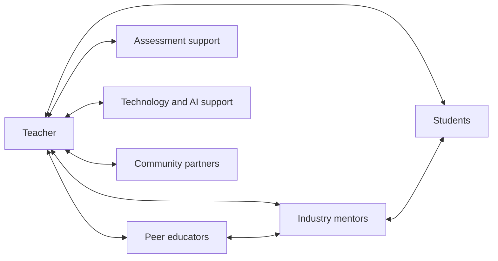

Figure 5. Title: Teaching as a team profession.

### Practical Recommendation for Teachers

Practice team teaching even before the institution formally redesigns around teams. Start small, but make the collaboration real.

In practice:

1. Select one complex topic that benefits from more than one perspective.
2. Invite a colleague, industry professional, advanced student, or community partner to help shape the task.
3. Ask students to work in teams with explicit roles, not only informal groups.
4. Assess both the product and the collaboration process.
5. Hold a short team debrief: what did each person contribute, where did coordination fail, and what should improve next time?

Classroom activity examples:

1. Cross-discipline design sprint. Pair two subjects, such as physics and design or biology and ethics. Students solve one problem that requires both perspectives and present how the disciplines changed each other.
2. Teamwork rubric lab. Students complete a short team task, then use a rubric to evaluate roles, communication, conflict, and contribution before discussing the technical result.
3. Industry-style standup. During a project week, students hold brief team standups: what was done, what is blocked, what help is needed, and what will be tested next.

Evaluation method:

Evaluate success through the quality of collaboration as well as the quality of the solution. Evidence should include role clarity, contribution records, response to feedback, and the team's ability to combine disciplinary perspectives. Individual assessment should include what each student added to the collective result.

For personal development, the updated teacher should experience professional teamwork personally. Join or create a small educator design group that meets regularly to build, test, and improve learning tasks. This follows [Jan Morrison's TIES argument](../materials/meeting-2-ties-jan-morrison.pptx) that career-connected, transdisciplinary learning requires a system shift, not isolated heroic teachers.

### Sources

[TIES Jan Morrison presentation](../materials/meeting-2-ties-jan-morrison.pptx), [Meeting 2 presentation](../materials/meeting-2-presentation.pptx), [Samuel Neaman Institute Round Table context](https://www.neaman.org.il/).

## Chapter 6 - The Engineering Education Case

### The Challenge

Engineering education is a powerful test case for the Round Table's ideas. It requires rigorous foundations, but it also promises graduates who can design, solve, collaborate, innovate, and work with real systems. Traditional course structures do not always deliver that combination.

Dr. Gabi Shafat's presentation, "The Challenge in Engineering Higher Education," made this case concrete. Afeka Academic College of Engineering works with graduate profiles, educational models, and an Afeka learning experience across undergraduate and graduate programs. The challenge she presented was not a rejection of engineering rigor. It was a warning that the traditional lecturer model is no longer sufficient for the changing engineering landscape.

The pressure comes from several directions at once. Engineering knowledge is expanding. AI tools can explain, compute, summarize, and write code. Students expect more personalized learning. Industry expects graduates who can work in teams and solve real problems. Faculty workload is increasing. Traditional courses in mathematics, physics, and engineering foundations often remain poorly aligned with applied engineering practice. The result is role overload for engineering faculty and a gap between what engineering programs promise and what course structures can deliver.

### The Dilemma

Should engineering programs mainly transmit disciplinary foundations, or redesign around graduate profiles and competency-based learning?

The dilemma is especially sharp in engineering because foundations are not optional. Mathematics, physics, signal processing, circuits, programming, and systems thinking are necessary. A weak foundation damages later learning.

At the same time, engineering graduates are not hired only to reproduce foundations. They are expected to design under constraints, evaluate tradeoffs, work with uncertainty, collaborate, communicate, use tools responsibly, and continue learning. AI raises the pressure further because some routine technical tasks can now be performed quickly by tools that may also be confidently wrong.

The question is not whether to keep foundations or move to projects. The question is how to connect foundations, projects, AI, assessment, industry, and graduate profiles into one coherent educational design.

### Main Positions

The traditional-sequence position protects mathematics, physics, and engineering fundamentals. The graduate-profile position starts from the desired graduate and works backward. The hybrid position protects foundations while connecting them earlier to practice, projects, AI, and industry.

The Afeka model, as presented in the meeting, belongs to the hybrid and graduate-profile family. It shifts the frame from "teaching engineering" to "engineering education." This shift matters. Teaching engineering can mean delivering the content of separate courses. Engineering education asks what kind of graduate the program is producing and how every course contributes to that profile.

The AI position inside this model is also balanced. AI is neither rejected nor worshipped. Dr. Shafat described AI almost as a "perfect lecturer" in certain narrow ways: available at all hours, patient, fast, and confident. But the same list exposes the problem. AI can be very confident when wrong. It is not responsible when things break in production. It does not provide human interaction. Therefore, engineering education must teach students to use AI while recognizing its strengths and limitations.

### Pros and Cons

The traditional sequence is clear and rigorous. Its weakness is that students may not connect early foundations to engineering practice.

The graduate-profile approach creates coherence and relevance. Its weakness is that faculty buy-in and assessment redesign are difficult.

The hybrid approach is the most practical. It keeps fundamentals but asks every stage of learning to connect to purpose.

The Afeka example shows the cost of doing this seriously. It requires adaptive and dynamic course design, lecturer availability, pre-assessment, student preparation, active tasks, formative feedback, industry visits, and careful assessment of learning outcomes. It is not a matter of adding one AI assignment to a traditional course.

There are also limits. Dr. Shafat noted that AI-supported approaches do not work effectively in very large groups without investment. Post-hoc grading alone has little educational impact. Take-home assignments lose value when students can rely heavily on AI-generated solutions. Team-based projects raise fairness questions about individual contribution. These are not reasons to abandon redesign. They are reasons to treat redesign as serious professional work.

### Point of View Map

Students need motivation and connection. In the Advanced Digital Signal Processing course described in the presentation, drivers of change included teamwork, flipped classroom, personalized learning, students teaching, AI as a tool to improve learning processes, and project-based or problem-based learning. Each lecture began with a problem to solve. Students prepared presentations. Pre-class preparation included videos or instructional content. Discussion was used to bridge knowledge gaps.

Faculty need professional support and evidence. Dr. Shafat's presentation described immediate formative feedback through Delta-Plus, assessment of learning outcomes, continuous improvement, and cross-departmental discussions about the strengths and limitations of AI tools and advanced teaching methods.

Industry needs graduates who can reason, collaborate, and judge. Industry site visits and guest experts were part of the course design, not external decoration. This connects engineering learning to professional practice.

Institutions need program-level design. Prof. Arnon Bentur emphasized that programs have traditionally been collections of individual courses, while the new direction requires defining a graduate profile and working backward. Afeka's mapping of competencies across courses provides a concrete example.

Policy makers need to understand that innovation requires investment. Dr. Shafat's policy message was that education requires more investment, not less. If institutions want project-based learning, AI integration, feedback, industry links, and meaningful assessment, they must fund the conditions that make them possible.

### Round Table Voices

Dr. Gabi Shafat described Afeka's shift from teaching engineering to engineering education. This shift includes graduate profiles, skill mapping, AI integration, feedback, industry visits, flipped classrooms, and project-based learning.

Avi Salmon emphasized that deep understanding and genuine engagement with the profession matter more as routine technical work becomes automated.

Prof. Arnon Bentur pointed to the importance of defining the graduate profile and designing backward.

Dr. Avigdor Zonnenshain asked what Afeka was doing to demonstrate the effectiveness of these processes. This question is crucial because innovation must not be judged only by enthusiasm. It needs evidence, feedback, and evaluation.

Dr. Gabi Shafat responded that rapid change means there are no definitive answers yet, but that Afeka conducts ongoing cycles of feedback and evaluation through cross-departmental discussions. She also identified practical lessons: take-home assignments must be reconsidered when AI can produce solutions, in-class assessment remains important, large classes constrain innovation, and foundational subjects need stronger applied integration.

Avi Salmon later sharpened the faculty-development issue: the real question is how to get professors involved. The challenge is not only to redefine curriculum content, but to enable teachers and lecturers to personally experience new pedagogical and technological realities.

### Synthesis

Engineering education shows that skills cannot be added only at the edges. They must be designed into courses, projects, assessment, and institutional culture.

The Afeka case suggests a concrete model:

1. Start from the graduate profile.
2. Map knowledge and competencies across courses.
3. Redesign courses around problems, preparation, feedback, and active learning.
4. Use AI as a learning tool, but deliberately expose its limits.
5. Connect learning to industry and professional practice.
6. Assess process, products, contribution, and understanding.
7. Support faculty through team models and institutional investment.

This is not a softening of engineering education. It is a more demanding form of rigor. It asks whether students can use foundations in conditions closer to the work they will actually do.

### Recommendation

Use engineering education as a model for program-level redesign. Define the graduate profile, map competencies across the curriculum, connect foundations to practice, and use AI in ways that expose rather than hide student thinking.

Engineering programs should review every major course through five questions:

1. Which part of the graduate profile does this course develop?
2. Which competencies are practiced, not merely named?
3. How does the course make student thinking visible?
4. How does the course teach students to evaluate AI outputs and tool limits?
5. What evidence shows that students can transfer knowledge into real engineering judgment?

The deeper recommendation is structural. Higher education should move from the heroic individual lecturer model toward a complementary team-based model. Teaching, project-based learning, industry engagement, AI integration, assessment, and faculty development should be realigned so that the program, not only the lecturer, carries the responsibility for graduate readiness.

### Visual

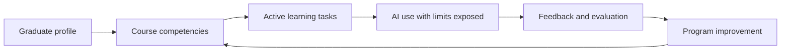

Figure 6. Title: Engineering education as backward design from the graduate profile.

### Practical Recommendation for Teachers

Use the engineering education case as a model even outside engineering: begin with the desired graduate or learner profile, then work backward to the lesson.

In practice:

1. Write one sentence describing what a successful learner should be able to do with the knowledge.
2. Design a task that requires application, not only recall.
3. Include a moment where students must evaluate an AI output or technical tool.
4. Add a real or realistic constraint, such as cost, safety, user need, data quality, or tradeoff.
5. Collect evidence from process, product, explanation, and reflection.

Classroom activity examples:

1. Constraint-based design task. Students design a solution under real constraints such as budget, safety, time, user need, or data quality, then explain the tradeoffs.
2. AI tool stress test. Students use AI on an engineering or STEM problem, compare its output to disciplinary principles, and document where the tool was useful or unreliable.
3. Graduate profile presentation. Students present a project by explaining which future professional capabilities it developed, not only what technical result they produced.

Evaluation method:

Evaluate success with a design-and-justification rubric. The student should show technical correctness, awareness of constraints, explanation of tradeoffs, and ability to connect the work to future professional capabilities. Strong work includes iteration, not only a final product.

For personal development, the updated teacher should redesign one course artifact using the Afeka logic: graduate profile, course skills, active learning, AI as a learning tool, feedback, and evaluation. The aim is not to copy engineering education mechanically. It is to adopt its discipline of connecting foundations to practice and evidence.

### Sources

[Dr. Gabi Shafat STEM material](../materials/meeting-2-gabi-shafat-stem.pdf), [Meeting 2 presentation](../materials/meeting-2-presentation.pptx), [TIES Jan Morrison presentation](../materials/meeting-2-ties-jan-morrison.pptx).

# Part III - Must Teachers Possess the Skills They Teach?

## Chapter 7 - Possessing Versus Cultivating Competencies

### The Challenge

Teachers are expected to cultivate competencies in students. But must they personally possess those competencies first? Can a teacher teach creativity without being creative? Can a lecturer cultivate teamwork without working in teams? Can an educator teach ethical AI use without deep AI experience?

The [Meeting 3 discussion document](../materials/meeting-3-teacher-in-ai-era-discussion.docx) framed this not as a binary question but as a continuum. Its purpose was not to settle the issue in advance, but to lay out the competencies, tensions, and arguments on each side as a basis for informed discussion.

The challenge is especially difficult because competencies are not like isolated facts. A teacher can teach a fact from a textbook with limited personal experience. But competencies such as judgment, collaboration, curiosity, ethical responsibility, and AI literacy are partly visible through practice. Students notice how educators think, respond, question, collaborate, and handle uncertainty.

At the same time, expecting every educator to be a full practitioner of every competency is unrealistic. It risks turning the future teacher profile into an impossible demand. The real question is not whether teachers must possess everything perfectly. The question is what level of lived understanding is necessary for credible cultivation.

### The Dilemma

Should lecturers and teachers themselves possess the required competencies, or should their primary expertise lie in cultivating these competencies in students?

The Meeting 3 document translated this dilemma into precise subquestions:

1. What counts as sufficient mastery?
2. Can pedagogical expertise substitute for personal practice?
3. Do all competencies require the same depth of teacher experience?
4. How should limited professional development time be allocated?
5. What is the role of teacher vulnerability and not-knowing?
6. How can enough competency be assessed?
7. Does the answer change across age, discipline, institution, culture, or resource level?

These questions prevent an easy answer. The teacher's role differs by context. A primary school teacher building foundational literacy, a high school physics teacher, a university lecturer in signal processing, and an engineering project mentor do not need identical competency profiles. But all need enough understanding to protect student learning and responsibility.

### Main Positions

The possession position argues that teachers need lived experience. Students learn not only from instruction but from modeling.

The cultivation position argues that teachers do not need to be expert practitioners of every competency. Their professional expertise is pedagogy.

The balanced position argues that teachers need enough lived experience to model, recognize, and judge the competency, but they do not need identical mastery in all domains.

The distributed-expertise position adds that some competencies can be held more deeply by specific members of a professional team. One educator may be strong in AI-supported learning, another in project design, another in assessment, another in industry connection, and another in student mentoring. The system must ensure that the full set of capabilities is available to learners.

The developmental position argues that teacher competency should be seen as growth, not as a static qualification. Educators can develop their own competencies while learning how to cultivate them in students.

### Pros and Cons

Possession gives credibility. It allows teachers to model thinking and practice. Its risk is unrealistic expectations.

Cultivation focuses on pedagogy. It recognizes that teachers help students grow beyond the teacher's own experience. Its risk is hollow instruction if the teacher lacks any lived understanding.

The balanced approach is most workable. It requires defining levels of competence and support.

Distributed expertise reduces overload and reflects real professional life. Its risk is fragmentation if roles are not coordinated.

Developmental expectations support professional growth. Their risk is vagueness unless institutions define evidence of progress.

The professional-development tradeoff is real. Training time and resources are limited. If all time is spent building teachers' own competencies, pedagogy may suffer. If all time is spent on how to teach competencies, teachers may lack the lived experience to model them credibly. A strong system must do both, but not all at once and not at the same depth for every role.

### Point of View Map

Teachers need expectations they can meet. If the profile becomes too idealized, teachers may experience it as accusation rather than professional direction.

Students need credible guidance. They must see adults who can ask good questions, use AI critically, collaborate, admit uncertainty, and take responsibility.

Teacher educators need priorities. They must decide what belongs in initial preparation, what belongs in induction, and what belongs in continuing professional development.

Policy makers need standards that support growth instead of creating impossible demands. Standards should define baseline competence, development pathways, and support structures.

Institutions need role design. If some competencies require deep specialization, then schools and departments should not pretend that every educator will hold the same level of expertise.

Industry and society need trust. If graduates are expected to work responsibly with powerful tools, the educators who prepare them must be able to recognize responsible and irresponsible use.

### Round Table Voices

Dr. Eli Eisenberg, Prof. Arnon Bentur, and Avi Salmon framed this dilemma in the Meeting 3 document.

Emlen Metz warned against students delegating thinking and responsibility to machines. This implies that teachers must be able to guide responsible use.

Prof. Russell Tytler expressed concern that AI may reduce deep, sustained thinking. This strengthens the case for teachers who can model intellectual discipline.

Avi Salmon argued in Meeting 2 that teachers and lecturers must remain above AI. In this chapter, that claim becomes a competency requirement. The educator does not need to know more than every AI system. The educator does need enough judgment to keep the human process of learning, responsibility, and meaning above the machine.

Dr. Einat Sprinzak's Meeting 2 contribution also belongs here. Teachers who mediate skills and competencies should first experience these learning processes themselves as learners. This does not mean they must become perfect models. It means they need firsthand understanding of the student journey.

[Dr. Gabi Shafat's Afeka material](../materials/meeting-2-gabi-shafat-stem.pdf) shows one way to make this practical: educators and students can use AI tools on challenging problems where the tools fail or show bias, then discuss the limits and produce a better solution. The teacher's role is not to be an all-knowing AI expert, but to design and guide the learning process responsibly.

### Synthesis

Teachers do not need to be perfect examples of every competency. But they do need enough lived understanding to model learning, ask good questions, recognize quality, and guide students responsibly.

The Round Table materials support a levels model:

1. Awareness: every educator understands the competency and why it matters.
2. Personal practice: every educator has some lived experience using the competency.
3. Pedagogical design: educators can design learning situations that cultivate the competency.
4. Assessment judgment: educators can recognize evidence of student growth.
5. Specialist leadership: some educators develop deeper expertise and support colleagues.

This levels model avoids two mistakes. It avoids saying that teachers can teach competencies they have never practiced. It also avoids saying that every teacher must master every competency equally.

### Recommendation

Define competency expectations in levels. All educators need baseline awareness and responsible practice. Some need deeper competence because of their discipline or role. Specialist expertise should be distributed across teams and institutions.

Professional development should be designed in two linked tracks:

1. Educator experience: teachers and lecturers personally practice AI use, critical questioning, teamwork, reflection, and ethical judgment.
2. Pedagogical translation: educators learn how to design tasks, feedback, assessment, and classroom routines that cultivate these competencies in students.

The recommendation is balanced: teachers must possess enough to model and judge, but they do not need to carry the whole future alone.

### Visual

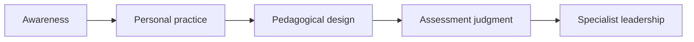

Figure 7. Title: Levels of educator competency for cultivating student skills.

### Practical Recommendation for Teachers

Build enough personal practice to model and judge the competency you want students to develop. Do not teach a competency only as vocabulary.

In practice:

1. Choose one competency you expect from students.
2. Practice it yourself in a real professional context.
3. Show students one example of your process, including difficulty or revision.
4. Design a student task where the competency is necessary, not decorative.
5. Use a simple rubric that separates awareness, responsible use, teaching translation, assessment judgment, and specialist leadership.

Classroom activity examples:

1. Teacher modeling session. The teacher demonstrates a real thinking process, including a mistake, revision, or uncertainty, then students identify the competency being modeled.
2. Competency transfer task. Students use one competency, such as critical questioning, in two different contexts and compare what changed.
3. Enough mastery discussion. Students examine a scenario where a teacher or expert guides a competency without being the top specialist, then discuss what level of mastery is enough to guide others responsibly.

Evaluation method:

Evaluate success by looking for student awareness of the competency and evidence of use in more than one setting. A student succeeds when they can name the competency, apply it, explain how it helped the work, and recognize what level of guidance or expertise was needed.

For personal development, the updated teacher should choose one competency per semester for deliberate growth. For example, if the focus is ethical AI use, the teacher should use AI, test its limits, read one relevant framework, design one classroom routine, and discuss results with colleagues. This follows the Meeting 3 balance: teachers need enough lived practice to model and judge, while specialist depth can be distributed across teams.

### Sources

[Meeting 3 discussion document](../materials/meeting-3-teacher-in-ai-era-discussion.docx), [Meeting 2 presentation](../materials/meeting-2-presentation.pptx).

## Chapter 8 - Teacher Vulnerability, Authority, and Not-Knowing

### The Challenge

AI destabilizes traditional authority. A student may use a tool the teacher has not yet mastered. A system may generate an answer faster than the teacher can. Knowledge changes quickly. The teacher can no longer rely only on being the person who knows.

The [Meeting 4 discussion document](../materials/meeting-4-discussion-document.docx) described the classical educational relationship as a teacher who knows and a student who learns. The teacher decides what to present, how to present it, when the student is ready, and whether understanding has been achieved. AI challenges this model because it can explain, tutor, quiz, adapt, and respond continuously. It does not replace the teacher, but it enters the space between teacher and student.

This creates a new professional pressure. If a student can get an instant answer, the teacher's authority cannot rest only on speed, access, or factual possession. The teacher's authority must rest on judgment, context, trust, care, interpretation, and the ability to guide inquiry.

### The Dilemma

Should teachers preserve confident authority, or model uncertainty, inquiry, and learning in real time?

The Meeting 3 document named the question directly: what is the role of teacher vulnerability and not-knowing? Should teachers model uncertainty and learning in real time, or do students need confident authority?

This is not a soft psychological issue. It is a core pedagogical question. Too much certainty can become false confidence. Too much vulnerability can become loss of structure. The AI era requires a new balance: professional authority that is confident enough to lead and humble enough to investigate.

### Main Positions

One position says students need confident authority. Without it, classrooms lose structure.

Another position says students need to see how experts learn, revise, verify, and admit uncertainty.

A third position is guided authority. Teachers remain responsible leaders, but they model inquiry and judgment openly.

A fourth position, grounded in cognitive apprenticeship, says that expert thinking should be made visible. Students learn not only from final answers, but from seeing how an expert frames a problem, tests a claim, notices uncertainty, checks evidence, and revises a conclusion.

### Pros and Cons

Traditional authority gives clarity and trust. Its weakness is brittleness. If authority depends on always knowing, it fails in fast-changing contexts.

Vulnerability models lifelong learning. Its weakness is that it can confuse students if not framed with care.

Guided authority is strongest. The teacher does not pretend to know everything. The teacher demonstrates how responsible learners handle what they do not know.

Cognitive apprenticeship adds a practical method. The teacher can model thinking aloud, coach students through uncertainty, scaffold the task, and gradually transfer responsibility. In an AI-rich classroom, this may mean comparing an AI explanation with a textbook, asking students to identify unsupported claims, showing how to verify a result, or explaining why a fluent answer is still not trustworthy.

The danger is performance vulnerability. A teacher saying "I do not know" without showing the next professional move may weaken trust. A teacher saying "I do not know yet, so here is how we will find out" strengthens trust.

### Point of View Map

Younger students may need stronger structure. Older students can benefit from explicit modeling of uncertainty. In AI-rich classrooms, all students need to see how claims are checked, compared, and judged.

From a teacher perspective, authority becomes interpretive rather than merely declarative. The teacher does not only state what is correct. The teacher helps students understand why, under what conditions, with what evidence, and with what limits.

From a student perspective, visible teacher inquiry can build self-efficacy. Students learn that not knowing is not failure if it leads to disciplined investigation.

From a policy perspective, teacher vulnerability must not be confused with lowered standards. Professional learning systems should help teachers develop confidence in uncertainty, not abandon expertise.

From the [OECD Teaching Compass](../materials/oecd-teaching-compass.pdf) perspective, teachers need agency to navigate complexity and uncertainty. The Compass describes teachers as agents of change who adapt, innovate, and act with professional judgment. That is exactly the authority needed here.

From the AI design perspective, the Meeting 4 and Danielle Eisenberg materials point to the teacher as the interpretive layer. AI can propose, surface evidence, or generate signals. The teacher who knows the student and the context decides.

### Round Table Voices

The Meeting 3 document explicitly asked about the role of teacher vulnerability and not-knowing.

Avi Salmon argued that teachers and lecturers must remain above AI. That does not mean they must know more facts than every tool. It means they must lead the human process of judgment.

Emlen Metz emphasized that decision-making and responsibility cannot be delegated to machines.

The [Meeting 4 discussion document](../materials/meeting-4-discussion-document.docx) asked whether AI enhances or undermines teacher authority. It suggested that the teacher's role may evolve from knowledge authority toward a guide who teaches judgment, context, and critical evaluation of AI-generated content.

Danielle Eisenberg's presentation added a design formulation: AI proposes, teachers decide. AI may surface skill evidence, but the teacher who knows the student remains the interpretive layer.

The [OECD Teaching Compass](../materials/oecd-teaching-compass.pdf) reinforces this stance through teacher agency, professional identity, ethical values, and the capacity to act under uncertainty.

### Synthesis

Authority in the AI era shifts from having all answers to leading the process of responsible inquiry.

Professional authority now has four parts:

1. Knowledge authority: the educator understands the field and its standards.
2. Process authority: the educator knows how to investigate and verify.
3. Ethical authority: the educator keeps responsibility human.
4. Relational authority: the educator knows the student, the context, and the learning process.

AI can challenge the first if authority is understood narrowly as information possession. It cannot replace the other three. That is where the teacher's future authority becomes stronger, not weaker.

### Recommendation

Adopt transparent professional authority. Teachers should be able to say, "I do not know yet," while showing students how to investigate, evaluate, decide, and take responsibility.

In practice, this means teachers should model professional inquiry in front of students:

1. State what is known.
2. Name what is uncertain.
3. Check sources and assumptions.
4. Compare human reasoning with AI output.
5. Decide what can be trusted.
6. Explain why the final judgment remains human.

The teacher above AI is not the teacher who always knows first. It is the teacher who knows how responsible knowing is done.

### Visual

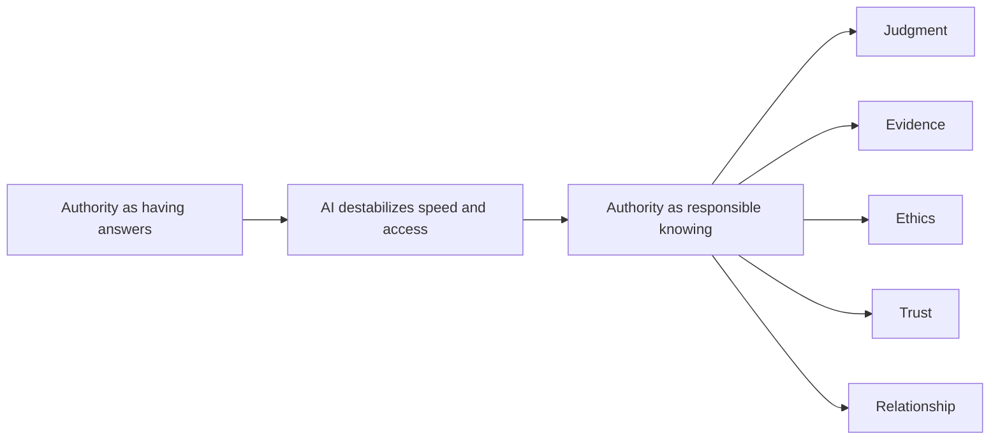

Figure 8. Title: From answer authority to responsible knowing.

### Practical Recommendation for Teachers

Model disciplined not-knowing. Do not hide uncertainty, and do not perform uncertainty without structure. Show students the professional moves that follow uncertainty.

In practice:

1. When a question is uncertain, name what is known and what is not yet known.
2. Ask students to propose how the class should verify the issue.
3. Compare at least two sources or explanations, including AI when relevant.
4. Explain why one answer is more trustworthy than another.
5. End with a clear human judgment and the evidence behind it.

Classroom activity examples:

1. I do not know yet protocol. When a difficult question arises, the class records what is known, what is uncertain, how to investigate, and what evidence would settle the issue.
2. Competing explanations. Students compare a textbook explanation, an AI explanation, and a peer explanation, then decide which is strongest and why.
3. Trust ladder. Students rank sources or answers from least to most trustworthy and explain what evidence would move each answer up or down.

Evaluation method:

Evaluate success through epistemic responsibility: how students handle uncertainty, evidence, and source trust. The student should be able to say what is known, what is unknown, what evidence is needed, and why one explanation is stronger than another. Reward careful reasoning even when the answer is not immediate.

For personal development, the updated teacher should rehearse transparent authority. Before class, identify one place in the lesson where uncertainty, competing explanations, or AI output could be examined openly. This develops the authority described in the Round Table: not authority based only on having answers, but authority based on judgment, process, ethics, and relationship.

### Sources

[Meeting 3 discussion document](../materials/meeting-3-teacher-in-ai-era-discussion.docx), [Meeting 2 presentation](../materials/meeting-2-presentation.pptx).

## Chapter 9 - Assessing Enough Competency

### The Challenge

If teachers are expected to possess or cultivate competencies, systems need ways to judge readiness. But competencies such as ethical judgment, critical thinking, teamwork, reflection, AI literacy, and professional judgment cannot be reduced to simple checklists.

The assessment challenge appears at three levels at once. First, students must be assessed for competencies, not only final answers. Second, teachers and lecturers must be assessed or supported in their ability to cultivate those competencies. Third, institutions and programs must be evaluated to see whether their reforms actually work.

The Round Table materials repeatedly warn against confusing measurement with learning. Assessment must make practice visible. It must support improvement. It must be credible enough for policy and institutions, but humane enough not to punish educators for engaging in complex change.

### The Dilemma

Can these competencies be assessed meaningfully for teachers and lecturers?

The Meeting 3 document asked: if possession matters, what does evaluation look like for something personal and contextual? This question is sharper than it first appears. A teacher's ethical judgment, AI literacy, ability to model uncertainty, or capacity to cultivate teamwork cannot be captured by a single written test.

At the same time, avoiding assessment entirely is not acceptable. If systems cannot tell whether teachers, courses, or programs are developing competencies, reforms remain aspirational. The dilemma is how to assess deeply without reducing complex professional practice to shallow indicators.

### Main Positions

Formal standards create clarity. Portfolios capture practice. Peer review brings professional judgment. Support-first approaches encourage growth. Each has value and each has limits.

The standards position says that systems need explicit expectations. Teachers and lecturers should know what is required. Institutions and policy makers need benchmarks.

The portfolio position says that competencies require evidence over time: lesson designs, student artifacts, reflections, feedback cycles, AI-use policies, assessment rubrics, peer observations, and examples of changed practice.

The peer-review position says that professional judgment should be evaluated by professionals, not only by external metrics. Colleagues can observe teaching, review course design, and discuss evidence.

The program-evaluation position, raised strongly by Avi Salmon, says that reforms themselves should be evaluated professionally and with data. A program should not be declared successful because it sounds modern.

The support-first position says that the purpose of assessment should be growth. Especially in a period of rapid change, teachers need accompaniment and feedback, not only accountability.

### Pros and Cons

Formal standards support accountability but can become bureaucratic. Portfolios show evidence but require time. Peer review is contextual but can be inconsistent. Support-first models reduce fear but may lack accountability.

Program evaluation can reveal whether reforms work, but it requires careful design. Bad metrics may reward superficial compliance. Good metrics must look at student learning processes, teacher practice, institutional support, and long-term outcomes.

AI-supported assessment can help surface patterns, but it introduces bias, privacy, trust, and interpretation problems. The Meeting 4 materials are relevant here: AI can propose analysis and feedback, but the teacher who knows the student and context must remain the interpretive layer.

The deepest risk is that assessment becomes another burden on teachers without improving learning. The [Meeting 5 steering context](https://www.neaman.org.il/) warned that professional development cannot be one-time training. It requires accompaniment, implementation support, institutional infrastructure, resources, evaluation, and policy backing. The same is true of assessment.

### Point of View Map

Teachers need assessment that helps them improve. Evidence should point to next steps: what to redesign, what to practice, what support is needed, what student evidence shows.

Institutions need quality assurance. They must know whether competency-based learning is actually happening across courses and programs.

Policy makers need mechanisms that can scale. But scalable mechanisms must not flatten practice into simplistic compliance.

Students need confidence that educators can guide them responsibly. If AI is part of learning, students need teachers who can interpret evidence, detect shallow work, guide ethical use, and evaluate process.

Assessment bodies need new tools. Dr. Marwa Maklada's comments about validating competency-based tasks in matriculation processes show that formal systems can evolve, but they must be careful and evidence-based.

Higher education needs course-level and program-level evidence. [Dr. Gabi Shafat's Afeka material](../materials/meeting-2-gabi-shafat-stem.pdf) included pre-assessment questionnaires, assessment of learning outcomes, immediate formative feedback, class discussions, evaluation of AI-supported work, and cross-departmental review.

### Round Table Voices

Dr. Gabi Shafat described assessing students' ability to think critically around AI, including cases where AI tools fail or produce biased perceptions.

Avi Salmon argued for professional, data-based evaluation of programs.

Dr. Marwa Maklada described work on validating competency-based tasks and assessment processes.

The [Meeting 5 steering context](https://www.neaman.org.il/) adds that there is no single actor with clear responsibility for sustained professional development. This matters for assessment because no assessment system can work if no one owns the follow-up. Evidence without support becomes judgment without improvement.

[Danielle Eisenberg's Meeting 4 material](../materials/meeting-4-default-or-design-ignite-ed.pptx) argued that traditional assessment measures outputs and cannot detect shallow AI use, equity gaps, or whether AI-supported learning is actually producing understanding. It proposed visibility into process, not only products.

Dr. Tzur Karelitz's question in Meeting 4, asking why the teacher should mediate between AI and students in evaluation, sharpened the trust issue. The answer from the discussion was not that AI has no role. It was that AI evidence still needs human interpretation because students, contexts, bias, and relationships matter.

### Synthesis

Assessment should be formative, evidence-based, and tied to practice. It should not become a single test of teacher worth.

The book should distinguish four assessment objects:

1. Student competency: evidence of reasoning, collaboration, reflection, AI critique, and responsibility.
2. Teacher practice: evidence that the educator can design, guide, assess, and improve competency-rich learning.
3. Course design: evidence that competencies are embedded in tasks, feedback, and assessment.
4. Program or system effectiveness: evidence that reforms improve learning over time and are supported institutionally.

Each object requires different evidence. A student portfolio is not the same as a teacher portfolio. Course redesign evidence is not the same as program evaluation. Confusing these layers creates weak assessment.

### Recommendation

Use layered evidence: reflective portfolios, peer observation, student artifacts, course redesign evidence, professional learning records, and institutional data.

A credible assessment model should include:

1. Formative evidence: feedback cycles, reflections, drafts, revisions, and student explanations.
2. Performance evidence: presentations, projects, problem-solving tasks, oral defense, and team contribution.
3. AI-use evidence: prompts, tool outputs, verification steps, rejected suggestions, and student justification.
4. Teacher-practice evidence: lesson designs, assessment rubrics, peer observation, and reflective analysis.
5. Program evidence: competency mapping, student progression data, graduate readiness indicators, and external review.
6. Support evidence: professional development participation, implementation coaching, and institutional resources.

The principle is simple: assess what the system claims to value. If the system values judgment, collaboration, responsibility, and learning with AI, assessment must make those processes visible.

### Visual

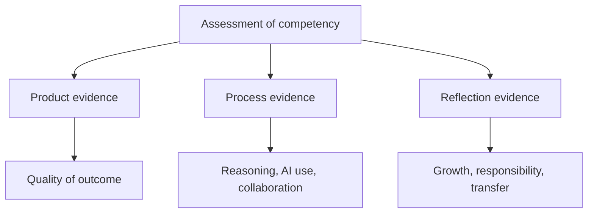

Figure 9. Title: Assessment evidence triangle for competency-rich learning.

### Practical Recommendation for Teachers

Use assessment as a learning mirror. Do not assess only the finished answer. Assess the evidence that shows whether the student actually developed the competency.

In practice:

1. Add a small portfolio element to major tasks: draft, feedback, revision, reflection, and final product.
2. Ask students to explain their contribution in team work.
3. Require students to document AI use, verification, and rejected suggestions.
4. Include one oral or written defense of reasoning.
5. Review student evidence with a colleague once per unit or semester.

Classroom activity examples:

1. Mini portfolio task. Students submit a final answer with one draft, one feedback note, one revision, and one reflection explaining how their thinking changed.
2. Oral defense circle. Small groups present a solution and answer peer questions about reasoning, AI use, evidence, and responsibility.
3. Team contribution evidence. In a group project, each student submits one artifact that proves their contribution and one reflection on how the team improved the result.

Evaluation method:

Evaluate success through a portfolio and short defense, not only a final score. The student should show growth, revision, evidence of contribution, and ability to explain decisions under questioning. A successful portfolio contains artifacts from the process and a reflection that connects effort to improved understanding.

For personal development, the updated teacher should build a teacher-practice portfolio as well. Save one redesigned task, one rubric, one student evidence sample, one reflection, and one improvement decision. This follows Dr. Gabi Shafat's course-evaluation approach, Danielle Eisenberg's evidence-design logic, Avi Salmon's call for data-based evaluation, and Dr. Tzur Karelitz's concern that AI evidence needs human interpretation.

### Sources

[Meeting 2 presentation](../materials/meeting-2-presentation.pptx), [Meeting 3 discussion document](../materials/meeting-3-teacher-in-ai-era-discussion.docx), [Meeting 4 discussion document](../materials/meeting-4-discussion-document.docx), [Meeting 4 presentation](../materials/meeting-4-presentation.pptx), [Dr. Gabi Shafat STEM material](../materials/meeting-2-gabi-shafat-stem.pdf).

# Part IV - The Teacher, the Student, and AI

## Chapter 10 - AI Enters the Triangle

### The Challenge

AI has entered the learning relationship. It is no longer outside the classroom. Students can use it as tutor, explainer, editor, evaluator, simulator, translator, and collaborator.

The [Meeting 4 discussion document](../materials/meeting-4-discussion-document.docx), prepared by Avi Salmon, Dr. Eli Eisenberg, and Prof. Arnon Bentur, stated the challenge clearly. For centuries, education rested on a direct relationship between teacher and student: a teacher who knows and a student who learns. The teacher decided what to present, how to present it, when the student was ready, and whether understanding had been achieved. AI now challenges this model at its core because it can explain, tutor, quiz, adapt, and respond continuously, patiently, and at scale.

The document made an important distinction. AI does not simply replace the teacher. It inserts itself into the space between teacher and student in ways that cannot be ignored. This makes AI different from a textbook, calculator, or static digital resource. It can engage the student in dialogue, respond to questions, assess understanding, and adapt in real time.

The challenge is therefore structural. Education must decide whether AI remains an optional tool selected by the teacher, becomes a recognized participant in a teacher-student-AI triangle, or becomes a primary student learning partner with the teacher serving as mentor, validator, or safety net.

### The Dilemma

Should AI be treated as a tool controlled by the teacher, or as a third actor in a redesigned teacher-student-AI triangle?

The dilemma is not only about technology adoption. It asks whether the structure of education itself should change. If AI can teach, quiz, explain, and respond, then the old didactic relation among teacher, student, and subject matter must be reconsidered.

The Meeting 4 document placed one principle above all configurations: the teacher's professional judgment must remain the final authority over the educational process. The question is not whether to eliminate the teacher. The question is how much of the instructional relationship should be shared with, or mediated by, AI.

### Main Positions

The tool model treats AI as an aid selected by the teacher. The student-AI direct model recognizes independent student use. The educational triangle model defines roles for teacher, student, and AI.

The teacher-led model keeps the teacher as the sole orchestrator of learning. AI is a tool the teacher may choose to deploy. The educational relationship remains teacher-student, and the teacher decides if, when, and how AI enters the process.

The triangle model recognizes AI as a co-participant in the educational process. The student interacts directly with AI as a learning partner, while the teacher designs, moderates, and oversees the dynamic among teacher, student, and AI.

The student-AI direct model recognizes that students may engage AI independently as a primary learning resource. In this configuration, learning becomes more student-driven and AI becomes an always-available guide, while the teacher serves as mentor, validator, safety net, and interpreter.

The Round Table did not treat these models as slogans. It used them to ask hard questions about authority, mediation, relationships, equity, assessment, accountability, and context.

### Pros and Cons

The tool model is safer and easier to govern, but ignores much student use. The direct model supports independence, but risks shallow learning and hidden dependency. The triangle model is more realistic, but requires new pedagogy and assessment.

The teacher-led model protects accountability and gives teachers control. Its weakness is that it may not match reality. Students already use AI outside formal teacher control, and pretending otherwise leaves educators blind to actual learning processes.

The student-AI direct model supports agency, personalization, and access. It carries the promise of something like personal tutoring at scale. But it also risks cognitive offloading, misinformation, social isolation, shallow understanding, and unequal use.

The triangle model is the most realistic and most demanding. It recognizes that AI is already active, but insists that teacher judgment, student responsibility, and institutional design must shape its role. It requires teachers to understand AI, students to disclose and reflect on use, and institutions to redesign assessment and policy.

### Point of View Map

Teachers need role clarity. If AI can explain and assess, teachers must know what remains uniquely human: judgment, relationships, motivation, values, context, and the design of meaningful learning.

Students need agency and guardrails. They should learn to use AI as part of modern life, but not in ways that replace thinking, curiosity, effort, or responsibility.

Institutions need policy. They must define acceptable use, disclosure expectations, assessment redesign, data privacy, tool procurement, teacher preparation, and accountability.

Families and society need trust. AI-supported learning raises questions about who is responsible when AI gives wrong, biased, or harmful guidance.

Equity must be central. The Meeting 4 document asked whether AI will equalize learning or deepen inequality. AI could offer personal tutoring to students who lack support. It could also create a new gap in which advantaged students use AI to augment thinking while disadvantaged students use it to replace thinking.

Discipline and age matter. A primary school teacher shaping literacy, a high school STEM teacher, and a university lecturer running an advanced seminar may need different AI relationships. The triangle should be locally designed, not imposed as one uniform model.

### Round Table Voices

Dr. Eli Eisenberg framed the Meeting 4 dilemma around whether the teacher alone should lead the process or whether AI becomes part of the educational relationship.

Avi Salmon, Dr. Eli Eisenberg, and Prof. Arnon Bentur prepared the [Meeting 4 discussion document](../materials/meeting-4-discussion-document.docx) that explored the new triangle.

UNESCO sources cited in the materials also refer to AI transforming the traditional teacher-student relationship into a teacher-AI-student dynamic.

[Dr. Iris Pinto's Meeting 4 lecture](../materials/meeting-4-iris-pinto-future-trends.pdf) connected the triangle to a wider futures perspective. In a volatile, uncertain, complex, and ambiguous world, education must prepare learners for multiple possible futures. Her summary presented the new model as teacher-student-AI collaboration: teachers lead pedagogy, students take active responsibility for learning, and AI supports both as a tool.

Danielle Eisenberg's presentation complicated the triangle further by arguing that AI in education is not a simple tool but a role-fluid system. It already acts as content, tutor, evaluator, and collaborator. Student-AI interactions occur whether or not schools design them. The issue is not whether AI will enter the system, but whether the system will design its role.

Avi Salmon argued during the discussion that AI is already an active participant in education. The real question is what the teacher's role should be inside the triangle. He emphasized that teachers must gain hands-on experience with AI, understand its capabilities and limits, think critically about it, and remain educational leaders.

Dr. Marwa Maklada stated that AI should not design learning or control knowledge. The teacher must remain the central architect, responsible for guiding learning, preserving deep thinking, and ensuring values-based education.

Dr. Revital Duek asked what must remain fundamentally human in the evolving model. Her question captures the chapter's central concern: the triangle is not complete until the human role is clearly defined.

### Synthesis

The triangle already exists in practice. The only question is whether education systems design it intentionally.

The Round Table's materials suggest that the teacher-student-AI triangle should not be understood as three equal points. It is a structured relationship:

1. The teacher leads pedagogy, judgment, values, trust, and learning design.
2. The student takes responsibility for active learning, disclosure, reflection, and independent thought.
3. AI supports explanation, practice, feedback, simulation, diagnosis, and exploration, but does not carry moral or educational responsibility.

The triangle becomes dangerous when AI replaces thinking, hides inequity, weakens relationships, or shifts accountability away from humans. It becomes powerful when it makes learning more visible, more personalized, more reflective, and more connected to human judgment.

### Recommendation

Adopt the teacher-student-AI triangle as a design model. Teachers lead pedagogy, students take active responsibility, and AI serves as a powerful but bounded support.

Every institution should define its triangle model explicitly:

1. What may students use AI for?
2. What must students disclose?
3. What remains the student's own responsibility?
4. What decisions remain with the teacher or lecturer?
5. How will AI-supported learning be assessed?
6. How will equity, privacy, bias, and tool quality be handled?
7. How will teachers gain hands-on experience before being asked to lead students?

The recommendation is not to let AI into education without boundaries. It is to admit that AI is already there and design the human structure around it.

### Visual

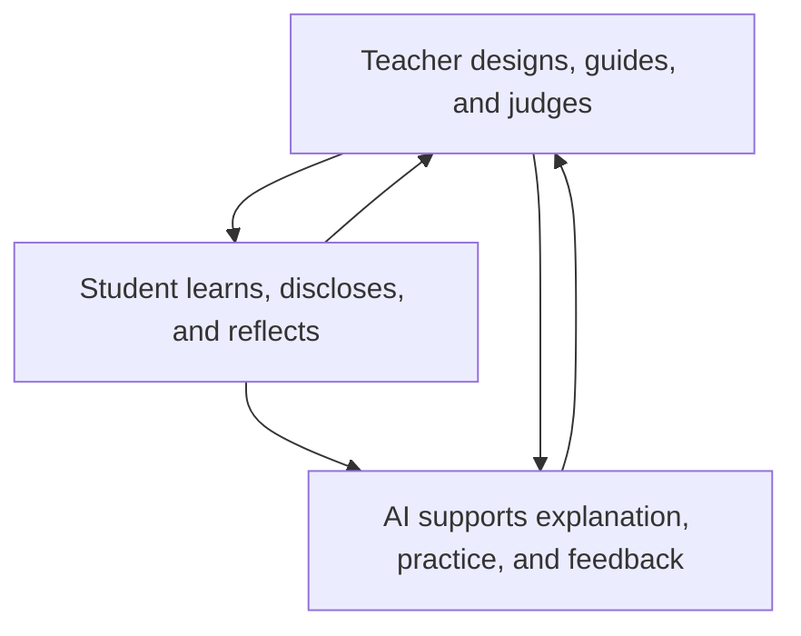

Figure 10. Title: The teacher-student-AI triangle.

### Practical Recommendation for Teachers

Create a clear teacher-student-AI classroom agreement. Students should know what AI may do, what they must do themselves, what they must disclose, and how their work will be judged.

In practice:

1. Define allowed AI uses for the topic: explanation, practice, brainstorming, feedback, simulation, or checking.
2. Define forbidden or limited uses, especially where AI would replace the student's own reasoning.
3. Require students to disclose meaningful AI use.
4. Build one activity where students compare AI help with teacher guidance or peer explanation.
5. End the activity by asking students what remained their own responsibility.

Classroom activity examples:

1. Triangle roles simulation. Assign three roles: teacher, student, and AI. Students analyze who decides the goal, who gives support, who verifies, and who is responsible.
2. AI boundary workshop. Students sort classroom AI uses into allowed, limited, and not allowed, then justify each decision using learning and integrity criteria.
3. Student responsibility contract. Before an AI-supported task, students write what AI may help with and what they must prove independently.

Evaluation method:

Evaluate success by checking whether the student understands the roles in the learning triangle. The student should know when AI is a helper, when the teacher is the designer and evaluator, and when the student must act independently. Evidence can include an AI-use contract, annotated drafts, and a short explanation of personal responsibility.

For personal development, the updated teacher should use AI hands-on before setting policy. Test the tool on the same assignment students will face. Notice what it explains well, where it misleads, and what judgment students will need. This follows Avi Salmon's point that teachers must gain practical AI experience and Dr. Marwa Maklada's insistence that the teacher remains the architect of learning.

### Sources

[Meeting 4 discussion document](../materials/meeting-4-discussion-document.docx), [Meeting 4 presentation](../materials/meeting-4-presentation.pptx), [UNESCO AI competency frameworks](https://www.unesco.org/en/digital-education/ai-future-learning/competency-frameworks).

## Chapter 11 - Default or Design

### The Challenge

AI use is already happening. Students use it whether institutions are ready or not. If systems do not design AI use, AI will shape learning by default.

[Danielle Eisenberg's Meeting 4 presentation, "Default or Design,"](../materials/meeting-4-default-or-design-ignite-ed.pptx) named this as a system architecture problem. AI is not simply a tool inserted into an existing classroom. It is a role-fluid agent that can act as content, tutor, evaluator, and collaborator at the same time. It enters several layers of the system, often without formal permission.

The challenge is that schools and universities can see that students are using AI, but they cannot yet reliably see the thinking around that use. A student may use AI to deepen understanding, test alternatives, and improve reasoning. Another student may use the same tool to avoid thinking altogether. The visible product may look similar. The learning underneath may be completely different.

This is why default integration is dangerous. Without design, AI creates hidden processes, hidden dependency, hidden inequity, and hidden erosion of student thinking.

### The Dilemma

Will education systems allow AI integration to happen by default, or will they design roles, boundaries, assessment, and equity protections deliberately?

The dilemma is not between AI and no AI. That choice is already unrealistic. The real dilemma is whether AI use will be governed by educational purpose or by convenience, market pressure, student habit, and tool design.

Danielle Eisenberg framed three central questions for the discussion:

1. What does it look like for a teacher to govern the student-AI layer, not just permit or prohibit it?
2. What would it take in assessment, policy, and practice to make student thinking visible?
3. If privileged students augment with AI while disadvantaged students replace thinking with AI, who is responsible for equity, and what authority do they have?

### Main Positions

Restriction tries to block use. Permission gives broad principles. Design creates structured roles and visible learning processes.

Restriction says that AI is too risky and should be blocked or minimized. This position may protect some forms of academic integrity in the short term, but it ignores actual student behavior.

Permission says that students may use AI within broad guidelines. This is more realistic, but often too weak. It can leave teachers without tools to evaluate process or prevent shallow use.

Design says that AI use must be built into the educational architecture. It defines what AI may do, what students must disclose, how teachers interpret evidence, how systems track patterns, and how equity is protected.

The design position is the only one that treats AI as a system condition rather than a classroom accessory.

### Pros and Cons

Restriction may protect integrity briefly, but it is unrealistic. Permission is flexible, but often too vague. Design is harder, but it is the only durable approach.

Design is harder because it requires infrastructure. Danielle Eisenberg's presentation argued for assessment infrastructure that sees inside learning, funding the teacher's role as system designer, defining AI as a policy lever with equity guardrails, and training teachers in evidence design rather than only AI tools.

Design also requires product discipline. Human-in-the-loop should be core architecture, not compliance language. Tools should be built for the margins first. Systems should separate demonstration from confidence level.

Design requires educational courage. It forces institutions to ask what evidence of learning is defensible in an AI-rich environment. It also forces them to admit that a single artifact, such as one essay or one homework submission, is a weak signal.

### Point of View Map

Students use AI unevenly. Advantaged students may use it to extend and refine thinking. Disadvantaged students may be more vulnerable to using it as a replacement for thinking. The same tool can produce opposite outcomes.

Teachers need guidance. They must learn to govern the student-AI layer, not only react to it. They need time for contextual judgment and support in interpreting evidence.

Assessment systems need redesign. Traditional assessment measures outputs. It cannot detect shallow AI use, equity gaps, or whether the triangle is producing learning. Patterns matter more than single artifacts. A notebook, reflection, peer review, oral defense, draft history, and final product together produce stronger evidence than one polished submission.

Technology designers need to build for human judgment. AI may propose skills, identify evidence, or rate confidence, but the educator should accept, override, or adjust. The teacher who knows the student and context remains the interpretive layer.

Policy makers need procurement and accountability rules. The people selecting AI tools for schools must understand the technology, the teacher role, the equity risks, and the preparation required before tools enter classrooms.

### Round Table Voices

Danielle Eisenberg argued that AI in education is already role-fluid. It can act as content, tutor, evaluator, and collaborator. Her key warning was that without design, AI will produce unintended consequences.

Jan Morrison connected this to the larger need for system transformation and equity.

Dr. Tzur Karelitz asked why the teacher should mediate between AI and students in evaluation, which sharpened the question of trust and interpretation.

Danielle Eisenberg answered that AI systems may become effective in assessing competencies such as collaboration or diligence, but trust remains limited and bias remains a serious concern. AI systems may be trained on datasets that do not fully represent diverse or neurodivergent students. Human oversight is therefore necessary to ensure the tools help rather than harm.

Dr. Revital Duek asked how students' thinking can be made visible when AI is involved. Danielle Eisenberg described using AI chatbots to interview students about portfolios, assignments, papers, or group projects. Such tools can prompt reflection about the student's role, peer contribution, self-assessment, and learning process.

Prof. Sigal Tifferet raised a possible future in which AI takes over much assessment work, allowing teachers to focus more on guidance, relationships, communication, and psychological support. This is an important possibility, but it depends on careful design. If AI takes over assessment without human interpretation, the system may become efficient but blind.

Jan Morrison emphasized that students focus on what educational systems value and measure. If oral communication, defense of ideas, and critical thinking matter, they must become central to assessment.

Avi Salmon warned that teachers must prevent students from "downloading their brains" into AI without real thinking or understanding. This phrase captures the chapter's core educational risk.

### Synthesis

AI policy is not enough. Education systems need learning designs that make student thinking visible.

Danielle Eisenberg's key contribution is the distinction between a learning triangle and a measurement triangle. The learning triangle involves student-AI interaction, teacher-student relationship, and teacher-AI governance. The measurement triangle involves AI proposing evidence, the teacher interpreting context, and the system aggregating patterns over time.

This architecture keeps humans in the loop where context matters most. It does not ask teachers to inspect every detail manually. It uses AI to reduce the cognitive load of evidence review so teachers can invest judgment where it matters.

The central principle is: AI proposes, teachers decide.

### Recommendation

Design AI use around process evidence: prompts, drafts, explanations, comparisons, critique, reflection, teacher interpretation, and student ownership.

Education systems should implement the following design requirements:

1. Make student thinking visible, not only student output.
2. Require students to demonstrate and defend their reasoning.
3. Use multiple artifacts rather than single submissions.
4. Build human interpretation into AI-supported assessment.
5. Train teachers in evidence design, not only tool operation.
6. Treat equity as a design requirement, not an afterthought.
7. Track patterns over time to distinguish learning from performance.
8. Build procurement rules that require teacher preparation and bias review.

The practical lesson is direct: if education does not design the AI layer, the AI layer will design education by default.

### Visual

| Default AI use | Designed AI use |
| --- | --- |
| Hidden student process | Visible process evidence |
| Output judged alone | Drafts, prompts, defense, and reflection reviewed together |
| Equity risk appears late | Equity guardrails built in from the start |
| AI use shaped by convenience | AI use shaped by educational purpose |
| Teacher reacts after submission | Teacher governs the student-AI layer |

Figure 11. Title: Default versus design in AI-supported learning.

### Practical Recommendation for Teachers

Design the student-AI layer instead of only reacting to it. The teacher should govern how AI enters learning by making process evidence visible.

In practice:

1. Ask students to submit prompts, drafts, and reflections for one AI-supported task.
2. Require a short explanation of what the AI did and what the student did.
3. Use multiple artifacts, not one final product: notes, draft, peer feedback, revision, and final explanation.
4. Watch for equity patterns: who uses AI to deepen thinking, and who uses it to avoid thinking?
5. Use teacher judgment to interpret AI-supported evidence, not to rubber-stamp it.

Classroom activity examples:

1. Process evidence notebook. During an AI-supported project, students keep a simple log of prompts, drafts, decisions, checks, and reflections.
2. AI proposes, student decides. Give students an AI-generated set of suggestions. They must accept, reject, or modify each suggestion and explain why.
3. Pattern review. Instead of grading one artifact, students assemble three pieces of evidence, such as draft, peer feedback, and final explanation, to show learning over time.

Evaluation method:

Evaluate success through patterns across evidence. The teacher should look for consistency between prompts, drafts, decisions, checks, and final work. A successful student makes the learning process visible and can explain why AI suggestions were accepted, rejected, or changed.

For personal development, the updated teacher should learn evidence design, not only AI tool operation. Take one assignment and redesign it so the thinking around AI becomes visible. This follows Danielle Eisenberg's principle: AI proposes, teachers decide, and patterns across artifacts are stronger than a single polished submission.

### Sources

[Danielle Eisenberg / Ignite Ed presentation](../materials/meeting-4-default-or-design-ignite-ed.pptx), [Meeting 4 presentation](../materials/meeting-4-presentation.pptx).

## Chapter 12 - The Futures Lens

### The Challenge

Education systems often plan from the past. Students are entering a volatile, uncertain, complex, and ambiguous world.

[Dr. Iris Pinto's Meeting 4 lecture, "Future Trends Shaping Reality,"](../materials/meeting-4-iris-pinto-future-trends.pdf) placed this challenge at the center of the Round Table. The point of futures thinking is not prophecy. Futures research is not an attempt to know what has not yet happened. Its practical purpose is to read signals in the present, identify trends, imagine several possible futures, and act now in ways that shape the preferred future.

This is a major shift for STEM education. Traditional education often assumes a relatively stable world: teach known knowledge, prepare for known professions, certify known achievement. Iris Pinto's lecture argued that this assumption no longer holds. The pace of change is accelerating, decision-making is becoming more complex, and human thinking remains linear and biased while reality is increasingly interconnected.

The challenge is therefore not only technological. It is cognitive, ethical, institutional, and human. Schools and universities must teach learners how to live with uncertainty without surrendering judgment.

### The Dilemma

Should education prepare students for known labor-market needs, or for multiple possible futures that cannot be fully predicted?

If education prepares only for current labor-market needs, it risks training students for work patterns that may disappear. If education prepares only for general adaptability, it may become too abstract and disconnected from real knowledge, tools, and professions.

The futures lens asks for a third path: prepare students through deep disciplinary grounding, cross-boundary thinking, ethical imagination, and the capacity to keep learning as reality changes.

This dilemma is especially sharp for universities. Their traditional model treats undergraduate and graduate study as a concentrated early-life phase followed by professional practice. The Round Table discussion questioned whether this model can survive in a world of rapid technological and professional change.

### Main Positions

One position focuses on current market needs. Another focuses on general adaptability. A third uses futures thinking to help students and institutions navigate uncertainty.

The current-market position is practical. It asks what employers need now and designs curricula accordingly. This can strengthen employability, but it may narrow education to the demands of the present.

The general-adaptability position emphasizes creativity, critical thinking, problem-solving, and lifelong learning. This is closer to the Round Table's spirit, but it still needs concrete pedagogy and assessment.

The futures position combines both. It does not abandon current skills, but it teaches students to analyze change. It uses time horizons, scenarios, wild cards, preferred futures, and STEEP dimensions: social, technological, economic, environmental, and political factors.

In this view, futures thinking is not an elective activity. It is a literacy for modern STEM learning.

### Pros and Cons

Current-market preparation is concrete, but it can become obsolete. General adaptability is valuable, but can become abstract. Futures thinking offers tools for uncertainty, but requires teacher preparation and institutional culture.

Futures thinking has a strong advantage: it helps learners move beyond passive prediction. Students learn that the future is partly shaped by present decisions. This supports agency, responsibility, and moral imagination.

It also has risks. Poorly taught futures work can become speculation, slogans, or anxiety. Students may be overwhelmed by possible futures without gaining tools to act. Teachers may lack preparation in scenario thinking, systems thinking, and interdisciplinary analysis.

The solution is not to turn every teacher into a futurist. It is to embed futures habits into STEM learning: ask what trends are visible, what assumptions may fail, what systems are connected, who benefits, who is harmed, and what future should be preferred.

### Point of View Map

Policy makers need long-term planning. They must prepare systems for futures that cannot be reduced to a single forecast.

Universities need to rethink their relationship with graduates. If knowledge and professional practice change continuously, the university cannot only be a gate through which young adults pass once. It may need to become a long-term learning partner.

Industry sees rapid skill change directly. Iris Pinto connected this to her experience in industry and noted the disconnect between education systems and industry practices. When education and industry solve similar problems separately, both lose time and relevance.

Teachers need preparation to lead students through complexity. Dr. Noa Ragonis raised the teacher development gap, and Iris Pinto strongly supported the importance of STEM teacher leadership. Without prepared teachers, meaningful transformation in competencies, skills, and AI integration will not happen.

Students need agency and identity in a changing world. In a post-work scenario, where automation reduces the centrality of traditional work, education must help students ask not only what job they will perform, but what kind of person and contributor they will become.

### Round Table Voices

Dr. Iris Pinto presented the futures lens. She described a VUCA world shaped by technological convergence, human-machine integration, bio-convergence, post-work scenarios, and accelerating change.

Her presentation described several meta-trends changing the nature of humanity. Convergence brings together AI, biotechnology, quantum technologies, nanotechnology, robotics, and other domains to create new capabilities. Human-machine interfaces blur boundaries through brain-computer interfaces, neural implants, subdermal devices, smart devices, and human-machine symbiosis. Human enhancement and gene editing raise the possibility of a bio-cognitive divide between enhanced and non-enhanced people. Automation, AI, robotics, abundant energy, biomanufacturing, and radical life extension raise questions about work, meaning, learning, identity, and equity.

Iris Pinto also described AI as an enabler, but not the endpoint. Human-centric AI may interpret emotion, cognition, senses, and body. Action and creation AI may plan, act, create, and collaborate. Multimodal and phygital AI may expand learning through hybrid physical and digital environments. These trends make STEM broader than technical knowledge.

Prof. Arnon Bentur connected the discussion to lifelong learning and the idea of a long-term relationship between universities and graduates.

He referred to models in which universities maintain learning relationships across a career, sometimes described as a long curriculum. This reframes higher education from a one-time credentialing institution into a continuing knowledge partner.

Iris Pinto gave a similar example. After graduation, universities often lose contact with graduates except when requesting donations. She proposed that universities could provide regular professional updates in fields such as engineering, similar to software or smartphone updates. This would help graduates remain current and would keep universities connected to professional reality.

Dr. Revital Duek noted that industry may force workers into continuous learning as the price of remaining relevant.

This comment exposed the harder side of lifelong learning. Continuous learning can be empowering, but it can also become pressure. If workers must update themselves constantly without institutional support, lifelong learning becomes an individual burden rather than a social design.

### Synthesis

The future cannot be predicted, but learners can be prepared to navigate it.

The futures lens changes the definition of STEM education. STEM is not only science, technology, engineering, and mathematics as separate domains. It becomes a way to understand complex socio-technological systems. It asks students to connect technical knowledge with human values, uncertainty, ethics, identity, and responsibility.

This is why the Round Table repeatedly returned to STEAM rather than only STEM. Art, ethics, humanities, philosophy, social understanding, and communication are not decorations around technical knowledge. They are necessary for judging what technology means and how it should be used.

The teacher's role becomes even more important under this lens. AI can provide information and simulation, but teachers help students frame questions, compare futures, examine values, and resist simplistic answers.

### Recommendation

Make futures thinking part of STEM education. Use scenarios, systems thinking, ethical reasoning, lifelong learning, and cross-sector learning to prepare students for uncertainty.

Every STEM program should include structured futures practices:

1. Identify trends in the present and connect them to possible futures.
2. Distinguish probable, possible, wild card, and preferred futures.
3. Use STEEP analysis to connect social, technological, economic, environmental, and political forces.
4. Examine technological convergence and its human implications.
5. Discuss post-work scenarios as questions of identity, meaning, equity, and purpose.
6. Treat lifelong learning as a designed relationship, not only a personal responsibility.
7. Build partnerships among schools, universities, industry, community, and policy.
8. Develop socio-technological leaders, not only competent users of technology.

The Round Table's recommendation is to move STEM beyond technical training. Future-ready STEM education should prepare learners to understand complex problems, shape preferred futures, and carry moral responsibility inside technological change.

### Visual

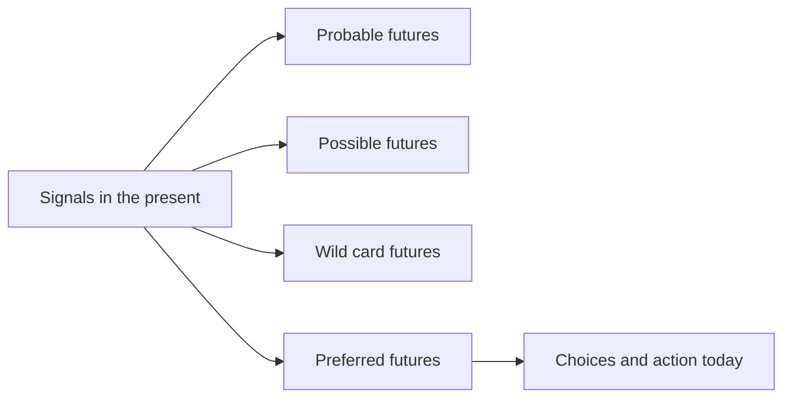

Figure 12. Title: Futures lens for STEM education.

### Practical Recommendation for Teachers

Add a futures lens to ordinary STEM topics. Students should learn not only how a technology works, but what future it may create and what choices humans still have.

In practice:

1. Begin a unit by asking which trends are visible now.
2. Use STEEP questions: social, technological, economic, environmental, and political effects.
3. Ask students to imagine probable, possible, wild card, and preferred futures.
4. Connect technical learning to human consequences, equity, identity, and responsibility.
5. Ask students what action today would move toward the preferred future.

Classroom activity examples:

1. Four futures map. Students take one technology and describe probable, possible, wild card, and preferred futures, then identify what choices could shape the preferred one.
2. STEEP scan. Groups analyze a STEM development through social, technological, economic, environmental, and political lenses.
3. Future backcasting. Students choose a preferred future, then work backward to identify what learners, teachers, industry, and policy should do now.

Evaluation method:

Evaluate success by assessing the quality of futures reasoning. The student should identify signals, consider more than one possible future, explain assumptions, and connect preferred futures to present choices. Strong work avoids prediction as certainty and shows thoughtful links between technology, society, values, and action.

For personal development, the updated teacher should keep a small futures notebook. Once a month, record one emerging technology or social trend, one classroom implication, and one question for students. This follows Dr. Iris Pinto's futures approach: do not predict the future as prophecy, identify signals in the present and act toward a preferred future.

### Sources

[Dr. Iris Pinto presentation](../materials/meeting-4-iris-pinto-future-trends.pdf), [Meeting 4 presentation](../materials/meeting-4-presentation.pptx), [OECD Learning Compass 2030](https://www.oecd.org/education/2030-project/teaching-and-learning/learning/).

## Chapter 13 - Risks and Design Principles for AI in Learning

### The Challenge

AI can personalize learning and provide feedback, but it can also weaken thinking, hide inequality, and erode trust.

The Round Table did not treat AI as either salvation or threat. It treated AI as a powerful condition that must be governed by educational purpose. The same tool can support deep learning or replace it. It can help teachers see student progress or create a new layer of invisible dependence. It can make learning more equitable or widen existing gaps.

The challenge is that AI's strongest features are also its educational risks. It is fast, articulate, patient, adaptive, and always available. These qualities can support students who need explanation and practice. They can also make students stop struggling, stop questioning, and stop developing the very competencies education is meant to cultivate.

### The Dilemma

How can AI enhance learning without replacing the human cognitive and ethical work that education is meant to develop?

The central principle from the [Meeting 3 discussion document](../materials/meeting-3-teacher-in-ai-era-discussion.docx) is keeping the human above the machine. The goal is to maintain human judgment, creativity, and moral responsibility as the final authority over any tool or system.

This creates a practical dilemma. If AI is too restricted, students may lose access to useful support and may use tools secretly. If AI is too open, students may outsource thinking, writing, verification, and even moral responsibility. If AI is designed into learning, teachers must have time, training, assessment infrastructure, and institutional authority.

### Main Positions

AI can be used as an efficiency tool, a thinking partner, or a controlled support inside human-centered pedagogy.

The efficiency position uses AI to save time: summarizing, generating examples, grading, tutoring, and producing feedback. It is attractive because education systems are overloaded. Its danger is that efficiency can become the main value, pushing aside reflection, effort, and relationship.

The thinking-partner position asks students to use AI to compare ideas, test assumptions, receive critique, and explore alternatives. This can be powerful when it is structured. It becomes weak when students accept AI output as authority.

The human-centered design position treats AI as a bounded support inside teacher-led learning. It requires disclosure, verification, explanation, oral defense, reflection, and teacher interpretation. This position best matches the Round Table's repeated claim that teachers and lecturers must remain above AI.

### Pros and Cons

Efficiency gives speed and access, but may encourage cognitive offloading. A thinking partner can prompt exploration, but may mislead. Controlled support preserves human judgment, but requires careful design.

The benefits are real. AI can offer individualized explanation, practice, simulation, translation, feedback, and access to resources. It can help students rehearse ideas and help teachers review evidence more efficiently.

The risks are also real. The [Meeting 4 discussion document](../materials/meeting-4-discussion-document.docx) identified shallow learning, misinformation, cognitive offloading, weakened teacher-student relationships, inequality, and accountability gaps. Research cited in the materials suggests that AI can boost performance when scaffolded by teachers, while independent or passive use risks dependency and reduced critical thinking.

The danger is not that students use AI. The danger is that AI use becomes invisible, unexamined, and detached from human judgment.

### Point of View Map

Teachers need to govern AI use. Students need to learn critical use. Institutions need integrity and equity mechanisms. Society needs citizens who do not delegate judgment to machines.

Students may see AI as helpful, nonjudgmental, and easier to approach than people. That can reduce anxiety, but it can also weaken the human relationships through which confidence, motivation, and identity develop.

Teachers may benefit from AI support, but they also face new burdens: verifying authenticity, interpreting AI-assisted work, protecting equity, and helping students understand the limits of tools.

Institutions must decide what counts as evidence of learning. A polished AI-supported product cannot be enough. Schools and universities need prompts, drafts, comparisons, oral explanations, process logs, peer feedback, reflection, and defense of reasoning.

Society needs graduates who can use AI without surrendering agency. In an AI-rich world, technical fluency is not enough. Learners must develop critical thinking, ethical judgment, collaboration, communication, and the ability to take responsibility.

### Round Table Voices

Emlen Metz emphasized that students must use AI thoughtfully and critically. Responsibility cannot be delegated to machines.

Her warning matters because it rejects a shallow definition of AI literacy. AI literacy is not only knowing how to prompt a tool. It includes knowing when not to accept an answer, how to verify, how to decide, and how to remain responsible for one's own judgment.

Prof. Russell Tytler warned that AI may reduce deep thinking if students surrender control over their reasoning.

He emphasized the danger of students relinquishing control over their thinking processes. As AI becomes more sophisticated, students may avoid deep, sustained thinking and shorten cognitive processes. This is not only a learning problem. It is a formation problem, because habits of independent and reflective reasoning take time to build.

Avi Salmon argued that the challenge is not whether to use AI, but how to use it wisely. Teachers and lecturers must remain above AI.

He later sharpened this argument by warning that teachers must prevent students from downloading their brains into AI without real thinking or understanding. This is a precise description of cognitive offloading as an educational failure.

Dr. Gabi Shafat described using AI on challenging problems where tools may fail or show bias, so that students learn critical evaluation.

This is an important design principle. Students should not only use AI where it works smoothly. They should also encounter cases where AI gives biased, incomplete, or incorrect responses. Comparing different tools and discussing their failures turns AI from an answer machine into an object of inquiry.

Dr. Marwa Maklada stated that AI should not design learning or control knowledge. The teacher must remain the architect, guiding learning, preserving deep thinking, and ensuring values-based education.

Prof. Gil Noam warned that AI may increase isolation and encourage students to seek quick answers rather than genuine learning. He emphasized curiosity, critical thinking, teamwork, and human relationships.

Dr. Olena Bekh argued that critical thinking remains the most essential human competency. If society loses it, it risks losing an important part of humanity. She also connected excessive AI dependence to possible reductions in curiosity, creativity, empathy, and emotional engagement.

Dr. Eli Eisenberg raised a concern about pace. AI should be integrated, but society may need time to study ethical, moral, social, and cognitive implications before moving too quickly.

### Synthesis

Good AI use increases reflection, judgment, and agency. Bad AI use replaces them.

The Round Table's design logic can be summarized in five principles.

First, AI use must be visible. Students should disclose how they used AI and show the process behind their work.

Second, AI use must be contestable. Students should compare, verify, criticize, and improve AI outputs rather than accept them.

Third, AI use must be relational. It should strengthen teacher guidance, peer discussion, and human explanation rather than isolate students.

Fourth, AI use must be equitable. Systems must prevent a pattern where privileged students augment their thinking while disadvantaged students replace their thinking.

Fifth, AI use must preserve accountability. The student remains responsible for learning, the teacher remains responsible for educational judgment, and the institution remains responsible for tool adoption and safeguards.

### Recommendation

Create learning designs that require students to question, compare, explain, justify, and reflect. Do not treat polished AI output as evidence of learning.

Every AI-supported learning task should include at least four elements:

1. A declaration of AI use.
2. A comparison between AI output and human reasoning.
3. A student explanation of what was accepted, rejected, changed, and why.
4. A teacher-mediated or peer-mediated discussion that tests understanding.

For higher-stakes work, add oral defense, draft history, source verification, and reflection on tool limitations.

The Round Table recommendation is not to slow learning by rejecting AI. It is to slow down the parts that matter: judgment, verification, meaning, and responsibility. AI may accelerate access to information, but education must protect the time needed for thinking.

### Visual

| AI learning risk | Classroom sign | Design response |
| --- | --- | --- |
| Overreliance | Student accepts output without explanation | Require comparison and verification |
| Bias or error | Output omits context or harms fairness | Use bias checks and source critique |
| Shallow thinking | Final answer is polished but undefended | Add oral defense and reasoning trail |
| Inequality | Students use AI in very different ways | Teach responsible use explicitly |
| Lost accountability | Student cannot say what they own | Require disclosure and responsibility statement |

Figure 13. Title: AI learning risks and design responses.

### Practical Recommendation for Teachers

Build friction into AI-supported learning. Students should not move directly from AI output to final submission. They should pause to test, question, and own the result.

In practice:

1. Use AI on a problem where the tool may be incomplete, biased, or wrong.
2. Ask students to compare outputs from different tools or prompts.
3. Require students to identify errors, missing assumptions, or weak reasoning.
4. Use peer discussion to test understanding before submission.
5. Add a final reflection: what did AI help with, and what did it not replace?

Classroom activity examples:

1. AI failure lab. Students investigate an AI response that is incomplete, biased, or wrong and identify the exact point where human judgment is needed.
2. Slow thinking checkpoint. During a task, pause before students use AI and ask them to write their own first explanation, prediction, or strategy.
3. Verify before trust. Students must verify an AI answer using a second method, such as calculation, experiment, source check, peer critique, or teacher conference.

Evaluation method:

Evaluate success through risk awareness and verification behavior. The student should recognize failure modes, slow down before accepting output, and use at least one independent method to check claims. Strong performance includes a correct answer and a documented reason for trusting it.

For personal development, the updated teacher should collect a bank of AI failure cases from the discipline. Use them to teach critical evaluation. This follows Dr. Gabi Shafat's example of using challenging AI problems, Emlen Metz's warning about responsibility, Prof. Russell Tytler's concern about losing deep thinking, and Avi Salmon's warning against students downloading their brains into AI.

### Sources

[Meeting 2 presentation](../materials/meeting-2-presentation.pptx), [Meeting 3 discussion document](../materials/meeting-3-teacher-in-ai-era-discussion.docx), [Meeting 4 discussion document](../materials/meeting-4-discussion-document.docx).

# Part V - Professional Development as System Infrastructure

## Chapter 14 - Who Is Responsible for Teacher Development?

### The Challenge

Professional development is essential, but responsibility is scattered. Teachers, institutions, ministries, teaching centers, professional bodies, and funders all play roles, but no single actor clearly owns the whole process.

The [Meeting 5 steering context](https://www.neaman.org.il/) stated the problem directly: there is currently no single body that carries overall responsibility for continuous professional development of teachers and lecturers. Responsibility is distributed across teaching and learning centers, educational institutions, management teams, government ministries, and professional bodies, but it is unclear who ensures that professional development happens systematically over time.

This is not a small administrative problem. It is the bottleneck of the entire Round Table agenda. Competency-based STEM education, AI literacy, assessment redesign, teacher-student-AI relationships, and future-ready learning environments all depend on educators who can learn continuously. If professional development is weak, every other recommendation remains fragile.

### The Dilemma

Who owns sustained professional development: individual teachers, institutions, teaching centers, ministries, professional bodies, or a national infrastructure?

The dilemma is difficult because each answer is partly correct and partly insufficient.

Teachers and lecturers must take responsibility for their own learning. But individual motivation cannot carry a national or institutional transformation.

Institutions must build local conditions for change. But institutions vary widely in resources, priorities, leadership, and incentives.

Teaching and learning centers have expertise. But they often lack authority over promotion, workload, budgeting, curriculum, and departmental culture.

National bodies can create coherence. But they may be too distant from practice and may produce formal requirements without deep implementation.

The Round Table materials therefore point toward shared responsibility, but shared responsibility can easily become no responsibility unless governance is explicit.

### Main Positions

Individual responsibility emphasizes teacher agency. Institutional responsibility emphasizes local implementation. National responsibility creates coherence. Shared responsibility combines levels.

The individual responsibility position says that teachers and lecturers are professionals, and professionals must keep learning. This position protects agency and dignity. It also aligns with the [OECD Teaching Compass](../materials/oecd-teaching-compass.pdf), which emphasizes teacher agency, professional identity, and continuous learning.

The institutional responsibility position says that educators cannot transform practice alone. Leaders must provide time, recognition, resources, peer structures, and incentives. Without institutional involvement, professional learning becomes voluntary enrichment for the already motivated.

The national responsibility position says that systemic change requires shared language, standards, and durable infrastructure. This may include teacher education institutions, national centers for skills development, policy frameworks, funding mechanisms, and evaluation systems.

The shared responsibility position says that professional development must be organized as an ecosystem. Individual learning, institutional support, professional communities, national strategy, and evidence-based evaluation must reinforce one another.

### Pros and Cons

Individual responsibility is motivating, but inequitable. Institutional responsibility is close to practice, but uneven. National responsibility creates scale, but can become bureaucratic. Shared responsibility is strongest, but requires governance.

The steering discussion before Meeting 5 highlighted major differences between schools and higher education. In schools, teaching is the core profession. In academia, many lecturers are promoted mainly through research rather than teaching quality. A single professional development model may therefore fail unless it is adapted to different incentive systems.

There are also large differences within higher education itself. Strong institutions may have active teaching centers and strategic leadership. Smaller colleges may have only a limited function for teaching improvement. Professional development policy that assumes equal capacity will widen inequality between institutions.

There is also a motivation problem. Some educators lead change willingly. Some sit on the fence. Some resist. The [Meeting 5 steering context](https://www.neaman.org.il/) raised the possibility of different development pathways and of using leading groups as change agents within the system.

This means responsibility cannot be defined only as attendance at training. Responsibility must include authority, incentives, support, evidence, and follow-up.

### Point of View Map

Teachers cannot carry the burden alone. Institutions need structures and incentives. Policy makers must create durable mechanisms. Professional bodies can provide standards and communities.

Teachers need protected time, practical relevance, peer learning, coaching, and opportunities to experience new pedagogy as learners before applying it as teachers.

Lecturers need a development model that recognizes academic freedom and research incentives while still making teaching improvement a serious professional responsibility.

Teaching and learning centers need status and reach. They should not be peripheral service units that work only with volunteers. They need connection to institutional strategy, promotion systems, curriculum design, and assessment reform.

Teacher education institutions need to prepare future educators for AI-rich, competency-centered teaching from the start, rather than treating AI and skills as later add-ons.

National or sector-level bodies need to create coherence across fragmented systems. This may include shared language for competencies, quality expectations, data, and evaluation.

Funders and foundations can support innovation, but the Round Table logic implies that projects must be connected to durable systems, not isolated initiatives.

### Round Table Voices

The [Meeting 5 steering context](https://www.neaman.org.il/) reported Prof. Russell Tytler's presentation on teacher professional development and Dr. Yael Granot-Bein's presentation on academic faculty development.

No separate presentation decks for Meeting 5 were found in the collected materials. The available evidence comes from the steering summaries before and after the meeting. Those summaries report that Prof. Russell Tytler addressed professional development for teachers and the question of who is responsible for advancing it and sustaining it over time. Dr. Yael Granot-Bein addressed professional development of lecturers in academia, focusing on activities of the Edmond de Rothschild Center and insights emerging from them.

The [Meeting 5 steering context](https://www.neaman.org.il/) noted that the broader context of the Academia 360 program was not fully presented. It also reported that the program's aim, as explained by Prof. Arnon Bentur, was to integrate different initiatives under a comprehensive concept of skills and competency development in the undergraduate degree, not simply to add new budgets.

Avi Salmon supported a data-based examination and proposed a professional evaluation of the program, similar to evaluations conducted in other projects. This links professional development to institutional learning rather than anecdotal success.

The steering team concluded that no single actor currently carries clear overall responsibility for sustained professional development.

It also concluded that professional development cannot be reduced to one-time training. The question is not only who delivers a workshop, but how educators receive guidance, support, and development across years.

The [Meeting 5 steering context](https://www.neaman.org.il/) emphasized institutional involvement. Effective professional development requires infrastructure: teaching and learning centers, leadership, organizational policy, and resources. Reliance on personal motivation alone is not enough to create broad, sustained change.

### Synthesis

Professional development must be treated as infrastructure, not optional enrichment.

The Round Table's deeper insight is that teacher development is not an activity added after reform. It is the mechanism through which reform becomes real. A system cannot ask teachers to develop students' competencies, use AI wisely, redesign assessment, build teamwork, and create future-ready learning if it does not also create a serious system for teacher learning.

Professional development therefore has to be continuous, differentiated, evidence-informed, and connected to implementation. It must support both school teachers and higher education lecturers, while recognizing that their conditions and incentives differ.

The question "who is responsible?" should not be answered by naming one actor. It should be answered by designing a responsibility chain.

### Recommendation

Build a shared-responsibility model: national direction, institutional implementation, local communities of practice, teaching and learning centers, and individual professional agency.

The model should assign clear responsibilities:

1. National or sector bodies define direction, language, expectations, and funding mechanisms.
2. Institutions translate those expectations into strategy, time, resources, incentives, and evaluation.
3. Teaching and learning centers provide expertise, coaching, design support, and evidence review.
4. Departments and professional communities create peer learning and shared practice.
5. Teachers and lecturers take active responsibility for growth, experimentation, and reflection.
6. Funders support innovation only when it connects to sustainability and evaluation.

The Round Table recommendation is to stop treating professional development as a sequence of courses. It should become a permanent infrastructure for educational adaptation.

### Visual

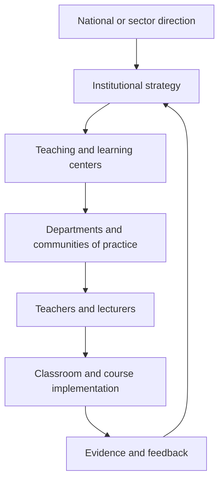

Figure 14. Title: Shared responsibility for sustained teacher development.

### Practical Recommendation for Teachers

Treat professional development as a shared system, while still taking personal responsibility for growth. Do not wait for the perfect institution before beginning, but do not accept isolation as normal.

In practice:

1. Write a one-year personal learning goal linked to AI-era teaching.
2. Identify what support you need: peer group, teaching center, mentor, time, tool access, or leadership backing.
3. Join or create a small professional learning group.
4. Ask the institution to connect professional development to real implementation, not only attendance.
5. Document what changed in your teaching after the development activity.

Classroom activity examples:

1. Teacher learning disclosure. Tell students about one teaching skill you are currently improving and show how it changes the class design.
2. Professional growth inquiry. Ask students what teacher supports would help them learn better, then use one answer to plan a professional learning goal.
3. Shared responsibility map. With older students, map who supports learning: teacher, student, peers, school, family, tools, industry, and policy.

Evaluation method:

Evaluate student success by looking at how well students understand learning as a shared responsibility. The student should be able to identify what they own, what the teacher supports, and what the wider environment contributes. In older classes, success includes proposing a practical support or improvement, not only describing a problem.

For personal development, the updated teacher should build a responsibility map: what I own, what my department owns, what the institution owns, and what policy or national infrastructure should own. This follows the Meeting 5 conclusion that no single actor currently carries clear responsibility, and that professional development must become systematic and continuous.

### Sources

[Samuel Neaman Institute Round Table context](https://www.neaman.org.il/), [OECD Teaching Compass](../materials/oecd-teaching-compass.pdf), [Envisioning Educator Roles for Transformation](../materials/envisioning-educator-roles-for-transformation.pdf).

## Chapter 15 - Beyond One-Off Training

### The Challenge

Workshops are easy to count. Practice change is harder. Teachers and lecturers need support while they implement new pedagogy, AI use, assessment, and collaboration.

The [Meeting 5 steering context](https://www.neaman.org.il/) was explicit: professional development cannot be reduced to one-time training. The question is not only who delivers a course, but how a system creates guidance, support, and growth over years.

This distinction matters because AI-era teaching is not a technique that can be explained once and then applied mechanically. It changes the teacher's role, the student's role, assessment evidence, classroom dialogue, curriculum design, and institutional expectations. A short workshop may create awareness. It rarely changes practice by itself.

### The Dilemma

Should professional development focus on training events, or on long-term implementation support?

Training events are attractive because they are visible, schedulable, and measurable. Leaders can count hours, certificates, attendance, and satisfaction surveys. But these measures do not prove that teaching changed.

Implementation support is harder to count. It requires coaching, peer observation, design time, leadership backing, experimentation, feedback, and reflection. It also requires tolerance for partial success and revision. Yet this is exactly the kind of support needed when educators are asked to move from knowledge transmission to competency formation.

### Main Positions

Training events provide exposure. Continuous professional learning supports growth. Implementation accompaniment helps teachers move from knowing to doing.

The exposure position says educators need initial access to new ideas, research, tools, and examples. This is true. Without exposure, teachers may not know what is possible.

The continuous learning position says that professional competence develops over time through cycles of practice, reflection, collaboration, and adjustment. This aligns with the [OECD Teaching Compass](../materials/oecd-teaching-compass.pdf) view of teaching as a lifelong professional journey rather than a one-time qualification.

The implementation accompaniment position goes further. It argues that professional development must be tied to actual classroom or course redesign. Teachers need help while planning, trying, observing, interpreting evidence, and improving. In this model, support follows the educator into practice.

### Pros and Cons

Training events are visible and manageable, but transfer weakly into practice. Continuous learning supports change, but requires time and budget. Accompaniment is powerful, but needs mentors and institutional commitment.

One-off training also tends to favor the already motivated. Those who attend are often the educators already inclined toward innovation. Those most in need of change may remain outside the process.

Long-term professional learning can address this, but only when institutions protect time and create recognition. If development is always added on top of existing workload, it becomes a burden rather than a source of professional renewal.

Implementation accompaniment is strongest when it is close to real problems. It can help a lecturer redesign an assessment, help a teacher structure AI use, help a department embed teamwork across courses, or help a school build project-based learning. But it cannot succeed if it is disconnected from leadership, scheduling, and evaluation.

### Point of View Map

Teachers need time, confidence, and peer support. Leaders must protect time and resources. Students benefit only when professional learning changes practice. Policy must fund implementation, not only courses.

Teachers need to experience new learning processes themselves. Dr. Einat Sprinzak argued in Meeting 2 that teachers must first experience these processes as learners, gaining a firsthand understanding of the student journey. This is especially important for AI use and competency-based learning. Educators cannot meaningfully guide what they have never experienced.

Lecturers need a path that respects academic identity. Many university lecturers are experts in research and disciplinary knowledge, but may not have been trained in competency development, active learning, or AI-supported assessment. Professional development for lecturers must therefore connect pedagogy to disciplinary depth, not present it as generic teaching advice.

Leaders need to understand that professional development is an implementation system. If leaders ask for new pedagogy but leave class sizes, timetables, promotion criteria, and assessment rules unchanged, the training will not travel into practice.

Students are the final test. A professional development system is successful only when students experience deeper learning, stronger feedback, more meaningful assessment, and better support.

### Round Table Voices

The [Meeting 5 steering context](https://www.neaman.org.il/) emphasized the need to move from training to support during implementation.

It stated that the central challenge is not the absence of initiatives or training opportunities, but the absence of a clear, coordinated, binding system for continuous professional development. This is a crucial distinction. The problem is not activity. The problem is system design.

Dr. Einat Sprinzak argued that teachers must experience learning processes themselves as learners.

Her argument gives professional development a pedagogical principle: teachers should not only hear about active learning, teamwork, AI use, or reflection. They should participate in such learning, feel its difficulty, and understand what students experience.

Avi Salmon emphasized that professors must become involved by experiencing new pedagogical and technological realities.

He argued that immersing educators in emerging practices increases the chance that they will internalize change and adapt their teaching. This places experience before formal curriculum decisions. People change practice more deeply when they have felt the new reality, not only read about it.

Jan Morrison's Meeting 2 contribution adds another warning. Problem-based and transdisciplinary learning are often criticized when they are implemented inside systems not designed to support them. Without time for faculty collaboration, cross-sector training, and structured teamwork, strong pedagogical ideas can fail for organizational reasons.

[Dr. Gabi Shafat's Afeka material](../materials/meeting-2-gabi-shafat-stem.pdf) offered a concrete institutional orientation: course skills are defined, assessed, evaluated, and continuously improved. This connects professional development to curriculum and evidence rather than isolated inspiration.

### Synthesis

Professional development should be a cycle: experience, design, implement, reflect, evaluate, and improve.

The cycle begins with experience. Educators encounter the kind of learning they are expected to create for students.

It continues with design. Educators adapt the ideas to their discipline, age group, institutional context, and students.

It moves into implementation. Teachers try the new practice with real learners, real constraints, and real uncertainty.

It requires reflection. Educators examine what happened, what students actually did, and what evidence was produced.

It includes evaluation. Institutions ask what changed, for whom, and under what conditions.

It ends by beginning again. Improvement is iterative.

### Recommendation

Design professional development as supported practice over time. Include mentoring, peer observation, collaborative design, communities of practice, implementation coaching, and evidence review.

A serious professional development model should include:

1. Initial exposure to concepts, tools, and research.
2. Educator experience as a learner.
3. Collaborative lesson or course design.
4. Classroom or course implementation with support.
5. Peer observation and professional dialogue.
6. Review of student evidence and teacher reflection.
7. Iteration across semesters or school years.
8. Institutional recognition of participation and improvement.

The Round Table recommendation is to stop asking whether professional development occurred and start asking whether professional practice changed. The unit of success is not the workshop. The unit of success is sustained improvement in teaching and learning.

### Visual

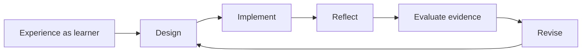

Figure 15. Title: Professional development as an implementation cycle.

### Practical Recommendation for Teachers

Turn every professional development event into an implementation cycle. A workshop should lead to a changed lesson, a trial, evidence, reflection, and revision.

In practice:

1. Before a training event, choose one classroom or course problem you want to solve.
2. During the event, identify one idea you can test within two weeks.
3. After the event, implement a small change with students.
4. Collect evidence: student work, student feedback, peer observation, or your own reflection.
5. Revise the practice and share the result with colleagues.

Classroom activity examples:

1. Try, reflect, revise. Introduce one new learning routine, such as peer critique or AI-supported drafting. Students try it, reflect on its usefulness, and help improve the next version.
2. Teacher-as-learner demonstration. The teacher completes a small version of the student task in front of the class and discusses what was difficult.
3. Implementation journal. Students keep a brief record of how a new classroom method affects their learning across three lessons.

Evaluation method:

Evaluate success through adaptation and reflection. The student should show willingness to try a new learning routine, give useful feedback, and adjust behavior after reflection. Evidence can include journal entries, revised work, and a short explanation of what changed between attempts.

For personal development, the updated teacher should experience the new pedagogy as a learner before teaching it. Try the AI tool, teamwork method, reflection routine, or project structure personally. This follows Dr. Einat Sprinzak's point that teachers must experience learning processes themselves, and Avi Salmon's point that educators internalize change through direct experience.

### Sources

[Meeting 2 presentation](../materials/meeting-2-presentation.pptx), [OECD Teaching Compass](../materials/oecd-teaching-compass.pdf), [Envisioning Educator Roles for Transformation](../materials/envisioning-educator-roles-for-transformation.pdf).

## Chapter 16 - Evidence, Evaluation, and Institutional Learning

### The Challenge

Education innovation often sounds persuasive before it is proven. Institutions need to know what is working, for whom, under what conditions, and why.

The Round Table repeatedly returned to evidence because AI-era education is too complex for slogans. Competency-based learning, project-based learning, AI-supported assessment, teacher development, and industry-connected education all sound promising. But without evidence, institutions cannot distinguish deep change from attractive language.

The challenge is to evaluate without flattening. If evaluation is reduced to simple metrics, it may miss the very competencies the Round Table wants to develop: critical thinking, collaboration, curiosity, ethical judgment, and communication. If evaluation is avoided because the work is complex, systems cannot learn or scale responsibly.

### The Dilemma

How can education systems evaluate AI-era teaching reforms without reducing them to shallow metrics?

The dilemma is between accountability and learning. Accountability asks whether public money, institutional time, and professional effort are producing results. Learning asks what is changing, why, where it works, where it fails, and how to improve.

Education systems often confuse the two. They collect data for reporting rather than improvement, or they avoid evaluation because meaningful learning is hard to measure. The Round Table materials point toward a different stance: measurement should support continuous improvement and iteration, not only external accountability.

### Main Positions

Quantitative outcomes support accountability. Qualitative evidence captures context. Mixed evidence combines both. Developmental evaluation fits complex change.

Quantitative evidence includes participation rates, course completion, assessment results, retention, progression, and other comparable indicators. It helps leaders see scale and patterns.

Qualitative evidence includes student artifacts, teacher reflections, observations, interviews, oral defenses, peer discussion, and examples of changed practice. It shows meaning and context.

Mixed evidence combines the two. It allows institutions to see both whether change is happening and how it is happening.

Developmental evaluation is especially relevant when reforms are still evolving. Instead of judging a fixed program after implementation, it helps teams learn while designing and adapting.

### Pros and Cons

Quantitative evidence is comparable, but may miss deeper learning. Qualitative evidence captures process, but can be harder to scale. Mixed models are richer, but require expertise. Developmental evaluation fits innovation, but may be less familiar to policy systems.

The main risk of quantitative evaluation is false precision. A number may look rigorous while hiding whether students actually became more capable.

The main risk of qualitative evaluation is inconsistency. Rich evidence can become anecdotal unless it is structured, reviewed, and connected to clear questions.

The main risk of mixed evaluation is complexity. It requires institutions to build capacity for data interpretation, evidence review, and improvement cycles.

The main risk of developmental evaluation is discomfort. Leaders may prefer simple answers, while complex reforms require learning from partial and changing evidence.

### Point of View Map

Policy needs evidence for funding and scaling. Institutions need learning loops. Teachers need evaluation that improves practice. Industry values evidence of real capability, not grades alone.

Students need assessment that recognizes process and capability, not only final products.

Teachers need evaluation that supports professional judgment. If evidence becomes surveillance, it will reduce trust and experimentation. If evidence becomes feedback, it can strengthen practice.

Institutions need to know whether their initiatives are reaching more than the already motivated. They need to ask who participates, who benefits, and where gaps remain.

Policy makers and funders need evidence of sustainability, not only activity. A program may run workshops, publish reports, and produce enthusiasm without changing practice.

Industry needs graduates who can perform in authentic contexts. This requires evidence of applied capability, teamwork, problem-solving, communication, and adaptation.

### Round Table Voices

Avi Salmon proposed professional, data-based evaluation of programs.

This point appeared in the [Meeting 5 steering context](https://www.neaman.org.il/) regarding Academia 360. Avi supported a data-based examination and proposed a professional evaluation of the program, similar to evaluations conducted in other projects. The significance is that large educational initiatives should not rely on impressions alone. They should be studied seriously.

Dr. Gabi Shafat described continuous feedback and evaluation in courses.

In the [Meeting 2 source context](https://www.neaman.org.il/), Afeka's approach included defining skills and competencies for each course, asking each lecturer to identify what students should acquire, and examining how those skills are assessed and tested. The question was not only whether content was taught, but whether intended capabilities were achieved.

Dr. Marwa Maklada described competency-based tasks and validation processes.

Her contribution connects evaluation to national school assessment. Competency-based tasks within matriculation and student assessment processes require validation, not only enthusiasm. This is essential if competency language is to become part of formal education rather than remain a parallel discourse.

Jan Morrison described TIES as using measurement for continuous improvement and iteration rather than accountability alone. She also pointed to systems where sustained implementation is supported by long-term data and continuous iteration.

[Danielle Eisenberg's Meeting 4 presentation](../materials/meeting-4-default-or-design-ignite-ed.pptx) added the idea of evidence design. AI may propose skill evidence and confidence ratings, but the teacher interprets. Patterns across artifacts are stronger than single submissions. This is a practical evaluation principle for AI-rich learning.

Dr. Eli Eisenberg emphasized that meaningful learning requires reflection and evaluation, and that establishing effective feedback, evaluation, and assessment mechanisms is a major challenge across higher education, schools, and the education system as a whole.

### Synthesis

Evaluation should be part of the learning system, not an external audit after the fact.

The Round Table's approach suggests three levels of evidence.

At the student level, evidence should show process, reasoning, collaboration, reflection, and growth, not only final answers.

At the teacher level, evidence should show changes in practice: new assessment designs, AI governance, collaborative teaching, feedback quality, and student engagement.

At the institutional level, evidence should show adoption, sustainability, equity, and improvement over time.

The key is to treat evidence as a feedback loop. Institutions should ask: What did we intend? What changed? Who benefited? Who was left out? What should we adjust next?

### Recommendation

Use mixed evidence: student artifacts, process evidence, teacher practice, competency progression, institutional adoption, and longitudinal outcomes.

A serious evaluation model should include:

1. Baseline description of current practice.
2. Clear definition of intended competencies and outcomes.
3. Evidence from student work, drafts, reflection, oral explanation, and collaboration.
4. Evidence from teacher practice and professional learning participation.
5. Data on participation, equity, persistence, and progression.
6. Review cycles in which teachers and leaders interpret evidence together.
7. Program evaluation for large initiatives such as Academia 360 or national competency programs.
8. Longitudinal follow-up where possible, especially in higher education and workforce preparation.

The Round Table recommendation is that evidence should not be used only to judge. It should be used to learn, improve, and protect educational integrity while systems change.

### Visual

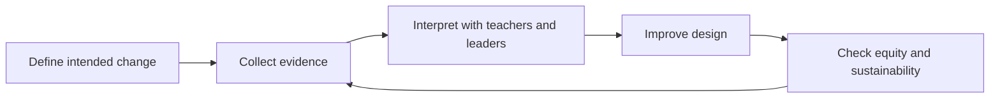

Figure 16. Title: Evidence loop for institutional learning.

### Practical Recommendation for Teachers

Use evidence as a feedback loop for your own teaching. The goal is not to collect data for display. The goal is to learn what changed and what should improve next.

In practice:

1. Define one intended learning change before the unit begins.
2. Collect at least two kinds of evidence, such as student artifacts and reflections.
3. Look for patterns, not only isolated examples.
4. Ask who benefited and who did not.
5. Use the evidence to make one concrete improvement in the next cycle.

Classroom activity examples:

1. Evidence wall. Students post examples of learning evidence, such as drafts, diagrams, questions, corrections, and reflections, then classify what each evidence type shows.
2. What changed review. After a unit, students compare their first and final attempts and identify one change in reasoning, skill, or confidence.
3. Improve the lesson feedback. Students answer three focused questions: what helped learning, what blocked learning, and what should be changed next time.

Evaluation method:

Evaluate success with evidence of change over time. The teacher should compare early and later artifacts, looking for stronger reasoning, better questions, improved accuracy, and clearer reflection. Student feedback about the learning design can also become evidence, but it should be interpreted with the teacher's professional judgment.

For personal development, the updated teacher should conduct a small practice inquiry each semester. Choose a question about your teaching, collect evidence, interpret it with a colleague, and revise the design. This follows Jan Morrison's measurement-for-improvement logic, Dr. Gabi Shafat's continuous course evaluation, Danielle Eisenberg's evidence design, and Avi Salmon's call for professional, data-based evaluation.

### Sources

[Meeting 2 presentation](../materials/meeting-2-presentation.pptx), [Dr. Gabi Shafat STEM material](../materials/meeting-2-gabi-shafat-stem.pdf), [OECD Teaching Compass](../materials/oecd-teaching-compass.pdf).

# Part VI - Environments, Industry, and Experiential Learning

## Chapter 17 - The Classroom Was Built for a Different Problem

### The Challenge

Many classrooms were designed for frontal teaching. But creativity, teamwork, making, AI-supported inquiry, and complex problem solving require different environments.

The preparation for Meeting 6 framed the issue clearly: what physical and organizational environment is required to develop twenty-first-century skills in the age of AI? The question was not only what competencies are needed or how teachers should be trained. It was how the learning, teaching, and organizational environment must be designed so those competencies can actually develop.

This matters because space, time, tools, schedules, roles, and partnerships quietly define what kind of learning is possible. A room organized for one teacher speaking to rows of students carries a theory of learning inside its furniture. It assumes attention, reception, and individual performance. But skills such as creativity, teamwork, multidisciplinary problem-solving, making, critique, and AI-supported inquiry require movement, dialogue, experimentation, iteration, and access to tools.

### The Dilemma

Can existing physical and organizational environments support AI-era STEM skills, or must they be redesigned?

The dilemma is not only architectural. It is organizational. A school may have a makerspace but no timetable that allows extended projects. A university may have advanced labs but no incentive for cross-disciplinary teaching. A classroom may have digital tools but remain pedagogically frontal. An institution may speak about collaboration while organizing teachers as isolated individuals.

The Round Table question was sharper: can creativity, teamwork, and complex problem solving be developed in classrooms and organizations built for frontal learning?

### Main Positions

Existing classrooms can be adapted. Specialized spaces such as makerspaces can support active learning. Broader ecosystem redesign can align space, time, roles, tools, and partnerships.

The adaptation position says that systems cannot wait for new buildings. Teachers can rearrange rooms, use digital tools, create project cycles, invite external partners, and redesign assignments inside existing constraints.

The specialized-space position says that certain forms of learning need dedicated environments. Makerspaces, labs, studios, simulation rooms, and collaborative learning spaces make certain actions possible: building, testing, prototyping, debugging, observing, and revising.

The ecosystem position says that space alone is not enough. The environment includes the physical layout, organizational structure, teacher collaboration, assessment design, AI tools, industry links, community involvement, and leadership mechanisms that sustain change.

### Pros and Cons

Adapting existing classrooms is practical, but may limit change. Specialized spaces enable making and experimentation, but can become isolated showcases. Ecosystem redesign is strongest, but complex.

Adaptation is important because most learning still happens in ordinary classrooms. But adaptation can leave the deeper organizational model untouched.

Specialized spaces can signal seriousness and give students access to richer experiences. Yet they can become symbolic islands if only a few students or teachers use them, or if they are disconnected from curriculum and assessment.

Ecosystem redesign is more powerful because it aligns the environment with the intended learning. It asks whether schedules allow project work, whether teachers can co-plan, whether assessment rewards process, whether industry partners are involved, and whether AI is used as a working tool rather than a novelty.

### Point of View Map

Teachers need spaces that support intended pedagogy. Students need active and collaborative learning. Institutions need investment and scheduling models. Industry can help connect spaces to real practice.

Teachers need environments that reduce friction. If every collaborative activity requires fighting the room, the timetable, and the assessment system, innovation will remain exceptional.

Students need environments where they can act, not only listen. They need to build, test, present, defend, fail, revise, and collaborate.

Institutions need to decide whether they are organized around knowledge transfer or competency development. This question affects spaces, partnerships, evaluation, AI use, teacher roles, and external relations.

Industry can help connect learning environments to real practice. It can provide problems, tools, mentors, visits, and standards of professional work. But industry involvement must serve learning, not reduce education to short-term labor demand.

### Round Table Voices

The [Meeting 6 steering context](https://www.neaman.org.il/) identified physical and organizational environment as a central issue.

The preparation summary listed questions that should guide this chapter: Does real change require organizational redesign, not only teacher training? Are new models of collaborative work among teachers and lecturers needed? Does the current organizational structure support or block innovation? Is responsibility for skill development placed on the individual teacher, or is a broader ecosystem of support required?

Avi Salmon was reported as focusing on enriched experiential learning environments such as makerspaces and on AI as a working tool from the industry perspective.

The available [Meeting 6 steering context](https://www.neaman.org.il/) reports that Avi's presentation was practical, current, and relevant to the Round Table goals. No separate presentation deck was found in the collected materials, so the chapter uses the steering team's description rather than adding unsupported details.

[TIES material](../materials/meeting-2-ties-jan-morrison.pptx) also connects STEM learning to makerspaces and industry-connected practice.

[Jan Morrison's TIES material](../materials/meeting-2-ties-jan-morrison.pptx) argued for career-connected learning infused with real-world experiences and expertise. It also warned that transdisciplinary and problem-based learning fail when placed inside systems not designed to support them. This directly supports the Meeting 6 environment question.

The [Meeting 6 steering context](https://www.neaman.org.il/) also reported that the two presentations, by Avi Salmon and Emlen Metz, were among the strongest in the series and led to discussion at the core of the project. This suggests that environment was not a side topic. It became a way to connect teacher profile, AI, competencies, and institutional design.

### Synthesis

Spaces teach. If environments are built for passive learning, they resist skill formation.

A learning environment is a curriculum made visible. It tells students what matters: listening or doing, compliance or inquiry, individual completion or shared problem solving, memorization or design, tool use or tool critique.

The key Round Table insight is that teacher development and learning environments must be designed together. A teacher trained for project-based, AI-supported, competency-centered learning will struggle in a system that provides only frontal classrooms, fixed schedules, isolated courses, and product-only assessment.

The problem is not the classroom as a physical room. The problem is the assumption that changing the teacher is enough while the environment remains unchanged.

### Recommendation

Redesign learning environments around collaboration, making, inquiry, critique, AI use, reflection, and real problems.

Every institution should audit its learning environments with the following questions:

1. What kind of learning does this space make easy?
2. What kind of learning does it make difficult?
3. Can students collaborate, build, test, revise, and present?
4. Can teachers work together, not only individually?
5. Is AI used as a tool for inquiry, design, feedback, and reflection?
6. Are industry and community connections built into the learning environment?
7. Does assessment reward process and capability, not only final answers?
8. Can the environment support lifelong learning for teachers as well as students?

The Round Table recommendation is to treat the physical and organizational environment as part of pedagogy. If the goal is competency development, the environment must be designed for competence, not only content delivery.

### Visual

| Learning environment | What it supports | Main risk |
| --- | --- | --- |
| Frontal classroom | Explanation and shared attention | Passive learning and limited collaboration |
| Flexible classroom | Discussion, teamwork, critique | Requires teacher design and routines |
| Makerspace or studio | Building, testing, iteration | Can become isolated from curriculum |
| Workplace-linked environment | Authentic constraints and professional context | Needs safeguards and educational purpose |

Figure 17. Title: From frontal classroom to competency-rich learning environment.

### Practical Recommendation for Teachers

Audit the learning environment before blaming the lesson or the students. Ask whether the space, time, tools, and routines support the kind of learning you are asking students to do.

In practice:

1. Choose one activity that requires teamwork, making, inquiry, or critique.
2. Rearrange the physical or digital space to support that activity.
3. Give students roles that require movement, dialogue, building, testing, or presenting.
4. Use AI as a tool for inquiry or feedback, not as a replacement for student work.
5. After the lesson, ask what the environment made easier and what it blocked.

Classroom activity examples:

1. Room redesign challenge. Students help rearrange the room for collaboration, making, or critique, then explain how the layout changed participation.
2. Makerspace without a makerspace. Use simple materials, paper prototypes, digital sketches, or simulations to let students build and test a model before discussing constraints.
3. Environment audit walk. Students inspect the classroom or school environment and identify what supports or blocks creativity, teamwork, and problem solving.

Evaluation method:

Evaluate success by observing how the environment changes student action. The student should participate actively, use space or materials purposefully, collaborate with others, and explain how the setting affected thinking. Evidence can include prototypes, observation notes, peer feedback, and a short environment reflection.

For personal development, the updated teacher should keep an environment log for one month. Record which arrangements supported active learning and which pushed the class back toward passive listening. This follows Meeting 6's question about whether classrooms built for frontal learning can develop creativity, teamwork, and complex problem solving.

### Sources

[Samuel Neaman Institute Round Table context](https://www.neaman.org.il/), [TIES Jan Morrison presentation](../materials/meeting-2-ties-jan-morrison.pptx), [OECD Learning Compass 2030](https://www.oecd.org/education/2030-project/teaching-and-learning/learning/).

## Chapter 18 - Virtual, XR, VR, and AI-Supported Learning Spaces

### The Challenge

Virtual, XR, VR, and AI-supported environments create possibilities for simulation, access, and repetition. But they may also detach students from physical, social, and ethical realities.

The Meeting 6 preparation material asked what kinds of learning environments allow students and teachers to work alongside AI. It also asked how digital tools and AI can be integrated without damaging the development of human skills. This is the right framing for XR, VR, virtual learning, and AI-supported spaces.

The question is not whether new technologies are impressive. The question is whether they deepen the learner's encounter with reality, complexity, evidence, collaboration, and judgment. A virtual environment can make an invisible process visible. It can also become a polished substitute for authentic practice.

### The Dilemma

What is the right balance between physical environments and virtual ones?

Physical learning offers material resistance. Tools break, prototypes fail, measurements vary, teammates disagree, and real constraints appear. These experiences are educational because they force students to connect ideas to consequences.

Virtual learning offers access, safety, repeatability, and scale. Students can simulate rare events, explore complex systems, practice procedures, or visualize processes that are too small, large, expensive, dangerous, or slow to observe directly.

The dilemma is that both are necessary. A purely physical model may be limited, expensive, and unequal. A purely virtual model may weaken embodied experience, social negotiation, and contact with real-world complexity.

### Main Positions

Physical-first learning values embodied experience. Virtual-first learning values access and simulation. Blended experiential learning combines both.

The physical-first position says students should learn through real materials, real tools, real collaboration, and real consequences. This is especially important in engineering, science, design, and makerspace learning.

The virtual-first position says students need access to simulations, AI tutors, immersive environments, and adaptive practice. This can widen opportunity and help students repeat difficult learning experiences.

The blended experiential position says that virtual and physical environments should be designed together. XR, VR, AI, simulation, laboratories, makerspaces, peer discussion, and industry-connected problems each serve different learning functions.

### Pros and Cons

Physical-first learning preserves material and social reality, but may be expensive and limited. Virtual learning is scalable and safe, but can flatten complexity. Blended learning is strongest, but demands design skill.

Virtual and XR environments are strongest when they do one of three things: make hidden processes visible, allow safe practice of difficult situations, or widen access to experiences students could not otherwise have.

They are weakest when they are used as novelty. A simulated lab that merely entertains does not build scientific judgment. A VR tour that replaces real inquiry may reduce learning to passive experience. An AI-supported environment that gives answers without requiring explanation may weaken thinking.

Blended learning is strongest when the teacher intentionally connects the virtual and the physical. Students simulate, test, build, compare, revise, explain, and reflect. The virtual environment becomes a bridge into deeper understanding, not an escape from effort.

### Point of View Map

Students need both access and authenticity. Teachers need tools that serve pedagogy, not novelty. Institutions need infrastructure and evaluation. Industry can provide realistic scenarios and tools.

Students need opportunities to practice in multiple modes: physical, digital, collaborative, reflective, and AI-supported. They also need to understand the limits of each mode.

Teachers need professional development in learning design. They should not be handed XR, VR, or AI tools and expected to invent pedagogy alone.

Institutions need procurement discipline. New learning technologies should be adopted because they serve defined learning goals, not because they look modern.

Industry can help provide authentic scenarios, tools, and constraints. This is especially valuable when virtual environments model real professional practice.

### Round Table Voices

Meeting 6 directly raised the balance between physical environments and virtual ones such as XR and VR.

The preparation summary asked what environments would allow work alongside AI, how digital tools and AI can be integrated without harming human skill development, and which human competencies require changes in the organization of learning.

Avi Salmon's reported focus on AI as a working tool suggests a practical approach: technology should support real work and thinking.

The [Meeting 6 steering context](https://www.neaman.org.il/) reports Avi's lecture as practical and relevant, with attention to experiential learning environments, such as makerspaces, and AI as a tool that works for the learner from an industry perspective. No separate deck was found, so this chapter uses only that documented framing.

Emlen Metz was reported as providing an international perspective on environment and ecosystem issues.

The same [Meeting 6 steering context](https://www.neaman.org.il/) reports Emlen Metz's presentation as one of the two focused and relevant lectures of Meeting 6. Because the separate deck was not found, the chapter treats her contribution at the level of confirmed theme rather than detailed claims.

[Dr. Iris Pinto's Meeting 4 lecture](../materials/meeting-4-iris-pinto-future-trends.pdf) adds useful conceptual language. She described multimodal AI, which integrates text, image, audio, and video, and phygital AI, which connects physical and digital realities through AR and VR. She also described AI-enabled learning through simulations, data, and immersive environments. These concepts help define why the virtual and physical should be connected rather than separated.

### Synthesis

Virtual environments should extend learning, not replace the human, social, and material dimensions of learning.

The best virtual learning spaces do not remove reality. They prepare students to engage reality more intelligently. They let students see a process, rehearse an action, test a model, compare alternatives, or receive feedback before returning to physical, social, and ethical practice.

The weakest virtual learning spaces replace friction with smoothness. They create the feeling of learning without the burden of making decisions, facing consequences, collaborating with others, or defending reasoning.

AI-supported environments must therefore be judged by what they ask students to do. Do students only consume? Or do they question, build, explain, compare, decide, and reflect?

### Recommendation

Use XR, VR, and AI when they deepen experience, widen access, or make invisible processes visible. Avoid using them as decoration or as a substitute for authentic practice.

Institutions should apply five design tests before adopting virtual or AI-supported learning spaces:

1. Does the tool serve a clearly defined learning goal?
2. Does it require active student reasoning rather than passive viewing?
3. Does it connect to physical, social, or professional reality?
4. Does it strengthen human competencies such as collaboration, communication, judgment, and ethical responsibility?
5. Does it produce evidence teachers can interpret and use?

The Round Table recommendation is not physical instead of virtual, or virtual instead of physical. It is intentional integration. The learning environment should be rich enough to include simulation and material practice, AI support and human judgment, access and authenticity.

### Visual

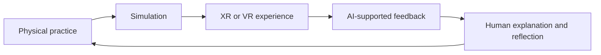

Figure 18. Title: Physical and virtual learning as one designed experience.

### Practical Recommendation for Teachers

Use virtual, XR, VR, and AI-supported tools only when they serve a learning function that ordinary instruction cannot serve as well.

In practice:

1. Define the learning purpose before choosing the tool.
2. Use simulation to reveal hidden processes, rehearse difficult actions, or widen access.
3. Connect every virtual experience to discussion, explanation, or physical practice.
4. Ask students to name what the virtual model shows and what it leaves out.
5. Collect evidence of reasoning, not only evidence that students completed the experience.

Classroom activity examples:

1. Simulation plus reality. Students explore a virtual simulation, then compare it with a physical demonstration, data set, or real-world case.
2. What the model hides. After using an XR, VR, digital, or AI tool, students list what the tool made visible and what it simplified or excluded.
3. Design test for tools. Students evaluate a learning technology using five criteria: purpose, active reasoning, connection to reality, human skills, and evidence for the teacher.

Evaluation method:

Evaluate success through the student's ability to connect virtual or AI-supported experience to real understanding. The student should explain what the tool revealed, what it hid, and how the experience changed their reasoning. Strong work includes critique of the tool, not only enjoyment or technical use.

For personal development, the updated teacher should test one digital or AI-supported environment as a learner, then write a short design note: what it made visible, what it hid, what student action it required, and how it should be assessed. This follows Dr. Iris Pinto's phygital and multimodal AI framing and the Meeting 6 concern that technology should support human skills rather than replace them.

### Sources

[Samuel Neaman Institute Round Table context](https://www.neaman.org.il/), [Dr. Iris Pinto presentation](../materials/meeting-4-iris-pinto-future-trends.pdf), [OECD Learning Compass 2030](https://www.oecd.org/education/2030-project/teaching-and-learning/learning/).

## Chapter 19 - Industry as a Learning Partner

### The Challenge

STEM learning is often disconnected from the contexts where STEM is practiced. Students may master school tasks without seeing how knowledge operates in real work.

### The Dilemma

Should industry be an occasional guest in education, or an ongoing partner in designing and supporting STEM learning?

### Main Positions

The guest model brings industry speakers and site visits. The mentorship model creates continuing relationships. The deep partnership model supports projects, externships, real problems, and feedback loops.

### Pros and Cons

Guest visits are easy but limited. Mentorship creates human connection but requires continuity. Deep partnership gives authenticity, but must protect educational purpose and equity.

### Point of View Map

Industry can provide real problems, tools, mentors, and professional context. Teachers need support translating industry experience into pedagogy. Students need exposure without narrow vocational tracking. Policy must define partnership models and safeguards.

### Round Table Voices

Jan Morrison emphasized externships, industry collaboration, and career-connected learning.

Avi Salmon brought the industry perspective on future skills and AI as a working tool.

Dr. Iris Pinto described the disconnect she observed between education and industry after moving from Intel into the Ministry of Education.

### Synthesis

Industry should not replace education's broader purpose. But it can make STEM learning more authentic, current, and motivating.

### Recommendation

Build sustained education-industry partnerships around mentoring, real problems, teacher externships, student projects, site visits, and feedback loops.

### Visual

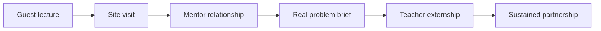

Figure 19. Title: Education-industry partnership ladder.

### Practical Recommendation for Teachers

Bring industry into learning as context, not decoration. A guest lecture is useful only if it connects to student work before and after the visit.

In practice:

1. Identify one unit where real professional context would deepen learning.
2. Invite an industry partner to provide a problem, constraint, example, or feedback.
3. Prepare students with disciplinary background before the interaction.
4. Ask students to produce something after the interaction: revised design, reflection, question set, or presentation.
5. Debrief what students learned about knowledge, teamwork, tools, uncertainty, and professional judgment.

Classroom activity examples:

1. Real constraint brief. An industry partner or teacher provides a realistic constraint, such as cost, reliability, user need, safety, or time, and students revise their solution accordingly.
2. Professional question clinic. Students prepare questions for a guest from industry, then turn the answers into design criteria or career-learning reflections.
3. Feedback from practice. Students present a project to an external mentor or professional and revise one element based on feedback.

Evaluation method:

Evaluate success by looking at how students use professional context to improve their work. The student should ask relevant questions, respond to constraints, revise based on feedback, and explain what changed because of the industry connection. The assessment should protect learning depth, not reward contact with industry as a symbolic event.

For personal development, the updated teacher should build one sustained professional connection per year: an externship, site visit, mentor relationship, or recurring project partner. This follows Jan Morrison's emphasis on externships and career-connected learning, Avi Salmon's industry perspective, and Dr. Iris Pinto's warning about the disconnect between education and industry.

### Sources

[Meeting 2 presentation](../materials/meeting-2-presentation.pptx), [TIES Jan Morrison presentation](../materials/meeting-2-ties-jan-morrison.pptx), [Meeting 4 presentation](../materials/meeting-4-presentation.pptx), [Samuel Neaman Institute Round Table context](https://www.neaman.org.il/).

## Chapter 20 - Ecosystem Around the Teacher

### The Challenge

Expecting individual teachers to transform STEM education alone is unrealistic.

### The Dilemma

Is skill development mainly the teacher's responsibility, or does it require a full ecosystem around the teacher?

### Main Positions

Teacher-centered responsibility honors professional agency. Institution-centered responsibility creates structure. Ecosystem responsibility distributes support across peers, leaders, technology, policy, industry, and community.

### Pros and Cons

Teacher-centered responsibility empowers educators, but can overload them. Institution-centered responsibility creates support, but can become top-down. Ecosystem responsibility is strongest, but requires coordination.

### Point of View Map

Teachers need support, not only expectations. Leaders must create enabling conditions. Industry and community can contribute context. Policy must support continuity beyond individual champions.

### Round Table Voices

Meeting 6 asked whether the teacher alone can carry the responsibility or whether a full ecosystem is needed.

Dr. Avigdor Zonnenshain emphasized education that fosters lifelong learning and team-driven practice.

Dr. Eli Eisenberg and Prof. Arnon Bentur framed the overall Phase III process around the future educator profile and its system conditions.

### Synthesis

The teacher remains central, but not solitary.

### Recommendation

Define the AI-era educator as the center of a designed support ecosystem: peers, leaders, mentors, AI tools, teaching centers, industry, policy, and community.

### Visual

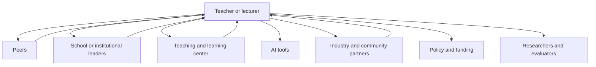

Figure 20. Title: Support ecosystem around the AI-era educator.

### Practical Recommendation for Teachers

Build a support map around your teaching. The updated teacher is central, but not solitary.

In practice:

1. List the people and resources that currently support your teaching.
2. Identify one missing support: peer planning, leadership time, AI guidance, assessment help, industry contact, community partner, or teaching center support.
3. Ask for or create one concrete support structure.
4. Share one teaching challenge with the ecosystem instead of solving it alone.
5. Revisit the map each semester and strengthen weak links.

Classroom activity examples:

1. Learning ecosystem map. Students map who and what supports their learning: teacher, peers, family, AI tools, mentors, community, school systems, and industry.
2. Peer support protocol. Students rotate roles as explainer, checker, questioner, and reflector, showing that learning is distributed across a group.
3. Support request exercise. Students identify one support they need to learn better and propose who in the ecosystem could provide it.

Evaluation method:

Evaluate success through the student's ability to use support responsibly. The student should identify available supports, seek help appropriately, contribute to peers, and explain how the ecosystem improved learning. Strong performance includes both independence and wise use of others.

For personal development, the updated teacher should move from self-improvement to ecosystem-building. This means developing personal competence while also creating conditions that help colleagues and students. It follows Dr. Avigdor Zonnenshain's system perspective and the Meeting 6 question of whether skill development belongs to the teacher alone or to a full support system.

### Sources

[Samuel Neaman Institute Round Table context](https://www.neaman.org.il/), [OECD Teaching Compass](../materials/oecd-teaching-compass.pdf), [Envisioning Educator Roles for Transformation](../materials/envisioning-educator-roles-for-transformation.pdf).

# Part VII - A Compass for STEM Education in the AI Era

## Chapter 21 - Insights Across the Six Meetings

The six meetings point to a coherent set of insights.

First, the future educator profile should be common in foundation but diverse in expression. Every educator needs a baseline of AI literacy, ethical judgment, pedagogical responsibility, and commitment to student agency. But not every educator needs the same strengths or roles.

Second, competencies must be embedded in disciplinary learning. Skills become real through practice, reflection, feedback, and repeated use in meaningful contexts.

Third, teachers need lived experience with the competencies they cultivate, but they do not need to be perfect models of everything. The system should distribute expertise.

Fourth, AI must be designed into learning. Ignoring it or banning it will not work. The question is how to make thinking visible and keep responsibility human.

Fifth, professional development must become infrastructure. Workshops are not enough. Teachers and lecturers need long-term support.

Sixth, environments matter. Physical space, virtual tools, industry connections, mentoring, organizational structures, and assessment systems all shape what learning is possible.

Seventh, equity must be designed from the start. AI can widen gaps if advantaged students use it to amplify thinking while disadvantaged students use it to replace thinking.

### Visual

Figure 21. Title: Six-meeting journey of the Round Table.

### Practical Recommendation for Teachers

Use the seven insights as a personal professional compass. Do not try to act on all of them at once. Choose one insight each term and translate it into a visible classroom practice.

In practice:

1. Select one insight that is most urgent for your students.
2. Define one teaching behavior that would make the insight real.
3. Design one student task that reflects it.
4. Collect evidence that the practice changed learning.
5. Share the result with colleagues and revise.

Classroom activity examples:

1. Six insights reflection. Students choose one insight, such as visible thinking or equity by design, and explain how the class practiced it during the unit.
2. Human above machine review. After an AI-supported task, students identify where human judgment mattered most.
3. Equity check discussion. Students examine whether a learning tool or activity helped all learners equally, and propose one adjustment.

Evaluation method:

Evaluate success through synthesis. The student should connect classroom experience to the larger Round Table insights: human judgment, competencies, evidence, equity, AI responsibility, and support systems. Strong work shows that the student can move from one activity to a broader principle.

For personal development, the updated teacher should review the six-meeting insights at the end of each semester and ask: where did I keep human judgment central, where did I make thinking visible, where did I support equity, and where did I still work alone? This turns the Round Table synthesis into a recurring teacher reflection tool.

## Chapter 22 - Guiding Principles

The following principles express the spirit of the Round Table:

1. Keep the human above the machine.
2. Treat AI as part of the learning ecology, not as a replacement for teachers.
3. Preserve disciplinary rigor while embedding human competencies.
4. Design for visible thinking, not polished outputs.
5. Build diverse educator ecosystems, not one impossible ideal profile.
6. Give teachers and lecturers lived experience with new learning models.
7. Make professional development continuous and supported.
8. Connect STEM learning to real-world practice and industry.
9. Use physical, virtual, and AI environments purposefully.
10. Evaluate reforms with evidence and feedback loops.
11. Design for equity from the start.
12. Build institutions for lifelong learning.

### Visual

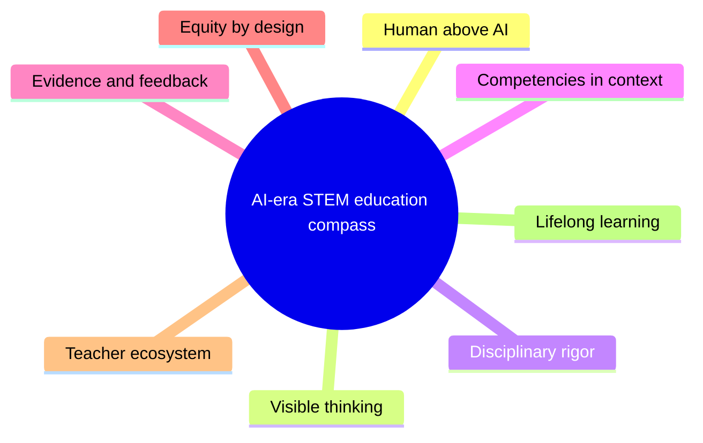

Figure 22. Title: Compass for STEM education in the AI era.

### The Human-First AI Learning Cycle

The guiding principles become practical when teachers design a learning sequence in which students meet the world before they meet AI. AI should enter after observation, curiosity, early reasoning, measurement, and prediction. It should help students expand, compare, model, and validate understanding, not replace the human work of learning.

This cycle can be used in many STEM topics. A simple example is a swing in a park. Students first observe the swing, form explanations with the teacher, measure the motion, make predictions, and only then use AI to deepen the model, build a simulator, and test whether the simulator fits reality.

The cycle has ten steps:

1. Observe the phenomenon. Begin with the real world. Students watch, sketch, describe, photograph, or record what happens before naming formulas or asking AI.
2. Form a human thesis. Students explain what they think is happening and why, with teacher guidance and peer discussion. The first explanation may be incomplete, but it must be theirs.
3. Experiment and measure. Students collect evidence through measurement, comparison, controlled change, or repeated observation.
4. Predict before AI. Students use their own explanation and data to predict what will happen if one condition changes. They also state what evidence would prove them wrong.
5. Use AI as a learning partner. Students ask AI to explain the topic, identify variables, suggest common mistakes, or propose a simple model. They compare the AI answer with their own evidence.
6. Explain verbally what was learned. Students explain the phenomenon in their own words before building or submitting anything AI-assisted.
7. Build a simulator with AI. Students use AI to help create a model, spreadsheet, code simulation, Scratch activity, GeoGebra model, or other representation of the phenomenon.
8. Validate the simulator against reality. Students compare the simulator with their observations and measurements. They identify where the model fits, where it fails, and which assumptions are too simple.
9. Present verbally and defend the learning. Students present the full path: observation, thesis, experiment, prediction, AI learning, simulator, validation, and conclusion.
10. Reflect on human responsibility. Students explain how they stayed above AI: what they understood before AI, what AI helped clarify, what they checked themselves, and where they made the final judgment.

The short teacher version is:

1. Observe reality.
2. Form a human explanation.
3. Measure or experiment.
4. Predict before AI.
5. Use AI to learn and compare.
6. Explain verbally.
7. Build a simulator with AI.
8. Validate against reality.
9. Present and defend.
10. Reflect on human responsibility.

The principle is direct: AI enters after human curiosity, observation, reasoning, and prediction. AI may help the learner model, extend, and test understanding, but the student remains responsible for judgment, validation, explanation, and meaning.

### Practical Recommendation for Teachers

Turn the guiding principles into a short design checklist before launching a major task, project, or AI-supported activity.

In practice:

1. Ask whether the task keeps human judgment above AI.
2. Check whether disciplinary rigor is preserved.
3. Identify where student thinking will be visible.
4. Decide how equity risks will be reduced.
5. Plan how evidence from the task will improve the next version.

Classroom activity examples:

1. Principle-to-task checklist. Before a project, students and teacher check which guiding principles are built into the task and which are missing.
2. Visible thinking checkpoint. Students pause mid-task to show evidence of reasoning, uncertainty, tool use, and next steps.
3. Principle evidence gallery. At the end of a unit, students display artifacts that show one guiding principle in action.

Evaluation method:

Evaluate success by asking students to produce evidence for a principle, not only repeat the principle. A student succeeds when they can show an artifact, decision, revision, or reflection that proves visible thinking, responsible AI use, collaboration, equity, or another guiding principle in action.

For personal development, the updated teacher should choose three principles as annual growth priorities. For example: visible thinking, lived experience with AI, and continuous professional learning. At the end of the year, gather evidence of progress for each. This makes the book's compass operational rather than decorative.

## Chapter 23 - Recommendations by Audience

### For Teachers

Use AI to deepen questioning, critique, and reflection. Do not use it only to produce better-looking answers. Ask students to explain their reasoning, compare alternatives, identify errors, and reflect on what changed in their understanding.

### For Lecturers

Redesign courses around graduate profiles and competencies. Connect foundations to application. Use AI-aware assessment that asks for process evidence, not only final submissions.

### For School Leaders

Create time and structures for teacher collaboration. Support project-based and experiential learning. Build AI policies around learning design.

### For Higher-Education Leaders

Strengthen teaching and learning centers. Map competencies across programs. Support faculty development as a long-term institutional priority.

### For Policy Makers

Define shared goals and infrastructure. Fund implementation support, not only training events. Support mechanisms for continuous professional development.

### For Industry Partners

Provide mentors, real problems, externships, site visits, and feedback. Support education without narrowing it to short-term labor needs.

### For Researchers

Study AI-era learning processes, teacher development, assessment, equity, and long-term outcomes.

### Visual

| Audience | Main action | Evidence to collect |
| --- | --- | --- |
| Teachers | Make thinking visible and guide AI use | Student reasoning, drafts, reflection |
| Lecturers | Redesign courses around graduate profiles | Competency maps and course artifacts |
| School leaders | Create time and structures for collaboration | Participation, implementation, student work |
| Higher-education leaders | Strengthen teaching centers and incentives | Program evidence and faculty development records |
| Policy makers | Fund infrastructure and continuity | System adoption and equity indicators |
| Industry partners | Provide real problems, mentors, and feedback | Student revisions and partnership continuity |
| Researchers | Study process, outcomes, and equity | Mixed evidence and long-term follow-up |

Figure 23. Title: Recommendations by audience.

### Practical Recommendation for Teachers

Translate audience recommendations into a local action plan. A teacher does not control every audience, but can initiate the first step with each one.

In practice:

1. For students, redesign one task so AI deepens questioning rather than replaces thinking.
2. For colleagues, propose one shared planning or peer review session.
3. For leaders, ask for one enabling condition: time, space, tool access, or assessment support.
4. For industry partners, request one authentic problem, visit, mentor, or feedback opportunity.
5. For researchers or evaluators, frame one question about what is working in your classroom.

Classroom activity examples:

1. Audience redesign. Students adapt one explanation of their work for three audiences: peer, teacher, and industry or community partner.
2. Stakeholder feedback round. Students identify who would care about their project outcome and seek feedback from at least one relevant audience.
3. Recommendation workshop. Students write practical recommendations from their project for teachers, leaders, policy makers, or industry partners.

Evaluation method:

Evaluate success through audience awareness and practical recommendation quality. The student should adapt language, evidence, and emphasis for different stakeholders. Strong work includes a recommendation that is specific, realistic, and grounded in what was learned.

For personal development, the updated teacher should become a bridge among audiences. Keep a small stakeholder map and update it each semester. This reflects the Round Table's repeated message that AI-era STEM education is not a private classroom matter. It is a coordinated professional, institutional, and social effort.

## Chapter 24 - Open Questions and Phase IV

The Round Table did not close every question. It opened the next layer.

Future work should examine STEM leadership in the AI era, uncertainty and resilience, the connection between bottom-up innovation and top-down policy, systems thinking and multidisciplinarity, and the role of values and attitudes alongside skills.

The next phase should move from defining the AI-era educator profile to designing the AI-era STEM education system: leadership, institutions, policy, practice, tools, environments, and evidence.

### Visual

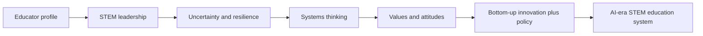

Figure 24. Title: Phase IV roadmap from educator profile to education system.

### Practical Recommendation for Teachers

Treat the open questions as an invitation to inquiry. The updated teacher does not wait for all answers before improving practice, but also does not pretend the questions are settled.

In practice:

1. Choose one open question that matters in your context: STEM leadership, resilience, bottom-up innovation, systems thinking, values, or attitudes.
2. Turn it into a classroom or course experiment.
3. Define what evidence would show progress.
4. Involve students in reflecting on the question.
5. Share the result with a professional community so practice can inform the next phase.

Classroom activity examples:

1. Open question inquiry. Students choose one unresolved question, such as resilience, STEM leadership, values, or systems thinking, and run a small inquiry project.
2. Bottom-up innovation lab. Students identify a problem in their learning environment and prototype a practical improvement.
3. Values and AI scenario. Students analyze a future STEM scenario and identify the skills, values, and attitudes needed to act responsibly.

Evaluation method:

Evaluate success through inquiry quality and responsible imagination. The student should frame a meaningful question, gather evidence, test or prototype an idea, and reflect on values and consequences. Strong work does not claim final certainty. It shows disciplined curiosity and a practical next step.

For personal development, the updated teacher should adopt an inquiry stance: learn, test, document, share, and revise. This fits the Phase IV direction suggested by the steering discussion, where the next challenge is not only to define the educator profile but to design the wider STEM education system around leadership, practice, tools, environments, values, and evidence.

# Appendices

## Appendix A - Meeting Timeline

- Meeting 1: 02.12.2025, introduction and AI-era skills.
- Meeting 2: 20.01.2026, uniform or diverse teacher and lecturer profiles.
- Meeting 3: 10.03.2026, possessing versus cultivating competencies.
- Meeting 4: 28.04.2026, teacher-student-AI triangle.
- Meeting 5: 09.06.2026, professional development responsibility.
- Meeting 6: 21.07.2026, learning environments, industry, XR/VR, mentors.
- Steering discussion: 04.08.2026, report structure and Phase IV.

## Appendix B - Speaker and Participant Directory

This appendix should be completed from the source summaries. Initial speaker list includes Dr. Eli Eisenberg, Prof. Arnon Bentur, Dr. Avigdor Zonnenshain, Tamar Dayan, Avi Salmon, Dr. Marwa Maklada, Dr. Revital Duek, Dr. Yael Granot-Bein, Dr. Noa Ragonis, Prof. Sigal Tifferet, Dr. Gabi Shafat, Dr. Tzur Karelitz, Dr. Einat Sprinzak, Prof. Russell Tytler, Emlen Metz, Jan Morrison, Prof. Gil Noam, Danielle Eisenberg, Dr. Iris Pinto, Dr. Rinat Itzhaki, Orly Rauch, and Dr. Olena Bekh.

## Appendix C - Presentation Inventory

Presentation files found in the collected corpus:

- [Presentation 2nd meeting, 20.01.2026](../materials/meeting-2-presentation.pptx).
- [TIES Jan Morrison International Round Table Presentation, Future of Teaching, 20.01.2026](../materials/meeting-2-ties-jan-morrison.pptx).
- [Default or Design, Ignite Ed STEM Roundtable Presentation, 04.2026](../materials/meeting-4-default-or-design-ignite-ed.pptx).
- [Presentation 4th meeting, 28.04.2026](../materials/meeting-4-presentation.pptx).

Additional presentation or background materials:

- [STEM, Dr. Gabi Shafat](../materials/meeting-2-gabi-shafat-stem.pdf).
- [Future Trends Shaping Reality, Dr. Iris Pinto](../materials/meeting-4-iris-pinto-future-trends.pdf).
- [The Teacher in the AI Era discussion document](../materials/meeting-3-teacher-in-ai-era-discussion.docx).
- [Meeting 4 discussion document](../materials/meeting-4-discussion-document.docx).

## Appendix D - Recording Inventory

The collected materials include YouTube recording links for meetings 2 and 4 in the summaries. The collected mail corpus also includes one direct [YouTube link found in the mail corpus](https://youtu.be/zAtAT7lsPac). The emails include Zoom join links for meetings 3, 5, and 6, and state that meetings will be recorded, but no direct recording links were found in the collected email corpus.

## Appendix E - External Sources and Frameworks

External references appearing in the collected materials include:

- [OECD Teaching Compass: Reimagining Teachers as Agents of Curriculum Change](../materials/oecd-teaching-compass.pdf).
- [OECD Learning Compass 2030](https://www.oecd.org/education/2030-project/teaching-and-learning/learning/).
- [TALIS 2024 material](../materials/talis-2024-us-short.pdf).
- [UNESCO AI Competency Framework for Teachers](https://www.unesco.org/en/articles/ai-competency-framework-teachers).
- [UNESCO AI competency framework overview](https://www.unesco.org/en/digital-education/ai-future-learning/competency-frameworks).
- [AI Literacy Framework](https://ailiteracyframework.org/).
- [What Should Teachers Teach in an AI Future, listed in the Meeting 3 discussion document](../materials/meeting-3-teacher-in-ai-era-discussion.docx).
- [Teachers' Professional Learning for the AI Era, listed in the Meeting 3 discussion document](../materials/meeting-3-teacher-in-ai-era-discussion.docx).
- [ISTE Standards for Educators](https://iste.org/standards/educators) and [ISTE Standards for Students](https://iste.org/standards/students).
- [Collins, Brown, and Holum on cognitive apprenticeship, listed in the Meeting 3 discussion document](../materials/meeting-3-teacher-in-ai-era-discussion.docx).
- [Bandura on self-efficacy, listed in the Meeting 3 discussion document](../materials/meeting-3-teacher-in-ai-era-discussion.docx).
- [Perkins and Salomon on transfer of learning, listed in the Meeting 3 discussion document](../materials/meeting-3-teacher-in-ai-era-discussion.docx).
- [Rest and Narvaez on moral development in the professions, listed in the Meeting 3 discussion document](../materials/meeting-3-teacher-in-ai-era-discussion.docx).
- [Abrami and colleagues on critical thinking instruction, listed in the Meeting 3 discussion document](../materials/meeting-3-teacher-in-ai-era-discussion.docx).

## Appendix F - Six-Day Teacher Training Program

### Program Purpose

This appendix proposes a six-day professional development program for teachers who want to adopt the principles of this book in STEM classrooms. The program is designed to help teachers use AI technically and responsibly, redesign classroom learning around human-first inquiry, and prepare for leading change in their own schools or institutions.

The program is built around three sections:

1. AI knowledge: practical use of AI for research, learning, software building, simulations, classroom preparation, and feedback.
2. Pedagogy: translating the book's principles into classroom design, student skills, assessment, activities, and the Human-First AI Learning Cycle.
3. Leading a change: preparing teacher leaders to influence colleagues and systems. This section is intentionally left as titled placeholders for later author development.

### Program Outcomes

By the end of the six days, participating teachers should be able to:

1. Use AI tools for research, explanation, lesson preparation, software generation, simulator building, feedback, and classroom support.
2. Identify the limits, risks, and reliability problems of AI outputs.
3. Design STEM learning activities that begin with observation, questioning, experimentation, prediction, and human explanation before AI use.
4. Build classroom routines that keep student thinking visible.
5. Assess student learning through process evidence, oral explanation, reflection, verification, and responsible AI use.
6. Create one implementable AI-era STEM lesson or unit based on the principles of the book.
7. Prepare an initial plan for influencing colleagues and leading school-level change.

### Program Structure

| Day | Section | Focus | Main deliverable |
| --- | --- | --- | --- |
| Day 1 | AI knowledge | AI for research, learning, explanation, and teacher productivity | Personal AI research and learning workflow |
| Day 2 | AI knowledge | AI for software, simulations, data, and classroom tool building | Working AI-supported simulator or digital learning artifact |
| Day 3 | Pedagogy | Skills, competencies, and human-first STEM learning | Human-First AI Learning Cycle activity plan |
| Day 4 | Pedagogy | Teacher-student-AI triangle, visible thinking, and assessment | AI-aware lesson design with assessment evidence |
| Day 5 | Pedagogy | Learning environments, projects, industry links, and implementation | Full classroom implementation plan |
| Day 6 | Leading a change | Teacher leadership and institutional influence | To be developed by author |

### Section 1 - AI Knowledge

The first section gives teachers practical fluency with AI tools. The purpose is not to turn every teacher into a software engineer. The purpose is to make teachers confident enough to use AI, test AI, explain AI-supported work to students, and design tasks in which AI strengthens learning rather than replacing it.

#### Day 1 - AI for Research, Learning, and Teacher Productivity

**Training focus:** Teachers learn how to use AI as a research assistant, learning partner, planning assistant, and explanation engine while keeping professional judgment above the tool.

**Core topics:**

1. What generative AI can and cannot do.
2. Prompting as professional questioning, not magic wording.
3. Using AI to explain unfamiliar topics at different levels.
4. Using AI to summarize, compare, and organize sources.
5. Checking AI claims against reliable sources.
6. Asking AI to produce examples, analogies, misconceptions, and questions.
7. Using AI for lesson planning, differentiation, rubrics, feedback drafts, and student support.
8. Recognizing hallucinations, bias, shallow explanations, and overconfident answers.
9. Responsible disclosure and privacy when using AI for school work.

**Hands-on practice:**

1. Research workflow exercise. Each teacher chooses one STEM topic and asks AI to explain it at three levels: middle school, high school, and adult professional. Teachers compare the outputs and identify what changed.
2. Source-checking exercise. Teachers ask AI for a short research summary, then verify claims against external sources. They mark which claims are reliable, unsupported, or unclear.
3. Misconception exercise. Teachers ask AI to list common student misconceptions about a topic, then evaluate which misconceptions are real and useful for their classroom.
4. Lesson-support exercise. Teachers ask AI to generate a lesson outline, three student questions, one formative assessment, and one extension task. They revise the output using their own professional judgment.
5. AI failure exercise. Teachers intentionally ask a weak or ambiguous question and analyze how the AI response can mislead students.

**Teacher deliverable:**

Each teacher creates a personal AI research and learning workflow that includes:

1. A prompt pattern for learning a new topic.
2. A prompt pattern for checking misconceptions.
3. A source-checking routine.
4. A rule for what they will never send to AI because of privacy or ethics.
5. A short reflection on where AI helped and where teacher judgment was still needed.

**Evaluation of teacher learning:**

Teachers are evaluated through a short oral explanation and an annotated AI-use example. They must show what they asked AI, what they trusted, what they changed, what they checked externally, and what decision remained their own.

#### Day 2 - AI for Software, Simulators, Data, and Classroom Tool Building

**Training focus:** Teachers learn how AI can help build simple software artifacts, simulations, models, spreadsheets, quizzes, visualizations, and classroom tools. The emphasis is on building, testing, debugging, and validating against reality or disciplinary knowledge.

**Core topics:**

1. AI as a coding assistant for non-specialists.
2. Asking AI to build small tools: calculators, simulations, visualizations, worksheets, quizzes, and practice generators.
3. Software literacy for teachers: inputs, outputs, variables, assumptions, errors, and testing.
4. Building simple simulators for STEM phenomena.
5. Using spreadsheets and code to model data.
6. Debugging AI-generated code or formulas.
7. Validating digital models against measurement, theory, or known examples.
8. Teaching students to critique a simulator rather than trust it automatically.
9. Safety, privacy, copyright, and school policy concerns in digital tool building.

**Hands-on practice:**

1. Build a simple simulator. Teachers choose a familiar phenomenon, such as a swing, cooling water, projectile motion, population growth, electric circuits, or chemical concentration. They use AI to help build a simple spreadsheet, code snippet, or interactive model.
2. Define variables and assumptions. Teachers list what the simulator includes, what it ignores, and which assumptions may be too simple.
3. Test with known cases. Teachers compare the simulator with a known formula, measured data, textbook example, or real classroom observation.
4. Debugging practice. Teachers introduce or discover an error and ask AI to help debug it. They must still explain the correction themselves.
5. Classroom adaptation. Teachers turn the simulator into a student activity that requires prediction before use and validation after use.

**Teacher deliverable:**

Each teacher produces one AI-supported digital artifact:

1. A simulator, spreadsheet, simple code tool, visualization, or interactive classroom model.
2. A short explanation of the phenomenon being modeled.
3. A list of variables and assumptions.
4. A validation check against reality, data, or disciplinary knowledge.
5. A classroom instruction sheet that tells students how to use the tool critically.

**Evaluation of teacher learning:**

Teachers present the artifact and answer four questions:

1. What does the model show?
2. What does it hide or simplify?
3. How was it validated?
4. How will students remain responsible for understanding rather than only operating the tool?

### Section 2 - Pedagogy

The second section translates the book into classroom practice. It focuses on skills, competencies, the teacher-student-AI triangle, human-first activity design, evidence of learning, classroom environments, and assessment. Teachers do not only discuss the principles. They build classroom-ready materials.

#### Day 3 - Skills, Competencies, and the Human-First AI Learning Cycle

**Training focus:** Teachers learn to design STEM activities that develop skills and competencies through disciplinary learning. The day centers on the Human-First AI Learning Cycle.

**Core topics:**

1. The shift from knowledge transmission to competency formation.
2. The difference between content knowledge, skill, competency, and evidence of learning.
3. Human judgment, curiosity, creativity, teamwork, communication, reflection, AI literacy, and ethical responsibility.
4. Why students should observe, explain, measure, and predict before using AI.
5. The Human-First AI Learning Cycle as a reusable classroom structure.
6. Keeping disciplinary foundations strong while making thinking visible.
7. Designing student tasks that require process, not only final answers.

**Hands-on practice:**

1. Phenomenon selection. Teachers choose one STEM phenomenon from their curriculum that can be observed or demonstrated.
2. Human-first activity design. Teachers design the first four steps: observe, form a thesis, experiment or measure, and predict before AI.
3. AI entry design. Teachers decide exactly when AI enters the activity and what students may ask it to do.
4. Verbal explanation routine. Teachers create prompts for student oral explanation before and after AI use.
5. Peer critique. Teachers exchange plans and check whether AI enters too early, too late, or in the right place.

**Teacher deliverable:**

Each teacher creates a one-page Human-First AI Learning Cycle plan for a STEM topic. The plan must include:

1. The phenomenon.
2. Student observation task.
3. First human explanation task.
4. Measurement or experiment.
5. Prediction before AI.
6. AI learning prompt.
7. Verbal explanation task.
8. Simulator or model idea.
9. Validation method.
10. Reflection on human responsibility.

**Evaluation of teacher learning:**

Teachers are evaluated by whether the activity keeps student thinking visible before AI, uses AI for comparison and extension, and ends with validation and responsibility.

#### Day 4 - Teacher-Student-AI Triangle, Visible Thinking, and Assessment

**Training focus:** Teachers learn how to manage AI as part of the learning relationship and how to assess student success when AI is involved.

**Core topics:**

1. The teacher-student-AI triangle.
2. The teacher as designer, mediator, evaluator, and guardian of human judgment.
3. The student as responsible learner, not passive AI user.
4. AI as support for explanation, feedback, simulation, practice, and comparison.
5. Visible thinking routines: reasoning trail, draft history, prompt log, comparison, reflection, and oral defense.
6. Assessment beyond the final answer.
7. Portfolio evidence, process evidence, oral explanation, peer feedback, and validation evidence.
8. Designing rubrics for AI-supported work.
9. Equity risks when students use AI differently.

**Hands-on practice:**

1. AI-use agreement. Teachers write a classroom agreement defining allowed AI use, limited use, disclosure, and student responsibility.
2. Visible thinking redesign. Teachers take an existing assignment and add process evidence: prompts, draft, explanation, verification, and reflection.
3. Rubric design. Teachers build a rubric with criteria for content quality, reasoning, AI transparency, verification, oral explanation, and reflection.
4. Oral defense simulation. Teachers practice asking students questions that reveal understanding rather than memorized output.
5. Equity check. Teachers review their redesigned task and identify which students may need extra support to use AI responsibly.

**Teacher deliverable:**

Each teacher produces an AI-aware assessment package:

1. Classroom AI-use agreement.
2. Redesigned assignment.
3. Student process-evidence checklist.
4. Rubric.
5. Oral defense question set.
6. Equity support note.

**Evaluation of teacher learning:**

Teachers present their assessment package and explain how it distinguishes between polished output and real learning. The package should show how the teacher will see student thinking, verify understanding, and protect student responsibility.

#### Day 5 - Learning Environments, Projects, Industry Links, and Classroom Implementation

**Training focus:** Teachers turn the principles into a complete classroom implementation plan. The day connects physical and digital learning environments, project-based learning, industry context, collaboration, and evidence loops.

**Core topics:**

1. The classroom as a learning environment, not only a room.
2. Frontal classroom, flexible classroom, makerspace, virtual space, and workplace-linked learning.
3. Project-based and problem-based STEM learning.
4. Collaboration and teamwork as explicit competencies.
5. Using industry or community context without reducing education to job training.
6. Physical plus virtual learning: simulation, measurement, building, testing, and reflection.
7. Evidence loops for improving teaching after implementation.
8. Planning realistic implementation under school constraints.

**Hands-on practice:**

1. Environment audit. Teachers map their real classroom constraints: space, time, tools, student needs, policy, assessment, and support.
2. Project design. Teachers expand the Human-First AI Learning Cycle plan into a larger classroom project or unit.
3. Collaboration design. Teachers define student roles such as observer, measurer, AI checker, model builder, skeptic, presenter, and evidence lead.
4. Industry or community connection. Teachers identify one possible external connection: guest question, real constraint, site visit, mentor, local problem, or professional feedback.
5. Implementation planning. Teachers create a timeline, materials list, risk list, and evidence plan.
6. Peer review. Teachers present the plan and receive feedback from colleagues.

**Teacher deliverable:**

Each teacher leaves with a complete implementation plan:

1. Topic and learning goals.
2. Target skills and competencies.
3. Human-First AI Learning Cycle sequence.
4. AI-use rules.
5. Student roles.
6. Learning environment setup.
7. Assessment evidence.
8. Timeline.
9. Materials and tools.
10. Risk and equity plan.
11. Optional industry or community link.
12. Reflection and improvement plan after teaching.

**Evaluation of teacher learning:**

Teachers complete a final presentation of their classroom implementation plan. Evaluation focuses on whether the plan is practical, grounded in STEM content, skill-rich, AI-aware, assessable, and faithful to the principle that students remain above AI.

### Section 3 - Leading a Change

This section is intentionally left as titles only for later author development.

#### Day 6 - Leading AI-Era STEM Change

**Training focus:** To be completed by author.

**Core topics:**

1. Teacher leadership identity.
2. Influencing colleagues without coercion.
3. Building a school or department change team.
4. Creating shared language around AI-era STEM education.
5. Supporting new teachers.
6. Working with resistance.
7. Building evidence for change.
8. Communicating with leadership, parents, policy makers, and industry partners.
9. Sustaining change over time.

**Hands-on practice:** To be completed by author.

**Teacher deliverable:** To be completed by author.

**Evaluation of teacher learning:** To be completed by author.

# Closing Note

This first draft is deliberately structured. The next pass should deepen each chapter with more direct speaker references, selected quotations from recordings where available, fuller bibliography entries, and a tighter editorial voice. The main conceptual architecture is now in place: AI-era STEM education requires a new educator profile, a new professional ecosystem, and a practical compass that keeps human judgment at the center.
