# International STEM Skills Round Table Phase III

<!-- markdownlint-disable MD025 MD024 -->

**The Teacher Above AI: STEM Education, Human Judgment, and the New Learning Ecosystem**

Avi Salmon

First edition: 2026  
Source base: International STEM Skills Round Table Phase III meeting summaries, presentations, discussion documents, steering-team records, and background sources.

# Editorial Note

This book is built from the collected Round Table materials. It is written as a synthesis, not as meeting minutes. Where the source material names speakers and summarizes their contributions, the book refers to them by name and role. Where a source was available only as a meeting outline or steering summary, the book treats it as a reported contribution and avoids direct quotation.

This book is not an official publication of the Samuel Neaman Institute or of any organization represented in the discussions, and it does not speak on behalf of the participants named in it. The text was developed with assistance from generative AI tools working from the collected Round Table materials, then reviewed and edited by the author, who is responsible for the final text.

The author was himself a participant in the Round Table and presented at the sixth meeting. His own contributions are cited on the same basis as those of every other participant, and readers should weigh them in that light. The Contributors section that follows names the people whose work this book rests on.

All six meetings left detailed written summaries, and five of the six also left presentation decks. Meeting 1 was an introductory session and left a summary but no deck, so the opening lecture is reported rather than reproduced. All six summaries were issued by the Samuel Neaman Institute as drafts circulated for participant comment, and no final version of any of them was ever circulated. That is the Institute's standing practice and not a sign that any one summary is provisional, so the circulated draft is the document of record in every case, and this book uses all six on that basis.

Two consequences follow. The first is that every attribution in this book passes through a summarizer rather than a transcript, and the compression is invisible on the page. Chapter 24 sets out what that costs the argument. The second is a matter of sequence. The Meeting 1 summary, the Phase I and Phase II reports, and later the Meeting 3 and Meeting 5 summaries and decks all reached the author after the first draft was written. Each arrival changed chapters that had already been drafted, and those chapters were rewritten rather than patched.

Appendix B records, meeting by meeting, exactly what evidence exists. It is short, and a reader who intends to rely on any attribution in this book should read it first.

This book uses external references that appear in the collected materials, including the [OECD Teaching Compass](../materials/oecd-teaching-compass.pdf), [OECD Learning Compass 2030](https://www.oecd.org/en/data/tools/oecd-learning-compass-2030.html), [UNESCO AI competency frameworks](https://www.unesco.org/en/digital-education/ai-future-learning/competency-frameworks), [TALIS 2024 material](../materials/talis-2024-us-short.pdf), and research references listed in the [Meeting 3 Round Table discussion document](../materials/meeting-3-teacher-in-ai-era-discussion.docx). Some working sources are internal Round Table or steering-team documents and are cited by document type and date when no public link is available.

Source citations that point to `../materials/` refer to the project's internal working library. Those files are third-party documents that the project does not hold publication rights to, so they are not distributed with the book or the public repository. They are listed so that the chain of evidence behind each chapter is visible. The steering-team summaries are part of that library and are cited on the same basis as everything else in it. They are working documents in Hebrew, and several of this book's most self-critical passages rest on them, so they are named individually rather than in a block.

Figures are numbered in a single sequence whether they are diagrams or tables. Eleven of the sixteen are diagrams and five are tables. The numbering does not distinguish them, so that a cross-reference to Figure 8 finds it without the reader having to know which kind it is.

# Contributors

One name appears on the cover of this book, and that is a statement about editorial responsibility, not about authorship of the ideas. Nothing in these pages was invented at a desk. The International STEM Skills Round Table Phase III was a shared inquiry conducted over six meetings and a year of steering discussions, and the substance of this book belongs to the people who were in that room.

**The people who made Phase III happen.** Dr. Eli Eisenberg initiated and led the Round Table. He opened the meetings, introduced each dilemma, moderated the discussion, and insisted that the process be an active professional inquiry rather than a documentation exercise. Prof. Arnon Bentur gave the inquiry its conceptual spine. At the second meeting he set out the sequence of dilemmas this book follows chapter by chapter: educator profile, possession versus cultivation of competencies, the teacher-student-AI relationship, professional development, and learning environments. Dr. Avigdor Zonnenshain brought the systems and engineering-education perspective and summarized the sessions. Tamar Dayan organized the meetings and built the source library on which every citation in this book depends; without that record there would be nothing to synthesize. Dr. Yael Granot-Bein and Dr. Revital Duek moderated discussions and shaped the treatment of competency development, repeated practice, teamwork, and visible thinking. Inna Zertser supported the Round Table process throughout Phase III.

Each of the six who led the work, Dr. Eli Eisenberg, Prof. Arnon Bentur, Dr. Avigdor Zonnenshain, Tamar Dayan, Dr. Yael Granot-Bein, and Dr. Revital Duek, was closely involved in producing this book, and an earlier draft carried their names on the cover. They are credited here instead because the drafting decisions, the structure, the interpretations, and any errors that follow from them are the author's own, and it would be unfair to attach their names to judgments they did not make.

**The people whose arguments the chapters are built from.** The author gave the opening lecture at Meeting 1 and a second at Meeting 6, and both are cited in these pages on the same basis as everyone else's. Jan Morrison of TIES and Dr. Gabi Shafat of Afeka Academic College of Engineering presented at Meeting 2. Prof. Sigal Tifferet of Ruppin Academic Center and Dr. Olena Bekh of the European Training Foundation presented at Meeting 3. Danielle Eisenberg of Ignite/Ed and ETS and Dr. Iris Pinto of the Institute for Futures Research in Education presented at Meeting 4. Prof. Russell Tytler of Deakin University and Dr. Yael Granot-Bein of the Edmond de Rothschild Bridge presented at Meeting 5. Emlen Metz of the OECD and Berkeley presented at Meeting 6, alongside the author. Their material is the primary evidence behind large parts of this book.

Positions, objections, and questions that shaped the argument came from Dr. Marwa Maklada, Dr. Noa Ragonis, Dr. Tzur Karelitz, Dr. Einat Sprinzak, Prof. Gil Noam, Dr. Edith Manny-Ikan, Dr. Rinat Itzhaki, Dr. Yair Noam, and Oren Baratz. Several of them disagreed with directions the group was taking, and Chapter 24 exists because they did. Inna Zertser, Orly Rauch, and Golan Tamir took part in the sessions and the steering work behind them.

Appendix A records each contributor's role and background in full. The attributions throughout the book are drawn from meeting summaries, presentation files, discussion documents, and steering-team records. Where a source reported a contribution rather than recording it verbatim, the book says so. Any misattribution is unintended, and corrections are welcome.

# Preface

The International STEM Skills Round Table Phase III took place when education systems were already feeling the pressure of generative artificial intelligence. AI tools had moved from novelty to everyday practice. Students could use them to explain a concept, solve a problem, write code, summarize a paper, generate a draft, translate a text, or rehearse an argument. Teachers and lecturers faced a difficult question: if AI can perform many routine intellectual tasks, what should human education now do?

The Round Table did not treat AI as a narrow technical issue. Its central concern was broader and more demanding: the profile of the teacher and lecturer in the age of generative AI, especially in STEM education. The group asked how educators should cultivate skills, competencies, ethical judgment, critical thinking, curiosity, teamwork, and real understanding when machines can produce fluent answers but cannot take human responsibility for learning.

This book captures the arc of that discussion. It follows the six Phase III meetings and the steering discussions around them. It draws on presentations, summaries, discussion documents, background papers, and the voices of participants from education, higher education, policy, research, and industry.

The book's central claim is simple: AI does not remove the need for teachers. It raises the bar for teaching. The educator is no longer only a transmitter of content. The educator becomes a designer of learning environments, a mediator of judgment, a cultivator of human competencies, a connector between knowledge and practice, and a guardian of the principle that the human must remain above the machine.

That is the claim the book sets out to defend, and it is wider than what the evidence finally supports. Chapter 24 tests it, finds that the case for the competencies is strong where they are taught explicitly inside a discipline and much weaker where transfer across disciplines is assumed, and states the narrower version that survives. A reader who wants the limits before the argument should start there.

# How to Read This Book

This book follows the Round Table's own sequence. Each of the first six parts takes one meeting, states the dilemma that meeting was convened to argue, and works it through over three or four chapters. The seventh part stops reporting and starts arguing.

| Part | Meeting | The dilemma put to the room | Chapters |
| --- | --- | --- | --- |
| I | 1, 16.12.2025 | What is a STEM education for, once a machine can produce a fluent answer? | 1 to 3 |
| II | 2, 20.01.2026 | Should the profile of teachers and lecturers be uniform, or diverse? | 4 to 6 |
| III | 3, 10.03.2026 | Must educators possess the competencies they are asked to cultivate? | 7 to 9 |
| IV | 4, 28.04.2026 | Is teaching still teacher and student, or a triangle that includes AI? | 10 to 13 |
| V | 5, 09.06.2026 | Who is responsible for sustaining professional development over time? | 14 to 16 |
| VI | 6, 21.07.2026 | What balance of physical, virtual, and workplace environments does STEM learning need? | 17 to 20 |
| VII | Synthesis | What the six meetings add up to, and what they failed to settle | 21 to 26 |

Chapters 1 to 20 all follow the same ten-part pattern, set out in the Methodology below. Once you have read one chapter you know the shape of the other nineteen, and you can enter any of them at the section you need. *Round Table Voices* is where the participants speak. *Practical Recommendation for Teachers* is where the chapter turns into something to do on Monday morning.

Three ways through:

- **If you have an hour.** Chapters 23, 24, and 25: the model, the case against it, and what to do anyway.
- **If you teach.** Chapters 1, 3, 11, 13, and 23, then the *Practical Recommendation for Teachers* section of any chapter whose dilemma you recognize.
- **If you run an institution.** Chapters 4, 14, 16, 17, and 20, then Chapter 24, which names the reasons an institution will agree with this book and still not act.

Chapter 24 argues against the rest of the book. It is not a list of caveats at the back; it is the chapter to read first if you read only one.

Three companion documents sit alongside the book and are shorter and more practical than the chapters they summarize: a competency summary, a one-page lesson model, and a six-day training program. They are published at <https://avisalmon.github.io/RoundTableIII/>.

# Methodology

This book is based on the materials of the International STEM Skills Round Table Phase III: meeting summaries, steering-team summaries, presentation files, discussion documents, program outlines, correspondence, and background papers.

Two earlier phases stand behind this one. The [Phase I report](../materials/phase-1-report.pdf), published in January 2025 from meetings held in 2022, set out definitions, teaching methodologies, and evaluation tools for three competency clusters: self-directed learning and lifelong learning; teamwork, collaboration, and cooperation; and complex problem solving with critical thinking. The [Phase II report](../materials/phase-2-report.pdf), published in March 2025, turned those clusters into a practical guide for educators and added a systematic literature review and a Delphi consensus on how AI in education might support each of them. Phase III keeps those competencies and changes the subject. It asks what the educator has to become for any of them to be cultivated at all.

The number of competencies changes between the phases, and it is worth being clear about why, because the sources themselves count differently. The Phase I report groups its findings into three clusters, the third of which is complex problem solving together with critical thinking. The Meeting 1 summary describes the same ground as four competencies, separating complex problem solving from critical thinking. This book follows the four-item reading and adds a fifth, ethical judgment and responsible use, because AI raises questions of integrity, ownership, fairness, transparency, and accountability that cut across the other four. Nothing was dropped between the phases. One cluster was split in two.

The six questions were not chosen in the meetings. They were set by the steering team at its [opening session on 19 October 2025](../materials/steering-2025-10-19.docx), which defined the target of Phase III as the profile of the lecturer and teacher in the era of generative AI for cultivating STEM competencies in higher education and high school, fixed the rhythm at a round table every six weeks from late 2025 to August 2026, and required that the recommendations be practical and separated into personal, institutional, and policy levels. This book keeps that separation and expresses it differently. Chapter 25 is cut by audience, because a reader arrives as a teacher or a dean or a policy maker and not as a level of a system, but every recommendation in it sits at one of the three levels the steering team named.

The meetings ran to a two-hour format that the steering team fixed and then kept to, and that is visible in the program outlines circulated beforehand. Dr. Eli Eisenberg opened. Two speakers addressed the dilemma of the day, one from Israel and one from abroad, each followed by a short question period. An open discussion followed. Dr. Zonnenshain summarized the meeting, and Dr. Eli Eisenberg closed by introducing the dilemma of the next one. A background document was circulated in advance of each session, prepared by Avi Salmon, Prof. Bentur, and Dr. Eli Eisenberg.

The format took a meeting or two to settle, and the details matter for the attributions in this book. Meeting 1 was an introductory session: a round of self-introductions from every participant, then a single lecture and discussion. At Meeting 2, Prof. Bentur presented the Phase III dilemmas and moderated the open discussion, while Dr. Eli Eisenberg moderated the two question periods. From Meeting 4 onward the steering team held to the division of roles it had written down: Prof. Bentur on the question periods, Dr. Granot-Bein and Dr. Duek on the open discussion. Meeting 6 closed with first insights and the question of what comes next rather than with another dilemma.

The proportions of that format matter too. In the Meeting 4 and Meeting 6 outlines, the two presentations and their question periods occupy fifty minutes and the open discussion forty; Meeting 2 gave the discussion five minutes more than the presentations. Either way, a good deal of what this book reports as a Round Table position was stated by an invited speaker rather than argued out by the group. Chapter 24 returns to what follows from a group that mostly heard from its own members.

This book follows that sequence. Chapters 1 to 20 are built on the same ten-part pattern, and these are the headings the reader will meet in every one of them:

- **The Challenge.** What changed, and why the previous answer stopped working.
- **The Dilemma.** The question the meeting was convened to argue, stated as a real choice rather than a settled one.
- **Main Positions.** The positions taken, each on its own terms.
- **Pros and Cons.** What each position buys, and what it costs.
- **Where Each Sector Stands.** How the question looks from schools, higher education, policy, and industry, which is rarely the same way. The set follows the dilemma rather than a fixed template, so some chapters add families, technology designers, or researchers, and some drop a sector the meeting never reached.
- **Round Table Voices.** What named participants said, including where they disagreed with each other.
- **Synthesis.** What the discussion converged on, and what it left open.
- **Recommendation.** What the system should do.
- **Practical Recommendation for Teachers.** What one educator can do without waiting for the system.
- **Sources.** The Round Table materials the chapter rests on.

The two recommendation sections do different work, and the distinction is worth stating once. *Recommendation* addresses whoever holds the budget, the timetable, and the assessment regime. *Practical Recommendation for Teachers* assumes none of that changes, and asks what is still possible in a single classroom on Monday.

This structure is meant to preserve the complexity of the Round Table rather than flatten it. The goal is not to force consensus where the discussion remained open, but to present a coherent professional compass that reflects the direction, the tensions, and the unresolved questions of the group.

Chapters one to twenty each carry their own source list. The closing chapters draw on the whole body of material rather than on any single meeting, so they carry no separate source list; their evidence is the twenty chapters that precede them. Chapter 24 is the exception, because it brings in research the Round Table never discussed and cannot borrow authority from chapters that did not cite it. It carries a source list of its own.

Chapter 24 departs from this pattern deliberately. It collects the strongest objections to the book's own argument, including objections raised inside the Round Table itself and objections from research literature that the Round Table did not resolve.

Chapter 26 also breaks the pattern, in the other direction. Every other chapter ends with something a teacher can do on Monday. The last one does not, because the questions it carries into Phase IV are not ones a classroom can settle, and closing the book on a lesson plan would suggest otherwise.

# Part I - Why STEM Education Must Change Now

Meeting 1, on 16 December 2025, opened Phase III with a round of introductions and a single lecture on skills and competencies in the era of artificial intelligence. Underneath it sat the question the Round Table would spend the following year on: if a machine can produce a fluent answer, what is a STEM education for? These three chapters set out the pressure that question creates, the competencies the Round Table inherited from its earlier phases, and what those competencies now have to mean.

## Chapter 1 - The New Pressure on STEM Education

### The Challenge

STEM education was built on the belief that disciplined knowledge matters. Mathematics, physics, chemistry, engineering, computer science, and biology all require sequence, practice, abstraction, symbolic fluency, and conceptual control. A learner cannot reason responsibly about a circuit, a model, a biological process, a data set, or an engineering system without foundations.

Generative AI makes that truth harder to protect.

A student can now ask an AI system to explain a concept, solve a calculation, write code, summarize a paper, produce a design idea, draft a laboratory report, or generate a polished answer. The output may be helpful. It may also be shallow, biased, wrong, or disconnected from understanding. This changes the basic evidence problem in education. Producing an answer no longer proves that a student has learned. Producing a fluent answer no longer proves that a student can judge, transfer, explain, or take responsibility for the result.

The second Round Table meeting placed this pressure inside a broader historical shift. Prof. Arnon Bentur described education as moving away from a model centered mainly on transmission of disciplinary knowledge toward a model in which teachers and lecturers must also cultivate cross-disciplinary competencies such as critical thinking, teamwork, curiosity, reflection, and AI literacy. That was the working vocabulary of the second meeting. Chapter 3 sets out the five competencies that this book uses from that point onward, and curiosity, creativity, communication, and reflection are treated there as ways those five show themselves in practice rather than as separate items on the list. What matters here is the direction of the shift: disciplinary knowledge matters as much as ever, and must now be taught as something learners can use, question, connect, and apply in uncertain situations.

The [Meeting 3 discussion document](../materials/meeting-3-teacher-in-ai-era-discussion.docx) sharpened the point further. It set out the five competencies for an AI-rich world that Chapter 3 examines in full. Its guiding principle was clear: keep the human above the machine. Across all competencies, human judgment and moral responsibility must remain the final authority over any tool or system.

This is the new pressure on STEM education. The system must still teach foundations, but it can no longer be satisfied when students reproduce procedures or submit correct-looking products. It must cultivate learners who can ask whether an answer makes sense, whether a tool should be trusted, whether a model fits the situation, whether a method is fair, and whether a decision can be defended.

### The Dilemma

Should STEM education continue to focus mainly on mastery of disciplinary content, or should it reorganize around deeper human competencies that remain valuable when AI can perform many routine tasks?

This question is often misunderstood as a choice between content and skills. The Round Table materials point to a more serious dilemma. STEM education must preserve rigorous disciplinary learning, but it must also change what counts as successful learning. A student who can repeat a procedure but cannot evaluate an AI-generated solution is not prepared. A student who can speak generally about critical thinking but lacks mathematical, scientific, or engineering foundations is also not prepared.

The deeper dilemma is therefore this: how can education preserve the slow work of conceptual formation while preparing students for a world in which many technical outputs can be produced quickly by machines?

### Main Positions

The first position is content-first. This view argues that students still need strong disciplinary foundations before they can use AI responsibly. Without mathematics, physics, scientific method, engineering reasoning, and computational thinking, students cannot reliably evaluate the outputs of AI systems. They may become dependent on confident answers that they do not understand.

The second position is competency-first. This view argues that the future value of education lies in human capacities for which no machine can take responsibility: moral responsibility, judgment, persistence, accountability, and the ability to decide when a tool should not be trusted. It also treats critical thinking, collaboration, creativity, communication, curiosity, and reflection as abilities that AI may imitate in output but cannot own in educational responsibility. From this perspective, education must prepare students for the harder task of acting wisely with what they know.

The third position, which best reflects the spirit of the Round Table, is integrated. STEM education must preserve disciplinary depth, but it must use disciplinary learning as the arena in which students develop human competencies. Students should not learn critical thinking as a slogan. They should learn it by testing claims, comparing models, identifying failure modes, explaining assumptions, and reflecting on evidence inside real STEM work.

Jan Morrison's presentation from TIES supported this integrated view from the education-system perspective. She argued that success requires transdisciplinary teaching, career-connected learning, real-world experiences, team-based teaching, and systems designed for iteration and improvement. Time for teacher collaboration, cross-sector training, and structured teamwork are not decorations in that account. They are the conditions on which the rest depends, and Chapters 5 and 20 both turn on what happens when they are absent.

Dr. Gabi Shafat's presentation from Afeka brought the same issue into higher education. The shift from teaching engineering to engineering education, which Chapter 6 takes up in full, means starting from the desired graduate profile and working back to course content. AI can provide assistance, summaries, explanations, and feedback, but it lacks accountability and human interaction, and it can be confidently wrong. Therefore, students must learn to use AI while understanding its limits.

### Pros and Cons

The content-first approach protects rigor. It reminds educators that AI fluency without knowledge is fragile. Students cannot check a mathematical derivation, debug code, critique a model, or recognize a flawed engineering assumption if they lack the underlying concepts. Its weakness is that it can preserve a model of education designed for an earlier evidence environment, where producing the answer was more tightly connected to doing the thinking.

The competency-first approach is future-facing. It recognizes that employers and societies need people who can think, judge, create, cooperate, and keep learning. Its weakness is that competencies can become vague if they are separated from disciplinary practice. A student does not become a critical thinker in general. A student learns to think critically through repeated work with specific materials, methods, claims, tools, and consequences.

The integrated approach is the strongest and the hardest. It asks teachers and lecturers to design tasks in which content and competencies develop together, and it asks institutions to change assessment, scheduling, professional development, class size, collaboration time, and learning environments so that such tasks are possible.

The failure mode is predictable. Institutions adopt the language and skip the scheduling. Integration is announced in a strategy document, teachers are asked to deliver it inside the timetable they already have, and within two years the initiative is remembered as something that did not work. The design did not fail. The decision to fund the announcement and not the conditions did.

### Where Each Sector Stands

From a school perspective, the challenge is implementation. Teachers face prescribed curricula, external exams, mixed student motivation, class size, limited time, and different expectations across age groups. The Meeting 2 discussion made clear that middle school, upper secondary school, and higher education cannot be treated as identical settings.

From a higher education perspective, the challenge is to protect foundations while redesigning programs around graduate profiles and competencies. Prof. Bentur noted that the first years of higher education, especially in mathematics, physics, and chemistry foundations, often resemble secondary education in their constraints. Later years may allow more autonomy, differentiation, and specialization.

From an industry perspective, Avi Salmon emphasized that employers, especially in high technology, are becoming less interested in routine technical skills that AI can easily perform and more interested in deep conceptual understanding, curiosity, and genuine engagement with the profession. His point was not that technical skill no longer matters. It was that technical skill must be connected to judgment, meaning, and the ability to keep learning. Schools should help develop love of the profession. Higher education should deepen conceptual understanding beyond curriculum coverage.

From a policy perspective, the challenge is to define skills clearly enough to support teacher development, curriculum design, assessment, and institutional investment. Dr. Marwa Maklada's contribution points to the importance of validating competency-based tasks in formal assessment systems, including matriculation processes.

From an international education-system perspective, Jan Morrison's examples suggest that isolated innovation is not enough. Systems need cross-sector communication, industry involvement, teacher externships, flexible professional pathways, and measures used for improvement rather than accountability alone.

### Round Table Voices

Dr. Eli Eisenberg opened the first meeting by naming the shift that defines Phase III. Phase I had described the generic STEM competencies, working through definitions, teaching methods, and assessment tools for self-directed learning, for teamwork, and for complex problem solving with critical thinking. Phase II had turned that into a practical guide for educators and had examined how AI might support each of the three. Phase III moves the question from the profile of the graduate to the profile of the teacher and the lecturer, and treats AI both as an educational tool and as a force that changes which skills are worth having.

Avi Salmon opened the substantive discussion with the industry view of what that pressure looks like from outside the school. Teachers, he argued, are frustrated, working with methods built for a different era, and often feel behind their own students. Some leave the profession. None of this is a complaint about teachers. It describes a system whose tools have moved faster than its design.

Dr. Yael Granot-Bein named a gap that runs through the rest of this book. When educators talk about their own use of AI they are curious and often enthusiastic. When the conversation turns to students using AI, the tone changes to suspicion and to fear of cheating. Institutions then spend their energy controlling behavior rather than asking what AI now makes possible that was not possible before.

Dr. Einat Sprinzak argued that the first need is foundational AI literacy, because many people use these tools without understanding their limits, their biases, or their distortions. Telling students to use AI responsibly is not enough. Learning environments have to be designed so that reflection and discernment are unavoidable.

Dr. Olena Bekh widened the frame. Learning now happens across blurred boundaries between formal and informal education, digital and physical environments, and cognitive and emotional development. She also raised the cost side: digital saturation can erode empathy, so educators have to nurture emotional awareness deliberately rather than assume it survives on its own.

Danielle Eisenberg raised the objection this book returns to more than any other. Expectations of educators keep rising while professional development, institutional support, and systemic guidance often do not. Teachers cannot carry a transformation of this size alone, and a system that asks them to will not sustain it.

Dr. Avigdor Zonnenshain closed the first meeting with the insight that framed the sessions that followed: the pressing need is to understand students better, in their diverse abilities, interests, and ways of learning, and to move away from one-size-fits-all teaching.

Dr. Eli Eisenberg opened Meeting 2 by emphasizing that the initiative's value lies not only in documentation but also in active participation and brainstorming. This matters because the dilemmas are not administrative. They concern the future purpose of education.

Prof. Bentur framed Phase III as a sequence of connected dilemmas: the educator profile, possession versus cultivation of competencies, the teacher-student-AI relationship, professional development, and the learning environment. This framing prevents the discussion from treating AI as a stand-alone technology issue. AI is part of a larger redesign of educational purpose, roles, environments, and evidence.

Jan Morrison argued that teaching must become a team-driven, cross-sector profession connected to real-world experience, and that the systems most schools run on were built for the opposite.

Dr. Shafat's answer, described earlier in this chapter, was to design the program backward from the graduate profile. What made it useful to the discussion was not the principle, which several people shared, but that Afeka had already done it and could say what it cost. Chapter 6 takes the case in full.

Avi Salmon brought the industry perspective into the conversation. His contribution was not that education should become narrow job training. It was that STEM education must cultivate the kind of thinking, curiosity, and meaning that remain valuable when routine production is automated.

Emlen Metz and Prof. Russell Tytler added a warning that belongs already in the opening chapter. AI can support learning, and it can also reduce independent thinking if students lean on it passively. Chapter 3 takes up what follows from that. Here the point is narrower: long-term habits of independent, reflective STEM learning do not appear on their own and have to be deliberately cultivated.

### Synthesis

The Round Table points toward a new understanding of STEM rigor. Rigor is not only the ability to produce a correct answer. Rigor is the ability to understand why an answer is correct, judge whether a method is appropriate, see the limits of a tool, connect knowledge to context, and take responsibility for decisions.

In the AI era, rigor must include visible thinking. Students should be asked to show how they framed the problem, what assumptions they made, how they used tools, how they checked outputs, where they found uncertainty, what alternatives they considered, and why they trust their conclusion. The polished final product is no longer enough.

This also changes the teacher's role. The teacher or lecturer is not only a source of content. The educator becomes a designer of learning situations in which students must think with tools, against tools, and beyond tools. The educator makes judgment visible. The educator protects the human work of learning.

### Recommendation

STEM education should preserve disciplinary rigor, but redesign learning so that every significant task also develops human competencies. Students should not only learn content. They should learn how to use content to think, judge, create, collaborate, and act responsibly in an AI-rich world.

The practical recommendation is to redesign STEM learning around three layers:

1. Foundations: disciplinary knowledge, methods, concepts, and technical fluency.
2. Competencies: critical thinking, self-directed learning, teamwork and interpersonal communication, solving complex problems, and ethical judgment and responsible use, with AI literacy running across all five.
3. Evidence of learning: visible reasoning, tool critique, explanation, reflection, application, and responsibility.

This is the first principle of the book: the future of STEM education is not less knowledge. It is knowledge placed under stronger human responsibility.

Chapter 23 sets out the practical form this takes in a classroom: a sequence in which students meet the phenomenon, commit to an explanation, and gather evidence before AI enters the room. Chapter 24 sets out the strongest arguments against the whole approach, including the objection that its evidence base is thinner than its confidence suggests.

### Practical Recommendation for Teachers

Act as a designer of visible thinking, not only as a presenter of content. In every substantial STEM task, ask students to show the path behind the answer: assumptions, tool use, checks, errors, corrections, and final responsibility.

In practice:

1. Add a short "how I know" component to assignments.
2. Ask students to compare their reasoning with an AI-generated explanation.
3. Require students to mark what they accepted, rejected, or changed after using AI.
4. Use class discussion to examine one wrong or biased AI answer.
5. Keep disciplinary foundations strong, but assess whether students can explain and defend them.

Classroom activity examples:

1. AI answer audit. Give students a familiar STEM problem and one AI-generated solution. Students mark correct steps, weak assumptions, missing explanations, and possible errors, then write a short statement explaining what they trust and why.
2. Reasoning trail submission. Students solve a problem and submit the final answer together with a reasoning trail: what they tried first, where they checked themselves, what evidence supports the answer, and what remains uncertain.
3. Human responsibility debate. Present two polished answers, one student-made and one AI-assisted. Students discuss which answer shows stronger learning and define what evidence would prove ownership.

Evaluation method:

The student should be able to explain assumptions, identify tool use, verify claims, correct errors, and take responsibility for the conclusion. A correct answer alone does not show any of this. A strong performance includes a defensible answer, a clear reasoning trail, and at least one explicit check of reliability.

For your own development, practice the same task yourself. Take one familiar lesson, use AI to solve or explain it in several ways, identify where the tool is strong and weak, and redesign the lesson so students must think beyond the output.

### Sources

*A note on this section, which appears at the end of chapters one to twenty. Titles linked to the working library are Round Table documents held by the project. Most are third-party files the project has no right to republish, so the link records the chain of evidence rather than offering access; Appendix C inventories them. Titles linked to a web address can be opened by anyone.*

[Meeting 1 summary](../materials/meeting-1-summary.docx), [Meeting 2 presentation](../materials/meeting-2-presentation.pptx), [Meeting 3 discussion document](../materials/meeting-3-teacher-in-ai-era-discussion.docx).

## Chapter 2 - From Knowledge Transmission to Competency Formation

### The Challenge

Many education systems now speak the language of skills and competencies. They mention critical thinking, teamwork, creativity, communication, adaptability, AI literacy, ethical judgment, and lifelong learning. Yet many classrooms, courses, timetables, examinations, and promotion systems remain organized around content delivery, individual performance, and final answers.

This gap between language and structure was one of the recurring concerns in the Round Table. It is easy to say that students need skills. It is harder to design courses, programs, assessment, teacher development, and institutional routines that actually cultivate them.

The [OECD Teaching Compass](../materials/oecd-teaching-compass.pdf) helps explain why the gap is so difficult. It argues that modern teaching requires more than subject knowledge and technical skill. Teachers need professional identity, agency, competencies for complexity, well-being, and participation in a learning ecosystem. In other words, competencies cannot be demanded only from students. The entire teaching system must become capable of supporting them.

The [TALIS 2024 material](../materials/talis-2024-us-short.pdf) reinforces this point from the teacher side. Teachers work under job demands such as workload, work pressure, student behavior, diverse learning needs, uncertainty, and change. They also need resources such as learning opportunities, agency, leadership, support, and professional status. A system that asks teachers to cultivate complex competencies while leaving their work environment unchanged creates a contradiction.

The challenge, therefore, is not whether competencies are desirable. The challenge is how to move them from policy language into daily educational practice without weakening disciplinary rigor or overloading teachers.

### The Dilemma

Should competencies be taught as separate skills, or embedded inside disciplinary courses and real learning tasks?

A separate skills course can make a skill visible. It can give students vocabulary, tools, and dedicated practice. But it can also signal that the skill is external to the discipline. Students may treat it as secondary, optional, or disconnected from real STEM work.

An embedded model makes the skill authentic. It asks students to practice critical thinking inside a physics problem, teamwork inside an engineering project, ethical judgment inside an AI-supported design task, and reflection inside a real learning process. But embedding competencies is demanding. It requires every teacher and lecturer to understand how to design for the competency, make it visible, support it, and assess it.

The Round Table discussion made the dilemma sharper by asking whether competencies should be taught in individual courses, across whole programs, or through a wider ecosystem of teachers, lecturers, industry partners, and institutional structures.

### Main Positions

The separate-skills position argues that competencies should be taught directly. Students need explicit language and practice. If teamwork, communication, or AI literacy matters, then it deserves dedicated time.

The embedded-skills position argues that competencies only become meaningful when used in context. Critical thinking in physics is not identical to critical thinking in history. Collaboration in engineering is shaped by technical constraints, design decisions, and shared responsibility.

The repeated-practice position, raised in the discussion through Dr. Yael Granot-Bein's reference to European evidence, argues that competencies are internalized when three conditions are present: they are linked to a discipline, reinforced over time, and supported by structured reflection. A one-time activity is not enough.

The program-level mapping position argues that individual courses are not enough. Institutions should define a graduate profile and then map where each competency is introduced, practiced, assessed, and deepened across the program.

The ecosystem position goes one step further. It argues that competencies require teachers, lecturers, school leaders, teaching centers, assessment bodies, industry partners, and policy makers to work in alignment. A teacher cannot create a competency-based system alone.

### Pros and Cons

Separate skills courses are easy to schedule, easy to describe, and easy to point at when someone asks what the institution is doing. Students are right to read them as peripheral, because a course that no later course depends on is peripheral. Transfer into disciplinary work rarely happens on its own.

Embedded competencies connect to real problems, repeated practice, and disciplinary identity, which is why they work when they work. They also depend entirely on teacher preparation. Without it, "embedded" means the competency appears in the syllabus and nowhere in the teaching, and from outside the room the two are indistinguishable.

Program-level mapping stops competencies from being left to chance, and its cost is coordination across departments, teachers, lecturers, and assessment systems. The usual failure is a map drawn once by a committee, distributed, and never opened again, because nothing in the teaching week requires anyone to consult it.

The ecosystem approach has the greatest long-term potential, but it is also the most demanding. It requires policy, leadership, professional development, data, time, collaboration, and investment. This is why the Afeka presentation is important. It did not present competency formation as a slogan. It presented it as course design, graduate profile work, dynamic learning processes, feedback, student presentations, flipped learning, AI-supported problem solving, project-based learning, industry visits, and evaluation.

The risk most often underestimated is teacher preparation. Every option above except the separate course asks lecturers to teach something they were not trained to teach and are not evaluated on. Institutions budget for the curriculum change and not for the people who have to deliver it, and then read the resulting failure as evidence that competency work does not suit their discipline.

### Where Each Sector Stands

Higher education needs graduate profiles and program-level mapping. The Afeka example, presented by Dr. Gabi Shafat, shows how engineering education can move from a collection of courses toward a coherent profile of the graduate. The presentation described the future lecturer profile, the Afeka learning experience, the limits of the traditional lecturer model, and the need for team-based structures that combine teaching, project-based learning, industry engagement, AI, and faculty development.

Schools need competencies that fit curriculum, assessment, and student development. Dr. Marwa Maklada's contribution pointed to work in STEM subjects where competency-based tasks can be connected to assessment processes.

Students need to see why competencies matter. If they experience skills as general slogans, they will not internalize them. If they use them to solve real problems, compare approaches, expose mistakes, and reflect on their decisions, competencies become part of learning.

Assessment bodies need ways to evaluate process, reasoning, reflection, and growth, not only final products.

Teachers and lecturers need agency and support. The [OECD Teaching Compass](../materials/oecd-teaching-compass.pdf) explicitly connects teacher agency with curriculum change. If educators are expected to lead modern learning, they need autonomy, confidence, capabilities, professional identity, and well-being. A competency agenda that ignores teacher conditions will remain rhetorical.

Industry needs graduates who can perform in uncertain and collaborative settings. Avi Salmon's contribution connects directly to this point: future readiness rests on deep understanding, curiosity, and professional engagement as much as on mastery of routine technical skills.

### Round Table Voices

Dr. Granot-Bein's European evidence is the empirical anchor for the repeated-practice position set out above, and it carries a warning inside it. The three conditions have to hold together. A competency named in a single workshop, or practiced without reflection, or reflected on without being tied to any discipline, does not survive the term.

Prof. Sigal Tifferet raised an important question: is embedding competencies inside disciplinary courses evidence-based? This question is central because education systems must avoid adopting attractive language without testing its effectiveness.

Dr. Shafat described Afeka's practice of defining skills and competencies for courses and evaluating whether students achieved them. His presentation adds operational depth. The Advanced Digital Signal Processing course, which Chapter 6 examines in full, was rebuilt around pre-assessment questionnaires, problems at the beginning of lectures, student presentations, pre-class preparation, immediate formative feedback through Delta-Plus, the in-class response system Afeka uses to see where a cohort is before the lecture moves on, discussions to bridge knowledge gaps, industry site visits, and guest experts.

Dr. Maklada described progress in integrating skills in STEM subjects and connecting competency-based tasks to assessment.

Dr. Avigdor Zonnenshain emphasized that education must go beyond knowledge transmission and foster a love of the profession and lifelong learning. He connected this to team-driven education, industry realities, project-based learning, active learning, meaningful assessment, and student motivation.

Danielle Eisenberg's comment about institutions mapping competencies across curricula added another layer. One lecturer teaching one skill settles very little. The question is whether an institution knows where its core competencies are developed, where gaps exist, and how professors are supported to teach competencies as intentionally as they teach content.

### Synthesis

Competencies become real when they are practiced, reflected on, and assessed in context. They cannot remain posters on a wall or terms in a policy document.

The Round Table material points to a discipline-linked model of competency formation. It has six parts:

1. Name the competency clearly.
2. Anchor it in a disciplinary or professional context.
3. Give students repeated opportunities to practice it.
4. Make the process visible through reflection and feedback.
5. Assess evidence of reasoning, contribution, and growth.
6. Map the competency across courses, years, and institutional structures.

This model also changes what teachers and lecturers need. They need to know how to design learning processes, not only how to deliver knowledge. They need to manage AI as a learning tool, not only as a threat. They need to work in teams, because one individual educator cannot carry the full complexity of modern STEM learning alone.

### Recommendation

The book recommends a program-level embedded model. Competencies should be explicitly named, repeatedly practiced, connected to disciplinary work, supported by reflection, and assessed through evidence of process as well as outcomes.

For schools, this means connecting competencies to subject learning, assessment tasks, classroom routines, and age-appropriate development.

For higher education, this means defining a graduate profile and mapping competencies across the program rather than leaving them to individual lecturer preference.

For teacher and lecturer development, this means giving educators lived experience with the learning processes they are expected to design for students.

For policy, this means supporting time, structures, assessment redesign, and investment. Competency formation is a different design logic, and it costs what a different design logic costs.

### Practical Recommendation for Teachers

Turn one unit from content coverage into competency formation. Do not add competencies as a slogan at the end of the lesson. Build them into the task itself.

In practice:

1. Choose one disciplinary topic already in the curriculum.
2. Name one competency that naturally belongs inside it, such as critical thinking, teamwork, reflection, communication, or ethical judgment.
3. Design a task where students must use the competency to solve the disciplinary problem.
4. Add structured reflection, so students explain how the competency helped them work.
5. Repeat the same competency later in the course, so it develops over time.

Classroom activity examples:

1. Competency inside content. During a disciplinary lesson, assign a task that requires both content and one named competency, such as explaining a physics result to a nonexpert or justifying a design choice under constraints.
2. Reflection loop. At the end of a project, ask students to write where they used critical thinking, teamwork, or ethical judgment and how that changed the technical result.
3. Repeated competency tracker. Return to the same competency three times across a unit. Students record how their performance changed from first attempt to final task.

Evaluation method:

The student should show accurate content knowledge and demonstrate the named competency in action within it: explaining, collaborating, questioning, reflecting, or making a justified decision. Use a rubric with two equal parts: disciplinary quality and competency evidence.

For your own development, map one course or semester and ask: where is each competency introduced, practiced, assessed, and revisited?

### Sources

[Meeting 2 summary, 20.01.2026](../materials/meeting-2-summary.docx), [Meeting 2 presentation](../materials/meeting-2-presentation.pptx), [Dr. Shafat STEM material](../materials/meeting-2-gabi-shafat-stem.pdf), [OECD Teaching Compass](../materials/oecd-teaching-compass.pdf), [TALIS 2024 background](../materials/talis-2024-us-short.pdf).

## Chapter 3 - The Five Competencies in an AI-Rich World

### The Challenge

The Round Table built on earlier work identifying core STEM competencies. Phase III added a new pressure: generative AI raises questions of integrity, fairness, responsibility, authorship, trust, dependence, bias, and human agency. These questions cannot be placed outside the competency framework.

The [Meeting 3 discussion document](../materials/meeting-3-teacher-in-ai-era-discussion.docx), prepared by Dr. Eli Eisenberg, Prof. Arnon Bentur, and Avi Salmon with AI assistance, made this point directly. The decision to prepare it that way is recorded in the [steering-team summary of 3 February 2026](../materials/steering-2026-02-03.docx). It stated that the first four competencies had been selected through the Phase I Round Table consensus process, and that ethical judgment and responsible use were added as a fifth competency because AI raises questions of integrity, fairness, transparency, accountability, and responsibility that cut across all the others.

This move is important. It means that AI changes the conditions under which every competency must be understood, which is a larger claim than adding one more technical requirement. Critical thinking now includes judging AI output. Self-directed learning now includes knowing when to continue learning beyond an automated answer. Teamwork and interpersonal communication now include collaboration in human-machine environments without hiding human contribution. Solving complex problems now includes framing the problem that AI cannot frame for the learner. Ethical judgment and responsible use become cross-cutting conditions for all four.

The five competencies used in this chapter are therefore: critical thinking; self-directed learning; teamwork and interpersonal communication; solving complex problems; and ethical judgment and responsible use. The chapter also treats AI literacy as a necessary operating layer across all five rather than as a replacement for them.

Four words that recur throughout this book are not on that list, and their absence is deliberate. Curiosity is what starts self-directed learning; without it the competency is a procedure nobody runs. Creativity is what solving complex problems looks like when the problem has no known solution. Communication sits inside teamwork, and is named there because collaboration that cannot be explained is not collaboration. Reflection is the mechanism by which all five improve, and it is the one an AI tool most easily removes, because a tool that supplies the answer also removes the pause in which a learner would have noticed what they did not yet understand. These four are treated throughout as ways the five competencies show themselves in practice, not as separate items to be listed and assessed. A framework of nine competencies is a framework nobody uses.

### The Dilemma

Are existing STEM skills sufficient, or does the AI era require adding ethical judgment and stronger AI literacy to the core profile?

Adding a fifth competency is the easy question. The harder one is whether AI changes the meaning of every competency already named. A student may demonstrate critical thinking in a traditional task, but fail to evaluate an AI-generated explanation. A student may collaborate well with classmates, but use AI in a way that hides contribution and responsibility. A student may show creativity in an assignment, but rely on AI to generate ideas without understanding where they came from. A student may be fluent with tools, but unable to explain when not to use them.

The dilemma is therefore structural. Should AI-era education update the list of competencies, or reinterpret the whole framework through the principle of human responsibility?

### Main Positions

One position is continuity. The competencies identified in earlier phases remain valid. Education systems should avoid constantly changing frameworks.

Another position is expansion. AI creates new conditions, so education must add explicit AI literacy and ethical judgment.

A third position is integration. Ethical judgment and AI literacy should not be treated only as separate skills. They should become cross-cutting dimensions of every competency.

A fourth position, implied by the [OECD Teaching Compass](../materials/oecd-teaching-compass.pdf), is professional mirroring. If students are expected to develop agency, responsibility, and competencies for complexity, teachers must also be supported as agents of curriculum change. The student competency framework and the educator competency framework cannot be separated.

### Pros and Cons

Continuity is the choice most systems make by default, and it has a real argument behind it: a framework that changes every three years is never implemented at all. What continuity understates is that AI altered the conditions of the existing competencies rather than adding to their number. Keeping the list intact can therefore look like stability while the meaning of every item drifts underneath it.

Expansion has the merit of naming the new thing directly and the defect of setting a precedent. A framework that grows by one competency per technology becomes unteachable within a decade, and teachers respond to an overloaded list the way they always have, by quietly selecting the three items they were already doing.

Integration is the strongest position and carries the hardest problem. It holds that ethical judgment and responsible AI use belong inside critical thinking, self-directed learning, teamwork and interpersonal communication, and complex problem solving rather than beside them. The problem is assessment. A competency that lives everywhere is measured nowhere, and in most systems what is measured nowhere is taught nowhere.

Professional mirroring has the clearest moral case and the largest bill. It blocks a system from asking teachers to cultivate capacities it has never supported them to practice. It also requires time, professional development, leadership, trust, and attention to teacher well-being, all of which are recurring costs rather than one-time ones. Chapter 15 argues that recurring cost is precisely what systems avoid.

### Where Each Sector Stands

Teachers need definitions they can teach. A vague call for "future skills" is not enough. Educators need to know what each competency looks like in a lesson, in a project, in feedback, in assessment, and in AI-supported work.

Students need habits, not only rules. They need repeated practice in asking: What did the tool do? What did I do? What do I understand? What do I still need to verify? What are the consequences if this answer is wrong?

Policy makers need a framework that can be adapted locally. The [OECD Teaching Compass](../materials/oecd-teaching-compass.pdf) is useful here because it connects competencies to professional identity, agency, well-being, and learning ecosystems. It also makes clear that transformative student learning cannot happen unless teachers are empowered and supported.

Industry needs graduates who can work responsibly with powerful tools. Avi Salmon's Meeting 2 contribution and the AI-era discussion documents point to a future in which routine output matters less than the ability to understand, judge, question, collaborate, and continue learning.

The [UNESCO AI competency framework](https://www.unesco.org/en/articles/ai-competency-framework-teachers), referenced in the collected materials, similarly supports the Round Table's direction. It frames AI-era teaching through human-centered mindsets, ethics, foundations, pedagogy, and professional learning. That structure reinforces a central idea: AI competence is responsible practice, and tool use is the smallest part of it.

### Round Table Voices

Dr. Eli Eisenberg, Prof. Bentur, and Avi Salmon framed the Meeting 3 question around the role of the teacher in cultivating competencies. The discussion document emphasized a guiding principle: the human must remain above the machine.

This phrase is more than a slogan. It means that AI can support analysis, explanation, production, and feedback, but responsibility remains human. The learner must remain responsible. The teacher must remain responsible. The institution must remain responsible.

Emlen Metz's Meeting 2 contribution is directly relevant to this chapter. The warning was that students must use AI thoughtfully and critically, and that deep understanding, critical thinking, and writing require students to think and produce work independently, not merely edit AI-generated text. Decision-making and responsibility cannot be delegated to machines.

Prof. Russell Tytler added a related concern: as AI becomes more sophisticated, students may relinquish control over their thinking processes. This risk turns AI literacy and critical thinking into long-term habits that STEM education has to cultivate deliberately.

[Dr. Gabi Shafat's Afeka material](../materials/meeting-2-gabi-shafat-stem.pdf) gives this principle a practical form. Students should confront problems where AI tools fail, produce biased output, or provide incomplete solutions. The educational value lies in learning to evaluate AI, which is the harder of the two skills.

Dr. Marwa Maklada's assessment perspective also matters. If competencies include ethical and critical AI use, assessment systems must be able to recognize more than final correctness. They must evaluate reasoning, process, judgment, and evidence of independent thought.

### Synthesis

AI changes the moral and intellectual conditions of learning, well beyond adding a technology skill. Students must learn when to question AI, when to reject it, when to disclose it, when to seek human help, and when to rely on their own judgment.

An AI-era competency is therefore not a simple skill. It has at least four layers:

1. Capability: the student can perform or participate in the activity.
2. Understanding: the student knows why the action or answer makes sense.
3. Judgment: the student can evaluate quality, limits, risks, and alternatives.
4. Responsibility: the student can explain and defend the decision to use, revise, reject, or disclose AI support.

This four-layer model helps prevent a common mistake. AI literacy should not be reduced to knowing how to prompt a system. Prompting may be useful, but it is not enough. The deeper educational question is whether the student remains intellectually present and morally responsible.

The same applies to teachers. Teachers need enough AI literacy to design meaningful learning, enough ethical judgment to set boundaries, enough pedagogical confidence to make thinking visible, and enough professional agency to adapt as tools change. Figure 1 sets out the five competencies and what each one asks of a learner.

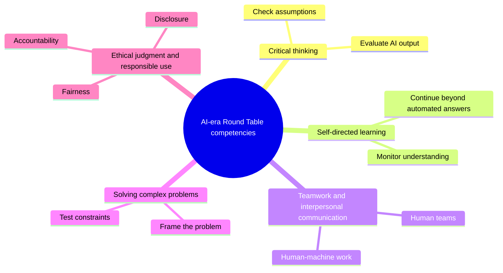

Figure 1. The five Round Table competencies in an AI-rich world.

### Recommendation

The book recommends an AI-era competency architecture rather than only a list. The architecture preserves the competencies developed in the earlier Round Table work, adds ethical judgment and responsible use explicitly, and embeds AI literacy across the whole framework.

The guiding principle should be: keep the human above the machine.

In practice, this means that every STEM learning task involving AI should ask students to provide evidence of:

1. What they asked the AI to do.
2. What they accepted, rejected, or changed.
3. How they checked the output.
4. What they learned independently.
5. What ethical or practical risks they considered.
6. Why the final answer is their responsibility.

This principle should guide curriculum, assessment, professional development, and institutional policy. It should also guide the language of the book. The goal is not anti-AI education. The goal is human-centered AI education.

### Practical Recommendation for Teachers

Teach AI literacy as responsibility, not only as tool use. A student who knows how to prompt AI but cannot verify, question, or own the result has not developed the needed competency.

In practice:

1. Require an AI-use note when students use a tool.
2. Ask students to identify one risk in the AI output: error, bias, missing context, weak source, or ethical concern.
3. Make students explain what remains their own responsibility.
4. Use short classroom routines for verification: source check, calculation check, assumption check, and consequence check.
5. Include ethical judgment in STEM tasks whenever AI affects fairness, privacy, accountability, or safety.

Classroom activity examples:

1. AI use declaration. Students complete an assignment with a short declaration: what AI tool was used, for what purpose, what was checked, and what remained their own work.
2. Bias and fairness check. Give students an AI answer to a STEM or technology scenario and ask them to identify possible bias, missing stakeholders, or fairness concerns.
3. Responsibility card. Before submitting AI-assisted work, each student writes one sentence beginning, "I am responsible for this answer because..." and supports it with one verification step.

Evaluation method:

What is being assessed here is what the student is willing to admit. The student should disclose assistance, distinguish personal thinking from tool output, identify possible ethical or reliability risks, and show how the final work was checked. The grade should reward transparency and judgment, not hidden automation or polished language alone.

For your own development, build a personal AI competency journal. Once a week, test one AI tool on a real teaching task, record what worked, what failed, and what boundary you would set for students. This turns the Meeting 3 principle, keeping the human above the machine, into a teacher habit.

### Sources

[Meeting 3 discussion document](../materials/meeting-3-teacher-in-ai-era-discussion.docx), [Meeting 2 summary, 20.01.2026](../materials/meeting-2-summary.docx), [Steering-team summary, 03.02.2026](../materials/steering-2026-02-03.docx), [OECD Teaching Compass](../materials/oecd-teaching-compass.pdf), [UNESCO AI Competency Framework for Teachers](https://www.unesco.org/en/articles/ai-competency-framework-teachers), [Dr. Shafat STEM material](../materials/meeting-2-gabi-shafat-stem.pdf).

# Part II - The Future Profile of the Teacher and Lecturer

Meeting 2, on 20 January 2026, asked whether the profile of teachers and lecturers should be uniform or diverse. Prof. Bentur set out the sequence of dilemmas that Phase III would follow, Jan Morrison spoke from the school system and Dr. Shafat from higher education. These three chapters take the profile question outward in stages: from the individual educator, to the teaching team, to a whole engineering faculty that rebuilt its curriculum around it.

## Chapter 4 - One Profile or Many?

### The Challenge

Teachers and lecturers are now expected to do many things at once. They must teach content, cultivate competencies, understand AI, design meaningful tasks, support student motivation, assess process and product, work with diverse learners, collaborate with peers, and connect education to society and work.

No single person can be equally strong in all these areas. This creates the central dilemma of Meeting 2: should the future profile of teachers and lecturers be uniform, or should education systems build diversity of profiles within a coordinated ecosystem?

The question goes to the identity of the profession, and no technical answer will settle it. If the system defines one ideal teacher profile, it may create clarity but also overload. If the system accepts many profiles, it may gain realism but lose coherence. If it builds a common foundation with differentiated roles, it may support both equity and excellence, but only if institutions are designed to coordinate those differences.

[Jan Morrison's TIES presentation](../materials/meeting-2-ties-jan-morrison.pptx) framed the issue as a shift from "no alternative" toward a strategic approach to defining the future teacher or lecturer. Her proposal included openness to recruiting individuals from diverse backgrounds, including industry, not as a temporary solution but as part of a systemic strategy. It also included team-based models in which teachers and lecturers with different strengths complement one another rather than all being expected to fit a single mold.

### The Dilemma

Should there be a uniform future profile for all teachers and lecturers, or a diversity of profiles within a coordinated educational ecosystem?

The dilemma contains several smaller questions. Are school teachers and university lecturers similar enough to share one profile? Does the answer change between middle school, upper secondary school, first-year higher education, and advanced university courses? Should all educators be expected to embed the same competencies in the same way? Can individual educators be retrained fast enough, or should systems create complementary teams? How much of the future profile belongs to the individual educator, and how much belongs to the institution?

### Main Positions

The uniform-profile position argues for a common expected profile. Every educator should share a clear foundation. This supports equity, policy, teacher education, and public expectations.

The diverse-profile position argues that educators should bring different strengths. Some may be strong in disciplinary depth, others in project-based learning, AI integration, mentoring, assessment, industry connection, or student support.

The common-foundation-plus-specialization position combines both. Every educator needs a baseline, but not every educator needs the same depth in every competency.

The ecosystem position goes further. It argues that the future profile should not be imagined only as the profile of one person. It should be imagined as the profile of a school, department, program, or learning system. The question becomes: what capabilities must exist around the learner, and how should they be distributed among teachers, lecturers, mentors, AI tools, industry partners, teaching centers, and institutional leaders?

### Pros and Cons

A uniform profile creates clarity. It can help teacher education and professional standards. But it can become unrealistic and may ignore differences between school, higher education, discipline, student age, and institutional mission.

Diverse profiles are more realistic. They allow teams to combine strengths. But diversity without coordination becomes fragmentation.

A common foundation plus specialization is the strongest model. It supports shared expectations and differentiated roles. But it requires institutional design.

The ecosystem model is even stronger when implemented well. It recognizes that STEM education in the AI era requires disciplinary expertise, pedagogy, technology use, assessment design, project design, industry relevance, mentoring, and student support. These capabilities can be distributed. The risk is that distributed responsibility can become no one's responsibility unless governance is clear.

The Round Table discussion suggests that this is the real tradeoff. Uniformity without realism produces overload. Diversity without structure produces incoherence. A coordinated ecosystem can produce both professional dignity and practical capacity.

### Where Each Sector Stands

School teachers work under prescribed curricula and close regulation. University lecturers have more academic freedom, but mostly in later years: large foundational courses in mathematics, physics, and chemistry are nearly as constrained as school teaching, because everything downstream depends on what they cover. The governance gap is sharper in Israel, where schools sit under Ministry of Education supervision and universities are largely autonomous. A shared vocabulary hides all of this, and what can reasonably be asked of an individual educator differs accordingly.

Industry tends to value diverse teams. Complex problems are rarely solved by one ideal worker. This supports an ecosystem view of teaching.

[Jan Morrison's TIES material](../materials/meeting-2-ties-jan-morrison.pptx) adds a systems perspective. Teaching should become a team-driven, cross-sector endeavor. It should connect education to workforce and economic development without reducing education to training. Career-connected learning should be infused with real-world experience and expertise. Emerging technologies such as AI should not remain optional or peripheral to teaching competencies.

[Dr. Gabi Shafat's Afeka material](../materials/meeting-2-gabi-shafat-stem.pdf) gives the higher education version of the same idea. The traditional lecturer model is no longer sufficient because the lecturer is asked to carry too many roles. His proposed principle is a shift from a single-lecturer model to a complementary team-based model with targeted integration of teaching, project-based learning, industry engagement, AI, and faculty development.

### Round Table Voices

Prof. Gil Noam emphasized that the terms teacher and lecturer refer to different professional contexts, and a book about educator profiles must not flatten the difference. Prof. Arnon Bentur complicated it from the other direction, arguing that foundational first-year courses resemble secondary education in their constraints, and describing the shift from academic programs as collections of individual courses toward programs designed backward from a graduate profile. Dr. Eli Eisenberg drew the governance line between the two, pointing to how much more academic freedom a university holds than a school.

Jan Morrison emphasized team-based and system-based teaching. Her contribution supports the idea that the future profile may not be one individual profile but a designed professional ecosystem. She described the need to leave the traditional "yellow brick road" career path and adopt an "interstate road" model with ramps on and off, including industry, nonprofit, post-military, and other entry paths into teaching.

Dr. Marwa Maklada emphasized that educator profiles differ across educational stages and subject areas as much as between schools and universities. Middle school, upper secondary school, STEM subjects, and humanities do not pose identical pedagogical demands.

Dr. Einat Sprinzak added that teachers must experience learning processes themselves in order to mediate them. This supports a differentiated profile because not every educator will enter the transformation from the same starting point.

Avi Salmon's contribution connects the profile question to industry. If employers value deep understanding, curiosity, and meaning-making more than routine AI-replaceable skills, then teachers and lecturers need enough capacity to cultivate these qualities. But this does not imply that every educator must do so in the same way.

### Synthesis

The Round Table points away from a single ideal educator. The better model is a shared baseline combined with diverse strengths, team structures, and institutional coherence.

The shared baseline should include disciplinary responsibility, pedagogical care, ethical judgment, AI awareness, commitment to student agency, and ability to participate in collaborative professional learning. These are not optional.

The differentiated layer should allow educators to specialize. Some may lead deep disciplinary foundations. Some may lead project-based learning. Some may design AI-supported learning. Some may connect with industry. Some may mentor students. Some may develop assessment. Some may coordinate interdisciplinary work.

The institutional layer must make these profiles work together. Without coordination, specialization becomes fragmentation. With coordination, specialization becomes capacity. Figure 2 shows the three levels and how they stack.

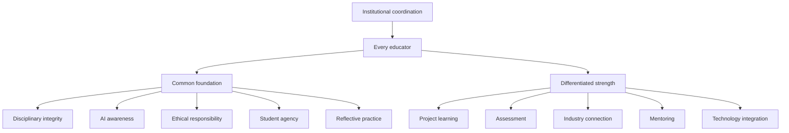

Figure 2. The three-level model: a foundation every educator shares, a strength each educator brings, and the institutional coordination without which the two do not add up.

### Recommendation

Define a common AI-era educator foundation, then design differentiated roles within schools, departments, and programs. The future teacher or lecturer should not be alone. The educator should be part of a coordinated ecosystem.

The recommended model has three levels:

1. A common foundation for all educators: ethical responsibility, disciplinary integrity, AI awareness, student agency, and reflective practice.
2. Differentiated professional strengths: project learning, industry connection, assessment, mentoring, technology integration, foundational teaching, or interdisciplinary design.
3. Institutional coordination: graduate profiles, team teaching, shared planning, professional development, quality indicators, and leadership support.

This model protects equity without demanding an impossible teacher. It treats excellence in AI-era STEM education as a designed professional system rather than a heroic individual trait.

### Practical Recommendation for Teachers

Stop trying to become every kind of future educator alone. Build a personal strength profile and connect it to colleagues with complementary strengths.

In practice:

1. Identify your current strongest contribution: foundations, project work, mentoring, assessment, AI use, industry connection, or interdisciplinary design.
2. Identify one gap that matters for your students this year.
3. Find a colleague, teaching center, or external partner who is stronger in that area.
4. Co-design one activity or assessment together.
5. Make the collaboration visible to students, so they see professional teamwork modeled.

Classroom activity examples:

1. Expert roles project. Students work in teams with differentiated roles such as concept lead, AI checker, evidence lead, ethics lead, and presentation lead. The class discusses why different strengths improved the outcome.
2. Teacher profile reflection. After a learning activity, students identify which teacher role mattered most: content expert, coach, assessor, AI guide, mentor, or industry connector.
3. Complementary teaching moment. Invite a colleague or external expert for one part of a lesson and explicitly show students how different professional profiles complement one another.

Evaluation method:

Ask who did what, and whether the student can say why that division improved the work. In team work, assess both the shared product and each student's role evidence. A successful student understands that expertise can be distributed while responsibility remains clear.

For your own development, create a two-layer growth plan: maintain the common foundation required of every educator, then develop one specialized strength deeply. This reflects the Round Table's balanced answer to the one-profile-or-many dilemma: common responsibility plus differentiated expertise inside a coordinated ecosystem.

### Sources

[Meeting 2 summary, 20.01.2026](../materials/meeting-2-summary.docx), [Meeting 2 presentation](../materials/meeting-2-presentation.pptx), [TIES Jan Morrison presentation](../materials/meeting-2-ties-jan-morrison.pptx), [Dr. Shafat STEM material](../materials/meeting-2-gabi-shafat-stem.pdf).

## Chapter 5 - Teaching as a Team Profession

### The Challenge

Teaching is often organized as individual work. One teacher, one classroom, one course, one syllabus. But the competencies discussed by the Round Table, especially teamwork, creativity, problem solving, communication, industry relevance, and real-world learning, are difficult to cultivate through isolated practice.

This creates a contradiction. Education systems ask students to become collaborative, interdisciplinary, adaptive, and connected to real problems, but they often place teachers in structures that are solitary, fragmented, and disconnected from the world of practice. A teacher may be asked to cultivate teamwork while having little time to work in a team. A lecturer may be asked to connect learning to industry while having no structured connection to industry partners. A school may be asked to develop creativity while preserving schedules, spaces, and assessments designed for individual content delivery.

[Jan Morrison's TIES presentation](../materials/meeting-2-ties-jan-morrison.pptx) made this contradiction explicit. Future STEM teaching, in her framing, requires transdisciplinary instruction that is team-based and connected to real-life problems and issues. It also requires career-connected learning, externships, diverse recruitment, and cross-sector collaboration. Teaching must become a professional system, not a private act performed behind a classroom door.

### The Dilemma

Should teachers remain primarily individual classroom actors, or should teaching become a team-based, cross-sector profession?

Individual teacher expertise matters, and nobody at the Round Table argued otherwise. Students still need teachers and lecturers who know their subjects, care about learning, and can build trust. The question is whether individual expertise is sufficient for AI-era STEM education.

If the future of STEM learning requires transdisciplinary problems, project-based learning, AI use, industry context, teamwork, ethical reasoning, and complex assessment, then the profession must decide whether one teacher should be expected to carry all of that alone.

### Main Positions

The individual model sees teaching as a craft practiced by one educator with one group of students. It values responsibility, continuity, classroom intimacy, and professional autonomy.

The team model sees teaching as shared professional design. Teachers plan together, divide strengths, observe one another, co-assess, and build learning sequences that no one teacher could design alone.

The cross-sector ecosystem model connects educators with industry experts, community partners, university mentors, technology specialists, assessment professionals, and policy structures. The teacher stays. What changes is that the teacher is surrounded by capacity.

### Pros and Cons

The individual model survives because it is easy to schedule and easy to govern: one teacher, one room, one accountable name on the timetable. It overloads that teacher and limits the kinds of learning any single person can support, and neither effect appears in an administrative record.

The team model lets teachers share expertise and shows students the collaborative behavior they are being asked to learn. It requires time, trust, scheduling, leadership, and recognition. Of those five, recognition is the one most often forgotten: a teacher whose advancement still depends on individually observed lessons will not invest in a team.

The ecosystem model connects school and higher education to real practice, and it fails without governance. Partnerships built on goodwill drift toward whatever the external partner finds easy to give, which is usually a talk and a site visit rather than sustained work on a real problem.

Jan Morrison's criticism of failed transdisciplinary instruction is important here. Problem-based and transdisciplinary learning are often criticized when they do not work. But the failure may not be in the pedagogy itself. It may be in the system around it. Without time for faculty collaboration, cross-sector training, and structured teamwork, such approaches are likely to fail and then be dismissed as ineffective.

The Egyptian STEM schools example, as reported in the meeting summary, illustrates the opposite condition. When the educational structure itself is intentionally redesigned to support transdisciplinary teaching, industry and university involvement, and long-term iteration, the approach can become sustainable. The lesson is not that every country should copy one model. The lesson is that team-based STEM learning needs system design.

### Where Each Sector Stands

From the TIES perspective, represented by Jan Morrison, future STEM teaching must be transdisciplinary, team-based, career-connected, and supported by systems. Industry can provide context, real problems, mentors, and externship opportunities.

From a teacher perspective, teamwork cannot simply be demanded. It must be supported by time, structures, and professional norms. Teachers need planning time, shared goals, protocols for collaboration, and recognition for work that happens outside direct classroom instruction.

From a policy perspective, collaboration must be funded and recognized.

From a student perspective, teamwork has to be taught rather than assumed. Medicine is the useful comparison, because team-based practice there is non-negotiable and learning to team is taught deliberately during professional formation. STEM education has no equivalent stage.

From an industry perspective, team-based learning reflects how complex work actually happens. The point is recognition rather than import: isolated individual performance is thin preparation for complex professional life.

From a recruitment perspective, Morrison's "interstate road" model matters. If teaching remains a narrow pathway in which people enter once and remain until burnout, the profession loses potential talent. A more flexible system can include industry workers, post-military professionals, nonprofit experts, and others who bring complementary strengths into education.

### Round Table Voices

Jan Morrison described teaching as a profession that should connect to industry and be treated with a status beyond a calling or service role. She emphasized externships, flexible teacher pathways, systemic redesign, and international learning.

Dr. Revital Duek raised teamwork as a foundational competency and asked how it could be established first in teacher development and then in student learning. If students must learn teamwork, teachers must experience and model it. Dr. Avigdor Zonnenshain put the same case from the industry side, arguing that education should reflect industry realities, and that in engineering teamwork is not one competency among many but the condition of the work.

Danielle Eisenberg's question to Jan Morrison about whether change was happening only in innovative pockets or also in large traditional systems sharpened the implementation issue. Morrison's answer, pointing to system-level developments in districts such as Chicago and Anaheim and higher-education structures such as UTeach, suggested that team-based redesign is not only a boutique innovation. It can enter mainstream systems when trust, measurement, and political conditions support it.

Prof. Sigal Tifferet raised criticism of transdisciplinary instruction, especially the concern that problem-based learning may reduce explicit instruction. This is a serious point. Team-based and transdisciplinary approaches should not become excuses for weak teaching. They must protect disciplinary clarity while expanding the context of learning.

Jan Morrison's response was that criticism often reflects poor implementation in systems not designed for the pedagogy. That distinction is real, and a good idea can fail when inserted into the wrong structure. It does not dispose of the whole objection. Tifferet's point also has an evidence dimension that implementation quality does not answer: for students who do not yet know a domain, explicit instruction with worked examples generally outperforms minimally guided inquiry, and no amount of good implementation changes that. Chapter 24 states the objection at full strength. The position this book holds is the narrower one, that project and team-based work needs explicit instruction inside it rather than instead of it.

### Synthesis

Teamwork is both an educational goal and a professional condition for achieving that goal. Students cannot learn modern STEM teamwork from systems that isolate teachers.

A team profession has at least four dimensions:

1. Team teaching: educators plan, teach, observe, and assess together.
2. Cross-disciplinary design: STEM problems are built across subject boundaries where appropriate.
3. Cross-sector partnership: industry, universities, communities, and mentors contribute authentic contexts.
4. Professional mobility: people can enter, leave, and re-enter teaching through flexible pathways without weakening standards.

This model also protects teachers. When the individual teacher is expected to be content expert, AI expert, project designer, mentor, assessor, social worker, industry connector, and innovation leader, burnout is predictable. Team structures distribute load and expertise.

### Recommendation

Treat teaching as a team profession. Build time, shared planning, joint assessment, cross-disciplinary projects, and partnerships into the structure of schools and higher education.

A serious implementation model should include:

1. Scheduled collaboration time for educators.
2. Team-based project design and assessment.
3. Teacher externships or structured contact with industry.
4. Flexible professional pathways that bring diverse expertise into teaching.
5. Cross-sector advisory groups that meet regularly, not only at conferences.
6. Measurement used for improvement and iteration, not only accountability.
7. Explicit teaching of teamwork to students, beginning before advanced STEM specialization.

The recommendation is to stop leaving the individual teacher alone with a system-level task.

### Practical Recommendation for Teachers

Practice team teaching even before the institution formally redesigns around teams. Start small, but make the collaboration real.

In practice:

1. Select one complex topic that benefits from more than one perspective.
2. Invite a colleague, industry professional, advanced student, or community partner to help shape the task.
3. Ask students to work in teams with explicit roles, not only informal groups.
4. Assess both the product and the collaboration process.
5. Hold a short team debrief: what did each person contribute, where did coordination fail, and what should improve next time?

Classroom activity examples:

1. Cross-discipline design sprint. Pair two subjects, such as physics and design or biology and ethics. Students solve one problem that requires both perspectives and present how the disciplines changed each other.
2. Teamwork rubric lab. Students complete a short team task, then use a rubric to evaluate roles, communication, conflict, and contribution before discussing the technical result.
3. Industry-style standup. During a project week, students hold brief team standups: what was done, what is blocked, what help is needed, and what will be tested next.

Evaluation method:

Mark the team and the person in it separately. Evidence should include role clarity, contribution records, response to feedback, and the team's ability to combine disciplinary perspectives. Individual assessment should include what each student added to the collective result.

For your own development, experience professional teamwork yourself. Join or create a small educator design group that meets regularly to build, test, and improve learning tasks. [Jan Morrison's TIES argument](../materials/meeting-2-ties-jan-morrison.pptx) is the reason to insist on the team version rather than the individual one: career-connected, transdisciplinary learning requires a system shift, not isolated heroic teachers.

### Sources

[Meeting 2 summary, 20.01.2026](../materials/meeting-2-summary.docx), [TIES Jan Morrison presentation](../materials/meeting-2-ties-jan-morrison.pptx), [Meeting 2 presentation](../materials/meeting-2-presentation.pptx).

## Chapter 6 - The Engineering Education Case

### The Challenge

Engineering education is a powerful test case for the Round Table's ideas. It requires rigorous foundations, but it also promises graduates who can design, solve, collaborate, innovate, and work with real systems. Traditional course structures do not always deliver that combination.

Dr. Gabi Shafat's presentation, "The Challenge in Engineering Higher Education," made this case concrete. Afeka Academic College of Engineering works with graduate profiles, educational models, and the Afeka learning experience across undergraduate and graduate programs. The challenge he presented was not a rejection of engineering rigor. It was a warning that the traditional lecturer model is no longer sufficient for the changing engineering landscape.

The pressure comes from several directions at once. Engineering knowledge is expanding. AI tools can explain, compute, summarize, and write code. Students expect more personalized learning. Industry expects graduates who can work in teams and solve real problems. Faculty workload is increasing. Traditional courses in mathematics, physics, and engineering foundations often remain poorly aligned with applied engineering practice. The result is role overload for engineering faculty and a gap between what engineering programs promise and what course structures can deliver.

### The Dilemma

Should engineering programs mainly transmit disciplinary foundations, or redesign around graduate profiles and competency-based learning?

The dilemma is especially sharp in engineering because foundations are not optional. Mathematics, physics, signal processing, circuits, programming, and systems thinking are necessary. A weak foundation damages later learning.

At the same time, engineering graduates are not hired only to reproduce foundations. They are expected to design under constraints, evaluate tradeoffs, work with uncertainty, collaborate, communicate, use tools responsibly, and continue learning. AI raises the pressure further because some routine technical tasks can now be performed quickly by tools that may also be confidently wrong.

Asking whether to teach foundations or projects is the wrong question. The real one is how to connect foundations, projects, AI, assessment, industry, and graduate profiles into one coherent educational design.

### Main Positions

The traditional-sequence position protects mathematics, physics, and engineering fundamentals. The graduate-profile position starts from the desired graduate and works backward. The hybrid position protects foundations while connecting them earlier to practice, projects, AI, and industry.

The Afeka model, as presented in the meeting, belongs to the hybrid and graduate-profile family. It shifts the frame from "teaching engineering" to "engineering education." This shift matters. Teaching engineering can mean delivering the content of separate courses. Engineering education asks what kind of graduate the program is producing and how every course contributes to that profile.

The AI position inside this model is also balanced. AI is neither rejected nor worshipped. Dr. Shafat described AI almost as a "perfect lecturer" in certain narrow ways: available at all hours, patient, fast, and confident. But the same list exposes the problem. AI can be very confident when wrong. It is not responsible when things break in production. It does not provide human interaction. Therefore, engineering education must teach students to use AI while recognizing its strengths and limitations.

### Pros and Cons

The traditional sequence is clear, rigorous, and easy to defend at an accreditation review. Its cost falls on students, who spend the early years on foundations before meeting the practice those foundations serve, and are left to make the connection between the two on their own.

The graduate-profile approach creates coherence, and it asks faculty to accept that their course exists to serve a program rather than a discipline. That is the harder sell. Assessment redesign follows from it, and is usually where the effort stops.

The hybrid approach is the most practical of the three. It keeps the fundamentals and asks every stage of learning to earn its place by connecting to purpose, a demand that traditional sequences never make of their own early courses.

The Afeka example shows the cost of doing this seriously. It requires adaptive and dynamic course design, lecturer availability, pre-assessment, student preparation, active tasks, formative feedback, industry visits, and careful assessment of learning outcomes. It is not a matter of adding one AI assignment to a traditional course.

There are also limits. Dr. Shafat noted that AI-supported approaches do not work effectively in very large groups without investment. Post-hoc grading alone has little educational impact. Take-home assignments lose value when students can rely heavily on AI-generated solutions. Team-based projects raise fairness questions about individual contribution. These are not reasons to abandon redesign. They are reasons to treat redesign as serious professional work.

### Where Each Sector Stands

Students need motivation and connection. In the Advanced Digital Signal Processing course described in the presentation, drivers of change included teamwork, flipped classroom, personalized learning, students teaching, AI as a tool to improve learning processes, and project-based or problem-based learning. Each lecture began with a problem to solve. Students prepared presentations. Pre-class preparation included videos or instructional content. Discussion was used to bridge knowledge gaps.

Faculty need professional support and evidence. Dr. Shafat's presentation described immediate formative feedback through Delta-Plus, assessment of learning outcomes, continuous improvement, and cross-departmental discussions about the strengths and limitations of AI tools and advanced teaching methods.

Industry needs graduates who can reason, collaborate, and judge. Industry site visits and guest experts were part of the course design, not external decoration. This connects engineering learning to professional practice.

Institutions need program-level design. Programs have traditionally been collections of individual courses, and the new direction defines a graduate profile first and works backward from it. Afeka's mapping of competencies across courses is the concrete example.

Policy makers need to understand that innovation requires investment. Dr. Shafat's policy message was that education requires more investment, not less. If institutions want project-based learning, AI integration, feedback, industry links, and meaningful assessment, they must fund the conditions that make them possible.

### Round Table Voices

Dr. Shafat put numbers and mechanisms behind the shift described above: graduate profiles, skill mapping across courses, AI integration, formative feedback, industry visits, flipped classrooms, and project-based learning, all running in the same program at the same time.

Avi Salmon emphasized that deep understanding and genuine engagement with the profession matter more as routine technical work becomes automated.

Prof. Arnon Bentur pointed to the importance of defining the graduate profile and designing backward.

Dr. Avigdor Zonnenshain asked what Afeka was doing to demonstrate that any of it worked, which is the question innovation is least often asked. Dr. Shafat answered that rapid change means there are no definitive answers yet, and that Afeka runs continuous cycles of feedback and evaluation through cross-departmental discussion. He named the practical lessons too: take-home assignments have to be reconsidered when AI can produce the solution, in-class assessment matters more than it did, large classes constrain what can be attempted, and foundational subjects need stronger applied integration.

Avi Salmon later sharpened the faculty-development issue: the real question is how to get professors involved. The challenge runs past curriculum content to enabling teachers and lecturers to personally experience new pedagogical and technological realities.

### Synthesis

Engineering education shows that skills cannot be added only at the edges. They must be designed into courses, projects, assessment, and institutional culture.

The Afeka case suggests a concrete model:

1. Start from the graduate profile.
2. Map knowledge and competencies across courses.
3. Redesign courses around problems, preparation, feedback, and active learning.
4. Use AI as a learning tool, but deliberately expose its limits.
5. Connect learning to industry and professional practice.
6. Assess process, products, contribution, and understanding.
7. Support faculty through team models and institutional investment.

This is not a softening of engineering education. It is a more demanding form of rigor. It asks whether students can use foundations in conditions closer to the work they will actually do. Figure 3 traces the design working backward from the graduate profile.

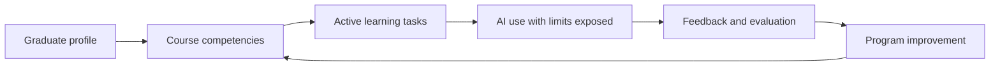

Figure 3. Engineering education as backward design from the graduate profile.

### Recommendation

Use engineering education as a model for program-level redesign. Define the graduate profile, map competencies across the curriculum, connect foundations to practice, and use AI in ways that expose rather than hide student thinking.

Engineering programs should review every major course through five questions:

1. Which part of the graduate profile does this course develop?
2. Which competencies are practiced, not merely named?
3. How does the course make student thinking visible?
4. How does the course teach students to evaluate AI outputs and tool limits?
5. What evidence shows that students can transfer knowledge into real engineering judgment?

The deeper recommendation is structural. Higher education should move from the heroic individual lecturer model toward a complementary team-based model. Teaching, project-based learning, industry engagement, AI integration, assessment, and faculty development should be realigned so that the program, not only the lecturer, carries the responsibility for graduate readiness.

### Practical Recommendation for Teachers

Use the engineering education case as a model even outside engineering: begin with the desired graduate or learner profile, then work backward to the lesson.

In practice:

1. Write one sentence describing what a successful learner should be able to do with the knowledge.
2. Design a task that requires application, not only recall.
3. Include a moment where students must evaluate an AI output or technical tool.
4. Add a real or realistic constraint, such as cost, safety, user need, data quality, or tradeoff.
5. Collect evidence from process, product, explanation, and reflection.

Classroom activity examples:

1. Constraint-based design task. Students design a solution under real constraints such as budget, safety, time, user need, or data quality, then explain the tradeoffs.
2. AI tool stress test. Students use AI on an engineering or STEM problem, compare its output to disciplinary principles, and document where the tool was useful or unreliable.
3. Graduate profile presentation. Students present a project by explaining which future professional capabilities it developed, not only what technical result they produced.

Evaluation method:

Justification carries as much weight here as the design. The student should show technical correctness, awareness of constraints, explanation of tradeoffs, and ability to connect the work to future professional capabilities. Strong work includes iteration, not only a final product.

For your own development, redesign one course artifact using the Afeka logic: graduate profile, course skills, active learning, AI as a learning tool, feedback, and evaluation. The aim is to adopt engineering education's discipline of connecting foundations to practice and evidence, without copying its structures.

### Sources

[Meeting 2 summary, 20.01.2026](../materials/meeting-2-summary.docx), [Dr. Shafat STEM material](../materials/meeting-2-gabi-shafat-stem.pdf), [Meeting 2 presentation](../materials/meeting-2-presentation.pptx).

# Part III - Must Teachers Possess the Skills They Teach?

Meeting 3, on 10 March 2026, asked whether educators must themselves possess the competencies they are expected to cultivate. It is the sharpest question in the book. Answer yes and the demand on an already stretched workforce becomes very large; answer no and the obvious reply is that nobody can teach what they have never done.

Two presentations opened it. Prof. Sigal Tifferet of Ruppin Academic Center reviewed what the research actually shows about training teachers to teach skills, and Dr. Olena Bekh of the European Training Foundation presented the ETF reference model for educators in the twenty-first century. The discussion that followed did not settle the dilemma, and it moved it somewhere more useful. The argument shifted off whether teachers must possess the competencies and onto how concrete the thing they possess has to be.

## Chapter 7 - Possessing Versus Cultivating Competencies

### The Challenge

Teachers are expected to cultivate competencies in students. But must they personally possess those competencies first? Can a teacher teach creativity without being creative? Can a lecturer cultivate teamwork without working in teams? Can an educator teach ethical AI use without deep AI experience?

The [Meeting 3 discussion document](../materials/meeting-3-teacher-in-ai-era-discussion.docx) framed this not as a binary question but as a continuum. Its purpose was to lay out the competencies, tensions, and arguments on each side as a basis for informed discussion, with the issue left open.

The challenge is especially difficult because competencies are not like isolated facts. A teacher can teach a fact from a textbook with limited personal experience. But competencies such as judgment, collaboration, curiosity, ethical responsibility, and AI literacy are partly visible through practice. Students notice how educators think, respond, question, collaborate, and handle uncertainty.

At the same time, expecting every educator to be a full practitioner of every competency is unrealistic. It risks turning the future teacher profile into an impossible demand. The real question is not whether teachers must possess everything perfectly. The question is what level of lived understanding is necessary for credible cultivation.

### The Dilemma

Should lecturers and teachers themselves possess the required competencies, or should their primary expertise lie in cultivating these competencies in students?

The Meeting 3 document translated this dilemma into precise subquestions:

1. What counts as sufficient mastery?
2. Can pedagogical expertise substitute for personal practice?
3. Do all competencies require the same depth of teacher experience?
4. How should limited professional development time be allocated?
5. What is the role of teacher vulnerability and not-knowing?
6. How can enough competency be assessed?
7. Does the answer change across age, discipline, institution, culture, or resource level?

These questions prevent an easy answer. The teacher's role differs by context. A primary school teacher building foundational literacy, a high school physics teacher, a university lecturer in signal processing, and an engineering project mentor do not need identical competency profiles. But all need enough understanding to protect student learning and responsibility.

### Main Positions

The possession position argues that teachers need lived experience. Students learn not only from instruction but from modeling.

The cultivation position argues that teachers do not need to be expert practitioners of every competency. Their professional expertise is pedagogy.

The balanced position argues that teachers need enough lived experience to model, recognize, and judge the competency, but they do not need identical mastery in all domains.

The distributed-expertise position adds that some competencies can be held more deeply by specific members of a professional team. One educator may be strong in AI-supported learning, another in project design, another in assessment, another in industry connection, and another in student mentoring. The system must ensure that the full set of capabilities is available to learners.

The developmental position argues that teacher competency should be seen as growth, not as a static qualification. Educators can develop their own competencies while learning how to cultivate them in students.

### Pros and Cons

Possession gives credibility. A teacher who has genuinely worked through an open-ended problem can model what that looks like, and students can tell the difference. The risk is a standard nobody meets. If every teacher must personally possess every competency, the profession becomes impossible to enter.

Cultivation focuses on pedagogy and accepts that students routinely grow past their teachers, which is true and is much of the point of teaching. The risk is instruction with nothing behind it. A teacher who has never sustained a difficult inquiry can assign one, mark it, and never notice that the class never actually did it.

The balanced approach is the workable one, and it survives only if someone defines the levels. Chapter 9 attempts that definition and is candid about falling short of it.

Distributed expertise reduces overload and matches how real professional work is organized. Its risk is that a shared responsibility becomes an unassigned one. When four people hold a competency between them and none of them owns it, it is taught by nobody while everyone reports that it is covered.

Developmental expectations support growth across a career rather than demanding everything at entry. They become decorative unless institutions state what evidence of progress looks like, and most do not.

The professional-development tradeoff is real. Training time and resources are limited. If all time is spent building teachers' own competencies, pedagogy may suffer. If all time is spent on how to teach competencies, teachers may lack the lived experience to model them credibly. A strong system must do both, but not all at once and not at the same depth for every role.

### Where Each Sector Stands

Teachers need expectations they can meet. If the profile becomes too idealized, teachers may experience it as accusation rather than professional direction.

Students need credible guidance. They must see adults who can ask good questions, use AI critically, collaborate, admit uncertainty, and take responsibility.

Teacher educators need priorities. They must decide what belongs in initial preparation, what belongs in induction, and what belongs in continuing professional development.

Policy makers need standards that support growth instead of creating impossible demands. Standards should define baseline competence, development pathways, and support structures.

Institutions need role design. If some competencies require deep specialization, then schools and departments should not pretend that every educator will hold the same level of expertise.

Industry and society need trust. If graduates are expected to work responsibly with powerful tools, the educators who prepare them must be able to recognize responsible and irresponsible use.

### Round Table Voices

Prof. Sigal Tifferet opened Meeting 3 with the research position, and it is less encouraging than the field usually admits. Meta-analyses of teacher training show effects that are statistically significant and small, in the range of 0.05 to 0.09. Her reading was not that training fails but that it compounds, and that nobody should expect a workshop to transform practice. She proposed extending the familiar TPACK model, which crosses technology, pedagogy, and content knowledge, into what she called TSPAC by adding a skills axis and taking every intersection seriously.

Her practical conclusion was the sharpest claim made at the meeting. Skills run from the general, such as creativity, to the specific, such as brainstorming used as a tool for fluency. For beginning teachers, and for university lecturers with no pedagogical training, teaching the specific tool works where teaching the abstract skill does not. A concrete tool is learnable, usable the following week, and produces a sense of success. Abstraction can wait for the experienced.

Dr. Olena Bekh of the European Training Foundation presented the ETF reference model, which identifies six domains for the modern educator: learner-driven practice, adaptability, sustainability and inclusion, collaboration and engagement, lifelong learning and reflection, and digital technologies. Her answer to the dilemma was to refuse it in its binary form. Teachers are not superhuman, and deep understanding and practical experience are not alternatives but requirements that vary by role and context. What she would not concede was the possibility of teaching a competency one does not model. Her phrase for it was teach as we preach.

Prof. Russell Tytler agreed that skills should be taught concretely and would not let the matter rest there. Competencies such as creativity and problem solving are context-dependent and do not decompose into fixed components, which makes the translation into practice different in every discipline. For experienced teachers he argued that training must begin with pedagogical content knowledge, because anything else produces surface learning.

Prof. Tifferet conceded the structure of the objection without conceding the practical point. Skills probably contain both general and context-dependent components, much as intelligence does. Some of it transfers and some does not, and the question is empirical and still open.

Dr. Yael Granot-Bein moved the discussion off pre-service training, where it is comfortable, and onto veteran educators, where it is not. Many experienced teachers are willing to change and were never trained to teach skills, and they cannot begin from scratch. She also rejected the framing of skills instruction as a burden added to teaching. Done properly it improves teaching instead of slowing it, though it requires a shift away from frontal delivery, and it cannot be left to individual teachers to lead.

Avi Salmon argued for practical tools as the entry point to deeper competencies, on an analogy from industry. Change comes through hands-on experience, not through theory. Teachers have to experience learning as students, using the new tools themselves, before they can carry the method into their own classrooms.

Dr. Edith Manny-Ikan gave the meeting its dissent, and it was the most useful contribution in the room. Teachers feel overwhelmed by the expectation to teach extensive content and new competencies at once. Under time pressure and assessment demands they choose content, and many lack the clarity and the capacity to implement competency-based approaches at all. Her warning was about the distance between policy conversation and classroom reality, and about the habit of designing reform around the already motivated.

Dr. Revital Duek answered from a pilot run at Tel Aviv University with Yale and the Edmond de Rothschild Bridge, where lecturers raised the same concerns and, by the end of the year, reported that the experience had been easier than they expected. Integrating the approach into syllabus planning, she argued, need not increase workload and can improve student engagement with the content.

Dr. Marwa Maklada described the national Interface Skills in STEM Education program, which at Meeting 3 she put at three years old and involving hundreds of teachers, expanding gradually and driven by motivated lighthouse teachers. Chapter 16 reports the same program from Meeting 5, three months later, counted in schools rather than teachers and dated at four years; the book gives both figures as its sources give them and no source reconciles them. Its results rest on continuous support during implementation and on internal system capacity rather than bought-in solutions. Her list of what remains hard is worth keeping: variability across disciplines, shallow capacity among teacher educators, and school leadership that is difficult to engage.

Emlen Metz warned at Meeting 6 against students delegating thinking and responsibility to machines, which implies that teachers must be able to guide responsible use.

Avi Salmon argued in Meeting 2 that teachers and lecturers must remain above AI. In this chapter, that claim becomes a competency requirement. The educator does not need to know more than every AI system. The educator does need enough judgment to keep the human process of learning, responsibility, and meaning above the machine.

Dr. Einat Sprinzak's Meeting 2 contribution also belongs here. Teachers who mediate skills and competencies should first experience these learning processes themselves as learners. What they need is firsthand understanding of the student journey, which is a lower bar than being a perfect model of it.

[Dr. Gabi Shafat's Afeka material](../materials/meeting-2-gabi-shafat-stem.pdf) shows one way to make this practical: educators and students can use AI tools on challenging problems where the tools fail or show bias, then discuss the limits and produce a better solution. The teacher's role is to design and guide the learning process responsibly, which demands far less AI expertise than teachers tend to assume.

### Synthesis

Teachers do not need to be perfect examples of every competency. But they do need enough lived understanding to model learning, ask good questions, recognize quality, and guide students responsibly.

The Round Table materials support a levels model:

1. Awareness: every educator understands the competency and why it matters.
2. Personal practice: every educator has some lived experience using the competency.
3. Pedagogical design: educators can design learning situations that cultivate the competency.
4. Assessment judgment: educators can recognize evidence of student growth.
5. Specialist leadership: some educators develop deeper expertise and support colleagues.

This levels model avoids two mistakes. It avoids saying that teachers can teach competencies they have never practiced. It also avoids saying that every teacher must master every competency equally.

### Recommendation

Define competency expectations in levels. All educators need baseline awareness and responsible practice. Some need deeper competence because of their discipline or role. Specialist expertise should be distributed across teams and institutions.

Professional development should be designed in two linked tracks:

1. Educator experience: teachers and lecturers personally practice AI use, critical questioning, teamwork, reflection, and ethical judgment.
2. Pedagogical translation: educators learn how to design tasks, feedback, assessment, and classroom routines that cultivate these competencies in students.

The recommendation is balanced: teachers must possess enough to model and judge, but they do not need to carry the whole future alone.

### Practical Recommendation for Teachers

Build enough personal practice to model and judge the competency you want students to develop. Do not teach a competency only as vocabulary.

In practice:

1. Choose one competency you expect from students.
2. Practice it yourself in a real professional context.
3. Show students one example of your process, including difficulty or revision.
4. Design a student task where the competency is necessary, not decorative.
5. Use a simple rubric that separates awareness, responsible use, teaching translation, assessment judgment, and specialist leadership.

Classroom activity examples:

1. Teacher modeling session. The teacher demonstrates a real thinking process, including a mistake, revision, or uncertainty, then students identify the competency being modeled.
2. Competency transfer task. Students use one competency, such as critical questioning, in two different contexts and compare what changed.
3. Enough mastery discussion. Students examine a scenario where a teacher or expert guides a competency without being the top specialist, then discuss what level of mastery is enough to guide others responsibly.

Evaluation method:

One demonstration is an accident. Look for the same competency in a second setting. A student succeeds when they can name the competency, apply it, explain how it helped the work, and recognize what level of guidance or expertise was needed.

For your own development, choose one competency per semester for deliberate growth. For example, if the focus is ethical AI use, use AI yourself, test its limits, read one relevant framework, design one classroom routine, and discuss results with colleagues. Meeting 3 produced no threshold, and it did point somewhere practical: begin with a concrete tool you can use yourself, not with the abstract competency it belongs to. A teacher needs enough lived practice to model a competency and to judge it, and specialist depth can be distributed across a team.

### Sources

[Meeting 3 summary, 10.03.2026](../materials/meeting-3-summary.docx), [Prof. Tifferet, How to train teachers to impart skills](../materials/meeting-3-sigal-tifferet-skills.pptx), [Dr. Bekh, Educators at the Times of New Learning](../materials/meeting-3-olena-bekh.pdf), [Meeting 3 discussion document](../materials/meeting-3-teacher-in-ai-era-discussion.docx), [Meeting 2 presentation](../materials/meeting-2-presentation.pptx), [Dr. Shafat STEM material](../materials/meeting-2-gabi-shafat-stem.pdf).

## Chapter 8 - Teacher Vulnerability, Authority, and Not-Knowing

### The Challenge

AI destabilizes traditional authority. A student may use a tool the teacher has not yet mastered. A system may generate an answer faster than the teacher can. Knowledge changes quickly. The teacher can no longer rely only on being the person who knows.

The [Meeting 4 discussion document](../materials/meeting-4-discussion-document.docx) described the classical educational relationship as a teacher who knows and a student who learns. The teacher decides what to present, how to present it, when the student is ready, and whether understanding has been achieved. AI challenges this model because it can explain, tutor, quiz, adapt, and respond continuously. The teacher remains, and AI now occupies the space between teacher and student.

This creates a new professional pressure. If a student can get an instant answer, the teacher's authority cannot rest only on speed, access, or factual possession. The teacher's authority must rest on judgment, context, trust, care, interpretation, and the ability to guide inquiry.

### The Dilemma

Should teachers preserve confident authority, or model uncertainty, inquiry, and learning in real time?

The Meeting 3 document named the question directly: what is the role of teacher vulnerability and not-knowing? Should teachers model uncertainty and learning in real time, or do students need confident authority?

This is not a soft psychological issue. It is a core pedagogical question. Too much certainty can become false confidence. Too much vulnerability can become loss of structure. The AI era requires a new balance: professional authority that is confident enough to lead and humble enough to investigate.

### Main Positions

One position says students need confident authority. Without it, classrooms lose structure.

Another position says students need to see how experts learn, revise, verify, and admit uncertainty.

A third position is guided authority. Teachers remain responsible leaders, but they model inquiry and judgment openly.

A fourth position, grounded in cognitive apprenticeship, says that expert thinking should be made visible. Students learn more from seeing how an expert frames a problem, tests a claim, notices uncertainty, checks evidence, and revises a conclusion than from any final answer.

### Pros and Cons

Traditional authority gives clarity and trust, and it is brittle. Authority that rests on always knowing has to survive the first student who checks an answer against a tool during the lesson, and in an AI-rich classroom that happens every week.

Vulnerability models lifelong learning, and it confuses students when it is left unframed. A teacher who is uncertain in public without showing what uncertainty leads to has taught the doubt and withheld the method.

Guided authority is the strongest of the three. The teacher demonstrates how responsible learners handle what they do not know, and the demonstration is itself the lesson.

Cognitive apprenticeship adds a practical method. The teacher can model thinking aloud, coach students through uncertainty, scaffold the task, and gradually transfer responsibility. In an AI-rich classroom, this may mean comparing an AI explanation with a textbook, asking students to identify unsupported claims, showing how to verify a result, or explaining why a fluent answer is still not trustworthy.

The danger is performance vulnerability. A teacher saying "I do not know" without showing the next professional move may weaken trust. A teacher saying "I do not know yet, so here is how we will find out" strengthens trust.

### Where Each Sector Stands

Younger students may need stronger structure. Older students can benefit from explicit modeling of uncertainty. In AI-rich classrooms, all students need to see how claims are checked, compared, and judged.

From a teacher perspective, authority becomes interpretive rather than merely declarative. The teacher does not only state what is correct. The teacher helps students understand why, under what conditions, with what evidence, and with what limits.

From a student perspective, visible teacher inquiry can build self-efficacy. Students learn that not knowing is not failure if it leads to disciplined investigation.

From a policy perspective, teacher vulnerability must not be confused with lowered standards. Professional learning systems should help teachers develop confidence in uncertainty, not abandon expertise.

From the [OECD Teaching Compass](../materials/oecd-teaching-compass.pdf) perspective, teachers need agency to navigate complexity and uncertainty. The Compass describes teachers as agents of change who adapt, innovate, and act with professional judgment. That is exactly the authority needed here.

From the AI design perspective, the Meeting 4 and Danielle Eisenberg materials point to the teacher as the interpretive layer. AI can propose, surface evidence, or generate signals. The teacher who knows the student and the context decides, which is why every subsequent chapter treats the placement of that decision as a design choice rather than a courtesy.

### Round Table Voices

Dr. Olena Bekh answered this question directly at Meeting 3, and her answer is stronger than it first sounds. Teacher vulnerability, by which she meant the recognition of what one does not yet know, is what drives professional growth. She placed it beside teacher autonomy and agency as a condition of continuous development rather than a risk to be managed. That makes not-knowing part of professional competence rather than a gap in it, which is the opposite of how most evaluation systems treat it.

Avi Salmon argued that teachers and lecturers must remain above AI. That is a claim about leading the human process of judgment, and says nothing about knowing more facts than every tool. Emlen Metz set the same boundary from the student's side: decision-making and responsibility cannot be delegated to machines, whoever is holding the tool.

The [Meeting 4 discussion document](../materials/meeting-4-discussion-document.docx) asked whether AI enhances or undermines teacher authority. It suggested that the teacher's role may evolve from knowledge authority toward a guide who teaches judgment, context, and critical evaluation of AI-generated content.

Danielle Eisenberg's presentation compressed it into a design formulation: AI proposes, teachers decide.

The [OECD Teaching Compass](../materials/oecd-teaching-compass.pdf) reinforces this stance through teacher agency, professional identity, ethical values, and the capacity to act under uncertainty.

### Synthesis

Authority in the AI era shifts from having all answers to leading the process of responsible inquiry.

Professional authority now has four parts:

1. Knowledge authority: the educator understands the field and its standards.
2. Process authority: the educator knows how to investigate and verify.
3. Ethical authority: the educator keeps responsibility human.
4. Relational authority: the educator knows the student, the context, and the learning process.

AI can challenge the first if authority is understood narrowly as information possession. It cannot replace the other three. That is where the teacher's future authority becomes stronger, not weaker.

### Recommendation

Adopt transparent professional authority. Teachers should be able to say, "I do not know yet," while showing students how to investigate, evaluate, decide, and take responsibility.

In practice, this means teachers should model professional inquiry in front of students:

1. State what is known.
2. Name what is uncertain.
3. Check sources and assumptions.
4. Compare human reasoning with AI output.
5. Decide what can be trusted.
6. Explain why the final judgment remains human.

The teacher above AI is not the teacher who always knows first. It is the teacher who knows how responsible knowing is done.

### Practical Recommendation for Teachers

Model disciplined not-knowing. Do not hide uncertainty, and do not perform uncertainty without structure. Show students the professional moves that follow uncertainty.

In practice:

1. When a question is uncertain, name what is known and what is not yet known.
2. Ask students to propose how the class should verify the issue.
3. Compare at least two sources or explanations, including AI when relevant.
4. Explain why one answer is more trustworthy than another.
5. End with a clear human judgment and the evidence behind it.

Classroom activity examples:

1. I do not know yet protocol. When a difficult question arises, the class records what is known, what is uncertain, how to investigate, and what evidence would settle the issue.
2. Competing explanations. Students compare a textbook explanation, an AI explanation, and a peer explanation, then decide which is strongest and why.
3. Trust ladder. Students rank sources or answers from least to most trustworthy and explain what evidence would move each answer up or down.

Evaluation method:

Watch what the student does when they do not know. The student should be able to say what is known, what is unknown, what evidence is needed, and why one explanation is stronger than another. Reward careful reasoning even when the answer is not immediate.

For your own development, rehearse transparent authority. Before class, identify one place in the lesson where uncertainty, competing explanations, or AI output could be examined openly. This develops the authority described in the Round Table: authority grounded in judgment, process, ethics, and relationship rather than in having answers.

### Sources

[Meeting 3 summary, 10.03.2026](../materials/meeting-3-summary.docx), [Dr. Bekh, Educators at the Times of New Learning](../materials/meeting-3-olena-bekh.pdf), [Meeting 3 discussion document](../materials/meeting-3-teacher-in-ai-era-discussion.docx), [Meeting 2 presentation](../materials/meeting-2-presentation.pptx), [Meeting 4 discussion document](../materials/meeting-4-discussion-document.docx), [OECD Teaching Compass](../materials/oecd-teaching-compass.pdf).

## Chapter 9 - Assessing Enough Competency

### The Challenge

If teachers are expected to possess or cultivate competencies, systems need ways to judge readiness. But competencies such as ethical judgment, critical thinking, teamwork, reflection, AI literacy, and professional judgment cannot be reduced to simple checklists.

The assessment challenge appears at three levels at once. First, students must be assessed for competencies, not only final answers. Second, teachers and lecturers must be assessed or supported in their ability to cultivate those competencies. Third, institutions and programs must be evaluated to see whether their reforms actually work.

The Round Table materials repeatedly warn against confusing measurement with learning. Assessment must make practice visible. It must support improvement. It must be credible enough for policy and institutions, but humane enough not to punish educators for engaging in complex change.

### The Dilemma

Can these competencies be assessed meaningfully for teachers and lecturers?

The Meeting 3 document asked: if possession matters, what does evaluation look like for something personal and contextual? This question is sharper than it first appears. A teacher's ethical judgment, AI literacy, ability to model uncertainty, or capacity to cultivate teamwork cannot be captured by a single written test.

At the same time, avoiding assessment entirely is not acceptable. If systems cannot tell whether teachers, courses, or programs are developing competencies, reforms remain aspirational. The dilemma is how to assess deeply without reducing complex professional practice to shallow indicators.

### Main Positions

The standards position says that systems need explicit expectations. Teachers and lecturers should know what is required. Institutions and policy makers need benchmarks.

The portfolio position says that competencies require evidence over time: lesson designs, student artifacts, reflections, feedback cycles, AI-use policies, assessment rubrics, peer observations, and examples of changed practice.

The peer-review position says that professional judgment should be evaluated by professionals, not only by external metrics. Colleagues can observe teaching, review course design, and discuss evidence.

The program-evaluation position, raised strongly by Avi Salmon, says that reforms themselves should be evaluated professionally and with data. A program should not be declared successful because it sounds modern.

The support-first position says that the purpose of assessment should be growth. Especially in a period of rapid change, teachers need accompaniment and feedback, not only accountability.

### Pros and Cons

Formal standards support accountability but can become bureaucratic. Portfolios show evidence but require time. Peer review is contextual but can be inconsistent. Support-first models reduce fear but may lack accountability.

Program evaluation can reveal whether reforms work, but it requires careful design. Bad metrics may reward superficial compliance. Good metrics must look at student learning processes, teacher practice, institutional support, and long-term outcomes.

AI-supported assessment can help surface patterns, and it introduces bias, privacy, trust, and interpretation problems at the same time. Where the interpreting happens is the question Chapter 10 settles.

The deepest risk is that assessment becomes another burden on teachers without improving learning. Meeting 5 established that professional development cannot be one-time training. It requires implementation coaching, institutional infrastructure, resources, evaluation, and policy backing. The same is true of assessment.

### Where Each Sector Stands

Teachers need assessment that helps them improve. Evidence should point to next steps: what to redesign, what to practice, what support is needed, what student evidence shows.

Institutions need quality assurance. They must know whether competency-based learning is actually happening across courses and programs.

Policy makers need mechanisms that can scale. But scalable mechanisms must not flatten practice into simplistic compliance.

Students need confidence that educators can guide them responsibly. If AI is part of learning, students need teachers who can interpret evidence, detect shallow work, guide ethical use, and evaluate process.

Assessment bodies need new tools. Dr. Marwa Maklada's comments about validating competency-based tasks in matriculation processes show that formal systems can evolve, but they must be careful and evidence-based.

Higher education needs course-level and program-level evidence. [Dr. Gabi Shafat's Afeka material](../materials/meeting-2-gabi-shafat-stem.pdf) included pre-assessment questionnaires, assessment of learning outcomes, immediate formative feedback, class discussions, evaluation of AI-supported work, and cross-departmental review.

### Round Table Voices

Dr. Shafat described assessing students' ability to think critically around AI, including cases where AI tools fail or produce biased output.

Dr. Maklada described work on validating competency-based tasks and assessment processes.

Meeting 3 produced the most concrete exchange on this question in the whole Round Table, and it went badly for the optimists. Prof. Arnon Bentur put the contradiction to the room: the education system and academia both describe graduate profiles built on competencies, and neither reflects that emphasis in how it assesses. He then asked Dr. Edith Manny-Ikan, who works on the matriculation examinations, how competencies are actually represented in them.

Her answer stated a sequence most reform proposals get backwards. Competencies must be assessed before they can be taught, because what is not examined does not survive contact with a timetable. Building them into high-stakes examinations is hard for a reason that is not bureaucratic timidity: competency-based questions are perceived as more difficult and may disadvantage some students, so policy makers move slowly and pilot rather than mandate. The constraint here is equity, and it does not dissolve because the pedagogy is sound.

Prof. Sigal Tifferet had already named the practical version of the same problem. Any institution deciding to teach skills has to decide how much time is allocated, since skills instruction is not a single event, and how the skills will be evaluated, whether by self-assessment, peer assessment, or the teacher. Neither question has a default answer, and leaving them unanswered is how a skills initiative quietly becomes a slogan.

Dr. Revital Duek drew the three conditions together at the close of that meeting. The change requires policy backing, measurement, and an implementation plan, and it cannot be carried by the field alone.

Meeting 5 added the missing piece. No single actor carries clear responsibility for sustained professional development, which matters for assessment because no assessment system works if nobody owns the follow-up. Evidence without support becomes judgment without improvement.

[Danielle Eisenberg's Meeting 4 material](../materials/meeting-4-default-or-design-ignite-ed.pptx) argued that traditional assessment measures outputs and cannot detect shallow AI use, equity gaps, or whether AI-supported learning is actually producing understanding. It proposed visibility into process, not only products.

Dr. Tzur Karelitz's question in Meeting 4, asking why the teacher should mediate between AI and students in evaluation, sharpened the trust issue. The answer from the discussion was not that AI has no role. It was that AI evidence still needs human interpretation because students, contexts, bias, and relationships matter.

### Synthesis

Assessment should be formative, evidence-based, and tied to practice. It should not become a single test of teacher worth.

Four assessment objects must remain distinct:

1. Student competency: evidence of reasoning, collaboration, reflection, AI critique, and responsibility.
2. Teacher practice: evidence that the educator can design, guide, assess, and improve competency-rich learning.
3. Course design: evidence that competencies are embedded in tasks, feedback, and assessment.
4. Program or system effectiveness: evidence that reforms improve learning over time and are supported institutionally.

Each object requires different evidence. A student portfolio is not the same as a teacher portfolio. Course redesign evidence is not the same as program evaluation. Confusing these layers creates weak assessment. Figure 4 separates the three kinds of evidence and names what each one cannot show.

| Kind of evidence | What the student produces | What it can show | What it cannot show |
| --- | --- | --- | --- |
| Product | Final answer, report, artifact, design, code | Quality of the outcome against a standard | Whether the student, or a tool, did the thinking |
| Process | Drafts, prompts, verification steps, rejected suggestions, team logs | Reasoning, AI use, collaboration, and where judgment was applied | Whether the student can transfer the competency elsewhere |
| Reflection | Written or spoken account of what changed and why | Growth, ownership, responsibility, and transfer | Technical accuracy on its own |

Figure 4. Three kinds of assessment evidence for competency-rich learning.

### Recommendation

Use layered evidence: reflective portfolios, peer observation, student artifacts, course redesign evidence, professional learning records, and institutional data.

A credible assessment model should include:

1. Formative evidence: feedback cycles, reflections, drafts, revisions, and student explanations.
2. Performance evidence: presentations, projects, problem-solving tasks, oral defense, and team contribution.
3. AI-use evidence: prompts, tool outputs, verification steps, rejected suggestions, and student justification.
4. Teacher-practice evidence: lesson designs, assessment rubrics, peer observation, and reflective analysis.
5. Program evidence: competency mapping, student progression data, graduate readiness indicators, and external review.
6. Support evidence: professional development participation, implementation coaching, and institutional resources.

The principle is simple: assess what the system claims to value. If the system values judgment, collaboration, responsibility, and learning with AI, assessment must make those processes visible.

### Practical Recommendation for Teachers

Use assessment as a learning mirror. Do not assess only the finished answer. Assess the evidence that shows whether the student actually developed the competency.

In practice:

1. Add a small portfolio element to major tasks: draft, feedback, revision, reflection, and final product.
2. Ask students to explain their contribution in team work.
3. Require students to document AI use, verification, and rejected suggestions.
4. Include one oral or written defense of reasoning.
5. Review student evidence with a colleague once per unit or semester.

Classroom activity examples:

1. Mini portfolio task. Students submit a final answer with one draft, one feedback note, one revision, and one reflection explaining how their thinking changed.
2. Oral defense circle. Small groups present a solution and answer peer questions about reasoning, AI use, evidence, and responsibility.
3. Team contribution evidence. In a group project, each student submits one artifact that proves their contribution and one reflection on how the team improved the result.

Evaluation method:

The portfolio is the exhibit and the defense is the assessment. The student should show growth, revision, evidence of contribution, and ability to explain decisions under questioning. A successful portfolio contains artifacts from the process and a reflection that connects effort to improved understanding.

For your own development, build a teacher-practice portfolio as well. Save one redesigned task, one rubric, one student evidence sample, one reflection, and one improvement decision.

### Sources

[Meeting 3 summary, 10.03.2026](../materials/meeting-3-summary.docx), [Meeting 2 presentation](../materials/meeting-2-presentation.pptx), [Meeting 3 discussion document](../materials/meeting-3-teacher-in-ai-era-discussion.docx), [Meeting 4 discussion document](../materials/meeting-4-discussion-document.docx), [Meeting 4 presentation](../materials/meeting-4-presentation.pptx), [Dr. Shafat STEM material](../materials/meeting-2-gabi-shafat-stem.pdf), [Danielle Eisenberg, Default or Design](../materials/meeting-4-default-or-design-ignite-ed.pptx).

# Part IV - The Teacher, the Student, and AI

Meeting 4, on 28 April 2026, asked whether teaching is still a relationship between a teacher and a student, or has become a triangle that includes AI. Dr. Iris Pinto spoke on the trends shaping the next decade and Danielle Eisenberg on the difference between default and design. These four chapters work through the competing models, the design choice each implies, the futures lens the meeting introduced, and the risks that follow from getting the design wrong.

## Chapter 10 - AI Enters the Triangle

### The Challenge

AI has entered the learning relationship. It is no longer outside the classroom. Students can use it as tutor, explainer, editor, evaluator, simulator, translator, and collaborator.

The [Meeting 4 discussion document](../materials/meeting-4-discussion-document.docx), prepared by Avi Salmon, Dr. Eli Eisenberg, and Prof. Arnon Bentur, stated the challenge clearly. For centuries, education rested on a direct relationship between teacher and student: a teacher who knows and a student who learns. The teacher decided what to present, how to present it, when the student was ready, and whether understanding had been achieved. AI now challenges this model at its core because it can explain, tutor, quiz, adapt, and respond continuously, patiently, and at scale.

The document made an important distinction. AI inserts itself into the space between teacher and student in ways that cannot be ignored, which is a more disruptive move than replacement would be. This makes AI different from a textbook, calculator, or static digital resource. It can engage the student in dialogue, respond to questions, assess understanding, and adapt in real time.

The challenge is therefore structural. Education must decide whether AI remains an optional tool selected by the teacher, becomes a recognized participant in a teacher-student-AI triangle, or becomes a primary student learning partner with the teacher serving as mentor, validator, or safety net.

### The Dilemma

Should AI be treated as a tool controlled by the teacher, or as a third actor in a redesigned teacher-student-AI triangle?

The dilemma reaches past technology adoption and asks whether the structure of education itself should change. If AI can teach, quiz, explain, and respond, then the old didactic relation among teacher, student, and subject matter must be reconsidered.

The Meeting 4 document placed one principle above all configurations: the teacher's professional judgment must remain the final authority over the educational process. Nobody proposes eliminating the teacher. The question is how much of the instructional relationship should be shared with, or mediated by, AI.

### Main Positions

The teacher-led model keeps the teacher as the sole orchestrator of learning. AI is a tool the teacher may choose to deploy. The educational relationship remains teacher-student, and the teacher decides if, when, and how AI enters the process.

The triangle model recognizes AI as a co-participant in the educational process. The student interacts directly with AI as a learning partner, while the teacher designs, moderates, and oversees the dynamic among teacher, student, and AI.

The student-AI direct model recognizes that students may engage AI independently as a primary learning resource. In this configuration, learning becomes more student-driven and AI becomes an always-available guide, while the teacher serves as mentor, validator, safety net, and interpreter.

The Round Table did not treat these models as slogans. It used them to ask hard questions about authority, mediation, relationships, equity, assessment, accountability, and context.

### Pros and Cons

The teacher-led model protects accountability and gives teachers control. Its weakness is that it may not match reality. Students already use AI outside formal teacher control, and pretending otherwise leaves educators blind to actual learning processes.

The student-AI direct model supports agency, personalization, and access. It carries the promise of something like personal tutoring at scale. But it also risks cognitive offloading, misinformation, social isolation, shallow understanding, and unequal use.

The triangle model is the most realistic and most demanding. It recognizes that AI is already active, but insists that teacher judgment, student responsibility, and institutional design must shape its role. It requires teachers to understand AI, students to disclose and reflect on use, and institutions to redesign assessment and policy.

### Where Each Sector Stands

Teachers need role clarity. If AI can explain and assess, teachers must know what remains uniquely human: judgment, relationships, motivation, values, context, and the design of meaningful learning.

Students need agency and guardrails. They should learn to use AI as part of modern life, but not in ways that replace thinking, curiosity, effort, or responsibility.

Institutions need policy. They must define acceptable use, disclosure expectations, assessment redesign, data privacy, tool procurement, teacher preparation, and accountability.

Families and society need trust. AI-supported learning raises questions about who is responsible when AI gives wrong, biased, or harmful guidance.

Equity must be central. The Meeting 4 document asked whether AI will equalize learning or deepen inequality. AI could offer personal tutoring to students who lack support. It could also create a new gap in which advantaged students use AI to augment thinking while disadvantaged students use it to replace thinking.

Discipline and age matter. A primary school teacher shaping literacy, a high school STEM teacher, and a university lecturer running an advanced seminar may need different AI relationships. The triangle should be locally designed, not imposed as one uniform model.

### Round Table Voices

Dr. Eli Eisenberg framed the Meeting 4 dilemma around whether the teacher alone should lead the process or whether AI becomes part of the educational relationship. He prepared the [Meeting 4 discussion document](../materials/meeting-4-discussion-document.docx) that explored the new triangle, with Avi Salmon and Prof. Bentur.

UNESCO sources cited in the materials also refer to AI transforming the traditional teacher-student relationship into a teacher-AI-student dynamic.

[Dr. Iris Pinto's Meeting 4 lecture](../materials/meeting-4-iris-pinto-future-trends.pdf) connected the triangle to a wider futures perspective. In a volatile, uncertain, complex, and ambiguous world, education must prepare learners for multiple possible futures. Her summary presented the new model as teacher-student-AI collaboration: teachers lead pedagogy, students take active responsibility for learning, and AI supports both as a tool.

Danielle Eisenberg's presentation complicated the triangle further by arguing that AI in education behaves as a role-fluid system. It already acts as content, tutor, evaluator, and collaborator. Student-AI interactions occur whether or not schools design them. The issue is not whether AI will enter the system, but whether the system will design its role.

Avi Salmon argued during the discussion that AI is already an active participant in education. The real question is what the teacher's role should be inside the triangle. He emphasized that teachers must gain hands-on experience with AI, understand its capabilities and limits, think critically about it, and remain educational leaders.

He had set out the underlying model at Meeting 1, and it gives this book its title. There are three levels of AI knowledge. The first is the user level, where the skills that matter are not technical: constructing a real dialogue with the tool, judging outputs for truthfulness and bias, and going on learning at a time when the field moves faster than any institution can update a syllabus.

The second is the practitioner level, where professionals use AI to accelerate work they already understand, as engineers do when they treat a model as a coding partner rather than a substitute for engineering judgment. Using a tool without understanding the principles beneath it does not survive contact with a hard problem. The third is genuine technical knowledge of how models are built and trained.

His argument was that education depends on teachers reaching the second level: able to generate material with AI, able to stay above it, and therefore able to mentor students through it. That cannot be delegated, because no one can teach an experience they have not had.

Dr. Marwa Maklada stated that AI should not design learning or control knowledge. The teacher must remain the central architect, responsible for guiding learning, preserving deep thinking, and ensuring values-based education.

Dr. Revital Duek asked what must remain fundamentally human in the evolving model. Her question captures the chapter's central concern: the triangle is not complete until the human role is clearly defined.

### Synthesis

The triangle already exists in practice. The only question is whether education systems design it intentionally.

The Round Table's materials suggest that the teacher-student-AI triangle should not be understood as three equal points. It is a structured relationship:

1. The teacher leads pedagogy, judgment, values, trust, and learning design.
2. The student takes responsibility for active learning, disclosure, reflection, and independent thought.
3. AI supports explanation, practice, feedback, simulation, diagnosis, and exploration, but does not carry moral or educational responsibility.

The triangle becomes dangerous when AI replaces thinking, hides inequity, weakens relationships, or shifts accountability away from humans. It becomes powerful when it makes learning more visible, more personalized, more reflective, and more connected to human judgment. Figure 5 draws it, with responsibility running along the teacher-student edge.

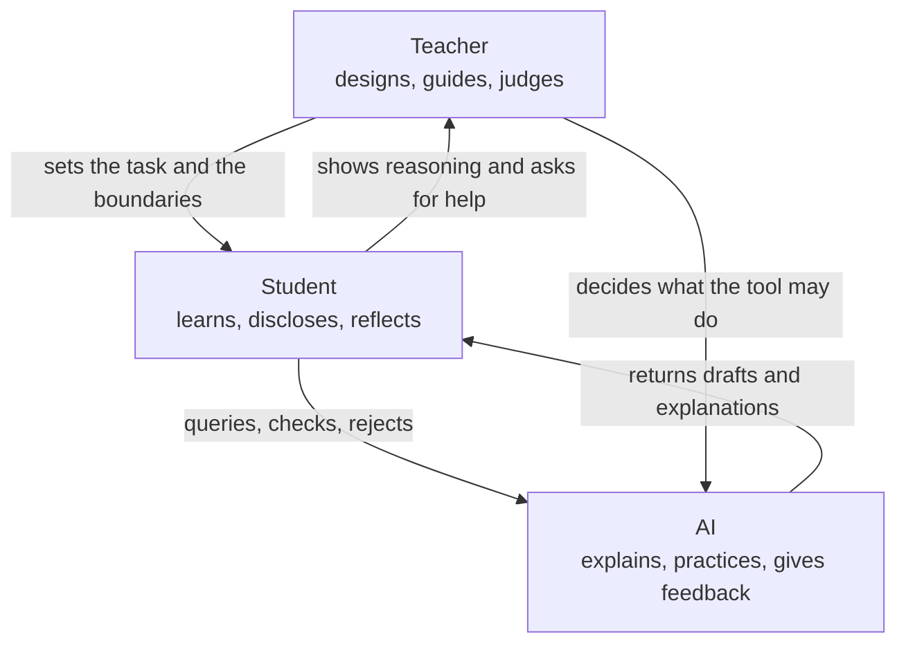

Figure 5. The teacher-student-AI triangle. Responsibility runs along the teacher-student edge; the tool is bounded on both sides.

### Recommendation

Adopt the teacher-student-AI triangle as a design model. Teachers lead pedagogy, students take active responsibility, and AI serves as a powerful but bounded support.

Every institution should define its triangle model explicitly:

1. What may students use AI for?
2. What must students disclose?
3. What remains the student's own responsibility?
4. What decisions remain with the teacher or lecturer?
5. How will AI-supported learning be assessed?
6. How will equity, privacy, bias, and tool quality be handled?
7. How will teachers gain hands-on experience before being asked to lead students?

The recommendation is to admit that AI is already in education and to design the human structure around it.

### Practical Recommendation for Teachers

Create a clear teacher-student-AI classroom agreement. Students should know what AI may do, what they must do themselves, what they must disclose, and how their work will be judged.

In practice:

1. Define allowed AI uses for the topic: explanation, practice, brainstorming, feedback, simulation, or checking.
2. Define forbidden or limited uses, especially where AI would replace the student's own reasoning.
3. Require students to disclose meaningful AI use.
4. Build one activity where students compare AI help with teacher guidance or peer explanation.
5. End the activity by asking students what remained their own responsibility.

Classroom activity examples:

1. Triangle roles simulation. Assign three roles: teacher, student, and AI. Students analyze who decides the goal, who gives support, who verifies, and who is responsible.
2. AI boundary workshop. Students sort classroom AI uses into allowed, limited, and not allowed, then justify each decision using learning and integrity criteria.
3. Student responsibility contract. Before an AI-supported task, students write what AI may help with and what they must prove independently.

Evaluation method:

Ask the student to say, for one piece of work, where the tool stopped and they started. The student should know when AI is a helper, when the teacher is the designer and evaluator, and when the student must act independently. Evidence can include an AI-use contract, annotated drafts, and a short explanation of personal responsibility.

For your own development, use AI hands-on before setting policy. Test the tool on the same assignment students will face. Notice what it explains well, where it misleads, and what judgment students will need.

### Sources

[Meeting 1 summary](../materials/meeting-1-summary.docx), [Meeting 4 summary, 28.04.2026](../materials/meeting-4-summary.docx), [Meeting 4 discussion document](../materials/meeting-4-discussion-document.docx), [Meeting 4 presentation](../materials/meeting-4-presentation.pptx), [UNESCO AI Competency Framework for Teachers](https://www.unesco.org/en/articles/ai-competency-framework-teachers), [Dr. Pinto, Future Trends Shaping Reality](../materials/meeting-4-iris-pinto-future-trends.pdf).

## Chapter 11 - Default or Design

### The Challenge

AI use is already happening. Students use it whether institutions are ready or not. If systems do not design AI use, AI will shape learning by default.

[Danielle Eisenberg's Meeting 4 presentation, "Default or Design,"](../materials/meeting-4-default-or-design-ignite-ed.pptx) named this as a system architecture problem. AI is not simply a tool inserted into an existing classroom. It is a role-fluid agent that can act as content, tutor, evaluator, and collaborator at the same time. It enters several layers of the system, often without formal permission.

The challenge is that schools and universities can see that students are using AI, but they cannot yet reliably see the thinking around that use. A student may use AI to deepen understanding, test alternatives, and improve reasoning. Another student may use the same tool to avoid thinking altogether. The visible product may look similar. The learning underneath may be completely different.

This is why default integration is dangerous. Without design, AI creates hidden processes, hidden dependency, hidden inequity, and hidden erosion of student thinking.

### The Dilemma

Will education systems allow AI integration to happen by default, or will they design roles, boundaries, assessment, and equity protections deliberately?

The dilemma is not between AI and no AI. That choice is already unrealistic. The real dilemma is whether AI use will be governed by educational purpose or by convenience, market pressure, student habit, and tool design.

Danielle Eisenberg framed three central questions for the discussion:

1. What does it look like for a teacher to govern the student-AI layer, not just permit or prohibit it?
2. What would it take in assessment, policy, and practice to make student thinking visible?
3. If privileged students augment with AI while disadvantaged students replace thinking with AI, who is responsible for equity, and what authority do they have?

### Main Positions

Restriction says that AI is too risky and should be blocked or minimized. This position may protect some forms of academic integrity in the short term, but it ignores actual student behavior.

Permission says that students may use AI within broad guidelines. This is more realistic, but often too weak. It can leave teachers without tools to evaluate process or prevent shallow use.

Design says that AI use must be built into the educational architecture. It defines what AI may do, what students must disclose, how teachers interpret evidence, how systems track patterns, and how equity is protected.

The design position is the only one that treats AI as a system condition rather than a classroom accessory.

### Pros and Cons

Restriction protects integrity for about as long as it takes a student to find a tool the policy did not name. Permission is flexible and usually too vague to guide anyone: a rule allowing AI use with acknowledgement tells a student nothing about what the acknowledgement is for. Design is harder than either, and it is the only one of the three that survives the next model release.

Design is harder because it requires infrastructure. Danielle Eisenberg's presentation argued for assessment infrastructure that sees inside learning, funding the teacher's role as system designer, defining AI as a policy lever with equity guardrails, and training teachers in evidence design rather than only AI tools.

Design also requires product discipline. Human-in-the-loop should be core architecture, not compliance language. Tools should be built for the margins first. Systems should separate demonstration from confidence level.

Design requires educational courage. It forces institutions to ask what evidence of learning is defensible in an AI-rich environment. It also forces them to admit that a single artifact, such as one essay or one homework submission, is a weak signal.

### Where Each Sector Stands

Students use AI unevenly. Advantaged students may use it to extend and refine thinking. Disadvantaged students may be more vulnerable to using it as a replacement for thinking. The same tool can produce opposite outcomes.

Teachers need guidance. They must learn to govern the student-AI layer, not only react to it. They need time for contextual judgment and support in interpreting evidence.

Assessment systems need redesign. Traditional assessment measures outputs. It cannot detect shallow AI use, equity gaps, or whether the triangle is producing learning. Patterns matter more than single artifacts. A notebook, reflection, peer review, oral defense, draft history, and final product together produce stronger evidence than one polished submission.

Technology designers need to build for human judgment. AI may propose skills, identify evidence, or rate confidence, but the interface has to let the educator accept, override, or adjust, and it has to record which of those happened.

Policy makers need procurement and accountability rules. The people selecting AI tools for schools must understand the technology, the teacher role, the equity risks, and the preparation required before tools enter classrooms.

### Round Table Voices

Danielle Eisenberg's warning followed from the role-fluidity described earlier in this chapter: a system that occupies four roles at once will produce consequences somebody has to live with, and if nobody designed them, nobody chose them either.

Two questions from the floor did most of the work. Dr. Tzur Karelitz asked why the teacher should mediate between AI and students at all in evaluation, which is the trust question stated at its sharpest. Danielle Eisenberg's answer conceded the premise and then narrowed it: AI systems may well become effective at assessing collaboration or diligence, and the limits are trust and bias rather than capability, because these systems are trained on datasets that do not represent diverse or neurodivergent students well. Human oversight is what stands between a useful tool and a harmful one.

Dr. Revital Duek asked the practical version: how can students' thinking be made visible once AI is in the room? The answer was concrete. AI chatbots can interview students about a portfolio, an assignment, a paper, or a group project, prompting reflection on their own role, their peers' contribution, and what they learned.

Prof. Sigal Tifferet raised the possibility that runs against all of this, and it deserves to be taken seriously: AI may absorb enough assessment work to free teachers for guidance, relationships, and psychological support. Whether that is liberation or blindness depends entirely on whether human interpretation stays in the loop. Jan Morrison put the constraint that decides it, connecting the question to system transformation and equity: students focus on what the system values and measures, so if oral communication, defense of ideas, and critical thinking matter, they have to be assessed. Avi Salmon named the failure the whole chapter is written against, warning that teachers must stop students from "downloading their brains" into AI without real thinking or understanding.

### Synthesis

AI policy is not enough. Education systems need learning designs that make student thinking visible.

Danielle Eisenberg's key contribution is the distinction between a learning triangle and a measurement triangle. The learning triangle involves student-AI interaction, teacher-student relationship, and teacher-AI governance. The measurement triangle involves AI proposing evidence, the teacher interpreting context, and the system aggregating patterns over time.

This architecture keeps humans in the loop where context matters most. It uses AI to reduce the cognitive load of evidence review so that teachers can invest judgment where it matters, instead of asking them to inspect every detail by hand.

The central principle is: AI proposes, teachers decide. Figure 6 puts the default arrangement beside the designed one, line by line.

| Default AI use | Designed AI use |
| --- | --- |
| Hidden student process | Visible process evidence |
| Output judged alone | Drafts, prompts, defense, and reflection reviewed together |
| Equity risk appears late | Equity guardrails built in from the start |
| AI use shaped by convenience | AI use shaped by educational purpose |
| Teacher reacts after submission | Teacher governs the student-AI layer |

Figure 6. Default versus design in AI-supported learning.

### Recommendation

Design AI use around process evidence: prompts, drafts, explanations, comparisons, critique, reflection, teacher interpretation, and student ownership.

Education systems should implement the following design requirements:

1. Make student thinking visible, not only student output.
2. Require students to demonstrate and defend their reasoning.
3. Use multiple artifacts rather than single submissions.
4. Build human interpretation into AI-supported assessment.
5. Train teachers in evidence design, not only tool operation.
6. Treat equity as a design requirement, not an afterthought.
7. Track patterns over time to distinguish learning from performance.
8. Build procurement rules that require teacher preparation and bias review.

The practical lesson is direct: if education does not design the AI layer, the AI layer will design education by default.

### Practical Recommendation for Teachers

Design the student-AI layer instead of only reacting to it. The teacher should govern how AI enters learning by making process evidence visible.

In practice:

1. Ask students to submit prompts, drafts, and reflections for one AI-supported task.
2. Require a short explanation of what the AI did and what the student did.
3. Use multiple artifacts, not one final product: notes, draft, peer feedback, revision, and final explanation.
4. Watch for equity patterns: who uses AI to deepen thinking, and who uses it to avoid thinking?
5. Use teacher judgment to interpret AI-supported evidence, not to rubber-stamp it.

Classroom activity examples:

1. Process evidence notebook. During an AI-supported project, students keep a simple log of prompts, drafts, decisions, checks, and reflections.
2. AI proposes, student decides. Give students an AI-generated set of suggestions. They must accept, reject, or modify each suggestion and explain why.
3. Pattern review. Instead of grading one artifact, students assemble three pieces of evidence, such as draft, peer feedback, and final explanation, to show learning over time.

Evaluation method:

The evidence here is a pattern rather than an artifact. The teacher should look for consistency between prompts, drafts, decisions, checks, and final work. A successful student makes the learning process visible and can explain why AI suggestions were accepted, rejected, or changed.

For your own development, learn evidence design, not only AI tool operation. Take one assignment and redesign it so the thinking around AI becomes visible.

### Sources

[Meeting 4 summary, 28.04.2026](../materials/meeting-4-summary.docx), [Danielle Eisenberg / Ignite Ed presentation](../materials/meeting-4-default-or-design-ignite-ed.pptx), [Meeting 4 presentation](../materials/meeting-4-presentation.pptx).

## Chapter 12 - The Futures Lens

### The Challenge

Education systems often plan from the past. Students are entering a volatile, uncertain, complex, and ambiguous world.

[Dr. Iris Pinto's Meeting 4 lecture, "Future Trends Shaping Reality,"](../materials/meeting-4-iris-pinto-future-trends.pdf) placed this challenge at the center of the Round Table. The point of futures thinking is not prophecy. Futures research is not an attempt to know what has not yet happened. Its practical purpose is to read signals in the present, identify trends, imagine several possible futures, and act now in ways that shape the preferred future.

This is a major shift for STEM education. Traditional education often assumes a relatively stable world: teach known knowledge, prepare for known professions, certify known achievement. Dr. Pinto's lecture argued that this assumption no longer holds. The pace of change is accelerating, decision-making is becoming more complex, and human thinking remains linear and biased while reality is increasingly interconnected.

The challenge is therefore not only technological. It is cognitive, ethical, institutional, and human. Schools and universities must teach learners how to live with uncertainty without surrendering judgment.

### The Dilemma

Should education prepare students for known labor-market needs, or for multiple possible futures that cannot be fully predicted?

If education prepares only for current labor-market needs, it risks training students for work patterns that may disappear. If education prepares only for general adaptability, it may become too abstract and disconnected from real knowledge, tools, and professions.

The futures lens asks for a third path: prepare students through deep disciplinary grounding, cross-boundary thinking, ethical imagination, and the capacity to keep learning as reality changes.

This dilemma is especially sharp for universities. Their traditional model treats undergraduate and graduate study as a concentrated early-life phase followed by professional practice. The Round Table discussion questioned whether this model can survive in a world of rapid technological and professional change.

### Main Positions

The current-market position is practical. It asks what employers need now and designs curricula accordingly. This can strengthen employability, but it may narrow education to the demands of the present.

The general-adaptability position emphasizes creativity, critical thinking, problem-solving, and lifelong learning. This is closer to the Round Table's spirit, but it still needs concrete pedagogy and assessment.

The futures position combines both. It keeps current skills and adds the ability to analyze change. It uses time horizons, scenarios, wild cards, preferred futures, and STEEP dimensions: social, technological, economic, environmental, and political factors.

In this view, futures thinking becomes a literacy for modern STEM learning.

### Pros and Cons

Current-market preparation is concrete, and it trains students for the job advertisements of the year they entered school. General adaptability avoids that trap by declining to commit to anything, which is why it is so easy to endorse and so hard to teach. Futures thinking gives students real tools for uncertainty, and asks more of teachers than either alternative.

Futures thinking has a strong advantage: it helps learners move beyond passive prediction. Students learn that the future is partly shaped by present decisions. This supports agency, responsibility, and moral imagination.

It also has risks. Poorly taught futures work can become speculation, slogans, or anxiety. Students may be overwhelmed by possible futures without gaining tools to act. Teachers may lack preparation in scenario thinking, systems thinking, and interdisciplinary analysis.

The solution is to embed futures habits into STEM learning, which requires no teacher to become a futurist: ask what trends are visible, what assumptions may fail, what systems are connected, who benefits, who is harmed, and what future should be preferred.

### Where Each Sector Stands

Policy makers need long-term planning. They must prepare systems for futures that cannot be reduced to a single forecast.

Universities need to rethink their relationship with graduates. If knowledge and professional practice change continuously, the university cannot only be a gate through which young adults pass once. It may need to become a long-term learning partner.

Industry sees rapid skill change directly. Dr. Pinto connected this to her experience in industry and noted the disconnect between education systems and industry practices. When education and industry solve similar problems separately, both lose time and relevance.

Teachers need preparation to lead students through complexity. Dr. Noa Ragonis raised the teacher development gap, and Dr. Pinto strongly supported the importance of STEM teacher leadership. Without prepared teachers, meaningful transformation in competencies, skills, and AI integration will not happen.

Students need agency and identity in a changing world. In a post-work scenario, where automation reduces the centrality of traditional work, education must help students ask what kind of person and contributor they will become, a question that outlasts any particular job.

### Round Table Voices

Dr. Pinto presented the futures lens. She described a VUCA world shaped by technological convergence, human-machine integration, bio-convergence, post-work scenarios, and accelerating change.

Her presentation described several meta-trends changing the nature of humanity. Convergence brings together AI, biotechnology, quantum technologies, nanotechnology, robotics, and other domains to create new capabilities. Human-machine interfaces blur boundaries through brain-computer interfaces, neural implants, subdermal devices, smart devices, and human-machine symbiosis. Human enhancement and gene editing raise the possibility of a bio-cognitive divide between enhanced and non-enhanced people. Automation, AI, robotics, abundant energy, biomanufacturing, and radical life extension raise questions about work, meaning, learning, identity, and equity.

She also described AI as an enabler, but not the endpoint. Human-centric AI may interpret emotion, cognition, senses, and body. Action and creation AI may plan, act, create, and collaborate. Multimodal and phygital AI may expand learning through hybrid physical and digital environments. These trends make STEM broader than technical knowledge.

Prof. Arnon Bentur connected the discussion to lifelong learning and the idea of a long-term relationship between universities and graduates. He referred to models in which universities maintain learning relationships across a career, sometimes described as a long curriculum. This reframes higher education from a one-time credentialing institution into a continuing knowledge partner.

Dr. Pinto gave a similar example. After graduation, universities often lose contact with graduates except when requesting donations. She proposed that universities could provide regular professional updates in fields such as engineering, similar to software or smartphone updates. This would help graduates remain current and would keep universities connected to professional reality.

Dr. Revital Duek noted that industry may force workers into continuous learning as the price of remaining relevant.

This comment exposed the harder side of lifelong learning. Continuous learning can be empowering, but it can also become pressure. If workers must update themselves constantly without institutional support, lifelong learning becomes an individual burden rather than a social design.

### Synthesis

The future cannot be predicted, but learners can be prepared to navigate it.

The futures lens changes the definition of STEM education. STEM is not only science, technology, engineering, and mathematics as separate domains. It becomes a way to understand complex socio-technological systems. It asks students to connect technical knowledge with human values, uncertainty, ethics, identity, and responsibility.

This is why the Meeting 4 discussion reached toward STEAM rather than only STEM. Art, ethics, humanities, philosophy, social understanding, and communication are not decorations around technical knowledge. They are necessary for judging what technology means and how it should be used.

The teacher's role becomes even more important under this lens. AI can provide information and simulation, but teachers help students frame questions, compare futures, examine values, and resist simplistic answers. Figure 7 sets out the futures lens as a sequence a class can actually run.

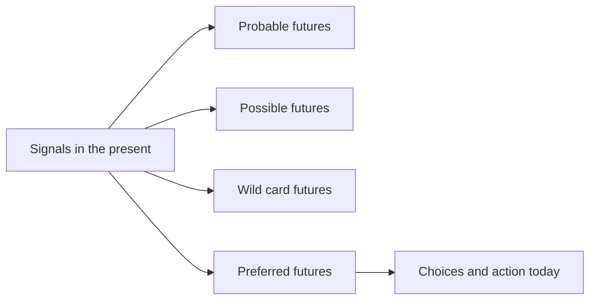

Figure 7. Futures lens for STEM education.

### Recommendation

Make futures thinking part of STEM education. Use scenarios, systems thinking, ethical reasoning, lifelong learning, and cross-sector learning to prepare students for uncertainty.

Every STEM program should include structured futures practices:

1. Identify trends in the present and connect them to possible futures.
2. Distinguish probable, possible, wild card, and preferred futures.
3. Use STEEP analysis to connect social, technological, economic, environmental, and political forces.
4. Examine technological convergence and its human implications.
5. Discuss post-work scenarios as questions of identity, meaning, equity, and purpose.
6. Treat lifelong learning as a designed relationship, not only a personal responsibility.
7. Build partnerships among schools, universities, industry, community, and policy.
8. Develop socio-technological leaders, not only competent users of technology.

The Round Table's recommendation is to move STEM beyond technical training. Future-ready STEM education should prepare learners to understand complex problems, shape preferred futures, and carry moral responsibility inside technological change.

### Practical Recommendation for Teachers

Add a futures lens to ordinary STEM topics. Students should learn how a technology works, what future it may create, and what choices humans still have.

In practice:

1. Begin a unit by asking which trends are visible now.
2. Use STEEP questions: social, technological, economic, environmental, and political effects.
3. Ask students to imagine probable, possible, wild card, and preferred futures.
4. Connect technical learning to human consequences, equity, identity, and responsibility.
5. Ask students what action today would move toward the preferred future.

Classroom activity examples:

1. Four futures map. Students take one technology and describe probable, possible, wild card, and preferred futures, then identify what choices could shape the preferred one.
2. STEEP scan. Groups analyze a STEM development through social, technological, economic, environmental, and political lenses.
3. Future backcasting. Students choose a preferred future, then work backward to identify what learners, teachers, industry, and policy should do now.

Evaluation method:

The student should identify signals, consider more than one possible future, explain the assumptions behind each, and connect preferred futures to present choices. The assumptions are the assessable part; the forecast is not. Strong work avoids prediction as certainty and shows thoughtful links between technology, society, values, and action.

For your own development, keep a small futures notebook. Once a month, record one emerging technology or social trend, one classroom implication, and one question for students. Dr. Pinto's futures approach is what makes this workable: do not predict the future as prophecy, identify signals already present and act toward a preferred version of it.

### Sources

[Meeting 4 summary, 28.04.2026](../materials/meeting-4-summary.docx), [Dr. Pinto presentation](../materials/meeting-4-iris-pinto-future-trends.pdf), [Meeting 4 presentation](../materials/meeting-4-presentation.pptx).

## Chapter 13 - Risks and Design Principles for AI in Learning

### The Challenge

AI can personalize learning and provide feedback, but it can also weaken thinking, hide inequality, and erode trust.

The Round Table did not treat AI as either salvation or threat. It treated AI as a powerful condition that must be governed by educational purpose. The same tool can support deep learning or replace it. It can help teachers see student progress or create a new layer of invisible dependence. It can make learning more equitable or widen existing gaps.

The challenge is that AI's strongest features are also its educational risks. It is fast, articulate, patient, adaptive, and always available. These qualities can support students who need explanation and practice. They can also make students stop struggling, stop questioning, and stop developing the very competencies education is meant to cultivate.

### The Dilemma

How can AI enhance learning without replacing the human cognitive and ethical work that education is meant to develop?

The central principle from the [Meeting 3 discussion document](../materials/meeting-3-teacher-in-ai-era-discussion.docx) is keeping the human above the machine. The goal is to maintain human judgment, creativity, and moral responsibility as the final authority over any tool or system.

This creates a practical dilemma. If AI is too restricted, students may lose access to useful support and may use tools secretly. If AI is too open, students may outsource thinking, writing, verification, and even moral responsibility. If AI is designed into learning, teachers must have time, training, assessment infrastructure, and institutional authority.

### Main Positions

The efficiency position uses AI to save time: summarizing, generating examples, grading, tutoring, and producing feedback. It is attractive because education systems are overloaded. Its danger is that efficiency can become the main value, pushing aside reflection, effort, and relationship.

The thinking-partner position asks students to use AI to compare ideas, test assumptions, receive critique, and explore alternatives. This can be powerful when it is structured. It becomes weak when students accept AI output as authority.

The human-centered design position treats AI as a bounded support inside teacher-led learning. It requires disclosure, verification, explanation, oral defense, reflection, and teacher interpretation. This position best matches the Round Table's repeated claim that teachers and lecturers must remain above AI.

### Pros and Cons

Efficiency gives speed and access, and teaches students that the fastest route to an acceptable answer is the route worth taking. A thinking partner prompts exploration and will mislead confidently while doing it. Controlled support preserves human judgment at the cost of design work for which nobody has been given time.

The benefits are real. AI can offer individualized explanation, practice, simulation, translation, feedback, and access to resources. It can help students rehearse ideas and help teachers review evidence more efficiently.

The risks are also real. The [Meeting 4 discussion document](../materials/meeting-4-discussion-document.docx) identified shallow learning, misinformation, cognitive offloading, weakened teacher-student relationships, inequality, and accountability gaps. Research cited in the materials suggests that AI can boost performance when scaffolded by teachers, while independent or passive use risks dependency and reduced critical thinking.

The danger is not that students use AI. The danger is that AI use becomes invisible, unexamined, and detached from human judgment.

### Where Each Sector Stands

Students may see AI as helpful, nonjudgmental, and easier to approach than people. That can reduce anxiety, but it can also weaken the human relationships through which confidence, motivation, and identity develop.

Teachers may benefit from AI support, but they also face new burdens: verifying authenticity, interpreting AI-assisted work, protecting equity, and helping students understand the limits of tools.

Institutions must decide what counts as evidence of learning. A polished AI-supported product cannot be enough. Schools and universities need prompts, drafts, comparisons, oral explanations, process logs, peer feedback, reflection, and defense of reasoning.

Society needs graduates who can use AI without surrendering agency. In an AI-rich world, technical fluency is not enough. Learners must develop critical thinking, ethical judgment, collaboration, communication, and the ability to take responsibility.

### Round Table Voices

Emlen Metz emphasized that students must use AI thoughtfully and critically, and that responsibility cannot be delegated to machines. Her warning rejects a shallow definition of AI literacy. AI literacy is not only knowing how to prompt a tool. It includes knowing when not to accept an answer, how to verify, how to decide, and how to remain responsible for one's own judgment.

The same worry arrived from four directions. Prof. Russell Tytler put it as a matter of formation rather than performance: as the tools get better, students shorten their cognitive processes, and habits of independent reasoning take years to build and months to lose. Prof. Gil Noam added isolation to the list, because a student who can get a quick answer has less reason to ask a person for a slow one. Dr. Olena Bekh went furthest, arguing that critical thinking is the competency a society cannot afford to lose, and connecting heavy AI dependence to reductions in curiosity, creativity, empathy, and emotional engagement. Avi Salmon's version was the practical one: the question is no longer whether to use AI but how to use it wisely, and teachers and lecturers have to stay above it. He later sharpened this into the warning quoted in Chapter 11, which is a precise description of cognitive offloading as an educational failure.

Dr. Gabi Shafat offered the one concrete counter-design in the discussion. He described setting students problems where the tools fail or show bias, so that students should not only meet AI where it works smoothly. Comparing tools and discussing their failures turns AI from an answer machine into an object of inquiry.

Two speakers pressed on where the decision sits. Dr. Marwa Maklada's position, set out in Chapter 10, applies directly to risk: if AI is allowed to design learning or control knowledge, there is no longer a human decision point at which any of these risks can be caught. Dr. Eli Eisenberg raised the question of pace, arguing that AI should be integrated but that society may need time to study the ethical, moral, social, and cognitive implications before moving faster.

### Synthesis

Good AI use increases reflection, judgment, and agency. Bad AI use replaces them.

The Round Table's design logic can be summarized in five principles.

First, AI use must be visible. Students should disclose how they used AI and show the process behind their work.

Second, AI use must be contestable. Students should compare, verify, criticize, and improve AI outputs rather than accept them.

Third, AI use must be relational. It should strengthen teacher guidance, peer discussion, and human explanation rather than isolate students.

Fourth, AI use must be equitable. Systems must prevent a pattern where privileged students augment their thinking while disadvantaged students replace their thinking.

Fifth, AI use must preserve accountability. The student remains responsible for learning, the teacher remains responsible for educational judgment, and the institution remains responsible for tool adoption and safeguards. Figure 8 pairs each risk in this chapter with the design response that addresses it.

| AI learning risk | Classroom sign | Design response |
| --- | --- | --- |
| Overreliance | Student accepts output without explanation | Require comparison and verification |
| Bias or error | Output omits context or harms fairness | Use bias checks and source critique |
| Shallow thinking | Final answer is polished but undefended | Add oral defense and reasoning trail |
| Inequality | Students use AI in very different ways | Teach responsible use explicitly |
| Lost accountability | Student cannot say what they own | Require disclosure and responsibility statement |

Figure 8. AI learning risks and design responses.

### Recommendation

Create learning designs that require students to question, compare, explain, justify, and reflect. Do not treat polished AI output as evidence of learning.

Every AI-supported learning task should include at least four elements:

1. A declaration of AI use.
2. A comparison between AI output and human reasoning.
3. A student explanation of what was accepted, rejected, changed, and why.
4. A teacher-mediated or peer-mediated discussion that tests understanding.

For higher-stakes work, add oral defense, draft history, source verification, and reflection on tool limitations.

The Round Table recommendation is to slow down the parts that matter: judgment, verification, meaning, and responsibility. Rejecting AI would slow the wrong things. AI may accelerate access to information, but education must protect the time needed for thinking.

### Practical Recommendation for Teachers

Build friction into AI-supported learning. Students should not move directly from AI output to final submission. They should pause to test, question, and own the result.

In practice:

1. Use AI on a problem where the tool may be incomplete, biased, or wrong.
2. Ask students to compare outputs from different tools or prompts.
3. Require students to identify errors, missing assumptions, or weak reasoning.
4. Use peer discussion to test understanding before submission.
5. Add a final reflection: what did AI help with, and what did it not replace?

Classroom activity examples:

1. AI failure lab. Students investigate an AI response that is incomplete, biased, or wrong and identify the exact point where human judgment is needed.
2. Slow thinking checkpoint. During a task, pause before students use AI and ask them to write their own first explanation, prediction, or strategy.
3. Verify before trust. Students must verify an AI answer using a second method, such as calculation, experiment, source check, peer critique, or teacher conference.

Evaluation method:

Check whether the student checked. The student should recognize failure modes, slow down before accepting output, and use at least one independent method to check claims. Strong performance includes a correct answer and a documented reason for trusting it.

For your own development, collect a bank of AI failure cases from the discipline. Use them to teach critical evaluation.

### Sources

[Meeting 2 summary, 20.01.2026](../materials/meeting-2-summary.docx), [Meeting 2 presentation](../materials/meeting-2-presentation.pptx), [Meeting 3 discussion document](../materials/meeting-3-teacher-in-ai-era-discussion.docx), [Meeting 4 summary, 28.04.2026](../materials/meeting-4-summary.docx), [Meeting 4 discussion document](../materials/meeting-4-discussion-document.docx).

# Part V - Professional Development as System Infrastructure

Meeting 5, on 9 June 2026, asked who is responsible for sustaining the professional development of teachers and lecturers over time, and who has the capacity to do it. Prof. Tytler and Dr. Yael Granot-Bein presented.

Dr. Granot-Bein's presentation gives this part its structure. She put four candidate owners on the table, namely individual faculty, teaching and learning centers, institutional leadership, and national support structures, and worked through what each can and cannot carry. Chapter 14 follows that analysis directly. Prof. Tytler supplied the school-system half of the same question, and his answer from Australia was that no national framework exists there either.

## Chapter 14 - Who Is Responsible for Teacher Development?

### The Challenge

Professional development is essential, but responsibility is scattered. Teachers, institutions, ministries, teaching centers, professional bodies, and funders all play roles, but no single actor clearly owns the whole process.

The [steering-team summary of 23 June 2026](../materials/steering-2026-06-23.docx) stated the problem directly: there is currently no single body that carries overall responsibility for the continuous professional development of teachers and lecturers. Responsibility is distributed across teaching and learning centers, educational institutions, management teams, government ministries, and professional bodies, but it is unclear who ensures that professional development happens systematically over time.

This is the bottleneck in the entire Round Table agenda, not a small administrative problem. Competency-based STEM education, AI literacy, assessment redesign, teacher-student-AI relationships, and future-ready learning environments all depend on educators who can learn continuously. If professional development is weak, every other recommendation remains fragile.

### The Dilemma

Who owns sustained professional development: individual teachers, institutions, teaching centers, ministries, professional bodies, or a national infrastructure?

The dilemma is difficult because each answer is partly correct and partly insufficient.

Teachers and lecturers must take responsibility for their own learning. But individual motivation cannot carry a national or institutional transformation.

Institutions must build local conditions for change. But institutions vary widely in resources, priorities, leadership, and incentives.

Teaching and learning centers have expertise. But they often lack authority over promotion, workload, budgeting, curriculum, and departmental culture.

National bodies can create coherence. But they may be too distant from practice and may produce formal requirements without deep implementation.

The Round Table materials therefore point toward shared responsibility, but shared responsibility can easily become no responsibility unless governance is explicit.

### Main Positions

The individual responsibility position says that teachers and lecturers are professionals, and professionals must keep learning. This position protects agency and dignity. It also aligns with the [OECD Teaching Compass](../materials/oecd-teaching-compass.pdf), which emphasizes teacher agency, professional identity, and continuous learning.

The teaching-center position says the work belongs to people who hold pedagogical expertise as their profession, which is what teaching and learning centers are for. They can train, coach, consult, and redesign courses. Dr. Yael Granot-Bein's verdict on them at Meeting 5 was blunter than their advocates would like: their authority and resources are limited, they often reach only a small proportion of faculty, and they cannot drive institutional change alone.

The institutional responsibility position says that educators cannot transform practice alone. Leaders must provide time, recognition, resources, peer structures, and incentives. Without institutional involvement, professional learning becomes voluntary enrichment for the already motivated.

The national responsibility position says that systemic change requires shared language, standards, and durable infrastructure. This may include teacher education institutions, national centers for skills development, policy frameworks, funding mechanisms, and evaluation systems.

The shared responsibility position says that professional development must be organized as an ecosystem. Individual learning, institutional support, professional communities, national strategy, and evidence-based evaluation must reinforce one another.

### Pros and Cons

Individual responsibility is motivating, but it rewards the educators who already have time, money, and a supportive institution. Institutional responsibility sits close to practice, though it varies enormously between institutions that look similar on paper. National responsibility creates scale, and what it reliably produces is compliance rather than change. Shared responsibility is the strongest of the four. It is also the only one nobody can implement alone.

The [steering discussion of 12 May 2026](../materials/steering-2026-05-12.docx), held before Meeting 5, highlighted major differences between schools and higher education. In schools, teaching is the core profession. In academia, many lecturers are promoted mainly through research rather than teaching quality. A single professional development model may therefore fail unless it is adapted to different incentive systems.

There are also large differences within higher education itself. Strong institutions may have active teaching centers and strategic leadership. Smaller colleges may have only a limited function for teaching improvement. Professional development policy that assumes equal capacity will widen inequality between institutions.

There is also a motivation problem. Some educators lead change willingly. Some sit on the fence. Some resist. The Meeting 5 steering-team materials raised the possibility of different development pathways and of using leading groups as change agents within the system.

This means responsibility cannot be defined only as attendance at training. Responsibility must include authority, incentives, support, evidence, and follow-up.

### Where Each Sector Stands

Teachers need protected time, practical relevance, peer learning, coaching, and opportunities to experience new pedagogy as learners before applying it as teachers.

Lecturers need a development model that recognizes academic freedom and research incentives while still making teaching improvement a serious professional responsibility.

Teaching and learning centers need status and reach. They should not be peripheral service units that work only with volunteers. They need connection to institutional strategy, promotion systems, curriculum design, and assessment reform.

Teacher education institutions need to prepare future educators for AI-rich, competency-centered teaching from the start, rather than treating AI and skills as later add-ons.

National or sector-level bodies need to create coherence across fragmented systems. This may include shared language for competencies, quality expectations, data, and evaluation.

Funders and foundations can support innovation, but the Round Table logic implies that projects must be connected to durable systems, not isolated initiatives.

### Round Table Voices

Dr. Granot-Bein brought numbers to a question the Round Table had until then argued from impression. A Samuel Neaman Institute survey of faculty found that ninety percent regard transferable skills as highly important, sixty-one percent have never received any formal training in teaching them, and eighty-four percent of those not currently teaching them would like to learn how. The three figures together dismantle the most common explanation for why nothing changes. Faculty are not the obstacle. The willingness is already there and the training is not.

She then named the assumption that the willingness gets wasted on. Understanding that skills matter is not the same as knowing how to teach them, and knowing how to teach them does not by itself change what happens in a lecture hall. Two gaps, not one, and most institutional effort is spent closing the first, which was never the binding constraint.

Her framework is the spine of this chapter. Four actors can carry faculty development, and each fails differently. Individual faculty bring autonomy, curiosity, and motivation, and reach mainly innovators, scale poorly, and depend on personal commitment: necessary but insufficient. Teaching and learning centers bring pedagogical expertise, coaching, and consultation, and hold limited authority and resources and often reach only a fraction of the faculty. Institutional leadership sets priorities, allocates resources, creates incentives, and shapes culture, and is what turns faculty development into institutional change. National support structures supply shared language, common tools, cross-institutional collaboration, and capacity building. Her observation about the last of these is the one worth remembering: research has national support structures and teaching usually does not.

She offered a working example, not a proposal. The Maarag Yeda initiative, whose name translates roughly as knowledge fabric, operates across twenty-three higher education institutions, uses teaching and learning centers as local change agents, supports faculty development and course redesign, and builds a national community of practice with shared language and peer learning. It is what the four-actor model looks like when someone actually assembles it.

Her point about framing is easy to skip and expensive to ignore. Faculty engage with transferable skills when the skills are connected to academic excellence, research quality, student learning, and disciplinary identity. They disengage when the case is made through employability and labor market demand. The same program, described in academic terms rather than economic ones, gets a different level of participation. That is a finding about how faculty understand their own work, and it means the argument this book makes in Chapter 1 has to be translated before it will land in a university.

Prof. Russell Tytler answered the same question from the school system, and his answer was that Australia has not solved it either. Professional development in STEM skills there is largely informal and decentralized. Responsibility rests with individual schools, which decide whether to organize anything or bring in outside expertise. Universities and professional development centers offer programs, and no national framework guides any of it, so provision varies with local priorities and individual initiative. Teacher shortages make releasing staff difficult and replacing them expensive. He was explicit that he does not regard the Australian arrangement as a model.

His second observation is more uncomfortable for this book's subject. In Victoria, science and mathematics teachers do take part in structured, long-term professional learning, and STEM skills are almost never treated as a topic in their own right. They are folded into broader pedagogical work, while the themes that actually attract attention are AI, programming, coding, and robotics. Professional development organizes itself around whatever is currently urgent, and competencies are not currently urgent.

Prof. Arnon Bentur put the counterweight. Over two years the Council for Higher Education and the Planning and Budgeting Committee have run the Academia 360 initiative, which has required every university and college to define graduate profiles, redesign curricula and pedagogy, strengthen faculty development, engage institutional leadership, and build partnerships with industry. In his assessment it has raised faculty awareness of transferable skills substantially and is already changing the system.

Prof. Sigal Tifferet disagreed, and her objection is the sharpest challenge to the national-infrastructure position anywhere in the Round Table. Different levels of the system send conflicting messages: faculty are urged through workshops and training to integrate skills, and are not given the resources, incentives, or conditions to do it, and the result is frustration and burnout instead of change. On Academia 360 specifically, her understanding was that part of its funding came at the expense of earlier programs that had already supported skills development, industry engagement, and community partnership, and that in some cases the new budget was smaller than the ones it replaced. Ambitious plans went unrealized. A national initiative can consume the capacity it was meant to create.

Dr. Granot-Bein's response to Prof. Bentur split the difference and conceded nothing important. Academia 360 has made a real contribution and has raised transferable skills on the institutional agenda. Working directly with universities and colleges, she still finds considerable uncertainty about who is responsible for faculty development, where that responsibility should sit, and who should lead it. National priority shifted; local ownership did not follow.

Dr. Eli Eisenberg asked for time. The program is still being implemented, its effects will vary between institutions, and it is too early to judge. That is a fair procedural point and it is also the answer that every large initiative receives during the years in which it cannot be evaluated.

Avi Salmon supported a data-based examination and proposed a professional evaluation of the program, similar to evaluations conducted in other projects. This links professional development to institutional learning rather than anecdotal success.

The steering team had reached the core of this question much earlier. Its [summary of 19 October 2025](../materials/steering-2025-10-19.docx) argued that teaching promotion centers in higher education can no longer be satisfied with a technical role supporting instruction. In an era when STEM teaching requires the integration of learning technologies and artificial intelligence, those centers have to become a strategic actor leading pedagogical change. The summary gave them a double task: developing individual members of the teaching staff, and driving the cultural and systemic change that would make competency-based teaching an integral part of STEM instruction rather than an initiative at the edge of it. It added a third task that is easy to overlook, which is brokering between the institution and the wider ecosystem of teaching, research, and innovation outside it, so that evidence-based methods travel in both directions.

That summary also named the structural gap this chapter has to work around. Teacher colleges provide full pedagogical training. Universities usually provide none. A lecturer may be an authority in the discipline and have no background whatever in cultivating competencies, and the two populations cannot be served by the same program. The steering team's conclusion was that uniform training should be avoided and that a differential model is required, matched to the individual lecturer's strengths, field of knowledge, and academic goals, with recruitment and development adapted accordingly.

The same summary pointed outward for capacity. Rather than expecting every institution to build pedagogical expertise internally, it proposed sustained partnership with professional bodies that specialize in cultivating STEM competencies, naming several operating in Israel, including the National Center for Skills and Competencies, Methodica, Beit Berl College, and the Davidson Institute. The principle generalizes past those particular names. An institution without internal capacity can acquire it by partnership, provided the partnership is continuous rather than a series of visits.

### Synthesis

Professional development must be treated as infrastructure, not optional enrichment.

The Round Table's deeper insight is that teacher development is the mechanism through which reform becomes real. A system cannot ask teachers to develop students' competencies, use AI wisely, redesign assessment, build teamwork, and create future-ready learning if it does not also create a serious system for teacher learning.

Professional development therefore has to be continuous, differentiated, evidence-informed, and connected to implementation. It must support both school teachers and higher education lecturers, while recognizing that their conditions and incentives differ.

The question "who is responsible?" should not be answered by naming one actor. It should be answered by designing a responsibility chain. Figure 9 shows what such a chain contains.

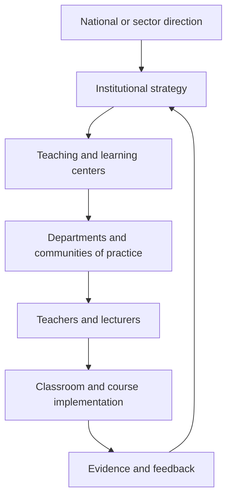

Figure 9. Shared responsibility for sustained teacher development.

### Recommendation

Build a shared-responsibility model: national direction, institutional implementation, local communities of practice, teaching and learning centers, and individual professional agency.

The model should assign clear responsibilities:

1. National or sector bodies define direction, language, expectations, and funding mechanisms.
2. Institutions translate those expectations into strategy, time, resources, incentives, and evaluation.
3. Teaching and learning centers provide expertise, coaching, design support, and evidence review.
4. Departments and professional communities create peer learning and shared practice.
5. Teachers and lecturers take active responsibility for growth, experimentation, and reflection.
6. Funders support innovation only when it connects to sustainability and evaluation.

Professional development should stop being a sequence of courses and become permanent infrastructure for educational adaptation. That was the Round Table's position, and it has a budget consequence that no participant disputed.

### Practical Recommendation for Teachers

Treat professional development as a shared system, while still taking personal responsibility for growth. Begin without waiting for the perfect institution, and refuse to accept isolation as normal.

In practice:

1. Write a one-year personal learning goal linked to AI-era teaching.
2. Identify what support you need: peer group, teaching center, mentor, time, tool access, or leadership backing.
3. Join or create a small professional learning group.
4. Ask the institution to connect professional development to real implementation, not only attendance.
5. Document what changed in your teaching after the development activity.

Classroom activity examples:

1. Teacher learning disclosure. Tell students about one teaching skill you are currently improving and show how it changes the class design.
2. Professional growth inquiry. Ask students what teacher supports would help them learn better, then use one answer to plan a professional learning goal.
3. Shared responsibility map. With older students, map who supports learning: teacher, student, peers, school, family, tools, industry, and policy.

Evaluation method:

Success here is a student who can divide the work honestly. The student should be able to identify what they own, what the teacher supports, and what the wider environment contributes. In older classes, success includes proposing a practical support or improvement, not only describing a problem.

For your own development, build a responsibility map: what I own, what my department owns, what the institution owns, and what policy or national infrastructure should own. Meeting 5 concluded that no single actor currently carries clear responsibility for this. Dr. Granot-Bein's answer was not to nominate one but to insist that the four levels be aligned, because each of them can block the other three.

### Sources

[Meeting 5 summary, 09.06.2026](../materials/meeting-5-summary.docx), [Dr. Granot-Bein, Who Sustains Faculty Development for Transferable Skills?](../materials/meeting-5-yael-granot-bein-faculty-development.pdf), [Prof. Tytler, STEM skills for teachers](../materials/meeting-5-russell-tytler-stem-skills.pptx), [Steering-team summary, 19.10.2025](../materials/steering-2025-10-19.docx), [Steering-team summary, 23.06.2026](../materials/steering-2026-06-23.docx), [Steering-team summary, 12.05.2026](../materials/steering-2026-05-12.docx).

## Chapter 15 - Beyond One-Off Training

### The Challenge

Workshops are easy to count. Practice change is harder. Teachers and lecturers need support while they implement new pedagogy, AI use, assessment, and collaboration.

Dr. Eli Eisenberg closed Meeting 5 on this point, and he put it as the lesson of years, not as a proposal. Training educators is not enough. Teachers and lecturers cannot be handed a professional development program and expected to apply it successfully on their own. What they need is accompaniment through implementation, and the question a system has to answer is how it provides guidance, mentoring, and support over years, which reaches well past who delivers a course.

This distinction matters because AI-era teaching is not a technique that can be explained once and then applied mechanically. It changes the teacher's role, the student's role, assessment evidence, classroom dialogue, curriculum design, and institutional expectations. A short workshop may create awareness. It rarely changes practice by itself.

### The Dilemma

Should professional development focus on training events, or on long-term implementation support?

Training events are attractive because they are visible, schedulable, and measurable. Leaders can count hours, certificates, attendance, and satisfaction surveys. But these measures do not prove that teaching changed.

Implementation support is harder to count. It requires coaching, peer observation, design time, leadership backing, experimentation, feedback, and reflection. It also requires tolerance for partial success and revision. Yet this is exactly the kind of support needed when educators are asked to move from knowledge transmission to competency formation.

### Main Positions

The exposure position says educators need initial access to new ideas, research, tools, and examples. This is true. Without exposure, teachers may not know what is possible.

The continuous learning position says that professional competence develops over time through cycles of practice, reflection, collaboration, and adjustment. This aligns with the [OECD Teaching Compass](../materials/oecd-teaching-compass.pdf) view of teaching as a lifelong professional journey rather than a one-time qualification.

The implementation accompaniment position goes further. It argues that professional development must be tied to actual classroom or course redesign. Teachers need help while planning, trying, observing, interpreting evidence, and improving. In this model, support follows the educator into practice.

### Pros and Cons

Training events are visible, manageable, countable, and largely inert: attendance is recorded and practice is not. Continuous learning changes practice, and costs time and budget every year rather than once. Accompaniment is the most powerful of the three and depends on mentors who are themselves scarce, which is why it is so often piloted and so rarely scaled.

One-off training also tends to favor the already motivated. Those who attend are often the educators already inclined toward innovation. Those most in need of change may remain outside the process.

Long-term professional learning can address this, but only when institutions protect time and create recognition. If development is always added on top of existing workload, it becomes a burden rather than a source of professional renewal.

Implementation accompaniment is strongest when it is close to real problems. It can help a lecturer redesign an assessment, help a teacher structure AI use, help a department embed teamwork across courses, or help a school build project-based learning. But it cannot succeed if it is disconnected from leadership, scheduling, and evaluation.

### Where Each Sector Stands

Teachers need to experience new learning processes themselves, for the reason Chapter 7 sets out from Dr. Einat Sprinzak's Meeting 2 contribution. This is especially important for AI use and competency-based learning. Educators cannot meaningfully guide what they have never experienced.

Lecturers need a path that respects academic identity. Many university lecturers are experts in research and disciplinary knowledge, but may not have been trained in competency development, active learning, or AI-supported assessment. Professional development for lecturers must therefore connect pedagogy to disciplinary depth, not present it as generic teaching advice.

Leaders need to understand that professional development is an implementation system. If leaders ask for new pedagogy but leave class sizes, timetables, promotion criteria, and assessment rules unchanged, the training will not travel into practice.

Students are the final test. A professional development system is successful only when students experience deeper learning, stronger feedback, more meaningful assessment, and better support.

### Round Table Voices

The central challenge is the absence of a clear, coordinated, binding system for continuous professional development. Initiatives and training opportunities are plentiful. This is a crucial distinction. The problem is not activity. The problem is system design.

Dr. Avigdor Zonnenshain gave the closest thing to a working mechanism, drawn from the national STEM skills initiative. It runs through a network of teachers of teachers who meet regularly, share what is happening in the field, and provide continuous guidance. His emphasis was on how the guidance is delivered rather than that it exists. Advice from a distance does not work. Mentors have to sit alongside teachers, watch them teach, and help them implement in a real classroom. He also noted what such a network produces that a course cannot: the learning runs both ways, and the mentors keep improving too.

Dr. Sprinzak turned the same instinct into a design at the Davidson Institute, where the work is with serving science teachers. Rather than treating professional development as exposure to ideas, she and her colleagues identified specific teaching skills they consider essential, such as hands-on and minds-on science teaching, and built a framework that answers three questions for each: what the skill is, why it matters, and how a teacher can implement it better tomorrow. They are also building tools that let teachers assess their own development in each skill.

Her constraint is worth stating plainly, because it disqualifies most of what is offered to teachers. Teachers and professors are extremely busy and need to know what they can do in their classroom the next morning. Theoretical discussion does not survive that filter. Her example makes the point concrete: teachers running an experiment need support not only to conduct the activity but to help students analyze and make sense of what they did, and that second part is where the professional skill actually lies.

Prof. Russell Tytler distinguished two models of professional development that are usually conflated. In the first, teachers attend activities and workshops and collect ideas and strategies. In the second, a school assembles teams of science, mathematics, and technology teachers to redesign their curricula together across disciplines, supported by ongoing workshops in which they share ideas and gradually build new practice. The second requires commitment from school leadership, particularly the principal, and it aims at something the first cannot reach: a shift in the school's STEM culture rather than an addition to its activity list.

His warning about sustainability applies to both. Professional learning fails when it is a series of isolated workshops. It works when it includes collaboration, reflection, and the chance to apply ideas in practice, and when teachers are given time to experiment and build confidence. Lasting improvement comes from professional learning communities, not from training events.

Dr. Tzur Karelitz raised the problem underneath all of this, which is pace. Educators are expected to adapt quickly to new technologies and approaches, and the expectation itself produces uncertainty and overload. His conclusion was that professional development should build confidence, adaptability, and the capacity for continuous learning, not technical knowledge of particular tools. Educators do not need to master every new technology. They need to be able to judge a tool critically, understand its educational value, and integrate it deliberately, inside a culture where experimenting and reflecting together is normal.

Avi Salmon emphasized that educators must become involved by experiencing new pedagogical and technological realities for themselves, and argued that this applies to AI with particular force. Professional development should spend less time teaching specific tools and more time giving educators hands-on experience with AI, because only an educator who is comfortable using it can guide a student in using it responsibly.

Jan Morrison's Meeting 2 contribution adds the organizational version of the same warning. Without time for faculty collaboration, cross-sector training, and structured teamwork, a sound pedagogical idea fails for reasons that have nothing to do with the pedagogy.

[Dr. Gabi Shafat's Afeka material](../materials/meeting-2-gabi-shafat-stem.pdf) offered a concrete institutional orientation: course skills are defined, assessed, evaluated, and continuously improved. This connects professional development to curriculum and evidence rather than isolated inspiration.

### Synthesis

Professional development should be a cycle: experience, design, implement, reflect, evaluate, and improve.

The cycle begins with experience. Educators encounter the kind of learning they are expected to create for students.

It continues with design. Educators adapt the ideas to their discipline, age group, institutional context, and students.

It moves into implementation. Teachers try the new practice with real learners, real constraints, and real uncertainty.

It requires reflection. Educators examine what happened, what students actually did, and what evidence was produced.

It includes evaluation. Institutions ask what changed, for whom, and under what conditions.

It ends by beginning again. Improvement is iterative.

### Recommendation

Design professional development as supported practice over time. Include mentoring, peer observation, collaborative design, communities of practice, implementation coaching, and evidence review.

A serious professional development model should include:

1. Initial exposure to concepts, tools, and research.
2. Educator experience as a learner.
3. Collaborative lesson or course design.
4. Classroom or course implementation with support.
5. Peer observation and professional dialogue.
6. Review of student evidence and teacher reflection.
7. Iteration across semesters or school years.
8. Institutional recognition of participation and improvement.

Ask whether professional practice changed, not whether professional development occurred. The unit of success is not the workshop. It is sustained improvement in teaching and learning, and only the second of those is currently counted.

### Practical Recommendation for Teachers

Turn every professional development event into an implementation cycle. A workshop should lead to a changed lesson, a trial, evidence, reflection, and revision.

In practice:

1. Before a training event, choose one classroom or course problem you want to solve.
2. During the event, identify one idea you can test within two weeks.
3. After the event, implement a small change with students.
4. Collect evidence: student work, student feedback, peer observation, or your own reflection.
5. Revise the practice and share the result with colleagues.

Classroom activity examples:

1. Try, reflect, revise. Introduce one new learning routine, such as peer critique or AI-supported drafting. Students try it, reflect on its usefulness, and help improve the next version.
2. Teacher-as-learner demonstration. The teacher completes a small version of the student task in front of the class and discusses what was difficult.
3. Implementation journal. Students keep a brief record of how a new classroom method affects their learning across three lessons.

Evaluation method:

Reflection that produces no change is a genre, not a practice. The student should show willingness to try a new learning routine, give useful feedback, and adjust behavior after reflection. Evidence can include journal entries, revised work, and a short explanation of what changed between attempts.

For your own development, experience the new pedagogy as a learner before teaching it. Try the AI tool, teamwork method, reflection routine, or project structure personally.

### Sources

[Meeting 5 summary, 09.06.2026](../materials/meeting-5-summary.docx), [Prof. Tytler, STEM skills for teachers](../materials/meeting-5-russell-tytler-stem-skills.pptx), [Meeting 2 presentation](../materials/meeting-2-presentation.pptx), [Dr. Shafat STEM material](../materials/meeting-2-gabi-shafat-stem.pdf).

## Chapter 16 - Evidence, Evaluation, and Institutional Learning

### The Challenge

Education innovation often sounds persuasive before it is proven. Institutions need to know what is working, for whom, under what conditions, and why.

The Round Table repeatedly returned to evidence because AI-era education is too complex for slogans. Competency-based learning, project-based learning, AI-supported assessment, teacher development, and industry-connected education all sound promising. But without evidence, institutions cannot distinguish deep change from attractive language.

The challenge is to evaluate without flattening. If evaluation is reduced to simple metrics, it may miss the very competencies the Round Table wants to develop: critical thinking, collaboration, curiosity, ethical judgment, and communication. If evaluation is avoided because the work is complex, systems cannot learn or scale responsibly.

### The Dilemma

How can education systems evaluate AI-era teaching reforms without reducing them to shallow metrics?

The dilemma is between accountability and learning. Accountability asks whether public money, institutional time, and professional effort are producing results. Learning asks what is changing, why, where it works, where it fails, and how to improve.

Education systems often confuse the two. They collect data for reporting rather than improvement, or they avoid evaluation because meaningful learning is hard to measure. The Round Table materials point toward a different stance: measurement should support continuous improvement and iteration, not only external accountability.

### Main Positions

Quantitative evidence includes participation rates, course completion, assessment results, retention, progression, and other comparable indicators. It helps leaders see scale and patterns.

Qualitative evidence includes student artifacts, teacher reflections, observations, interviews, oral defenses, peer discussion, and examples of changed practice. It shows meaning and context.

Mixed evidence combines the two. It allows institutions to see both whether change is happening and how it is happening.

Developmental evaluation is especially relevant when reforms are still evolving. Instead of judging a fixed program after implementation, it helps teams learn while designing and adapting.

### Pros and Cons

The main risk of quantitative evaluation is false precision. A number may look rigorous while hiding whether students actually became more capable.

The main risk of qualitative evaluation is inconsistency. Rich evidence can become anecdotal unless it is structured, reviewed, and connected to clear questions.

The main risk of mixed evaluation is complexity. It requires institutions to build capacity for data interpretation, evidence review, and improvement cycles.

The main risk of developmental evaluation is discomfort. Leaders may prefer simple answers, while complex reforms require learning from partial and changing evidence.

The risk running under all four is that an evaluation reports on whatever its commissioner asked about. A ministry funding an evaluation of its own reform receives an account of that reform's activities, because that is what the terms of reference requested. The scaling objection stated later in this chapter applies here as well: an evaluation that never reaches the measurement systems with real consequences attached changes nothing, whatever its method.

### Where Each Sector Stands

Students need assessment that recognizes process and capability, not only final products.

Teachers need evaluation that supports professional judgment. If evidence becomes surveillance, it will reduce trust and experimentation. If evidence becomes feedback, it can strengthen practice.

Institutions need to know whether their initiatives are reaching more than the already motivated. They need to ask who participates, who benefits, and where gaps remain.

Policy makers and funders need evidence of sustainability, not only activity. A program may run workshops, publish reports, and produce enthusiasm without changing practice.

Industry needs graduates who can perform in authentic contexts. This requires evidence of applied capability, teamwork, problem-solving, communication, and adaptation.

### Round Table Voices

Three participants described evaluation systems they had actually built, at three different scales. Avi Salmon's was the program level: his Meeting 5 proposal for Academia 360, recorded in Chapter 14, asked for independent evaluation rather than a report written by the people running the program, on the grounds that an initiative nobody evaluates cannot be defended when its budget is questioned and cannot be corrected when it is wrong. Dr. Gabi Shafat's was the course level, where Afeka defines skills and competencies for each course, asks each lecturer what students should acquire, and then examines how those things are assessed. The question is whether intended capabilities were achieved, which is a different test from whether content was taught. Dr. Marwa Maklada's was the national level, where competency-based tasks inside matriculation and student assessment require formal validation rather than enthusiasm, and without it competency language stays a parallel discourse.

Jan Morrison contributed the orientation rather than a method: TIES uses measurement for continuous improvement and iteration rather than accountability alone, and the systems that sustain implementation are the ones supported by long-term data.

[Danielle Eisenberg's Meeting 4 presentation](../materials/meeting-4-default-or-design-ignite-ed.pptx) added the idea of evidence design. AI may propose skill evidence and confidence ratings, but the teacher interprets. Patterns across artifacts are stronger than single submissions. This is a practical evaluation principle for AI-rich learning.

Dr. Revital Duek asked the question this chapter exists to answer, and asked it of a room that had spent an hour describing professional development. How do we know that professional development actually changed teaching and learning? Nobody in the discussion claimed to know.

Dr. Eli Eisenberg came closest to an answer, and it is the most useful piece of evidence the Round Table produced. The national Interface Skills in STEM Education program began four years earlier with five pilot schools and has reached three hundred and fifty-three. It is evaluated annually by the Henrietta Szold Institute, which means the expansion is documented rather than asserted. Two findings came out of that evaluation and both cut against comfortable practice. Embedding skills inside subject content is not sufficient on its own: the skills have to be made explicit, discussed openly, and reflected on by teachers and students, because learning does not happen without reflection. And the skills have to be assessed, formatively and summatively, or the claim that students developed them cannot be checked.

Prof. Gil Noam pressed on exactly the point that evaluation record does not settle. Is there evidence comparing the two approaches, teaching durable skills directly as standalone skills against embedding them in STEM subjects and activities? He supports the connection between social-emotional and teamwork capabilities and STEM learning, and he warned that the concept goes vague without clearly defined skills and explicit pedagogy. Students do not necessarily develop communication, teamwork, or critical thinking by taking part in an activity. He wanted systematic research on which approach works and under what conditions, and the Round Table had none to give him.

Dr. Einat Sprinzak named the same gap from the practitioner's side. It is not enough to expose teachers to new ideas. The real question is whether the exposure changed what happens in the classroom, and answering it requires accessible tools for reflection and self-assessment that teachers can actually use.

Dr. Eli Eisenberg emphasized that meaningful learning requires reflection and evaluation, and that establishing effective feedback, evaluation, and assessment mechanisms is a major challenge across higher education, schools, and the education system as a whole.

Danielle Eisenberg made the hardest evaluation point in the whole Round Table, and she made it at the last meeting. Innovation fails to scale, she argued, because the systems that decide what counts still reward what they have always rewarded. What that does to this chapter is turn the evaluation question around. The problem is not that competency-based learning lacks evidence. It is that the measurement systems with real consequences attached are not measuring it, so a school that succeeds at it is rewarded for nothing and a school that ignores it loses nothing.

### Synthesis

Evaluation should be part of the learning system, not an external audit after the fact.

The Round Table's approach suggests three levels of evidence.

At the student level, evidence should show process, reasoning, collaboration, reflection, and growth, not only final answers.

At the teacher level, evidence should show changes in practice: new assessment designs, AI governance, collaborative teaching, feedback quality, and student engagement.

At the institutional level, evidence should show adoption, sustainability, equity, and improvement over time.

The key is to treat evidence as a feedback loop. Institutions should ask: What did we intend? What changed? Who benefited? Who was left out? What should we adjust next? Figure 10 closes that loop, and the closing step is the one institutions usually skip.

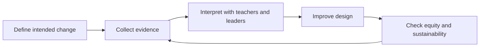

Figure 10. Evidence loop for institutional learning.

### Recommendation

Use mixed evidence: student artifacts, process evidence, teacher practice, competency progression, institutional adoption, and longitudinal outcomes.

A serious evaluation model should include:

1. Baseline description of current practice.
2. Clear definition of intended competencies and outcomes.
3. Evidence from student work, drafts, reflection, oral explanation, and collaboration.
4. Evidence from teacher practice and professional learning participation.
5. Data on participation, equity, persistence, and progression.
6. Review cycles in which teachers and leaders interpret evidence together.
7. Program evaluation for large initiatives such as Academia 360 or national competency programs.
8. Longitudinal follow-up where possible, especially in higher education and workforce preparation.

The Round Table recommendation is that evidence should not be used only to judge. It should be used to learn, improve, and protect educational integrity while systems change.

### Practical Recommendation for Teachers

Use evidence as a feedback loop for your own teaching. The goal is to learn what changed and what should improve next, rather than to collect data for display.

In practice:

1. Define one intended learning change before the unit begins.
2. Collect at least two kinds of evidence, such as student artifacts and reflections.
3. Look for patterns, not only isolated examples.
4. Ask who benefited and who did not.
5. Use the evidence to make one concrete improvement in the next cycle.

Classroom activity examples:

1. Evidence wall. Students post examples of learning evidence, such as drafts, diagrams, questions, corrections, and reflections, then classify what each evidence type shows.
2. What changed review. After a unit, students compare their first and final attempts and identify one change in reasoning, skill, or confidence.
3. Improve the lesson feedback. Students answer three focused questions: what helped learning, what blocked learning, and what should be changed next time.

Evaluation method:

The teacher should compare early and later artifacts, looking for stronger reasoning, better questions, improved accuracy, and clearer reflection. A single moment carries no information about any of these. Student feedback about the learning design can also become evidence, but it should be interpreted with the teacher's professional judgment.

For your own development, conduct a small practice inquiry each semester. Choose a question about your teaching, collect evidence, interpret it with a colleague, and revise the design.

### Sources

[Meeting 5 summary, 09.06.2026](../materials/meeting-5-summary.docx), [Meeting 2 presentation](../materials/meeting-2-presentation.pptx), [Dr. Shafat STEM material](../materials/meeting-2-gabi-shafat-stem.pdf), [Danielle Eisenberg, Default or Design](../materials/meeting-4-default-or-design-ignite-ed.pptx).

# Part VI - Environments, Industry, and Experiential Learning

Meeting 6, on 21 July 2026, asked what balance of physical, virtual, and workplace environments STEM learning needs, and how mentors from industry can be brought into it without the arrangement collapsing into hospitality. Emlen Metz and Avi Salmon presented. These four chapters move outward from the room the teacher stands in to the ecosystem that is supposed to hold that teacher up.

## Chapter 17 - The Classroom Was Built for a Different Problem

### The Challenge

Many classrooms were designed for frontal teaching. But creativity, teamwork, making, AI-supported inquiry, and complex problem solving require different environments.

The preparation for Meeting 6 framed the issue clearly: what physical and organizational environment is required to develop twenty-first-century skills in the age of AI? The question was not only what competencies are needed or how teachers should be trained. It was how the learning, teaching, and organizational environment must be designed so those competencies can actually develop.

This matters because space, time, tools, schedules, roles, and partnerships quietly define what kind of learning is possible. A room organized for one teacher speaking to rows of students carries a theory of learning inside its furniture. It assumes attention, reception, and individual performance. But skills such as creativity, teamwork, multidisciplinary problem-solving, making, critique, and AI-supported inquiry require movement, dialogue, experimentation, iteration, and access to tools.

### The Dilemma

Can existing physical and organizational environments support AI-era STEM skills, or must they be redesigned?

The dilemma is organizational as much as architectural. A school may have a makerspace but no timetable that allows extended projects. A university may have advanced labs but no incentive for cross-disciplinary teaching. A classroom may have digital tools but remain pedagogically frontal. An institution may speak about collaboration while organizing teachers as isolated individuals.

The Round Table question was sharper: can creativity, teamwork, and complex problem solving be developed in classrooms and organizations built for frontal learning?

### Main Positions

The adaptation position says that systems cannot wait for new buildings. Teachers can rearrange rooms, use digital tools, create project cycles, invite external partners, and redesign assignments inside existing constraints.

The specialized-space position says that certain forms of learning need dedicated environments. Makerspaces, labs, studios, simulation rooms, and collaborative learning spaces make certain actions possible: building, testing, prototyping, debugging, observing, and revising.

The ecosystem position says that space alone is not enough. The environment includes the physical layout, organizational structure, teacher collaboration, assessment design, AI tools, industry links, community involvement, and leadership mechanisms that sustain change.

### Pros and Cons

Adaptation is important because most learning still happens in ordinary classrooms. But adaptation can leave the deeper organizational model untouched.

Specialized spaces can signal seriousness and give students access to richer experiences. Yet they can become symbolic islands if only a few students or teachers use them, or if they are disconnected from curriculum and assessment.

Ecosystem redesign is more powerful because it aligns the environment with the intended learning. It asks whether schedules allow project work, whether teachers can co-plan, whether assessment rewards process, whether industry partners are involved, and whether AI is used as a working tool rather than a novelty.

### Where Each Sector Stands

Teachers need environments that reduce friction. If every collaborative activity requires fighting the room, the timetable, and the assessment system, innovation will remain exceptional.

Students need environments where they can act, not only listen. They need to build, test, present, defend, fail, revise, and collaborate.

Institutions need to decide whether they are organized around knowledge transfer or competency development. This question affects spaces, partnerships, evaluation, AI use, teacher roles, and external relations.

Industry can help connect learning environments to real practice. It can provide problems, tools, mentors, visits, and standards of professional work. But industry involvement must serve learning, not reduce education to short-term labor demand.

### Round Table Voices

The Meeting 6 steering-team materials identified physical and organizational environment as a central issue.

The preparation summary listed questions that should guide this chapter: Does real change require organizational redesign, not only teacher training? Are new models of collaborative work among teachers and lecturers needed? Does the current organizational structure support or block innovation? Is responsibility for skill development placed on the individual teacher, or is a broader ecosystem of support required?

Dr. Revital Duek opened the Meeting 6 discussion with the sharpest version of the question: would learning environments look different if education were designed around skills and competencies rather than around knowledge? The rest of the session was an attempt to answer it.

[Avi Salmon's Meeting 6 lecture](../materials/meeting-6-avi-salmon-training-by-experience.pptx) answered from industry. He described hands-on environments, meaning makerspaces, hackathons, technical challenges, and innovation hubs, as places where people learn by designing, building, testing, and improving real solutions. He reported that in engineering training the participants who explored independently and used AI as a support tool were considerably more successful than those who waited for instructions or predefined solutions. He named three qualities that decided the difference: curiosity, determination, and humility. He also described programs in which students teach younger peers or work with their parents on technological challenges, and argued that talented students need room to pursue projects outside the constraints of the curriculum.

Prof. Arnon Bentur put the scaling question to him directly: should experiential learning become an integral part of formal education, or remain an external program? Avi Salmon answered that it must become part of the formal system, and that the obstacle is teacher confidence rather than student interest. Student leadership, peer teaching, and authentic hands-on work are what bridge that gap.

Dr. Gabi Shafat gave the higher-education version. Afeka runs roughly twenty-four maker clubs in fields ranging from electronics to accessibility to music, one of them designing and building musical instruments with 3D printing. Students also work on applied engineering projects, including a fuel-free electric vehicle designed to travel from Dan to Eilat and an autonomous marine vessel entered in an international competition. The decisive feature is that faculty members take part as mentors and that the college funds the space, the equipment, and the academic supervision. Equipment alone would have produced none of it.

Prof. Bentur then named the constraint that blocks most of this in universities: many classes are extremely large, and interactive learning cannot become central until the student-to-faculty ratio changes. This is the environment question in its least glamorous and most decisive form.

Danielle Eisenberg put the scaling objection to this chapter's material directly: a redesigned environment is worth building only if something beyond the school recognizes what comes out of it, and at present nothing does.

Dr. Rinat Itzhaki argued that the target audience should be teacher education, and that the model and its objectives must be defined before implementation begins, so that everyone involved shares the same understanding of the intended outcome.

Dr. Avigdor Zonnenshain closed the meeting by reaffirming learning by doing as the foundation. Makerspaces, Fab Labs, and project-based programs work because they let learners tackle authentic challenges, collaborate, and develop technical and leadership capability together, with mentors and teachers acting as facilitators who guide rather than supply solutions.

[Jan Morrison's TIES material](../materials/meeting-2-ties-jan-morrison.pptx) argued for career-connected learning infused with real-world experiences and expertise. The environment question Meeting 6 asked is the same question from the other end: what has to be true of a building, a timetable, and a budget before career-connected learning is possible in it.

The sixth meeting treated environment as a way to connect teacher profile, AI, competencies, and institutional design, rather than as a side topic.

### Synthesis

Spaces teach. If environments are built for passive learning, they resist skill formation.

A learning environment is a curriculum made visible. It tells students what matters: listening or doing, compliance or inquiry, individual completion or shared problem solving, memorization or design, tool use or tool critique.

The key Round Table insight is that teacher development and learning environments must be designed together. A teacher trained for project-based, AI-supported, competency-centered learning will struggle in a system that provides only frontal classrooms, fixed schedules, isolated courses, and product-only assessment.

The problem is not the classroom as a physical room. The problem is the assumption that changing the teacher is enough while the environment remains unchanged. Figure 11 sets the frontal classroom beside the competency-rich alternative.

| Learning environment | What it supports | Main risk |
| --- | --- | --- |
| Frontal classroom | Explanation and shared attention | Passive learning and limited collaboration |
| Flexible classroom | Discussion, teamwork, critique | Requires teacher design and routines |
| Makerspace or studio | Building, testing, iteration | Can become isolated from curriculum |
| Workplace-linked environment | Authentic constraints and professional context | Needs safeguards and educational purpose |

Figure 11. From frontal classroom to competency-rich learning environment.

### Recommendation

Redesign learning environments around collaboration, making, inquiry, critique, AI use, reflection, and real problems.

Every institution should audit its learning environments with the following questions:

1. What kind of learning does this space make easy?
2. What kind of learning does it make difficult?
3. Can students collaborate, build, test, revise, and present?
4. Can teachers work together, not only individually?
5. Is AI used as a tool for inquiry, design, feedback, and reflection?
6. Are industry and community connections built into the learning environment?
7. Does assessment reward process and capability, not only final answers?
8. Can the environment support lifelong learning for teachers as well as students?

The physical and organizational environment belongs inside pedagogy, not around it. If the goal is competency development, the environment has to be designed for competence and not only for content delivery.

### Practical Recommendation for Teachers

Audit the learning environment before blaming the lesson or the students. Ask whether the space, time, tools, and routines support the kind of learning you are asking students to do.

In practice:

1. Choose one activity that requires teamwork, making, inquiry, or critique.
2. Rearrange the physical or digital space to support that activity.
3. Give students roles that require movement, dialogue, building, testing, or presenting.
4. Use AI as a tool for inquiry or feedback, not as a replacement for student work.
5. After the lesson, ask what the environment made easier and what it blocked.

Classroom activity examples:

1. Room redesign challenge. Students help rearrange the room for collaboration, making, or critique, then explain how the layout changed participation.
2. Makerspace without a makerspace. Use simple materials, paper prototypes, digital sketches, or simulations to let students build and test a model before discussing constraints.
3. Environment audit walk. Students inspect the classroom or school environment and identify what supports or blocks creativity, teamwork, and problem solving.

Evaluation method:

The student should participate actively, use space or materials purposefully, collaborate with others, and explain how the setting affected their thinking. The test is whether the room made something possible that a desk would not have. Evidence can include prototypes, observation notes, peer feedback, and a short environment reflection.

For your own development, keep an environment log for one month. Record which arrangements supported active learning and which pushed the class back toward passive listening. Meeting 6 opened on exactly this question: whether a classroom built for frontal learning can develop creativity, teamwork, and complex problem solving at all.

### Sources

[Meeting 6 summary](../materials/meeting-6-summary.docx), [Avi Salmon's Meeting 6 presentation](../materials/meeting-6-avi-salmon-training-by-experience.pptx), [TIES Jan Morrison presentation](../materials/meeting-2-ties-jan-morrison.pptx).

## Chapter 18 - Virtual, XR, VR, and AI-Supported Learning Spaces

### The Challenge

Virtual, XR, VR, and AI-supported environments create possibilities for simulation, access, and repetition. But they may also detach students from physical, social, and ethical realities.

The Meeting 6 preparation material asked what kinds of learning environments allow students and teachers to work alongside AI. It also asked how digital tools and AI can be integrated without damaging the development of human skills, and which human competencies require the organization of learning to change. That is the right framing for XR, VR, virtual learning, and AI-supported spaces.

The question is not whether new technologies are impressive. The question is whether they deepen the learner's encounter with reality, complexity, evidence, collaboration, and judgment. A virtual environment can make an invisible process visible. It can also become a polished substitute for authentic practice.

### The Dilemma

What is the right balance between physical environments and virtual ones?

Physical learning offers material resistance. Tools break, prototypes fail, measurements vary, teammates disagree, and real constraints appear. These experiences are educational because they force students to connect ideas to consequences.

Virtual learning offers access, safety, repeatability, and scale. Students can simulate rare events, explore complex systems, practice procedures, or visualize processes that are too small, large, expensive, dangerous, or slow to observe directly.

The dilemma is that both are necessary. A purely physical model may be limited, expensive, and unequal. A purely virtual model may weaken embodied experience, social negotiation, and contact with real-world complexity.

### Main Positions

The physical-first position says students should learn through real materials, real tools, real collaboration, and real consequences. This is especially important in engineering, science, design, and makerspace learning.

The virtual-first position says students need access to simulations, AI tutors, immersive environments, and adaptive practice. This can widen opportunity and help students repeat difficult learning experiences.

The blended experiential position says that virtual and physical environments should be designed together. XR, VR, AI, simulation, laboratories, makerspaces, peer discussion, and industry-connected problems each serve different learning functions.

### Pros and Cons

Physical-first learning preserves material and social reality, but may be expensive and limited. Virtual learning is scalable and safe, but can flatten complexity.

Virtual and XR environments are strongest when they do one of three things: make hidden processes visible, allow safe practice of difficult situations, or widen access to experiences students could not otherwise have.

They are weakest when they are used as novelty. A simulated lab that merely entertains does not build scientific judgment. A VR tour that replaces real inquiry may reduce learning to passive experience. An AI-supported environment that gives answers without requiring explanation may weaken thinking.

Blended learning is strongest when the teacher intentionally connects the virtual and the physical. Students simulate, test, build, compare, revise, explain, and reflect. The virtual environment becomes a bridge into deeper understanding, not an escape from effort.

That is the answer this book would give, and it is worth saying plainly that it is not much of an answer. Naming the blend as the winner does not say how much of each, for which subject, at which age, or against what budget, and the Round Table produced none of those numbers because nobody has them. A head of department choosing between a set of headsets and a set of workbenches gets no help from the word blended. This trade-off is left unresolved here, because resolving it in a sentence would be a claim the evidence does not support.

### Where Each Sector Stands

The sector that most often gets this wrong is the one holding the budget. New learning technology is usually bought at institutional level, specified by people who will not teach with it, and handed to teachers as a completed decision. What each group needs is not hard to state. What is hard is that the needs are usually met in reverse order of their importance.

Taking them in the order they are actually served, institutions come first, because they hold the procurement decision. The discipline they lack is a simple one: adopt a learning technology because it serves a defined learning goal, not because it looks modern.

Industry comes second, since it supplies the authentic scenarios, tools, and constraints that make a virtual environment worth entering at all. That contribution is real, and it arrives whether or not anyone has asked what the classroom needs.

Teachers come third, and what they need is professional development in learning design rather than another tool. Handing an educator XR, VR, or an AI system and expecting them to invent the pedagogy alone is the most common failure in this chapter's subject.

Students come last, and their need is the one the budget was supposedly for: practice in multiple modes, physical, digital, collaborative, reflective, and AI-supported, together with an understanding of what each mode cannot do. Reverse that order and most of the procurement decisions in this field would come out differently.

### Round Table Voices

Meeting 6 directly raised the balance between physical environments and virtual ones such as XR and VR.

[Emlen Metz's Meeting 6 lecture](../materials/meeting-6-ai-use-in-education.pptx) answered the question at the level of classroom practice rather than technology. She separated productive uses of AI from unproductive ones. Productive use is dialogic: asking the system to generate counterarguments, challenge an assumption, or explain a concept at a chosen level, rather than requesting a finished answer. Translation into another language or reading level widens access. Active evaluation means checking what AI asserts, and she gave lateral reading as the working example. That skill is difficult when no sources are offered, so the student should ask the system for its sources and then examine those sources for reliability and relevance. Think-first means brainstorming independently before consulting AI, because consulting it early narrows the range of ideas a student will consider.

She also proposed a category the environment discussion needs: AI-robust tasks. These are activities whose value does not collapse when a language model is available: laboratory work, drawing or building models, card sorts, handwriting, pairwise and group discussion, jigsaw grouping, and collaborative work with a defined role for each student. Alongside them she argued for deliberate no-AI practice: students must still practice reading, writing, and mathematics with pen and paper, oral examination, or locked machines, because difficulty and effort are where learning happens and students should not outsource a skill they have not yet mastered. Her term for the failure mode is cognitive surrender, the point at which a student accepts an output because checking it is harder than believing it.

Danielle Eisenberg asked how these environments should serve neurodiverse students and what the design trade-offs are. Emlen Metz answered that AI offers real flexibility and personalization for neurodiverse learners but should complement rather than replace face-to-face interaction, because structured collaborative activity and hands-on experience are what build social confidence and meaningful participation. Dr. Olena Bekh asked the system-scale version: how can education systems, given their size and inertia, equip teachers with the competencies this requires? The answer was accessible professional learning, and more importantly communities of practice in which educators learn from one another rather than from a single training event.

Dr. Noa Ragonis brought the question back to a case the field has already run. During the COVID-19 pandemic, whether virtual laboratories could replace physical ones became a live issue, and the conclusion was that the two must be combined, because each carries distinct educational value. Virtual laboratories, AI, and digital tools improve access and flexibility, but physical experimentation, prototyping, and engineering design remain essential. She pointed to at-home making kits and to teacher training that uses 3D printers, laser cutters, and Arduino as evidence that hands-on learning has not been superseded. Dr. Einat Sprinzak made the parallel point for simulation: it has genuine educational value, and it complements rather than replaces hands-on work and active student participation.

Prof. Gil Noam argued that the debate is framed too narrowly. Framing this as AI or hands-on learning misses the more interesting question, which is how AI can act as a collaborative learning partner. He meant systems designed to ask questions rather than supply answers, students collaborating with each other while interacting with AI, and the teacher strengthened in the role of facilitating collective reflection. Emlen Metz extended this into classroom design: have students compare AI-generated arguments, evaluate the reliability of sources, and analyze together why two AI responses differ. Avi Salmon noted that current systems can already be prompted to guide a student through questions rather than answer them, and that the teacher's job is to create the discussion and independent thinking that happen before a student turns to the tool.

Dr. Yael Granot-Bein widened the frame to the educator's own position. When students increasingly rely on recorded lectures and AI rather than attending class, teachers and professors have to redefine what their added value is beyond delivering content. Avi Salmon offered the flipped classroom as one answer: content studied independently, and contact time spent on discussion, experiential learning, mentorship, and the practical work that neither a recording nor a model can replicate.

[Dr. Iris Pinto's Meeting 4 lecture](../materials/meeting-4-iris-pinto-future-trends.pdf) adds useful conceptual language. She described multimodal AI, which integrates text, image, audio, and video, and phygital AI, which connects physical and digital realities through AR and VR. She also described AI-enabled learning through simulations, data, and immersive environments. These concepts help define why the virtual and physical should be connected rather than separated.

### Synthesis

Virtual environments should extend learning, not replace the human, social, and material dimensions of learning.

The best virtual learning spaces do not remove reality. They prepare students to engage reality more intelligently. They let students see a process, rehearse an action, test a model, compare alternatives, or receive feedback before returning to physical, social, and ethical practice.

The weakest virtual learning spaces replace friction with smoothness. They create the feeling of learning without the burden of making decisions, facing consequences, collaborating with others, or defending reasoning.

AI-supported environments must therefore be judged by what they ask students to do. Do students only consume? Or do they question, build, explain, compare, decide, and reflect?

### Recommendation

Use XR, VR, and AI when they deepen experience, widen access, or make invisible processes visible. Avoid using them as decoration or as a substitute for authentic practice.

Institutions should apply five design tests before adopting virtual or AI-supported learning spaces:

1. Does the tool serve a clearly defined learning goal?
2. Does it require active student reasoning rather than passive viewing?
3. Does it connect to physical, social, or professional reality?
4. Does it strengthen human competencies such as collaboration, communication, judgment, and ethical responsibility?
5. Does it produce evidence teachers can interpret and use?

The Round Table recommendation is not physical instead of virtual, or virtual instead of physical. It is intentional integration. The learning environment should be rich enough to include simulation and material practice, AI support and human judgment, access and authenticity.

### Practical Recommendation for Teachers

Use virtual, XR, VR, and AI-supported tools only when they serve a learning function that ordinary instruction cannot serve as well.

In practice:

1. Define the learning purpose before choosing the tool.
2. Use simulation to reveal hidden processes, rehearse difficult actions, or widen access.
3. Connect every virtual experience to discussion, explanation, or physical practice.
4. Ask students to name what the virtual model shows and what it leaves out.
5. Collect evidence of reasoning, not only evidence that students completed the experience.

Classroom activity examples:

1. Simulation plus reality. Students explore a virtual simulation, then compare it with a physical demonstration, data set, or real-world case.
2. What the model hides. After using an XR, VR, digital, or AI tool, students list what the tool made visible and what it simplified or excluded.
3. Design test for tools. Students evaluate a learning technology using five criteria: purpose, active reasoning, connection to reality, human skills, and evidence for the teacher.

Evaluation method:

The question is what came back with the student from the simulation. The student should explain what the tool revealed, what it hid, and how the experience changed their reasoning. Strong work includes critique of the tool, not only enjoyment or technical use.

For your own development, test one digital or AI-supported environment as a learner, then write a short design note: what it made visible, what it hid, what student action it required, and how it should be assessed.

### Sources

[Meeting 6 summary](../materials/meeting-6-summary.docx), [Emlen Metz's Meeting 6 presentation](../materials/meeting-6-ai-use-in-education.pptx), [Dr. Pinto presentation](../materials/meeting-4-iris-pinto-future-trends.pdf).

## Chapter 19 - Industry as a Learning Partner

### The Challenge

STEM learning is often disconnected from the contexts where STEM is practiced. Students may master school tasks without seeing how knowledge operates in real work.

The disconnection is not a failure of enthusiasm. It is structural. School problems are bounded, single-answer, and scheduled to fit a lesson. Professional problems are underspecified, constrained by cost and time, contested between stakeholders, and solved by teams over months. A student can be excellent at the first kind and unprepared for the second. AI widens this gap, because the bounded school problem is exactly the kind of problem a language model solves best.

Dr. Iris Pinto described this gap from both sides. Having moved from Intel into the Ministry of Education, she saw how differently the two systems define a good outcome, how differently they treat failure, and how rarely they share a vocabulary. Industry treats a failed prototype as information. Education often treats a failed attempt as a lower grade.

### The Dilemma

Should industry be an occasional guest in education, or an ongoing partner in designing and supporting STEM learning?

Behind this sits a sharper question about purpose. Education serves the learner across a whole life. Industry serves a market that changes in a few years. A partnership that lets the second define the first will produce narrow training that ages badly. A partnership that keeps industry at arm's length will produce learning that never meets a real constraint.

### Main Positions

The guest model brings industry speakers and site visits. The mentorship model creates continuing relationships. The deep partnership model supports projects, externships, real problems, and feedback loops.

A fourth position, raised through Jan Morrison's TIES material, treats the question as one of system design rather than individual relationships. In a STEM ecosystem, industry is not a visitor to a school. Schools, colleges, employers, museums, community organizations, and out-of-school programs form a connected learning landscape, and a student moves through it. On this view, asking whether industry should visit is the wrong question. The question is whether the region has an ecosystem at all.

### Pros and Cons

Guest visits are easy but limited. Mentorship creates human connection but requires continuity. Deep partnership gives authenticity, but must protect educational purpose and equity.

Equity is the risk most often underestimated. Partnerships form where the partners already are. Schools near a technology corridor accumulate mentors, equipment, and site visits. Schools in peripheral regions accumulate none of it. A partnership strategy that grows by enthusiasm alone will widen the gap it was meant to close, and only deliberate allocation, remote formats, and shared regional programs will prevent that.

Continuity is the second risk. Partnerships are usually built on one committed engineer and one committed teacher, which is why so few of them outlive a job change.

### Where Each Sector Stands

For industry partners, the honest constraint is time. Engineers volunteer, and volunteering competes with delivery schedules. Partnerships that ask for a full day per month fail. Partnerships that ask for two hours per term, with the teacher doing the pedagogical translation, survive.

For school leaders, the constraint is liability, scheduling, and transport. These are unglamorous and decisive. A partnership that no one has timetabled does not exist.

For students, the risk is that a visit becomes recruitment. The purpose is to see how knowledge behaves under real constraints, not to be sorted into a career track at fifteen.

For policy makers, the constraint is that none of this scales on goodwill. Partnership models and safeguards have to be defined centrally, or the map of partnerships will go on matching the map of who already had connections.

### Round Table Voices

Jan Morrison emphasized externships, industry collaboration, and career-connected learning. Her argument was that teacher externships matter more than student visits, because a teacher who has spent two weeks inside a working engineering team redesigns every unit afterwards, while a student who visits for an afternoon remembers the building.

Avi Salmon brought the industry perspective on future skills and AI as a working tool. His point was that industry no longer needs graduates who can perform routine technical production, because AI performs it. Industry needs people who understand a problem deeply enough to know when the automated answer is wrong.

[His Meeting 6 lecture](../materials/meeting-6-avi-salmon-training-by-experience.pptx) made the partnership concrete rather than aspirational. The programs he described run in both directions. Inside the company, engineering upskilling happens through hands-on formats: a hardware challenge, a processor teardown workshop, a crash-course technical competition, an autonomous-driving contest. All of them are built on the finding that people who tolerate uncertainty and explore independently learn more than people who wait for the specification. Outside it, the same logic produces young technology leadership programs, students teaching younger students, and challenges that parents and children build together. The common element is that the learner produces something under real constraints, which is precisely what a site visit cannot deliver.

Jan Morrison pressed the point that matters most for scale: how should teacher education institutions prepare future teachers to use makerspaces and experiential learning, rather than concentrating only on the needs of teachers already in post? Avi Salmon answered that teacher educators have to experience it first. Until they have been learners in a makerspace themselves, they cannot integrate the approach into what they teach. Prof. Arnon Bentur's companion question, taken up in Chapter 17, asked whether such programs belong inside formal education at all.

Dr. Pinto described the disconnect she observed between education and industry after moving from Intel into the Ministry of Education.

Dr. Avigdor Zonnenshain connected the same theme to lifelong learning: the professional context students meet in school should teach them that learning does not stop at graduation, because in industry it does not.

### Synthesis

Industry should not replace education's broader purpose. But it can make STEM learning more authentic, current, and motivating.

The practical test of a partnership is what changes in student work. If the industry connection changed nothing about what students produced, revised, or understood, it was hospitality rather than education. If a student revised a design because of a real constraint, asked a better question because of a professional conversation, or understood why a method matters because they saw it used, the partnership did its work.

### Recommendation

Build sustained education-industry partnerships around mentoring, real problems, teacher externships, student projects, site visits, and feedback loops. Figure 12 arranges those forms as a ladder, and most partnerships never leave the bottom rung.

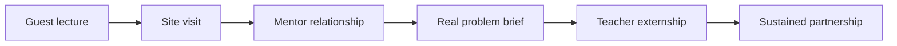

Figure 12. The partnership ladder, from one-off visit to sustained collaboration.

The ladder matters because most education-industry contact stops on the first rung and gets counted as partnership anyway. Each step costs more and returns more. A guest lecture costs an hour and changes one afternoon. A site visit costs a day and changes what students picture when they read a problem. A mentor relationship costs a term and changes how a student revises. A real problem brief costs planning time and changes what the teacher assesses. A teacher externship costs weeks and changes every unit that teacher writes afterwards. Sustained partnership costs institutional commitment and changes the curriculum.

The recommendation is not that every school should reach the top rung. It is that a school should know which rung it is on and move up one. Describing a yearly guest lecture as an industry partnership is not dishonest so much as unambitious, and the language hides the distance still to travel. Naming the rung makes the next step visible.

Two things make the ladder collapse. The first is dependence on one person. A partnership that lives inside a single teacher's contact list ends when that teacher moves, so the relationship has to be institutional before it is worth building on. The second is asymmetry, where the school receives and the company gives. Partnerships that last give the company something it wants, usually early sight of future employees and sometimes a genuine problem worked on by people with no stake in the existing answer. That exchange should be stated rather than assumed.

### Practical Recommendation for Teachers

Bring industry into learning as context, not decoration. A guest lecture is useful only if it connects to student work before and after the visit.

In practice:

1. Identify one unit where real professional context would deepen learning.
2. Invite an industry partner to provide a problem, constraint, example, or feedback.
3. Prepare students with disciplinary background before the interaction.
4. Ask students to produce something after the interaction: revised design, reflection, question set, or presentation.
5. Debrief what students learned about knowledge, teamwork, tools, uncertainty, and professional judgment.

Classroom activity examples:

1. Real constraint brief. An industry partner or teacher provides a realistic constraint, such as cost, reliability, user need, safety, or time, and students revise their solution accordingly.
2. Professional question clinic. Students prepare questions for a guest from industry, then turn the answers into design criteria or career-learning reflections.
3. Feedback from practice. Students present a project to an external mentor or professional and revise one element based on feedback.

Evaluation method:

What matters is what the student did with the access. The student should ask relevant questions, respond to constraints, revise based on feedback, and explain what changed because of the industry connection. The assessment should protect learning depth, not reward contact with industry as a symbolic event.

For your own development, build one sustained professional connection per year: an externship, site visit, mentor relationship, or recurring project partner.

### Sources

[Meeting 2 presentation](../materials/meeting-2-presentation.pptx), [TIES Jan Morrison presentation](../materials/meeting-2-ties-jan-morrison.pptx), [Meeting 4 presentation](../materials/meeting-4-presentation.pptx), [Meeting 6 summary](../materials/meeting-6-summary.docx), [Avi Salmon's Meeting 6 presentation](../materials/meeting-6-avi-salmon-training-by-experience.pptx).

## Chapter 20 - Ecosystem Around the Teacher

### The Challenge

Expecting individual teachers to transform STEM education alone is unrealistic.

Almost every recommendation in this book adds something to a teacher's workload. Design tasks so thinking is visible. Learn the tools before setting policy. Collect evidence. Build partnerships. Reflect each semester. Taken one at a time, each is reasonable. Taken together, they describe a job no one has time to do. This is where reform proposals usually fail, and they fail quietly. Teachers do not refuse. They run out of hours, and the reform survives as language in a document.

The TALIS material named the same problem from the teacher's side. Workload, pressure, behavior, diverse learning needs, and constant change are job demands. Learning opportunities, agency, leadership, support, and professional status are resources. When demands rise and resources do not, the system gets exhaustion instead of transformation.

### The Dilemma

Is skill development mainly the teacher's responsibility, or does it require a full ecosystem around the teacher?

The question is not rhetorical, and the ecosystem answer is not obviously the right one. Teacher-centered responsibility has a real argument behind it. The classroom is where the change either happens or does not, professional autonomy is worth protecting, and reforms designed above the teacher and delivered downward have a poor record. Ecosystem answers can also be a way of postponing action until conditions are perfect, which they never are.

The arithmetic of the previous section is harder to argue with. If every recommendation in this book adds to a workload that is already among the leading reasons teachers leave, then a teacher-centered answer is a plan to exhaust the people the plan depends on. The real question is where the additional capacity comes from, and there are only three sources: the teacher's own unpaid time, the institution's budget and timetable, or a wider set of actors who each carry a defined piece.

### Main Positions

Teacher-centered responsibility honors professional agency. Institution-centered responsibility creates structure. Ecosystem responsibility distributes support across peers, leaders, technology, policy, industry, and community.

The strongest objection to the ecosystem position deserves stating plainly: when responsibility is shared among everyone, it can end up held by no one. "The ecosystem should support teachers" is a sentence with no subject who can be asked what they did about it. An ecosystem is only real if each part of it has a name, a budget line, and something it can be held to.

### Pros and Cons

Teacher-centered responsibility empowers educators while quietly transferring the system's unsolved problems to them. Being the cheapest of the three, it is also the one most often chosen: no budget line, no reorganization. Institution-centered responsibility creates real support, but it tends to arrive top-down, reaching teachers as a program they were enrolled in rather than one they shaped. Ecosystem responsibility is the strongest of the three. No single decision can put it in place.

Coordination is not free. Every additional partner adds meetings, alignment work, and points of failure. An ecosystem with seven weak links is worse than three strong ones. The practical advice is to build the ecosystem one link at a time and to strengthen a link before adding another.

The remedy is unglamorous. Name one accountable role for each link in the chain and put a date on it, because the alternative is four institutions each able to point at the other three.

### Where Each Sector Stands

This is the chapter where the sector question is the whole subject, so it is worth stating in terms of what each actor owes rather than what each actor wants.

Teachers owe the system their practice and their judgment, and they are the only actor in the chain currently delivering in full. What they are owed in return is support rather than expectation, which in practice means time that appears on a timetable and not in an evening.

Institutional leaders owe enabling conditions, and the test of whether they have delivered is whether a teacher can name the specific hour, room, or budget line that was created for this work. A statement of institutional commitment that survives contact with no calendar is not a condition.

Industry and community owe context: real problems, real constraints, and people who will come back a second time. The contribution is usually offered as generosity, which is why it stops when the person who offered it changes jobs.

Policy owes continuity beyond individual champions. Every actor above can be replaced by an equally capable successor except the policy that funded them, and reforms in this field die far more often from an expired budget line than from a bad idea.

The [Envisioning Educator Roles for Transformation](../materials/envisioning-educator-roles-for-transformation.pdf) material adds a practical design discipline to this ecosystem view. New educator roles should not be invented as slogans. They should be specified through concrete questions: what is the role called, where does it sit in the system, what responsibilities does it carry, what is it not responsible for, what qualifications are required or preferred, what compensation and working conditions make it sustainable, and what happens if the role is or is not filled. This turns the idea of an ecosystem into an organizational design task.

The question about what a role is *not* responsible for is the one most often skipped, and it is the one that protects teachers. An ecosystem that only adds responsibilities is a longer list, and teachers read it as one.

### Round Table Voices

Meeting 6 asked whether the teacher alone can carry the responsibility or whether a full ecosystem is needed.

Dr. Avigdor Zonnenshain emphasized education that fosters lifelong learning and team-driven practice, and brought a systems-engineering habit to the discussion: a system that depends on the exceptional performance of its individual components is a badly designed system.

Dr. Eli Eisenberg and Prof. Arnon Bentur framed the overall Phase III process around the future educator profile and its system conditions. Their sequence of dilemmas was deliberate: profile, competencies, AI, professional development, environments. Each earlier answer creates a system requirement that a later one has to meet.

Jan Morrison's ecosystem argument from Meeting 2 returns here in a different form. She argued that transdisciplinary and problem-based learning fail when inserted into systems built for isolated individual teaching. The ecosystem is the precondition for the reform rather than an enhancement to it. At the closing session she extended the same logic to the Round Table itself, urging it to connect with other international round tables and professional networks so that expertise is exchanged, effort is not duplicated, and the group's work reaches practice. A group that argues for ecosystems should not operate as an island.

Dr. Eli Eisenberg's closing remarks drew the six meetings together around the same claim. Preparing learners for the future means rethinking which competencies students should develop and, at the same time, the roles of teachers, higher education, industry, and the learning environment. Three findings recurred: there is no single ideal educator profile, and effective education may need diverse and complementary roles; teachers need to develop the competencies they are expected to cultivate, particularly around AI and experiential learning; and learning should increasingly incorporate authentic workplace experience, industry mentors, and hands-on activity. He also insisted that the outcome be a product rather than a conversation: a draft report circulated for comment, finalized collectively, and published.

### Synthesis

The teacher remains central, but not solitary.

Central means the teacher still holds the judgment that cannot be delegated: what this student needs, whether this evidence is trustworthy, what learning is for. Not solitary means the system carries the load that does not require that judgment: materials, tools, time, structure, evaluation capacity, and partnership infrastructure. Reform fails when these are reversed, when the system dictates the judgment and leaves the teacher to find the time.

### Recommendation

Define the AI-era educator as the center of a designed support ecosystem: peers, leaders, mentors, AI tools, teaching centers, industry, policy, and community. Figure 13 draws that ecosystem as it currently runs, which is not the same as how it should.

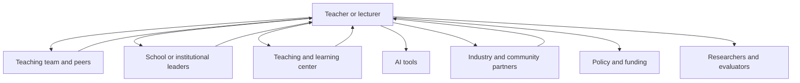

Figure 13. The support ecosystem around the AI-era educator. Four relationships return; three do not.

The diagram is drawn as the system currently runs, not as it should. Seven relationships lead outward from the teacher and four lead back. The three that do not return are AI tools, policy and funding, and researchers and evaluators, and that asymmetry is the recommendation of this chapter rather than an oversight in the drawing.

Each of the three is one-way for a different reason. AI tools take a teacher's judgment, corrections, and classroom knowledge and return a product the teacher had no part in shaping; no mechanism exists by which a teacher's experience of a tool reaches the people who build it. Policy and funding set the conditions a teacher works under and receive, in return, compliance reports written for the system's convenience rather than the teacher's. Researchers and evaluators collect from classrooms and publish to each other, and the teacher whose class supplied the data usually learns nothing from it.

So the recommendation is narrow and it is testable. Make those three relationships return. For AI tools, that means procurement decisions that require a supplier route for classroom feedback and an institution willing to use it. For policy and funding, it means that every requirement placed on teachers arrives with a named resource attached, and that the parts of the system that fail to deliver theirs are as visible as the teachers who fail to deliver theirs. For researchers, it means that a study conducted in a school owes that school a readable account of what was found, before publication rather than after.

None of the three is expensive. All three are currently nobody's job, which is the objection Chapter 24 raises against the whole ecosystem idea, and the only answer to it is to name the piece each actor owes and to notice when it does not arrive.

### Practical Recommendation for Teachers

Build a support map around your teaching. You are central, but not solitary.

In practice:

1. List the people and resources that currently support your teaching.
2. Identify one missing support: peer planning, leadership time, AI guidance, assessment help, industry contact, community partner, or teaching center support.
3. Ask for or create one concrete support structure.
4. Define the missing support as a real role: responsibility, boundaries, qualifications, time, and working conditions.
5. Share one teaching challenge with the ecosystem instead of solving it alone.
6. Revisit the map each semester and strengthen weak links.

Classroom activity examples:

1. Learning ecosystem map. Students map who and what supports their learning: teacher, peers, family, AI tools, mentors, community, school systems, and industry.
2. Peer support protocol. Students rotate roles as explainer, checker, questioner, and reflector, showing that learning is distributed across a group.
3. Support request exercise. Students identify one support they need to learn better and propose who in the ecosystem could provide it.

Evaluation method:

Look for a student who asked for help early and gave some back. The student should identify available supports, seek help appropriately, contribute to peers, and explain how the ecosystem improved learning. Strong performance includes both independence and wise use of others.

For your own development, move from self-improvement to ecosystem-building. This means developing personal competence while also creating conditions that help colleagues and students. It follows Dr. Zonnenshain's system perspective and the Meeting 6 question of whether skill development belongs to the teacher alone or to a full support system.

### Sources

[OECD Teaching Compass](../materials/oecd-teaching-compass.pdf), [Envisioning Educator Roles for Transformation](../materials/envisioning-educator-roles-for-transformation.pdf), [TALIS 2024 material](../materials/talis-2024-us-short.pdf), [Meeting 6 summary](../materials/meeting-6-summary.docx).

# Part VII - A Compass for STEM Education in the AI Era

The Round Table closed in August 2026. These chapters stop reporting and start arguing. They gather what the six meetings converged on, set out a lesson model built from it, put the strongest case that can be made against that model, and say what each audience might do next. Chapter 24 is the one to read if you read only one.

## Chapter 21 - Insights Across the Six Meetings

Seven insights survived the six meetings. Survived is the right verb. These are not the ideas that were most popular, and they are not a summary of what was said. They are the points that were put under pressure by people who disagreed and were still standing at the end. The coherence between them is partly imposed by this book. The meetings themselves were less tidy, and Chapter 24 records where the tidiness is doing work it has not earned.

First, the future educator profile should be common in foundation but diverse in expression. Every educator needs a baseline of AI literacy, ethical judgment, pedagogical responsibility, and commitment to student agency. Not every educator needs the same strengths or roles. Meeting 2 opened on this question expecting to produce a profile and closed without one, for a reason worth stating: a single profile is either so general that it commits to nothing or so demanding that nobody meets it. The cost of the diverse answer is coordination. A group of specialists that nobody coordinates is not a team. It is a staffing accident.

Second, competencies must be embedded in disciplinary learning. Skills become real through practice, reflection, feedback, and repeated use in meaningful contexts. [Dr. Gabi Shafat's Afeka material](../materials/meeting-2-gabi-shafat-stem.pdf) is the strongest evidence for this, because it shows competency work built into engineering courses rather than added beside them. The cost is curriculum time, and no meeting produced an account of what comes out to make room.

Third, teachers need lived experience with the competencies they cultivate, but they do not need to be perfect models of everything. The system should distribute expertise. Meeting 3 was convened to settle this and did not. It relocated the question instead. Prof. Sigal Tifferet argued that for educators without pedagogical training the workable answer is concrete tools rather than abstract skills, and Prof. Russell Tytler replied that competencies such as creativity and problem solving are context-dependent and do not decompose into fixed components. What this book adopts is that a teacher needs enough lived practice to model a competency and to judge it. That is a lower bar than mastery and a higher one than familiarity. Chapter 9 admits that nobody has defined enough.

Fourth, AI must be designed into learning. Ignoring it or banning it will not work. The question is how to make thinking visible and keep responsibility human. Danielle Eisenberg's default-or-design framing is the sharpest version of this: AI is already in the classroom, so the only remaining choice is whether its role was decided or inherited. The cost of deciding is that design takes time teachers do not have, which is why Chapter 24 treats workload as the objection this book cannot answer.

Fifth, professional development must become infrastructure. Workshops are not enough. Teachers and lecturers need long-term support. Meeting 5 was the meeting that most clearly named a problem with no owner. Ministries, universities, schools, and individual educators each hold part of the responsibility, and none holds enough of it to act alone.

Sixth, environments matter. Physical space, virtual tools, industry connections, mentoring, organizational structures, and assessment systems all shape what learning is possible. Dr. Revital Duek's opening question at Meeting 6 is the one worth keeping: would learning environments look different if education had been designed around competencies rather than knowledge? The honest answer is that most of them would be unrecognizable, and almost none of them have changed.

Seventh, equity must be designed from the start. AI can widen gaps if advantaged students use it to amplify thinking while disadvantaged students use it to replace thinking. This is the insight the Round Table stated most often and examined least. It appears at Meetings 1, 4, and 6 as a warning and never as a measurement, and no participant brought data on how AI use actually differs across student populations. Figure 14 lays the six meetings out in sequence with the question each one opened.

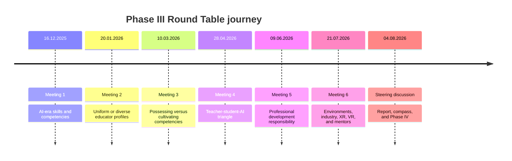

Figure 14. The six-meeting journey of the Round Table, and the question each meeting opened.

### What the Six Meetings Did Not Settle

Four questions were raised repeatedly and closed by nobody. They are listed here rather than buried because a synthesis that reports only convergence is a misleading document.

Who pays. Every recommendation in this book carries a cost, and Meeting 5 established that no actor currently owns it. The Round Table costed none of its proposals.

What comes out. Embedding competencies inside disciplinary courses means something already in those courses leaves. No meeting named what.

How much possession is enough. Chapter 9 offers indicators rather than a threshold, and that is a considered evasion rather than an answer.

Whether any of it scales. Danielle Eisenberg named the constraint at the final meeting: assessment regimes, university admissions, and employer expectations still reward what they have always rewarded. The group agreed with her, and then continued as though she had not spoken.

These are not gaps in the record. They are the actual state of the question, and Chapter 26 carries them into Phase IV.

### Practical Recommendation for Teachers

Use the seven insights as a personal professional compass. Do not try to act on all of them at once. Choose one insight each term and translate it into a visible classroom practice.

In practice:

1. Select one insight that is most urgent for your students.
2. Define one teaching behavior that would make the insight real.
3. Design one student task that reflects it.
4. Collect evidence that the practice changed learning.
5. Share the result with colleagues and revise.

Classroom activity examples:

1. Seven insights reflection. Students choose one insight, such as visible thinking or equity by design, and explain how the class practiced it during the unit.
2. Human above machine review. After an AI-supported task, students identify where human judgment mattered most.
3. Equity check discussion. Students examine whether a learning tool or activity helped all learners equally, and propose one adjustment.

Evaluation method:

The student should connect classroom experience to the larger themes of this book: human judgment, competencies, evidence, equity, AI responsibility, and support systems. What is assessed is the connection rather than the activity that prompted it. Strong work shows that the student can move from one activity to a broader principle.

For your own development, review the seven insights at the end of each semester and ask: where did I keep human judgment central, where did I make thinking visible, where did I support equity, and where did I still work alone? This turns the Round Table synthesis into a recurring teacher reflection tool.

## Chapter 22 - Guiding Principles

Twelve principles carry the argument of this book. They are not independent, they are not equally important, and several of them pull against each other. Setting them out as a list is a convenience, and Figure 15 groups them into four bearings; the paragraphs after it say what both the list and the grouping conceal.

1. Keep the human above the machine.
2. Treat AI as part of the learning ecology, not as a replacement for teachers.
3. Preserve disciplinary rigor while embedding human competencies.
4. Design for visible thinking, not polished outputs.
5. Build diverse educator ecosystems, not one impossible ideal profile.
6. Give teachers and lecturers lived experience with new learning models.
7. Make professional development continuous and supported.
8. Connect STEM learning to real-world practice and industry.
9. Use physical, virtual, and AI environments purposefully.
10. Evaluate reforms with evidence and feedback loops.
11. Design for equity from the start.
12. Build institutions for lifelong learning.

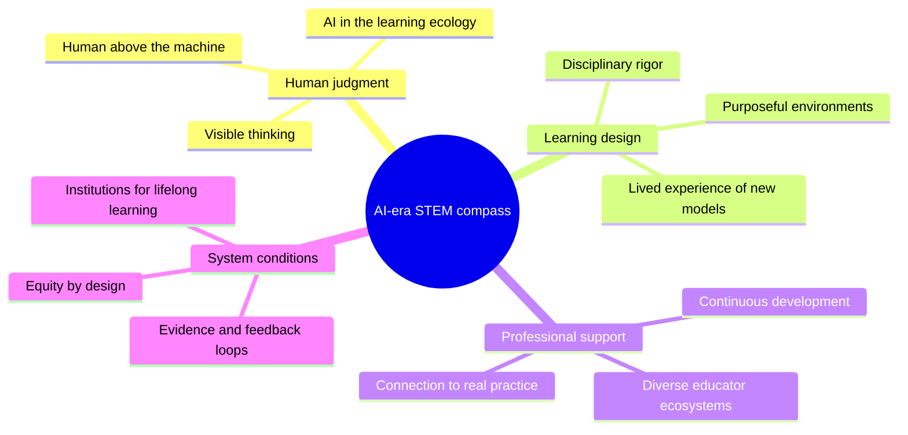

Figure 15. The compass: all twelve guiding principles, grouped into four bearings.

A list this clean hides where it came from, and this is the one chapter in the book where twelve claims arrive without a source attached. Each was argued somewhere in these pages by someone who was in the room, and a reader who wants to weigh a principle should be able to find that argument, not just the sentence. The first two came out of the fourth meeting and the teacher-student-AI triangle; Chapters 10 and 13 carry them. The third and fourth came out of the second and third meetings, where the group worked through what it means to possess a competency rather than perform one; Chapters 6, 7, and 9 carry them. The fifth came out of the second meeting's central question, whether the field needs one teacher profile or many; Chapters 4 and 5 carry it. The sixth, seventh, and tenth came out of the fifth meeting on who owns professional development and what happens after the workshop ends; Chapters 14, 15, and 16 carry them. The eighth, ninth, and twelfth came out of the sixth meeting on learning environments, industry partnership, and mentors; Chapters 18, 19, and 20 carry them. The eleventh runs through all six meetings and is argued hardest in Chapter 19.

Three things here are the author's and not the room's, and it would be dishonest to let them pass as findings. The Round Table never ranked the principles: the ordering set out below, which puts the first, the fourth, and the eleventh ahead of the rest, is a judgment made while writing this book, and no participant endorsed it. The Round Table never named the conflicts either. The three pairs described next were visible in the discussions, and nobody set them out as conflicts. And the four bearings in Figure 15 are a grouping imposed afterwards for legibility. The principles belong to the Round Table. The architecture around them does not.

Three pairs of these principles conflict. Pretending otherwise is how a compass becomes decoration.

Rigor and visible thinking compete for time. The third principle asks for disciplinary depth and the fourth asks students to show their reasoning throughout. Both are right, and both spend the same hours. The workable resolution is to make thinking visible at a few well-chosen moments rather than continuously, which is the design Chapter 23 uses.

Diverse ecosystems and continuous development compete for people. The fifth principle asks institutions to build teams of specialists and the seventh asks them to keep everyone learning. An institution that attempts both with the staff it already has will do neither. The resolution is sequence rather than compromise: build the team first, because a team can absorb development that an individual cannot.

Industry connection and equity compete structurally, and this is the sharpest conflict in the list. The eighth principle asks for real-world partnership and the eleventh asks for equity by design. Partnerships form where partners already are, so pursuing the eighth will undermine the eleventh unless allocation is deliberate. Chapter 19 treats this at length and does not fully solve it.

If resources force a choice, the order is the first, the fourth, and the eleventh. Keeping human judgment above the machine, making thinking visible, and designing for equity are the three that cannot be recovered later, because a system that loses them stops generating the evidence that would show anything was lost. The other nine can be built once those hold. A reader who adopts only those three has taken the argument of this book. A reader who adopts the other nine without them has taken its vocabulary.

Cost is the other thing the list conceals, and it is the reason compasses of this kind so often stay on the wall. Four of the twelve are free in the sense that matters. The first, the third, the fourth, and the tenth ask a teacher or an institution to decide differently, not to spend. They cost attention and the willingness to break a habit, which is not nothing, but they need no budget line and no permission from above.

Four need money. The sixth asks for teachers to be released long enough to experience a new learning model themselves, which means paying for cover. The seventh asks for development that continues, which means recurring hours rather than a one-off day. The ninth asks for physical, virtual, and AI environments used purposefully, which means equipment, licenses, and someone to maintain them. The eleventh, taken seriously, means spending more per student on the students who are hardest to reach, which is the point at which Danielle Eisenberg's question about what scales stops being rhetorical.

The last four cannot be bought at all. The second, the fifth, the eighth, and the twelfth ask an institution to change its shape: how it staffs a department, who counts as an educator, whom it partners with, and what it believes it owes a graduate five years on. These move slowest, and a school that begins with them will have nothing to show for two years. A school that begins with the free four will have something to show within a term, and will have generated the evidence it needs to argue for the other eight.

Chapter 23 turns these principles into a single teachable sequence.

### Practical Recommendation for Teachers

Turn the guiding principles into a short design checklist before launching a major task, project, or AI-supported activity.

In practice:

1. Ask whether the task keeps human judgment above AI.
2. Check whether disciplinary rigor is preserved.
3. Identify where student thinking will be visible.
4. Decide how equity risks will be reduced.
5. Plan how evidence from the task will improve the next version.

Classroom activity examples:

1. Principle-to-task checklist. Before a project, students and teacher check which guiding principles are built into the task and which are missing.
2. Visible thinking checkpoint. Students pause mid-task to show evidence of reasoning, uncertainty, tool use, and next steps.
3. Principle evidence gallery. At the end of a unit, students display artifacts that show one guiding principle in action.

Evaluation method:

Stating the principle proves nothing. Ask for the artifact behind it. A student succeeds when they can show an artifact, decision, revision, or reflection that proves visible thinking, responsible AI use, collaboration, equity, or another guiding principle in action.

For your own development, treat these principles as a checklist rather than a second to-do list. At the end of the term, take the one insight you chose in Chapter 21 and ask which of these principles it served and which it quietly ignored. That is a shorter exercise than an annual plan, and it is far more likely to actually happen.

## Chapter 23 - The Human-First AI Learning Cycle

The guiding principles become practical when teachers design a learning sequence in which students meet the world before they meet AI. AI should enter after observation, curiosity, early reasoning, measurement, and prediction. It should help students expand, compare, model, and validate understanding, not replace the human work of learning.

This is the book's single most transferable proposal. Everything else in these pages describes what should be true of AI-era STEM education. This chapter describes an order of operations that a teacher can use on Monday.

### Why Order Matters

The sequence is the whole argument. The same ten activities in a different order produce a different education.

If AI comes first, it supplies the frame. The student receives a vocabulary, a model, and a set of expected answers before they have looked at anything themselves. Every later observation is then read through that frame. The student is not wrong, exactly, but the thinking has been outsourced at the only point where it was formative.

If AI comes after the student's own explanation, its role inverts. It becomes something to compare against, argue with, and check. The student now has a position, which means they have something to defend or revise. This is the difference between a tool that thinks for you and a tool that gives you something to think about.

### A Worked Example

This cycle can be used in many STEM topics. A simple example is a swing in a park. Students first observe the swing, form explanations with the teacher, measure the motion, make predictions, and only then use AI to deepen the model, build a simulator, and test whether the simulator fits reality.

The example is deliberately humble. A swing needs no laboratory, no budget, and no specialist knowledge to observe. Students will notice that pushing harder does not change the timing much, which contradicts almost everyone's first intuition. That contradiction, discovered before AI enters, is the engine of the whole sequence. A student who has been surprised by a swing will interrogate an AI explanation of a pendulum. A student who was told about pendulums first will not.

The same structure works for a falling object, a circuit that dims, a plant that grows toward light, a bridge made of paper, a queue at the cafeteria, or a set of local weather records.

### The Ten Steps

1. Observe the phenomenon. Begin with the real world. Students watch, sketch, describe, photograph, or record what happens before naming formulas or asking AI.
2. Form a human thesis. Students explain what they think is happening and why, with teacher guidance and peer discussion. The first explanation may be incomplete, but it must be theirs.
3. Experiment and measure. Students collect evidence through measurement, comparison, controlled change, or repeated observation.
4. Predict before AI. Students use their own explanation and data to predict what will happen if one condition changes. They also state what evidence would prove them wrong.
5. Use AI as a learning partner. Students ask AI to explain the topic, identify variables, suggest common mistakes, or propose a simple model. They compare the AI answer with their own evidence.
6. Explain verbally what was learned. Students explain the phenomenon in their own words before building or submitting anything AI-assisted.
7. Build a simulator with AI. Students use AI to help create a model, spreadsheet, code simulation, Scratch activity, GeoGebra model, or other representation of the phenomenon.
8. Validate the simulator against reality. Students compare the simulator with their observations and measurements. They identify where the model fits, where it fails, and which assumptions are too simple.
9. Present verbally and defend the learning. Students present the full path: observation, thesis, experiment, prediction, AI learning, simulator, validation, and conclusion.
10. Reflect on human responsibility. Students explain how they stayed above AI: what they understood before AI, what AI helped clarify, what they checked themselves, and where they made the final judgment.

The short teacher version is:

1. Observe reality.
2. Form a human explanation.
3. Measure or experiment.
4. Predict before AI.
5. Use AI to learn and compare.
6. Explain verbally.
7. Build a simulator with AI.
8. Validate against reality.
9. Present and defend.
10. Reflect on human responsibility.

### What Can Go Wrong

Three failure modes are common enough to name.

The first is the ceremonial thesis. Students are asked for their own explanation, give one in a sentence, and move on. Nothing has been committed to, so nothing can be revised. The fix is to make the thesis specific and falsifiable: not "it depends on the weight" but "if we double the weight, the time will halve."

The second is the validation that never happens. Steps seven and eight are the easiest to build and the easiest to skip. A simulator that is never compared against the measurements is a decorative artifact. The comparison, including the places where the model fails, is the learning.

The third is compression. Ten steps look like ten lessons, and no timetable has room. In practice the cycle runs in two to four lessons, because steps one to four are fast when the phenomenon is simple. If the cycle needs a month, the phenomenon was too ambitious.

### Where It Fits in a Course

The cycle is not a replacement for direct instruction, and it should not be used for everything. Novices learning a new formalism need explicit teaching, worked examples, and practice. The evidence on this is strong and Prof. Sigal Tifferet's challenge in Chapter 24 applies here directly.

The realistic pattern is one full cycle per unit, positioned where the discipline has a phenomenon worth being surprised by, surrounded by ordinary instruction and practice. Two or three per term is enough to change what students believe learning is for.

### Practical Recommendation for Teachers

Run the cycle once, on a topic you already teach, before redesigning anything else.

In practice:

1. Choose a phenomenon students can observe directly, in the room or nearby.
2. Ask for a written prediction with a number in it, before any tool is opened.
3. Measure, and let the measurement disagree with the prediction.
4. Only then allow AI, and require students to state where it agrees and disagrees with their data.
5. Ask each student to explain the phenomenon aloud, without notes, before any AI-assisted artifact is submitted.
6. End with the reflection: what did I understand before AI, what did AI clarify, what did I verify myself.

Classroom activity examples:

1. Prediction envelope. Students seal a written prediction before the experiment and open it after the measurement. The gap between the two becomes the lesson.
2. Disagreement log. While using AI, students record every point where the AI explanation and their own evidence do not match, then resolve each one.
3. Model autopsy. After building a simulator, students list three ways the model is wrong and explain why each simplification was acceptable or not.

Evaluation method:

A strong performance shows a specific initial thesis, evidence that was actually collected, an identified disagreement between the student's understanding and the AI output, a resolution of that disagreement, and a clear statement of what the student verified personally. A polished simulator with no disagreement log is weak work, however impressive it looks.

For your own development, run the cycle on yourself first, on a topic you know well. Notice how strongly the AI explanation pulls you toward its framing, even when you have taught the topic for years. That pull is what the sequence is designed to resist.

## Chapter 24 - The Case Against This Book

A book that asks students to state a position before checking it against a stronger one should do the same. This chapter sets out the strongest arguments against the case made here, without softening them.

### The Competency Claims Are Under-Evidenced

The central claim of Part I is that STEM education should reorganize around a set of transferable human competencies. Prof. Sigal Tifferet asked the question that this book has not fully answered: is that evidence-based?

The honest answer is partly. Abrami and colleagues, in the meta-analysis listed in Appendix D, found that critical thinking instruction does work when it is domain-specific and explicit. There is much weaker evidence that critical thinking taught inside a discipline transfers to other disciplines, and half a century of work on transfer by Perkins and Salomon is, at best, mixed. Transfer is precisely what the competency argument assumes. A recommendation to redesign national curricula around transferable competencies is a large bet placed on a contested literature.

This book proceeds anyway, on the grounds that the alternative, assessing students only on outputs AI can produce, is clearly failing. But "the current approach is failing" is an argument for change, not evidence that this particular change works.

### Explicit Instruction Usually Beats Discovery for Novices

The book repeatedly recommends inquiry, projects, problem-based learning, and student-led investigation. The research on novice learners points the other way. For students who lack domain knowledge, minimally guided instruction is generally less effective than explicit instruction with worked examples, because novices lack the schemas needed to direct their own search and their working memory is consumed by the search itself. The argument is set out at length by Kirschner, Sweller, and Clark in *Why Minimal Guidance During Instruction Does Not Work* (Educational Psychologist, 2006), and it rests on a substantial body of cognitive load research. No participant in the Round Table raised it.

The Human-First Learning Cycle in Chapter 23 is vulnerable to this objection. Asking a student to form a thesis about a phenomenon they have no conceptual vocabulary for may produce confident nonsense rather than productive struggle. The defense is that the cycle is bounded, guided, and followed by instruction, not that discovery works.

A reader who takes this objection seriously should use the cycle sparingly, on phenomena that are directly observable, and should not conclude that projects can replace teaching.

### "Ecosystem" Can Mean Nobody Is Responsible

Chapter 20 concedes most of this. It names the three relationships in the ecosystem that run one way only, and it says what each actor owes the others. That is further than most treatments go, and it does not go far enough.

Distributed responsibility is the standard way institutions avoid accountability. Every actor in an ecosystem can point to another actor. Policy blames funding, funding blames priorities, leadership blames policy, and the teacher is still alone in the classroom at eight in the morning. The ecosystem framing is attractive to everyone except the person it is supposed to help, because for everyone else it converts a demand into a diagram.

What Chapter 20 does not supply is a mechanism. It says what each actor owes and is silent on what happens to an actor who does not pay. Obligations without consequences are descriptions of good behavior, and the reason the ecosystem model keeps failing is that every actor in it has always been free to opt out at no cost. Until one of the relationships in Figure 13 carries a sanction, a funding condition, or an accreditation requirement, the diagram records what ought to happen rather than what will.

### The Workload Arithmetic Does Not Work

Counted honestly, the teacher blocks in this book carry more than two hundred practical recommendations. Each is small. Collectively they describe a teacher who redesigns assessment, learns new tools, collects evidence, builds partnerships, mentors colleagues, runs inquiry cycles, and reflects each semester, on top of teaching a full load.

No serious costing accompanies any of it. Neither does any account of what should be removed to make room. A reform program that only adds is not a program. It is a wish, and teachers have learned to recognize the difference.

The most useful thing a reader can do with this book is to take one recommendation, run it for a term, and ignore the rest until that one works.

Since the book asks the reader to choose and nowhere helps them, here is the author's own ranking on the only criterion that matters at this point, which is learning gained per hour of teacher time. First, require a short oral or written explanation of one submitted piece of work per unit. It costs minutes, it is the single most reliable way to see whether understanding sits behind an answer, and it does not depend on any tool. Second, run the cycle in Chapter 23 on one unit per term, because it makes the AI question concrete instead of theoretical and it can be done inside an existing syllabus. Third, keep one deliberately AI-free task per unit, which costs nothing to design and protects the practice that the rest of the argument assumes. Everything else in this book is worth doing and none of it is worth doing first.

### Nothing Here Scales While the Gatekeepers Reward Something Else

Danielle Eisenberg put this to the final meeting and the book has no adequate answer to it. Innovation in education does not fail for lack of good programs. It fails because it cannot scale, and it cannot scale because assessment systems, university admissions, and employer hiring practices continue to reward traditional academic achievement.

Every recommendation in this book asks a teacher, a lecturer, or an institution to invest in capabilities that the gatekeeping systems do not measure. A student who spends a term building judgment, collaboration, and the habit of checking a tool still faces an admissions process that reads a grade. A school that redesigns assessment around visible thinking still reports the same examination results. The incentive runs against the argument at every point where the argument would have to become general.

This book's answer is that the measurement systems should change, which is true and is not a plan. Until matriculation, admissions, and hiring recognize the competencies described here, the model in these pages will keep working in individual classrooms and keep failing to become the system.

So the question stays open, and it is better stated plainly than buried. What would make an examination board, an admissions officer, or an employer actually value the competencies described in this book? Not what should make them, which is easy to assert and costs nothing. What would. Who moves first, what evidence would persuade them, and what does a school do in the years before any of that happens.

The Round Table did not answer that, and neither does this book. It is left here as an open question, and it is the most important one this work hands on.

### The Evidence Base Is Summary, Not Transcript

Every attribution in this book comes from a meeting summary rather than a transcript. The summaries are detailed and were written close to the sessions, and they still render each speaker in reported prose that has already decided what mattered. All six were circulated as drafts for participant comment, and none was ever superseded by a version marked final, so the book uses the draft in every case. Where this book states a position, the reader stands at the end of a chain: a participant spoke, a summarizer compressed, and an editor who was himself in the room synthesized. The compression does not show on the page, and a claim that was hedged in the discussion can read as settled here.

The summaries create a second and less obvious problem. They record who spoke and what each speaker argued. They do not record who stayed quiet, or who disagreed and let it pass. A summary reports agreement far more reliably than it reports the absence of objection, and a book built from summaries will therefore overstate how much the room agreed.

### The Round Table Saw Part of This and Did Not Solve It

The [steering team's summary of 24 March 2026](../materials/steering-2026-03-24.docx) is harder on the process than most of this book is. Reviewing Meeting 3, it recorded two faults. The first was an imbalance in the discussion itself: the conversation leaned toward the school system at the expense of academia, and the steering team asked for the academic component to be strengthened in later meetings. The second is more serious. In academia, the summary observed, there is openness to these ideas at the level of principle, and a gap between that openness and any ability to act on it, because of institutional constraints and the absence of incentives. Elsewhere the same summary noted the difficulty of embedding change in academia given academic freedom and faculty resistance.

That is the gatekeeper objection again, arriving from inside the organizing group. The people running the discussion could see that the institutions they were addressing were willing in conversation and unable in practice. The remedies they proposed were dedicated webinars and a wider but still selective circle of participants. Those are improvements in communication, and the problem they had identified was not a problem of communication.

The same summary records a decision that a reader should weigh. The steering team resolved to prefer speakers from among the Round Table's own participants, as a leading principle of the initiative. That decision gave six meetings an unusual continuity, and it also means that the range of positions in this book is narrower than the range of positions in the field. A group that mostly hears from itself will find more agreement than actually exists.

### AI Capability May Outrun the Argument

The book's core move is to identify what remains human when machines can produce fluent answers: judgment, responsibility, meaning, and the decision about when not to trust a tool. That boundary is drawn at a moment in time, and it has moved before.

If systems become substantially better at calibrated uncertainty, at knowing what they do not know, and at explaining their reasoning in ways that survive checking, some of the tasks reserved here for humans will not stay reserved. The claim that responsibility cannot be delegated to a machine is a claim about accountability, which is a social and legal fact rather than a technical one. Social and legal facts also change.

### What Survives

Taking all of this seriously, a smaller claim survives, and this book stands behind it:

Producing a correct-looking answer no longer demonstrates learning. Educators therefore need new ways to see whether a student understands. Making thinking visible, requiring explanation, and asking students to check tools rather than trust them are reasonable responses to that specific problem, whatever else turns out to be true.

That is a narrower thesis than the one in the Preface. It is also the part most likely to still be right in ten years.

### Sources

This chapter is the one exception to the rule that the closing chapters carry no source list, because it brings in material the Round Table never discussed. [Steering-team summary, 24.03.2026](../materials/steering-2026-03-24.docx); Kirschner, Sweller, and Clark, *Why Minimal Guidance During Instruction Does Not Work*, Educational Psychologist, 2006; Abrami and colleagues on critical thinking instruction and the transfer literature that Perkins and Salomon summarized, both listed in Appendix D and both reached through the [Meeting 3 discussion document](../materials/meeting-3-teacher-in-ai-era-discussion.docx); [Meeting 5 summary, 09.06.2026](../materials/meeting-5-summary.docx) for Prof. Tifferet's evidence question and [Meeting 6 summary](../materials/meeting-6-summary.docx) for Danielle Eisenberg's scaling objection.

## Chapter 25 - Recommendations by Audience

### For Teachers

Use AI to deepen questioning, critique, and reflection rather than to produce better-looking answers. Ask students to explain their reasoning, compare alternatives, identify errors, and reflect on what changed in their understanding.

The first move is one task, not a syllabus. Take an assignment you already set and add a step in which the student has to say what the tool got wrong. The obstacle is not the students. It is that the redesigned task takes longer to mark and nothing has been removed from your week to pay for it. Do the one task anyway, and do not attempt a second until the first is routine.

### For Lecturers

Redesign courses around graduate profiles and competencies. Connect foundations to application. Use AI-aware assessment that asks for process evidence rather than final submissions alone.

Start with the assessment rather than the syllabus, because the assessment is what students actually respond to. The obstacle is that graduate profiles are written at faculty level and taught at course level, and nobody owns the gap between them. [Dr. Gabi Shafat's Afeka material](../materials/meeting-2-gabi-shafat-stem.pdf) is the worked example of closing it.

### For School Leaders

Create time and structures for teacher collaboration. Support project-based and experiential learning. Build AI policies around learning design.

Protected time on the timetable does more than any policy document. Collaboration that depends on goodwill after hours ends when the most committed teacher leaves. What defeats it is that timetabled collaboration is visible and expensive while its returns are slow and hard to attribute, which makes it the first thing cut in a difficult year.

### For Higher-Education Leaders

Strengthen teaching and learning centers. Map competencies across programs. Support faculty development as a long-term institutional priority.

Nothing here moves until teaching development counts in promotion. A teaching center with no connection to advancement is a service that busy academics will use last, whatever its quality. Promotion criteria usually sit outside the reach of the people who run those centers, which is why this recommendation is addressed to leaders rather than to the centers themselves.

### For Policy Makers

Define shared goals and infrastructure. Fund implementation support rather than training events alone. Support mechanisms for continuous professional development.

Fund the year after the training, which is the year that currently has no budget line. Workshops are cheap, visible, and countable; implementation support is expensive, invisible, and slow. Systems buy what they can count, and the evidence for implementation support arrives well after the budget cycles that would have to protect it.

### For Industry Partners

Provide mentors, real problems, externships, site visits, and feedback. Support education without narrowing it to short-term labor needs.

The first move is to attach the partnership to a role and a calendar rather than to an enthusiastic engineer, because partnerships built on individuals end when those individuals move. The obstacle is geographic: partnerships form where partners already are, so an industry strategy left to enthusiasm will widen the gap it was meant to close.

### For Researchers

Study AI-era learning processes, teacher development, assessment, equity, and long-term outcomes.

Two studies would be worth more than the rest. The first is a comparison of how AI use differs across student populations within the same task, because the equity claim in this book is asserted throughout and evidenced nowhere. The second is a longitudinal check on whether competency-rich programs change anything measurable after graduation. The obstacle is that both run longer than the funding cycles that would pay for them, which is part of why Chapter 24 rates this book's evidence base as thin. Figure 16 sets out what each audience should do next and what evidence would show it worked.

| Audience | Main action | Evidence to collect |
| --- | --- | --- |
| Teachers | Make thinking visible and guide AI use | Student reasoning, drafts, reflection |
| Lecturers | Redesign courses around graduate profiles | Competency maps and course artifacts |
| School leaders | Create time and structures for collaboration | Participation, implementation, student work |
| Higher-education leaders | Strengthen teaching centers and incentives | Program evidence and faculty development records |
| Policy makers | Fund infrastructure and continuity | System adoption and equity indicators |
| Industry partners | Provide real problems, mentors, and feedback | Student revisions and partnership continuity |
| Researchers | Study process, outcomes, and equity | Mixed evidence and long-term follow-up |

Figure 16. What each audience should do next, and what evidence would show it worked.

### Practical Recommendation for Teachers

Translate audience recommendations into a local action plan. A teacher controls none of these audiences and can still take the first step with each one.

In practice:

1. For students, redesign one task so AI deepens questioning rather than replaces thinking.
2. For colleagues, propose one shared planning or peer review session.
3. For leaders, ask for one enabling condition: time, space, tool access, or assessment support.
4. For industry partners, request one authentic problem, visit, mentor, or feedback opportunity.
5. For researchers or evaluators, frame one question about what is working in your classroom.

Classroom activity examples:

1. Audience redesign. Students adapt one explanation of their work for three audiences: peer, teacher, and industry or community partner.
2. Stakeholder feedback round. Students identify who would care about their project outcome and seek feedback from at least one relevant audience.
3. Recommendation workshop. Students write practical recommendations from their project for teachers, leaders, policy makers, or industry partners.

Evaluation method:

Give the same recommendation to two audiences and see what changes besides the vocabulary. The student should adapt language, evidence, and emphasis for different stakeholders. Strong work includes a recommendation that is specific, realistic, and grounded in what was learned.

For your own development, become a bridge among audiences. Keep a small stakeholder map and update it each semester. This reflects the Round Table's repeated message that AI-era STEM education is a coordinated professional, institutional, and social effort, and no classroom carries it alone.

## Chapter 26 - Open Questions and Phase IV

The Round Table did not close every question. It opened the next layer.

Dr. Eli Eisenberg set out the direction in his closing remarks at the sixth meeting, and invited participants to shape it collectively rather than receive it from the organizers. Three themes were proposed. The first is how rising global uncertainty, whether technological disruption, geopolitical instability, or social change, affects not only cognitive competencies but the social and emotional ones that learners and professionals depend on. The second is the relationship between top-down policy and bottom-up innovation: rather than waiting for ministries to define change, the next phase should study how initiatives that already work in schools, universities, industry, and local communities can inform policy. The third is STEM leadership, which means moving past the preparation of technically expert engineers and scientists to the leadership capability needed to guide organizations, education systems, and innovation ecosystems. Jan Morrison added a fourth direction that is procedural rather than thematic: connect the Round Table to other international round tables and professional networks, so that expertise is shared and effort is not duplicated.

Those three themes and Morrison's procedural one are what the Round Table itself proposed. Two further directions belong to this book rather than to the group, and are marked as such: systems thinking and multidisciplinarity, which Chapter 17 shows the learning environments question keeps running into, and the place of values and attitudes alongside skills, which Chapter 8 raises and no meeting took up.

The next phase should move from defining the AI-era educator profile to designing the AI-era STEM education system: leadership, institutions, policy, practice, tools, environments, and evidence.

### The Four Questions Chapter 21 Left Open

Chapter 21 named four questions that the six meetings raised and nobody closed: who pays, what comes out, how much possession is enough, and whether any of it scales. Phase IV inherits all four. It is worth being precise about what answering each would require, because only one of them is a research question.

Who pays is a budget question, and it will be settled by whoever writes a budget line, not by whoever writes a report. The [Meeting 5 summary](../materials/meeting-5-summary.docx) established that no actor currently owns the cost of sustained teacher and faculty development for competencies. Answering the question means naming a payer (a ministry, a university, an employer consortium, a philanthropic fund) and costing one concrete program from end to end. Phase IV could do that for a single case and would learn more from it than from another round of principles.

What comes out is a curriculum question, and it is the one the Round Table was best placed to answer and did not. Nothing is added to a full timetable without something else coming off it. Answering the question means taking one real syllabus, in one real institution, and marking what would be cut. Until somebody does that, the recommendation to embed competencies is a request for time that nobody has.

How much possession is enough is the genuine research question of the four. Chapter 9 offers indicators rather than a threshold, and the evidence for any threshold is thinner than the confidence usually placed in it. Answering the question needs longitudinal data: cohorts followed past graduation, with some measure of whether the competencies their schooling claimed to develop are present, and in use, years later. No participant in Phase III holds data of that kind. Somebody has to collect it.

Whether any of it scales is a systems question, and Danielle Eisenberg's objection at the final meeting is the sharpest thing said across the six sessions. Phase IV would have to engage the institutions that set the rewards rather than the educators who work inside them. That means a different room, with examination authorities, admissions officers, and hiring managers in it.

### What Phase IV Would Have to Do Differently

Phase III was a conversation among people who already agreed with each other. That is what made it productive, and it is also its main limitation. Six meetings of educators and researchers who share a starting position will refine that position. They will not test it.

Three changes would make the next phase harder and better. The first is to bring in the actors who can say no: the examination authority, the admissions office, the employer who screens on grades. Their objections are the ones Chapter 24 had to reconstruct from the research literature, because the room did not supply them. The second is to commit to at least one piece of primary evidence, whether a costed program, a revised syllabus, or a cohort followed, rather than a further synthesis of what the participants already believe. The third is to publish the disagreements. The Phase III summaries record convergence more faithfully than they record dissent, and this book has had to work against that grain in several chapters.

The [steering discussion of 4 August 2026](../materials/steering-2026-08-04.docx) points the same way. The next challenge is not only to define the educator profile but to design the wider STEM education system around leadership, practice, tools, environments, values, and evidence. Designing a system means committing to specifics that a profile can avoid.

### Who Would Carry It

Phase III worked because Dr. Eli Eisenberg convened it and the Samuel Neaman Institute at the Technion carried it. Continuity of that kind is not automatic, and it is worth saying that the whole enterprise currently depends on a small number of people continuing to do it. Jan Morrison's procedural proposal, to connect this Round Table to other international round tables and professional networks, is partly an answer to that fragility. A network survives the departure of any single organizer. A round table often does not.

For a teacher reading this at the end of the book, none of the four questions has to be answered before Monday. The direction of this book is that practice can improve while the large questions stay open, and that improving practice is itself one of the ways the questions get answered. But the reverse should not be claimed. A teacher who redesigns one unit has not solved who pays, what comes out, how much is enough, or whether it scales.

The honest position at the close of Phase III is that the group described the problem well, agreed on a direction, and left the four hardest questions open. That is a reasonable place to end a phase. It is not a reasonable place to stop.

# Appendices

## Appendix A - Contributors and Participants

This appendix records who took part in the International STEM Skills Round Table Phase III. Entries describe each person's role in the discussion and, where a verified public profile exists, their wider work. Where no public profile was available, the entry describes the Round Table contribution only and makes no claim about publications or career.

### Dr. Eli Eisenberg

Role in the Round Table: Initiator, organizer, opening speaker, moderator, and co-author of the Meeting 3 and Meeting 4 discussion documents. He opened Meeting 2, Meeting 4, and Meeting 6, introduced later meeting dilemmas, delivered the closing remarks that set the Phase IV agenda, and helped frame the Round Table as an active professional inquiry rather than only a documentation project. He is not related to Danielle Eisenberg, the Meeting 4 speaker listed later in this appendix.

Bio: The [Samuel Neaman Institute profile](https://www.neaman.org.il/en/experts/eli-eisenberg/) identifies Dr. Eisenberg as a Senior Research Fellow specializing in technological and vocational education and training. His education includes a PhD and MSc in Education in Technology and Science from the Technion and a BSc in Electrical Engineering from the Technion.

Main achievements, publications, and interests: His public profile describes him as a leading pedagogue in TVET, consultant to governments and international organizations, former Senior Deputy Director General of ORT Israel and Head of its Administration for R&D and Training, and author of many publications, research reports, and books in technology education and ICT in education and training. Relevant listed publications and projects include the National Skills Interface Program in STEM Subjects, Faculty Attitudes Toward Integration of Core Skills and Competencies into Academic Courses, the International Round Table for Advancing Skills in STEM Education Phase I and Phase II, Academy Interface, active online education, and engineering education for Industry 4.0. At Meeting 5 he reported that the Interface Skills in STEM Education program has grown from five pilot schools to three hundred and fifty-three over four years, is evaluated annually by the Henrietta Szold Institute, and has produced two findings this book relies on: embedding skills in content is not sufficient without explicit discussion and reflection, and skills must be assessed formatively and summatively or the claim that students developed them cannot be checked.

### Prof. Arnon Bentur

Role in the Round Table: Senior conceptual framer and moderator. The Meeting 2 program assigns him the presentation of the key dilemmas and moderation of the discussion, and he moderated both question sessions at Meeting 6. He is also named as a co-author of the Meeting 3 and Meeting 4 discussion documents.

Bio: Prof. Bentur is one of the Round Table's senior academic leaders. Samuel Neaman Institute publication listings name him as a co-author on education, engineering education, academy-school interface, skills, competencies, lifelong learning, and STEM excellence work.

Main achievements, publications, and interests: Neaman publication listings connect him to the International Round Table Phase I and Phase II, the Skills Interface Program in STEM, faculty attitudes toward integrating competencies into academic courses, academy-school interface work, engineering education in the 21st century, digital engineering, lifelong learning, and university-industry relations. His contribution to the book is the systemic framing of educator profile, competencies, professional development, and learning environments as connected dilemmas rather than isolated topics.

### Dr. Avigdor Zonnenshain

Role in the Round Table: Senior systems and engineering-education voice. The Meeting 2, Meeting 4, and Meeting 6 programs assign him the meeting summary role, and this book uses his comments on lifelong learning, teamwork, industry realities, system design, evidence, and learning by doing.

Bio: The [Samuel Neaman Institute profile](https://www.neaman.org.il/en/experts/avigdor-zonnenshain/) identifies Dr. Zonnenshain as a Senior Research Fellow specializing in quality, reliability and safety management, systems engineering and management, systems thinking, advanced manufacturing, engineering education, regional strategic development, and social responsibility. He holds a PhD in Systems Engineering from the University of Arizona, an MSc in Operations Research from the Technion, and a BSc in Industrial Engineering from the Technion.

Main achievements, publications, and interests: His public profile describes senior roles in quality, reliability, project management, and systems engineering at Rafael, leadership of the Center for Quality and Excellence in the Prime Minister's Office, work at the Technion Gordon Center for Systems Engineering, chairing the Standardization Committee for Management and Quality at the Israel Standards Institute, and recognition as an INCOSE Fellow in 2010. Relevant listed publications and projects include AI Integration in Engineering and Systems Engineering, Engineering Leadership: Skills and Competencies, engineering education in the 21st century, digital engineering, lifelong learning, advanced manufacturing, and the methodology of generating information from round-table discussions. His Meeting 5 summary contributes the mechanism behind Chapter 15: a network of teachers of teachers who meet regularly, share field experience, and work alongside teachers in real classrooms instead of advising from a distance.

### Tamar Dayan

Role in the Round Table: Research, information, and source-infrastructure contributor. The Neaman public pages list her as a member of the International Round Table for Advancing STEM Excellence Skills and as a co-author on Phase I, Phase II, and related skills publications.

Bio: The [Samuel Neaman Institute profile](https://www.neaman.org.il/en/experts/tamar-dayan/) identifies Tamar Dayan as a researcher and information specialist at the Samuel Neaman Institute, with specializations in information science. Her education includes an MLS from the University of Haifa and a BA in Education and General Studies from the University of Haifa.

Main achievements, publications, and interests: The public profile notes her participation in projects on Intel Israel's contribution to the national economy, engineering education in the 21st century, economic infrastructure in Northern Israel, continuing education for STEM graduates, the Forum for Engineering Education in the 21st Century, the Industry Forum of the Center for Industrial Excellence, and the International Round Table for Advancing STEM Excellence Skills. Relevant listed publications include Faculty Attitudes Toward Integration of Core Skills and Competencies into Academic Courses, the International Round Table Phase I and Phase II reports, Digital Engineering and its Assimilation in Engineering Education, and Academy Interface.

### Avi Salmon

Role in the Round Table: Industry perspective contributor, speaker at Meeting 1 and Meeting 6, discussant at Meetings 3 and 5, and co-author of the Meeting 3 and Meeting 4 discussion documents. He opened the substantive discussion of Phase III with a lecture titled The Future Educator in the Age of AI. This book uses his arguments about deep understanding, curiosity, authentic professional engagement, AI as a working tool, makerspaces, evidence-based program evaluation, and the principle that teachers and lecturers must remain above AI. He is also the author of this book, which means his own contributions appear here more often than a neutral count would justify; readers should weigh them accordingly.

Bio: Avi Salmon took part as an industry voice from the Innovation Department of Intel Israel, where his work concerns emerging technology and the engineering capability needed to use it. He joined Phase III at the first meeting, joined the steering team in December 2025, and prepared the literature review behind the Meeting 3 discussion document. He is not an education researcher, and the book's judgments should be read as those of a practitioner who works on how engineers learn.

Main achievements, publications, and interests: His [Meeting 6 presentation, Training by Experience](../materials/meeting-6-avi-salmon-training-by-experience.pptx), describes engineering upskilling through hands-on formats and school-facing programs in which students teach younger students or build alongside their parents, and names curiosity, determination, and humility as the qualities that decide who learns in an AI-rich environment. Within the Round Table, his areas of interest are AI-era STEM learning, industry-relevant skills, deep conceptual understanding, curiosity, program evaluation, experiential learning environments, makerspaces, and practical AI use.

### Dr. Marwa Maklada

Role in the Round Table: Assessment and policy contributor. This book uses her contributions on competency-based tasks, formal assessment, matriculation processes, and the claim that AI should not design learning or control knowledge.

Bio: Dr. Maklada contributed from the Ministry of Education and from the assessment and education-system perspective.

Main achievements, publications, and interests: The [Dr. Eli Eisenberg profile](https://www.neaman.org.il/en/experts/eli-eisenberg/) lists Marwa Maklada as a co-author of The National Skills Interface Program in STEM Subjects summary report and the International Round Table Phase II report. At Meeting 3 she described the national Interface Skills in STEM Education program, a three-year initiative involving hundreds of teachers that has expanded gradually through motivated lighthouse teachers, and named its dependence on continuous support during implementation and on internal system capacity instead of bought-in solutions. She was equally direct about the obstacles, which she put at three: disciplines that vary too much to share one approach, teacher educators without depth in the material, and school leaders who are hard to bring into the work. In this book, her areas of interest are STEM competency assessment, validation of competency-based tasks, and preserving teacher authority in AI-rich learning.

### Dr. Revital Duek

Role in the Round Table: Discussion moderator and contributor on teamwork, visible thinking, and what must remain fundamentally human in the teacher-student-AI triangle. The Meeting 4 program lists her as a discussion moderator together with Dr. Yael Granot-Bein, and the two moderated the Meeting 6 discussion as well.

Bio: Dr. Duek took part as a policy advisor on STEM.

Main achievements, publications, and interests: In this book, her contribution centers on teamwork as a foundational competency, making students' thinking visible when AI is involved, and clarifying the non-delegable human role in learning. At Meeting 3 she reported a pilot run at Tel Aviv University with Yale and the Edmond de Rothschild Bridge, in which lecturers raised the familiar objections and by the end of the year reported the work had been easier than they expected, and she closed that meeting by naming policy backing, measurement, and an implementation plan as the three conditions for change. At Meeting 5 she asked the question Chapter 16 is built on: how do we know that professional development actually changed teaching and learning? Her opening question at Meeting 6, whether learning environments would look different if education were designed around skills and competencies rather than knowledge, frames Chapter 17.

### Dr. Yael Granot-Bein

Role in the Round Table: Meeting 5 speaker on faculty development, and discussion moderator at Meetings 4 and 6. Her presentation supplies the four-actor framework that structures Chapter 14.

Bio: Dr. Granot-Bein works in higher-education faculty development at the Edmond de Rothschild Bridge for Higher Education and Employment.

Main achievements, publications, and interests: Her [Meeting 5 presentation, Who Sustains Faculty Development for Transferable Skills?](../materials/meeting-5-yael-granot-bein-faculty-development.pdf) reports a Samuel Neaman Institute survey in which ninety percent of faculty consider transferable skills highly important, sixty-one percent have never received formal training in teaching them, and eighty-four percent of those not teaching them would like to learn how. It names lack of training, lack of time, and lack of institutional support as the barriers, and separates two gaps that are usually confused: understanding that skills matter is not knowing how to teach them, and knowing how to teach them is not changing practice. It assesses four possible owners of faculty development, namely individual faculty, teaching and learning centers, institutional leadership, and national support structures, and concludes that each is insufficient alone. It observes that research has national support structures while teaching usually does not, and offers the Maarag Yeda initiative across twenty-three institutions as a working example. Its finding on framing is that faculty engage when transferable skills are linked to academic excellence and disciplinary identity rather than to employability. At Meeting 3 she moved the discussion from pre-service training to veteran educators and argued that skills instruction makes teaching better instead of adding to it. At Meeting 6 she asked which educational paradigm most needs breaking, and how teachers and professors should redefine their added value when students rely on recorded lectures and AI instead of attending.

### Dr. Noa Ragonis

Role in the Round Table: Participant and contributor on teacher-development gaps and on the balance between physical and virtual laboratories. This book uses her point that teachers need preparation to lead students through complexity, and her Meeting 6 conclusion, drawn from the pandemic experience, that virtual and physical laboratories must be combined rather than substituted.

Bio: Dr. Ragonis took part from Beit Berl Academic College.

Main achievements, publications, and interests: In the book, her areas of contribution are teacher preparation for AI-era STEM complexity, the development gap that appears when schools expect transformation without preparing educators, and the continuing educational value of physical experimentation, prototyping, and engineering design alongside digital tools. Her evidence was concrete: at-home making kits still sell, and teacher training still runs on 3D printers, laser cutters, and Arduino boards.

### Prof. Sigal Tifferet

Role in the Round Table: Meeting 3 speaker on how to train teachers to impart skills, and critical discussant on evidence and pedagogy throughout Phase III. This book uses her Meeting 3 presentation for its treatment of teacher training effectiveness, and her questions about whether embedding competencies inside disciplinary courses is evidence-based and whether transdisciplinary instruction or problem-based learning can weaken explicit instruction.

Bio: Prof. Tifferet took part from Ruppin Academic Center.

Main achievements, publications, and interests: Her [Meeting 3 presentation on teaching skills](../materials/meeting-3-sigal-tifferet-skills.pptx) reports that meta-analyses of teacher training show small but statistically significant effects, describes the characteristics of programs that work, and proposes extending the TPACK model into TSPAC by adding a skills axis. Its practical conclusion is that beginning teachers and untrained lecturers should be taught concrete tools rather than abstract skills, and that institutions must decide who plans skills activities, how much time is allocated, and how the skills will be assessed. Her wider Round Table contribution is methodological and evaluative: do not assume a fashionable pedagogy works merely because it sounds progressive. At Meeting 5 she argued that faculty receive conflicting messages from different levels of their institutions, and questioned whether the Academia 360 initiative was funded at the expense of earlier programs that had already supported skills development.

### Dr. Gabi Shafat

Role in the Round Table: Higher-education speaker in Meeting 2. His [Afeka presentation](../materials/meeting-2-gabi-shafat-stem.pdf) is one of the main sources for the book's treatment of engineering education, graduate profiles, the future lecturer, AI use, project-based learning, continuous feedback, and team models.

Bio: Dr. Shafat represented Afeka Academic College of Engineering and presented The Challenge in Engineering Higher Education.

Main achievements, publications, and interests: His presentation describes Afeka's BSc and MSc engineering programs, the graduate profile, the Afeka learning experience, adaptive and dynamic course design, pre-assessment, flipped classroom practice, personalized learning, students teaching, AI as a learning-support tool, project/problem-based learning, continuous improvement, and fair assessment of individual contributions in team projects. At Meeting 6 he described roughly twenty-four maker clubs at Afeka, applied projects including a fuel-free electric vehicle designed to travel from Dan to Eilat and an autonomous marine vessel entered in an international competition, and the institutional funding, space, equipment, and faculty mentorship that make them work.

### Dr. Tzur Karelitz

Role in the Round Table: Assessment and trust discussant. This book uses his Meeting 4 question about why the teacher should mediate between AI and students in evaluation.

Bio: Dr. Karelitz took part from NITE, the National Institute for Testing and Evaluation.

Main achievements, publications, and interests: In the book, his contribution sharpens the trust issue: AI may propose evidence, but student context, bias, relationships, and interpretation still require human judgment. At Meeting 5 he argued that the pace of technological change is itself the professional development problem, that educators need not become experts in every tool but must be able to judge a tool's educational value critically, and that the goal is a culture in which experimenting and reflecting together is normal.

### Dr. Einat Sprinzak

Role in the Round Table: Contributor on educator professional learning. This book uses her point that teachers must experience new learning processes themselves before they can mediate them for students.

Bio: Dr. Sprinzak took part from the Davidson Institute at the Weizmann Institute of Science.

Main achievements, publications, and interests: Her Round Table contribution concerns teacher development, experiential professional learning, and the need for educators to internalize AI-era pedagogy by experiencing it as learners. At Meeting 5 she described the Davidson Institute's approach to serving science teachers, which identifies specific teaching skills such as hands-on and minds-on science teaching and builds a framework answering what the skill is, why it matters, and how to implement it, together with tools that let teachers assess their own development. Her constraint on all professional development is that teachers need to know what they can do in the classroom the next morning. At Meeting 6 she argued for the educational value of simulations and technology-enhanced environments while insisting that technology complement rather than replace hands-on learning and active participation.

### Prof. Russell Tytler

Role in the Round Table: Meeting 5 speaker on STEM skills for teachers, and international expert contributor across Phase III. He also spoke in the discussion at Meetings 2 and 3. His presentation is a main source for Part V, and this book also uses his Meeting 2 warning that AI can reduce deep, sustained thinking if students surrender control of reasoning.

Bio: Prof. Tytler is Professor of Science Education at Deakin University, Australia, and took part from the OECD and Deakin. No detailed public biography is claimed here beyond his Round Table contribution.

Main achievements, publications, and interests: His [Meeting 5 presentation, STEM skills for teachers](../materials/meeting-5-russell-tytler-stem-skills.pptx) argues that developing STEM skills in teachers means more than disciplinary knowledge or generic competencies, and that teacher education should focus on translating capabilities into classroom practice. It draws on research into the identities of integrated-STEM teachers, whose commitment turns out to rest on personal and pedagogical identity rather than disciplinary identity, and on studies of expert science teachers guiding open-ended inquiry, who intervene actively, prompt metacognitive regulation, and regulate the social aspects of group work. It describes Deakin's shift toward work-integrated learning, industry placements, multidisciplinary client projects, and authentic assessment. Its central claim is that critical thinking is not a generic skill but develops through discipline-specific representational tools such as diagrams, models, measurements, and collaborative explanation. At Meeting 3 he argued that context-dependent competencies do not decompose into fixed components and that training for experienced teachers must begin with pedagogical content knowledge. At Meeting 5 he reported that Australia has no national framework for STEM professional development and said he does not regard the Australian arrangement as a model.

### Emlen Metz

Role in the Round Table: Meeting 6 speaker and international perspective contributor, and a discussant at Meeting 2, where the summary records her warning about thoughtful and critical AI use. Her [presentation, Balancing In-Person vs. Computer-Based and AI Experiences in Education](../materials/meeting-6-ai-use-in-education.pptx), is a main source for the book's treatment of productive AI use, AI-robust tasks, and deliberate no-AI practice. This book also uses her warnings about thoughtful and critical AI use, independent thinking, decision-making, responsibility, and the learning environment.

Bio: S. Emlen Metz took part from the OECD and the University of California, Berkeley.

Main achievements, publications, and interests: Her presentation sets out four productive uses of AI, namely dialogic learning, translation into level and language, active evaluation of claims and sources, and thinking first before consulting the tool. It also proposes a category of AI-robust tasks that keep their value when a language model is available, including laboratory work, model building, card sorts, handwriting, and structured group discussion. It argues that difficulty and effort are where learning happens, that students should not outsource a skill they have not mastered, and that systems must protect offline practice against what she calls cognitive surrender.

### Jan Morrison

Role in the Round Table: Meeting 2 education-system speaker. The [TIES presentation](../materials/meeting-2-ties-jan-morrison.pptx) is a major source for the book's chapters on team-based teaching, transdisciplinary learning, externships, diverse educator pathways, career-connected learning, and STEM ecosystems.

Bio: The [TIES About page](https://www.tiesteach.org/about/) identifies Jan Morrison as Founder of TIES and describes the organization as emerging from the vision of a 35-year veteran teacher and principal. The [TIES Our Work page](https://www.tiesteach.org/our-work/) describes TIES as working across STEM ecosystems, emerging technologies, digital fabrication, school design, workforce development, government engagement, and STEM investment strategy.

Main achievements, publications, and interests: The public TIES pages describe a 22-year organizational history, a mission to advance education and employment outcomes, STEM ecosystem work across almost 120 national and global communities, and more than 40 million learners connected to ecosystem spaces. In the Round Table, Morrison's main contribution is the argument that STEM teaching must become team-based, cross-sector, career-connected, and designed as a system rather than left to isolated teachers. At Meeting 6 she pressed the question of how teacher education institutions should prepare future teachers to work in makerspaces, and proposed that the Round Table itself connect with other international round tables and professional networks to exchange expertise and avoid duplicated effort.

### Prof. Gil Noam

Role in the Round Table: Contributor on the distinction between school teachers and university lecturers, and on risks of AI increasing isolation and quick-answer behavior. He is not related to Dr. Yair Noam, listed later in this appendix.

Bio: The [PEAR profile](https://www.pearinc.org/gil-noam) identifies Gil Noam, Ed.D., Dr. Habil, as an associate professor at Harvard Medical School focusing on prevention and resilience, leader of the Institute for the Study of Resilience in Youth at McLean Hospital, former director of the Risk and Prevention Program, and founder of the RALLY Prevention Program.

Main achievements, publications, and interests: The PEAR profile states that he has published over 200 papers, articles, and books in child and adolescent development, risk and resiliency in clinical, school, and afterschool settings, and served as editor-in-chief of New Directions for Youth Development. In the book, his contribution keeps the educator-profile discussion from flattening school and university contexts and highlights the social and relational risks of AI-rich learning. At Meeting 5 he asked for evidence comparing the direct teaching of durable skills against embedding them in STEM activities, warned that the concept of embedding goes vague without defined skills and explicit pedagogy, and described the paradox he sees in medical education, where the more powerful the technology becomes the more the human relationship matters. At Meeting 6 he reframed the debate away from AI versus hands-on learning and toward AI as a collaborative learning partner: systems designed to ask questions rather than give answers, students collaborating with one another while using AI, and teachers strengthened in the role of facilitating collective reflection.

### Danielle Eisenberg

Role in the Round Table: Meeting 4 speaker on AI, assessment, and system design, and the participant who put the scaling objection to the final meeting. Her [Default or Design presentation](../materials/meeting-4-default-or-design-ignite-ed.pptx) is the main source for the book's discussion of role-fluid AI, evidence design, the learning triangle, and the measurement triangle. Her Meeting 6 intervention on why good programs do not scale is the objection Chapter 24 concedes the book cannot answer, and it is the reason Chapter 21 lists scale among the questions the six meetings left open.

Bio: Danielle Eisenberg is Founder of Ignite/Ed Consulting and presented the Ignite Ed material Default or Design. Her presentation also identifies her as Executive Director, Product Strategy: Skills for the Future, at ETS. She is not related to Dr. Eli Eisenberg.

Main achievements, publications, and interests: Her Round Table contribution argues that AI is already acting as content, tutor, evaluator, and collaborator; that AI may propose evidence but teachers decide; that assessment must see the learning process and not only the products; that patterns across artifacts are stronger than one polished submission; and that equity and bias risks require human oversight. At Meeting 6 she named the constraint the book cannot dismiss: the obstacle to educational innovation is not a shortage of successful programs but the inability to scale them, because assessment systems, university admissions, and workforce expectations still reward traditional academic achievement.

### Dr. Iris Pinto

Role in the Round Table: Meeting 4 speaker on futures and trends. Her [Future Trends Shaping Reality presentation](../materials/meeting-4-iris-pinto-future-trends.pdf) supports the book's treatment of VUCA, futures thinking, STEEP analysis, convergence, human-machine interfaces, multimodal and phygital AI, post-work questions, and the education-industry gap.

Bio: Dr. Pinto works at the Institute for Futures Research in Education at the Ministry of Education and gave the Meeting 4 future-trends presentation.

Main achievements, publications, and interests: Her presentation contributes a futures-literacy lens: education should prepare learners not only for today's tools but for unstable, converging, AI-mediated realities.

### Dr. Olena Bekh

Role in the Round Table: Meeting 3 speaker on educators at the time of new learning, and contributor on critical thinking and the human risk of over-dependence on AI. Her presentation is a main source for the book's treatment of the possession-versus-cultivation dilemma and of teacher vulnerability.

Bio: Dr. Bekh took part from the European Training Foundation, which supports human capital development across EU partner countries.

Main achievements, publications, and interests: Her [Meeting 3 presentation on the ETF reference model](../materials/meeting-3-olena-bekh.pdf) sets out the model for educators, which identifies six domains: learner-driven practice, adaptability, sustainability and inclusion, collaboration and engagement, lifelong learning and reflection, and digital technologies. Her answer to the Meeting 3 dilemma was that teachers are not superhuman, that depth of competency is role- and context-specific, that teacher autonomy and agency are conditions of development, and that educators should possess and model what they advocate. She argued that teacher vulnerability, meaning the recognition of what one does not know, is what drives growth. She also described a physical card deck built with the Joint Research Center that integrates four EU competence frameworks and is designed to reduce screen time while building interpersonal skills, and the FORMA module that translates formative assessment into system-level implementation for policy makers. Her wider contribution centers on critical thinking, curiosity, creativity, empathy, the human consequences of relying too heavily on AI, and her Meeting 6 question about how education systems of that size and inertia can equip teachers quickly enough to matter.

### Dr. Edith Manny-Ikan

Role in the Round Table: Meeting 3 discussant on the classroom reality of competency-based teaching and on competencies in formal assessment. Her contribution is the strongest dissent recorded in Part III.

Bio: Dr. Manny-Ikan took part from the Henrietta Szold Institute and is involved in the writing of the matriculation examinations.

Main achievements, publications, and interests: At Meeting 3 she argued that teachers feel overwhelmed by the expectation to teach extensive content and new competencies at once, that under time and assessment pressure they choose content, and that many lack the clarity and capacity to implement competency-based approaches at all. The warning underneath it concerned who reform is designed for, and how far a policy conversation sits from the room where the teaching happens. Asked by Prof. Arnon Bentur how competencies are represented in the matriculation examinations, she answered that competencies must be assessed before they can be taught, and that building them into high-stakes examinations is difficult because such questions are perceived as harder and may disadvantage some students, which is why policy makers pilot before they mandate.

### Dr. Rinat Itzhaki

Role in the Round Table: Teacher-education contributor. This book uses her Meeting 6 argument that teacher education should be the target audience for work on learning environments, and that the intended model and its objectives must be defined before implementation so that everyone involved shares the same understanding of the goal.

Bio: Dr. Itzhaki took part from the Henrietta Szold Institute.

Main achievements, publications, and interests: Her Round Table contribution concerns teacher education, clarity of purpose in educational design, and the gap between adopting a practice and agreeing on what it is for.

### Dr. Yair Noam

Role in the Round Table: Contributor from the defense sector. Lt. Col. (res.) Dr. Noam took part from the Behavioral Sciences Department of the Israel Defense Forces and joined the Phase III sessions from the first meeting onward. He is not related to Prof. Gil Noam, listed earlier in this appendix.

Bio: Dr. Noam represents the Behavioral Sciences Center of the IDF.

Main achievements, publications, and interests: His stated interest in the Round Table was the retention of professional personnel and the strengthening of competencies among commanders and leaders, and the translation of wider educational thinking into structured development processes inside a large institution that is not a school.

### Inna Zertser

Role in the Round Table: Steering-team member and process contributor. She took part in the Phase III sessions and in the steering discussions that set the sequence of dilemmas and the format of the meetings.

Bio: Inna Zertser is an organizational consultant at the Samuel Neaman Institute specializing in skills development and human capital.

Main achievements, publications, and interests: Her contribution to Phase III was to the running of the inquiry rather than to any single argument inside it. This book does not attribute a quoted position to her, and that absence reflects what the written record captured rather than the size of her part in the work.

### Oren Baratz

Role in the Round Table: Contributor on ethics and values in STEM education, taking part from the first meeting.

Bio: Oren Baratz is a former Senior Deputy at the Jewish Federation of Cleveland and led the Federation's STEM program in Israel.

Main achievements, publications, and interests: His stated interest is how ethics and values can be integrated into STEM education so that technological advancement rests on moral and social foundations rather than capability alone.

### Additional Participants

The following people took part in Phase III sessions. This book does not attribute a specific quoted position to them, and their inclusion here records attendance rather than authorship of any argument above.

- Golan Tamir, Samuel Neaman Institute.
- Dr. Merav Geva, Davidson Institute, Weizmann Institute of Science.
- Suzan Hasan, JDC-TEVET.
- Nadezda Solodjankina, European Training Foundation.
- Orly Rauch, Social Finance Israel. Her work concerns the measurement of skills development and the generation of actionable insight for STEM initiatives run with several municipalities in partnership with the Cleveland Federation.
- Ruchie Avital, English-Hebrew interpreter for the sessions.

## Appendix B - Meeting Timeline

Every summary listed here was issued as a draft circulated for participant comment, under the Samuel Neaman Institute's standard naming. No final version of any of the six was ever circulated. Where an entry says a summary exists, it means the circulated draft exists, and that is the document this book cites.

- Meeting 1: 16.12.2025, introduction and AI-era skills. A full meeting summary and a published recording exist for this meeting. No presentation file for the opening lecture was found. The invitation circulated in November 2025 announced 02.12.2025; the meeting summary is headed 16.12.2025, and this book follows the summary.
- Meeting 2: 20.01.2026, uniform or diverse teacher and lecturer profiles. A full meeting summary, both presentation decks, and a published recording exist for this meeting.
- Meeting 3: 10.03.2026, possessing versus cultivating competencies. A full meeting summary, both presentation decks, and a published recording exist for this meeting. A discussion document was also circulated on 22.02.2026, before the session.
- Meeting 4: 28.04.2026, teacher-student-AI triangle. A full meeting summary, presentation files, and a published recording exist for this meeting. A discussion document was also circulated before the session.
- Meeting 5: 09.06.2026, professional development responsibility. A full meeting summary, both presentation decks, and a published recording exist for this meeting.
- Meeting 6: 21.07.2026, learning environments, industry, XR/VR, mentors. A full meeting summary, both presentation decks, and a published recording exist for this meeting. The summary was circulated on 10.08.2026, and the comment period on it was still open when this edition was prepared.
- Steering-committee discussions: 19.10.2025, 16.12.2025, 03.02.2026, 24.03.2026, 12.05.2026, 23.06.2026, and 04.08.2026. These summaries record the planning behind the sequence of dilemmas and the group's own assessment of how each meeting went. They are the main source for the closing chapters, which draw on the arc of the whole phase, not on any single session.

## Appendix C - Presentation Inventory

Presentation files used in Phase III:

- [Presentation 2nd meeting, 20.01.2026](../materials/meeting-2-presentation.pptx).
- [TIES Jan Morrison International Round Table Presentation, Future of Teaching, 20.01.2026](../materials/meeting-2-ties-jan-morrison.pptx).
- [Presentation 3rd meeting, 10.03.2026](../materials/meeting-3-presentation.pptx).
- [How to train teachers to impart skills, Prof. Sigal Tifferet, 10.03.2026](../materials/meeting-3-sigal-tifferet-skills.pptx).
- [Educators at the Times of New Learning, Dr. Olena Bekh, 10.03.2026](../materials/meeting-3-olena-bekh.pdf).
- [Default or Design, Ignite Ed STEM Roundtable Presentation, 04.2026](../materials/meeting-4-default-or-design-ignite-ed.pptx).
- [Presentation 5th meeting, 09.06.2026](../materials/meeting-5-presentation.pptx).
- [STEM skills for teachers, Prof. Russell Tytler, 09.06.2026](../materials/meeting-5-russell-tytler-stem-skills.pptx).
- [Who Sustains Faculty Development for Transferable Skills?, Dr. Yael Granot-Bein, 09.06.2026](../materials/meeting-5-yael-granot-bein-faculty-development.pdf).
- [Presentation 4th meeting, 28.04.2026](../materials/meeting-4-presentation.pptx).
- [Presentation 6th meeting, 21.07.2026](../materials/meeting-6-presentation.pptx).
- [Balancing In-Person vs. Computer-Based and AI Experiences in Education, Emlen Metz, 21.07.2026](../materials/meeting-6-ai-use-in-education.pptx).
- [Training by Experience, Avi Salmon, 21.07.2026](../materials/meeting-6-avi-salmon-training-by-experience.pptx).

Additional presentation or background materials:

- [STEM, Dr. Gabi Shafat](../materials/meeting-2-gabi-shafat-stem.pdf).
- [Future Trends Shaping Reality, Dr. Iris Pinto](../materials/meeting-4-iris-pinto-future-trends.pdf).
- [The Teacher in the AI Era discussion document](../materials/meeting-3-teacher-in-ai-era-discussion.docx).
- [Meeting 4 discussion document](../materials/meeting-4-discussion-document.docx).
- [Meeting 1 summary, 16.12.2025](../materials/meeting-1-summary.docx).
- [Meeting 2 summary, 20.01.2026](../materials/meeting-2-summary.docx).
- [Meeting 3 summary, 10.03.2026](../materials/meeting-3-summary.docx).
- [Meeting 4 summary, 28.04.2026](../materials/meeting-4-summary.docx).
- [Meeting 5 summary, 09.06.2026](../materials/meeting-5-summary.docx).
- [Meeting 6 summary, 21.07.2026](../materials/meeting-6-summary.docx).
- [International Round Table for Advancing Skills in STEM Education, Phase I report](../materials/phase-1-report.pdf).
- [International Round Table for Advancing Skills in STEM Education, Phase II report, March 2025](../materials/phase-2-report.pdf).
- [Steering-team summary, 19.10.2025](../materials/steering-2025-10-19.docx).
- [Steering-team summary, 16.12.2025](../materials/steering-2025-12-16.docx).
- [Steering-team summary, 03.02.2026](../materials/steering-2026-02-03.docx).
- [Steering-team summary, 24.03.2026](../materials/steering-2026-03-24.docx).
- [Steering-team summary, 12.05.2026](../materials/steering-2026-05-12.docx).
- [Steering-team summary, 23.06.2026](../materials/steering-2026-06-23.docx).
- [Steering-team summary, 04.08.2026](../materials/steering-2026-08-04.docx).

## Appendix D - External Sources and Frameworks

External references appearing in the collected materials include:

- [OECD Teaching Compass: Reimagining Teachers as Agents of Curriculum Change](../materials/oecd-teaching-compass.pdf).
- [OECD Learning Compass 2030](https://www.oecd.org/en/data/tools/oecd-learning-compass-2030.html).
- [TALIS 2024 material](../materials/talis-2024-us-short.pdf).
- [UNESCO AI Competency Framework for Teachers](https://www.unesco.org/en/articles/ai-competency-framework-teachers). The framework itself, and the one Chapter 3 draws on.
- [UNESCO competency frameworks hub](https://www.unesco.org/en/digital-education/ai-future-learning/competency-frameworks). The landing page carrying both the teacher and the student frameworks, cited where the book refers to the pair.
- [AI Literacy Framework](https://ailiteracyframework.org/). A joint European Commission and OECD initiative named in the collected materials. No chapter draws on it, and it is listed here only because the Round Table was reading it.
- [What Should Teachers Teach in an AI Future, listed in the Meeting 3 discussion document](../materials/meeting-3-teacher-in-ai-era-discussion.docx).
- [Teachers' Professional Learning for the AI Era, listed in the Meeting 3 discussion document](../materials/meeting-3-teacher-in-ai-era-discussion.docx).
- [ISTE Standards for Educators](https://iste.org/standards/educators) and [ISTE Standards for Students](https://iste.org/standards/students).
- [Collins, Brown, and Holum on cognitive apprenticeship, listed in the Meeting 3 discussion document](../materials/meeting-3-teacher-in-ai-era-discussion.docx).
- [Bandura on self-efficacy, listed in the Meeting 3 discussion document](../materials/meeting-3-teacher-in-ai-era-discussion.docx).
- [Perkins and Salomon on transfer of learning, listed in the Meeting 3 discussion document](../materials/meeting-3-teacher-in-ai-era-discussion.docx).
- [Rest and Narvaez on moral development in the professions, listed in the Meeting 3 discussion document](../materials/meeting-3-teacher-in-ai-era-discussion.docx).
- [Abrami and colleagues on critical thinking instruction, listed in the Meeting 3 discussion document](../materials/meeting-3-teacher-in-ai-era-discussion.docx).

The web addresses behind the links above are printed in full in Appendix E, for readers of the paper edition.

## Appendix E - Web Addresses

Twelve web addresses appear as links in this book. A printed page cannot be clicked, so every one of them is set out in full below. All were reachable in August 2026. Addresses move, and where one no longer resolves the title should still find the document.

**Frameworks and standards.**

- OECD Learning Compass 2030. `https://www.oecd.org/en/data/tools/oecd-learning-compass-2030.html`
- UNESCO AI Competency Framework for Teachers. `https://www.unesco.org/en/articles/ai-competency-framework-teachers`
- UNESCO competency frameworks hub, carrying both the teacher and the student frameworks. `https://www.unesco.org/en/digital-education/ai-future-learning/competency-frameworks`
- AI Literacy Framework, a joint European Commission and OECD initiative. `https://ailiteracyframework.org/`
- ISTE Standards for Educators. `https://iste.org/standards/educators`
- ISTE Standards for Students. `https://iste.org/standards/students`

**Contributor profiles cited in Appendix A.**

- Dr. Eli Eisenberg, Samuel Neaman Institute. `https://www.neaman.org.il/en/experts/eli-eisenberg/`
- Dr. Avigdor Zonnenshain, Samuel Neaman Institute. `https://www.neaman.org.il/en/experts/avigdor-zonnenshain/`
- Tamar Dayan, Samuel Neaman Institute. `https://www.neaman.org.il/en/experts/tamar-dayan/`
- Prof. Gil Noam, PEAR. `https://www.pearinc.org/gil-noam`

**Organizations.**

- TIES, about the organization. `https://www.tiesteach.org/about/`
- TIES, its work. `https://www.tiesteach.org/our-work/`

Citations set as *Meeting 3 summary* and the like point to the project's internal working library and have no public address. The Editorial Note explains that convention, and Appendix C lists the presentation files by name.

# Closing Note

The Round Table did not settle the question it opened. It sharpened it.

What the six meetings established is an architecture rather than an answer: AI-era STEM education requires a renewed educator profile, a stronger professional support system, and a practical compass that keeps human judgment at the center. What they did not establish is how any education system pays for it, staffs it, or sustains it past the enthusiasm of the people who started it.

Chapter 24 puts the sharper version of that doubt, and it is worth carrying away rather than the architecture. The part of this book most likely to still be true in ten years is a single observation: producing a correct-looking answer no longer shows that anyone has learned anything. Everything else in these pages is a response to that observation, and responses can be wrong.

That is the work of the next phase, and of the readers of this book. If a single unit is redesigned so that a student has to think before the tool answers, the discussion recorded here will have done more than most discussions do.
